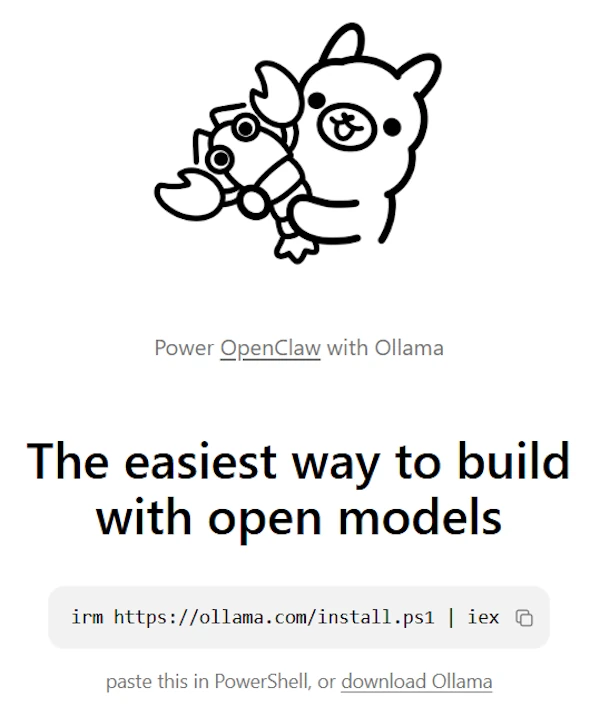
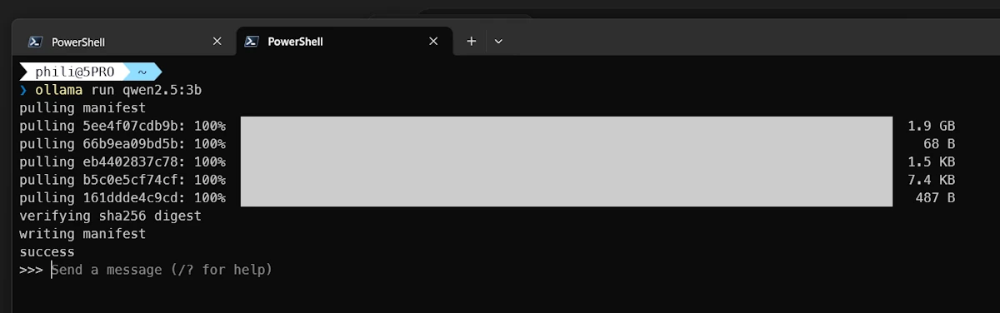
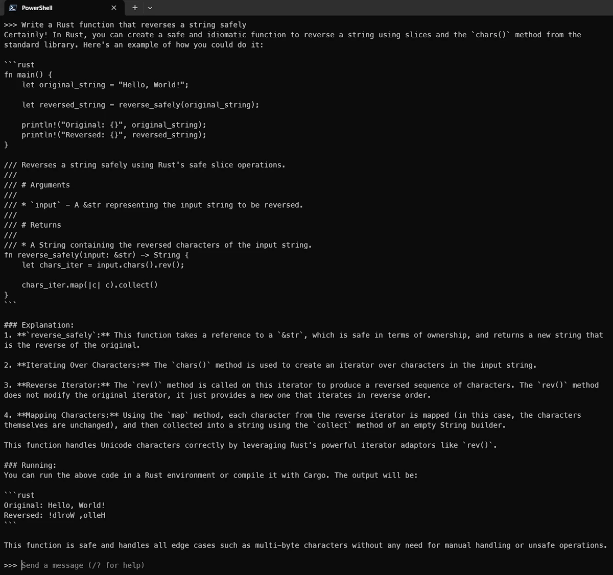
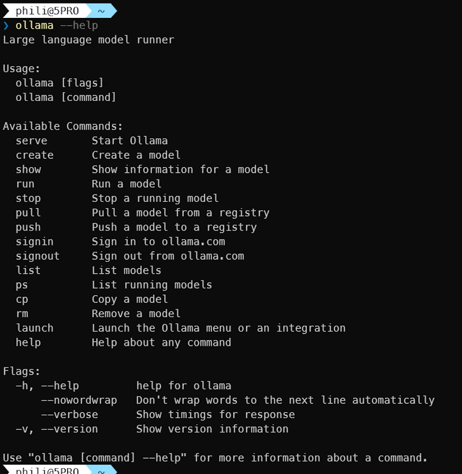
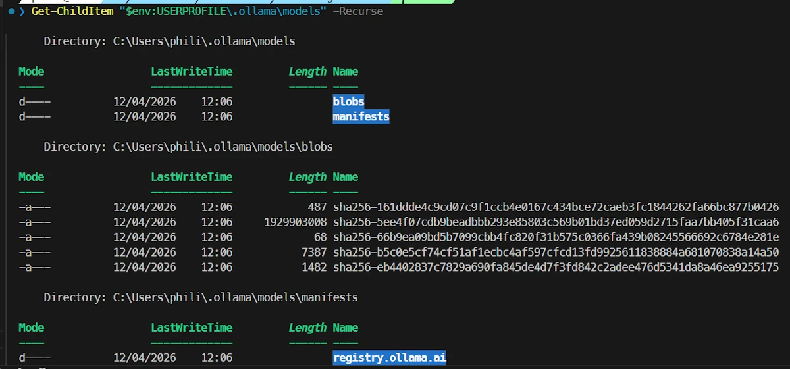

# {{ page.title }}
{: .no_toc }

{{ page.description }}
{: .lead }


<h2 align="center"><span style="color:orange"><b> 🚧 This post is under construction 🚧</b></span></h2>


<!-- ###################################################################### -->
<!-- ###################################################################### -->
<!-- ###################################################################### -->
## TL;DR
{: .no_toc }

* Point 1
* Point 2


<figure style="max-width: 900px; margin: auto; text-align: center;">

<figcaption>TODO: Add a legend</figcaption>
</figure>


<!-- ###################################################################### -->
<!-- ###################################################################### -->
<!-- ###################################################################### -->
## Table of Contents
{: .no_toc .text-delta}
- TOC
{:toc}


<!-- ###################################################################### -->
<!-- ###################################################################### -->
<!-- ###################################################################### -->
<!-- ## Introduction

Lorem ipsum dolor sit amet, consectetur adipiscing elit. Nullam luctus blandit tincidunt. Nunc et laoreet ipsum. Fusce neque nisi, blandit vitae magna nec, sollicitudin commodo felis. Morbi a viverra lorem, ut sollicitudin lacus. Pellentesque euismod magna et enim fermentum tempor. Etiam vel sagittis mauris. Praesent dictum nisl sit amet tellus rhoncus mollis. Aenean nisi nibh, tincidunt at massa eget, luctus aliquet lectus. Mauris ac massa dolor. Sed fringilla tristique est. Suspendisse nec leo et magna tincidunt ultrices. Suspendisse lacinia leo sed congue ornare. Mauris congue eu dui posuere ultricies. Duis volutpat volutpat erat, ut consequat nisl bibendum gravida. Curabitur fringilla tincidunt auctor.

<!-- Link to a video -->
<figure style="max-width: 560px; margin: auto;">
<div style="position: relative; padding-bottom: 56.25%; height: 0;">
    <iframe
    src="https://www.youtube.com/embed/MIeYz6aMBbk"
    title="Add a title"
    style="position: absolute; inset: 0; width: 100%; height: 100%;"
    allowfullscreen>
    </iframe>
</div>
<figcaption style="text-align: center;">TODO: Add a legend</figcaption>
</figure> -->


<!-- ###################################################################### -->
<!-- ###################################################################### -->
<!-- ###################################################################### -->
## Install Ollama

Visit [ollama.com](https://ollama.com/)

<figure style="max-width: 450px; margin: auto; text-align: center;">

<figcaption>TODO: Add a legend</figcaption>
</figure>


```powershell
irm https://ollama.com/install.ps1 | iex
```


<!-- ###################################################################### -->
<!-- ###################################################################### -->
<!-- ###################################################################### -->
## Install and Run QWEN

This is a "small" model. Perfect to check our setup.

```powershell
ollama run qwen2.5:3b
```


<figure style="max-width: 900px; margin: auto; text-align: center;">

<figcaption>TODO: Add a legend</figcaption>
</figure>


<!-- ###################################################################### -->
<!-- ###################################################################### -->
<!-- ###################################################################### -->
## First prompt

Once you see `>>>>` you can try your first prompt.

```powershell
# prompt:
Write a Rust function that reverses a string safely

# Explain what Rust ownership is in simple terms
# ...

# /exit or CTRL+D to exit
```

See below the answer:

<figure style="max-width: 900px; margin: auto; text-align: center;">

<figcaption>TODO: Add a legend</figcaption>
</figure>


<!-- ###################################################################### -->
<!-- ###################################################################### -->
<!-- ###################################################################### -->
## Getting Help and Information

- Exit Ollama (`/exit`)
- In the terminal type


```powershell
ollama --help
```


<figure style="max-width: 900px; margin: auto; text-align: center;">

<figcaption>TODO: Add a legend</figcaption>
</figure>


- Let's try `ollama list` to see the list of model available locally:

```powershell
ollama list
ollama show qwen2.5:3b
```


<figure style="max-width: 900px; margin: auto; text-align: center;">

<figcaption>TODO: Add a legend</figcaption>
</figure>


<!-- ###################################################################### -->
<!-- ###################################################################### -->
<!-- ###################################################################### -->
## Check where the models are stored

Ollama is installed in `$env:USERPROFILE`

```powershell
Get-ChildItem "$env:USERPROFILE\.ollama\models" -Recurse
```


<figure style="max-width: 900px; margin: auto; text-align: center;">

<figcaption>TODO: Add a legend</figcaption>
</figure>


<!-- ###################################################################### -->
<!-- ### Level 3 Section
{: .no_toc }

Cras dui ex, scelerisque et magna et, lacinia convallis nunc. Proin sapien nunc, eleifend a mi semper, efficitur pharetra justo. Etiam sit amet ex lacinia, consequat orci sed, malesuada leo. Donec commodo felis eu commodo suscipit. Praesent vitae lorem a dui porta volutpat. Pellentesque efficitur pharetra velit, at placerat nulla iaculis in. Praesent placerat turpis sit amet mauris bibendum interdum. Sed consectetur massa lacus, tempus congue purus dictum nec.

Math inline $$x(t)$$ and, below, math offline:

$$
\frac{dS}{dt} = r \cdot S
$$

 -->


<!-- ###################################################################### -->
<!-- ###################################################################### -->
<!-- ###################################################################### -->
<!-- ## Conclusion

Maecenas in arcu id erat interdum tristique sed fermentum tortor. Donec eget felis ornare sem dapibus tincidunt at vitae justo. Mauris feugiat tristique augue at maximus. Vivamus euismod blandit mi, ut pretium libero tempor sit amet. In tristique nisi vel mi molestie, ac ornare enim blandit. Phasellus bibendum diam massa, in tempor purus imperdiet a. Curabitur mattis mauris eget cursus molestie. Orci varius natoque penatibus et magnis dis parturient montes, nascetur ridiculus mus.

Aliquam blandit malesuada purus at porta. Orci varius natoque penatibus et magnis dis parturient montes, nascetur ridiculus mus. Vestibulum efficitur sapien leo, id iaculis sem sagittis ac. Praesent dolor nisl, fringilla fermentum maximus id, ornare id justo. Morbi at gravida purus, eu imperdiet risus.
 -->


<!-- ###################################################################### -->
<!-- ###################################################################### -->
<!-- ###################################################################### -->
<!-- ## Webliography

* [Link to a web page](https://cleonis.nl/physics/phys256/energy_position_equation.php).
* [Link to a page of the site]() -->