# Gravel RC 520

## Introduction

Je ne suis pas un fan de vélo, je n'y connais rien et je ne pense pas que je vais devenir un passionné. Cela dit, afin d'avoir la forme lors des [roulages moto](``NOT YET TRANSFERED``), en ce moment je [cours](``NOT YET TRANSFERED``) et je marche beaucoup (de mon point de vue en tout cas) et je n'ai pas envie de me blesser. Comme les mairies n'ont plus de sous, elles ne chauffent plus les piscines et donc l'autre alternative en termes de sport "porté" c'était le vélo.

## La démarche

*OK, ben achète un vélo et ne nous fais pas suer...*

Oui, mais en fait cela n'a pas été si simple que ça alors je vais prendre deux minutes pour expliquer ma démarche. Au début j'ai hésité entre vélo d'intérieur et un vrai vélo. L'idée était de trouver un vélo d'intérieur pas trop cher sur le LBC sachant que le risque était très grand que je lâche l'affaire au bout de 3 semaines. Ensuite, je ne me voyais pas pédaler comme un sourd dans mon bureau en plein hiver. Je n'y crois pas, je le sens pas. En plus je sais qu'en hiver je lève le pied côté "entraînements". Donc exit le vélo d'intérieur. On passe au vrai vélo.

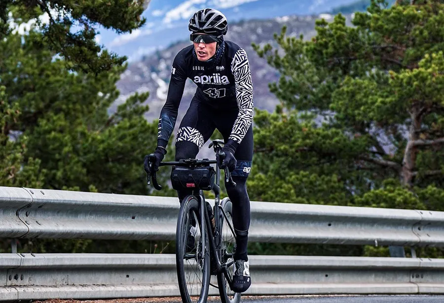

L'été dernier j'avais eu l'occasion de tester un VAE à gros pneus. C'était a priori un truc top du top qui devait valoir entre 4 et 5000 € : suspension AV, AR, moteur Bosch dans le pédalier, dérailleur de compet'... Sympa mais no way : trop cher et par chez moi je n'ai pas les chemins ni les terrains qui justifient un tel engin. En plus, comme je veux faire un peu de cardio sans me blesser je n'ai pas besoin de l'option électrique. Cela dit c'était cool et je pense que j'en referai à l'occasion.

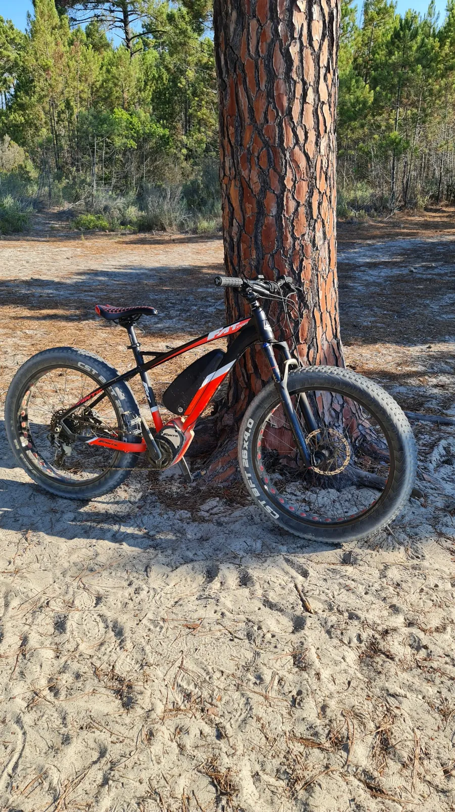

Mêmes remarques en ce qui concerne les VTT. Je ne parle même pas de prix. Le fait d'être en ville, je sens très bien que s'il faut que je charge le vélo pour aller rouler, cela ne se fera jamais. J'ai déjà vécu ça avec les enfants. On a stocké les vélos à la cave après avoir fait une ou deux sorties.

En fait ce qu'il me faut c'est un vélo que je puisse utiliser **au départ de chez moi**. Du coup, il ne me reste que les vélos de route...

En cherchant sur LBC, c'est toujours pareil tu vois à boire et à manger mais comme je n'y connais rien j'ai pas du tout confiance. Par exemple, au début de mes recherches je ne savais pas que les vélos étaient, depuis 2021, [marqués](https://www.citycle.com/63956-le-marquage-velo-devient-obligatoire-en-2021-pour-se-proteger-du-vol/). Un détail pour vous mais qui pour moi veut dire beaucoup... 🎶 Quitte à acheter un vélo en 2023 autant qu'il soit marqué. Comme en plus LBC n'oblige pas à préciser si le vélo est gravé ou pas cela n'aide pas à choisir. Là, de mon point de vue, LBC fait une grosse bêtise en n'obligeant pas les vendeurs à préciser les choses. En plus, les prix... Du délire... Des trucs d'occase à 2 ou 3 000 €... No way. Oui, oui j'ai vu aussi des épaves à 100 €.

Bon, ben, qu'est-ce tu fais dans ces cas-là... Tu vas chez Decat'. FYI, je n'ai pas d'actions chez eux et je suis de moins en moins fan :

* En fait je leur reproche de ne vendre QUE du Decathlon. La majorité du temps pour un "pinpin" comme moi, pour débuter, c'est largement suffisant. Mais bon, j'aimerais pouvoir acheter mes chaussures [Brooks](https://www.i-run.fr/chaussures_homme/Running_c23/Brooks_m2/Brooks-Glycerin-20-Wide-M_Brooks_fiche_119327.html) là-bas et avoir la possibilité de comparer quitte à prendre des [Kiprun](https://www.decathlon.fr/p/chaussures-running-homme-kiprun-kd900/_/R-p-345407?mc=8798229&c=JAUNE) au final.

* En plus, j'apprécie pas du tout la démarche qui consiste à dire "on vend des fringues Millet" mais on n'a rien en magasin à part du Decathlon. Et donc pour ces produits il faut obligatoirement commander en ligne. T'as raison... Je vais commander une polaire Lafuma qui coûte la peau des yeux sans l'essayer, sans avoir touché la texture, évalué la densité, vérifié la couleur... Je ne comprends même pas comment les marques peuvent signer un contrat avec Decathlon dans ces conditions.

* Concernant les vélos je ne sais pas ce qui se passait mais j'avais franchement l'impression que les vélos "moins chers" n'étaient ni en stock, ni livrables... Alors que ceux aux prix plus élevés n'étaient pas visibles en magasin mais disponibles en ligne. Un exemple ? En avril 2023, vas-y, trouve en France un Decathlon où tu peux aller voir à quoi ressemble un Gravel 520... Good luck mon grand. Un autre exemple ? J'ai pas mal hésité entre 2 références de biclou. Il y en avait un à 900 € ([Van Rysel](https://www.decathlon.fr/p/velo-route-cyclotourisme-rc520-105-prowheel/_/R-p-346312?mc=8800123&c=BLEU) RC 520 je crois) et l'autre c'était le Gravel RC 520. À ce jour, le moins cher des 2 n'est toujours pas dispo alors que RC 520 est toujours commandable en ligne. Je ne dis pas que c'est intentionnel (je n'ai pas de preuves) mais bon... Mystère...

En faisant un peu de recherche sur le YouTube je suis tombé sur une initiative marketing qui consiste à prendre un vélo de route et à lui mettre des pneus un peu plus larges avec des "crampons". L'idée est de pouvoir aller sur des chemins et ne pas être limité qu'au bitume. Quand je dis initiative marketing cela n'a rien de péjoratif. Il y a là, je pense, un vrai marché. En effet, on ne vit pas tous à Grenoble, pas loin des montagnes. La réalité c'est qu'une bonne partie de ceux qui veulent se mettre au vélo vivent en ville, assez loin des forêts, des montagnes etc... Ce n'est donc pas idiot de proposer un entre 2. En plus, je trouve que les vélos de route sont très vite extrêmes techniquement et donc très chers.

Allez, zou, ce sera un vélo de type Gravel que je vais prendre neuf, chez Decathlon. J'ai essayé de regarder en magasin "classique". No way, jamais je ne vais mettre autant d'argent dans un machin pour faire du cardio en étant porté (faut pas oublier que c'est mon objectif initial). C'est simple, j'ai retenu qu'en magasin, si tu n'as pas 2 500€ minimum ce n'est même pas la peine de rentrer. En plus, comme tu ne connais rien et que tu poses des questions tu passes pour un con vu que tu n'as pas été adoubé et que tu ne fais pas parti du sérail. Bien sûr, si tu es prêt à mettre plus de 5 000 € dans un cargo tu pourras laisser tes 2 insupportables mioches mettre le brin dans le magasin. Ça sent le vécu d'après toi ? Va voir [cette page et ce magasin à Angers par exemple](https://www.velo-horizon.fr/velos-electriques-cube-cube-cargo-sport-hybrid-6974.html#/1220-couleur-flasgrey_n_black).

Bref, Decathlon, gravel, neuf, commande en ligne d'un truc disponible dans ma taille.

Ci-dessous une des vidéos qui m'a permis de comprendre les différences entre les modèles 120 et 520 et qui m'a décidé à choisir le RC 520. De plus, c'est avec les explications qui sont à 9:03 de la vidéo que j'ai choisi le [modèle "gros plateau"](https://www.decathlon.fr/p/velo-gravel-triban-rc520-gravel-kaki-shimano-105/_/R-p-337677?mc=8733355&orderId=fr10040376973) car chez moi c'est surtout du bitume partout encore et toujours (le RC 520 existe en trois déclinaisons. Je n'avais pas bien compris ça sur le site de Decathlon).

Attention. En 2023 le prix c'est 1 220 € (prix livré). À ce jour la vidéo date d'un an. Ça fait donc [+20%]() en un an. Pas mal, pas mal...

J'aime bien les [vidéos de cette chaine](https://youtu.be/S-P_yTPgGn4). J'ai eu un peu de mal avec ses casquettes au début... Mais à part ça c'est top, informatif et pas prise de tête.

Une vidéo de promo du RC 520 : <https://youtu.be/DtjGuMFUijY>

## Réception

Aucun souci pour la commande. Decathlon de ce côté-là ils assurent. C'est une grosse machine logistique bien huilée. De mon point de vue j'ai reçu le vélo avec un jour d'avance sans payer le supplément "livraison express". Je ne vais pas me plaindre. Les gars étaient sympas. Ça a duré 2 minutes montre en main.

Ensuite je me retrouve avec le carton dans le salon.

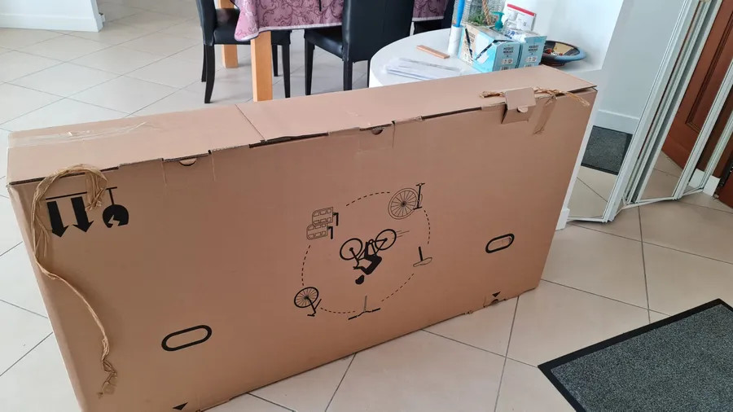

Je fais attention au carton afin de pouvoir l'utiliser de nouveau s'il faut retourner la bête à Decathlon.

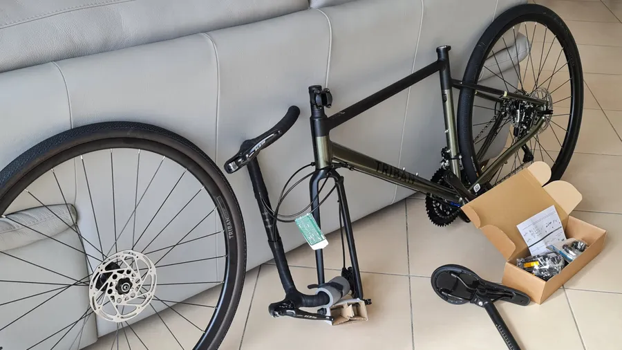

C'est vraiment bien emballé. Il y a une petite documentation et 2 ou 3 trucs dans une boite en carton. Il y a même une sonnette 😊.

Une vidéo que j'ai trouvé après... : <https://youtu.be/zEuBvuRX5b0>

## T'as d'autres images en gros plan ?

Voili, voilà ce que j'ai. ~~Il ne faut pas hésiter à **cliquer sur les images** puis à zoomer dessus si besoin~~ (Momentanément non disponible). Si tu ne trouves pas ton bonheur ici il faut continuer à lire. Il y a d'autres images plus loin dans le billet.

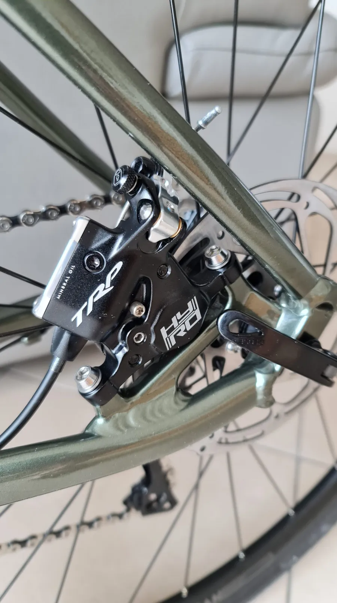

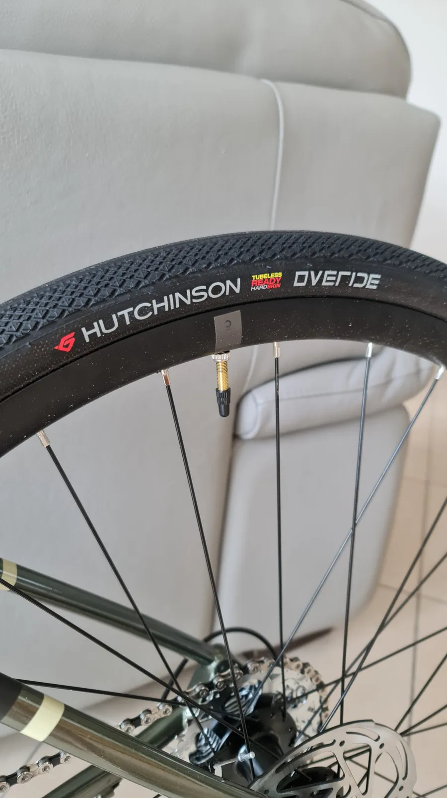

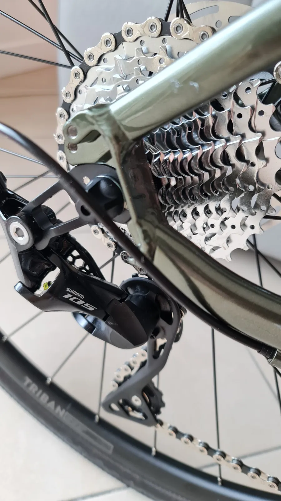

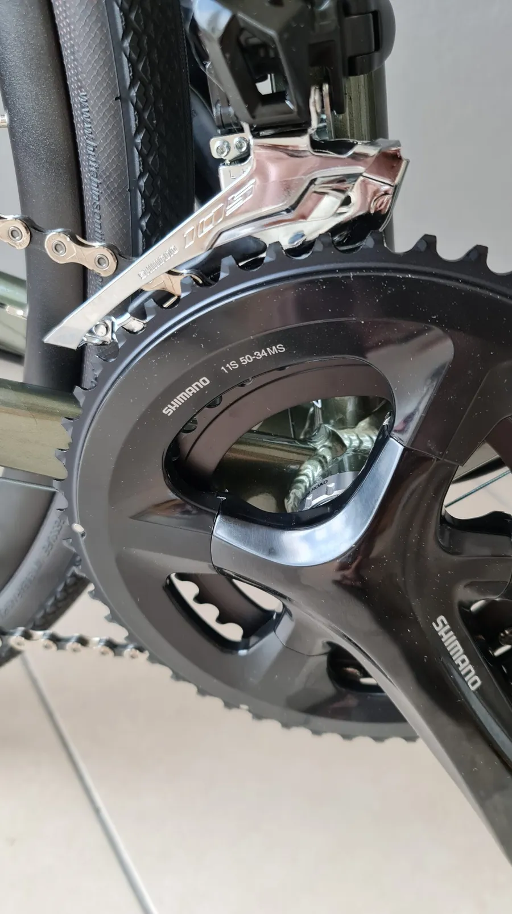

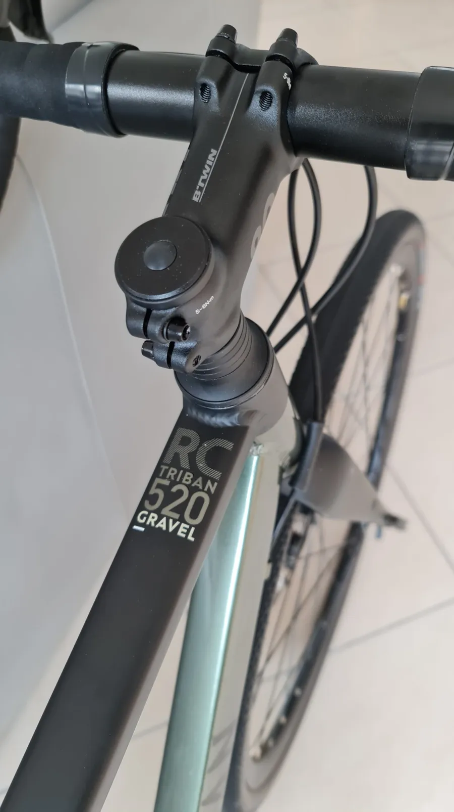

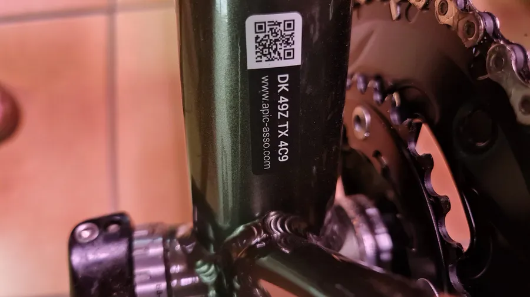

## Montage

Ce n'est franchement pas compliqué. Il y a une petite documentation qui rappelle surtout qu'il y a un sens de vissage pour les pédales (c'est comme pour les rétros de moto).

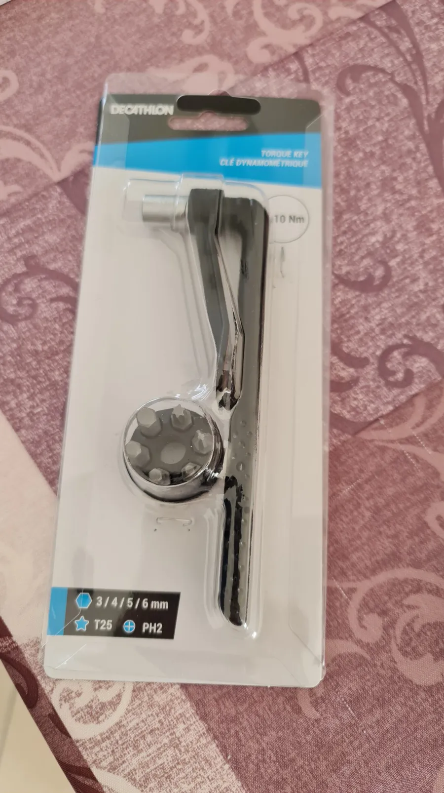

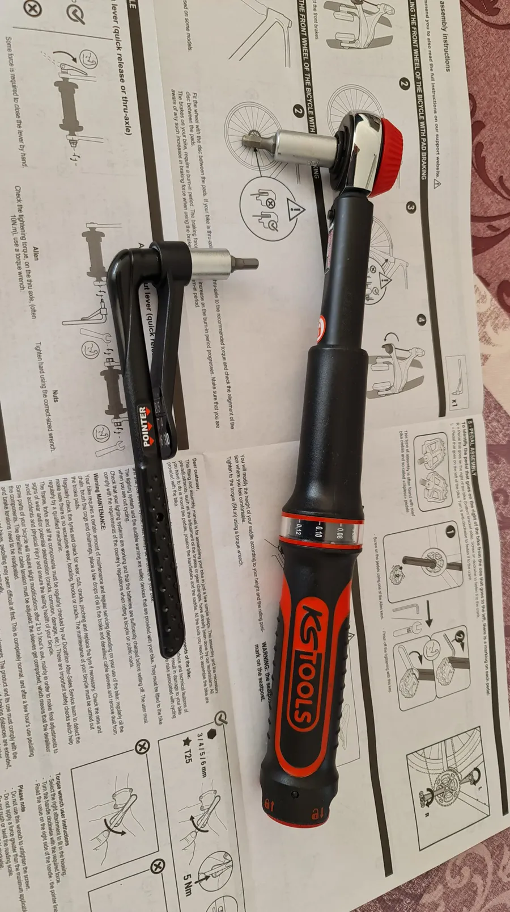

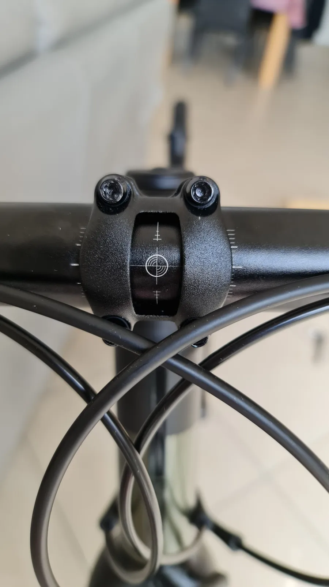

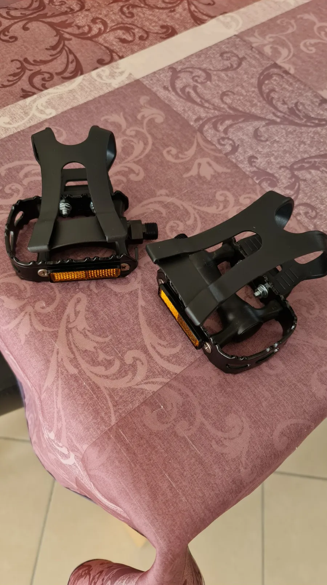

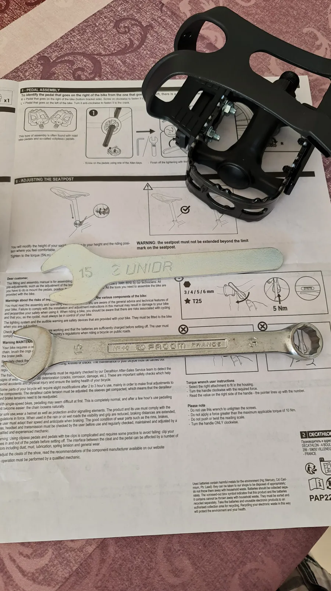

Un peu partout sur le vélo les couples de serrage sont rappelés. C'est une très bonne idée. Si dans 1 an il n'y a plus de marque sur le vélo je pourrais revenir ici.

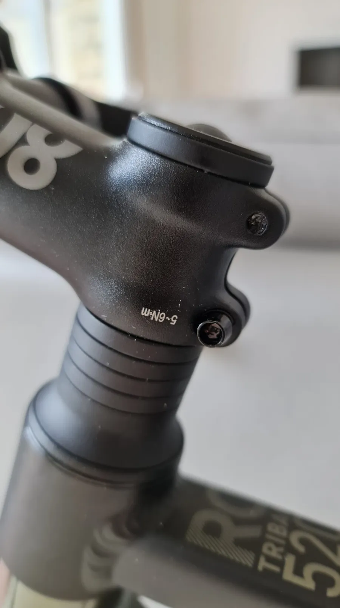

## Réglages

Y a 12 000 vidéos sur le sujet sur YouTube. Il faut un niveau, une clé et un fil à plomb.

Un exemple de vidéo ici : <https://youtu.be/CyGVjuSPsTQ>

Allez, une autre sur le même sujet ci-dessous. On apprécie ou pas le ton utilisé mais il y a de l'information. Dans cette vidéo comme dans les autres du même auteur, on sent qu'il y a du vécu. En plus il a quelques expressions marrantes : <https://youtu.be/flewCvbgjj4?t=25>

Une dernière pour la route : <https://youtu.be/K1QiMfD4p0o>

### Rien à voir

J'ai l'impression qu'ils se la pète un peu dans le monde du biclou ou alors qu'ils nous font un petit complexe d'infériorité. Un exemple ? Dans la vidéo ci-dessus, quand le gars parle du guidon il parle du cockpit. Cela n'a rien à voir avec le fait que ce soit un cousin Canadien, j'ai entendu des Frenchies utiliser ce terme ou alors parler de poste de pilotage...

Bon... Alors on va se calmer. Je rappelle que ça c'est un cockpit, un vrai.

Ça c'est un tableau de bord, un vrai.

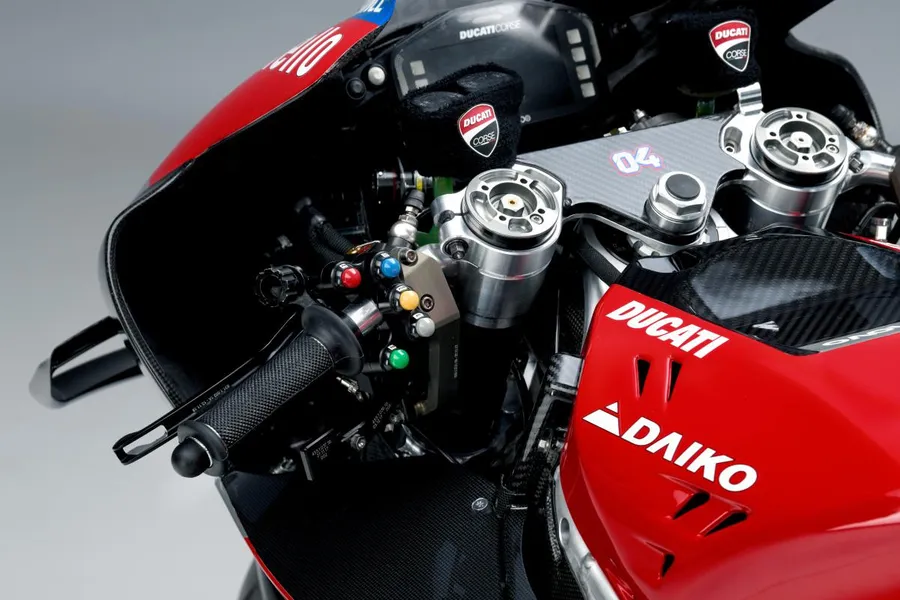

Et ça... Ben ça c'est un guidon. Même si tu mets une sonnette et un téléphone histoire d'avoir des boutons à tripoter... 😂

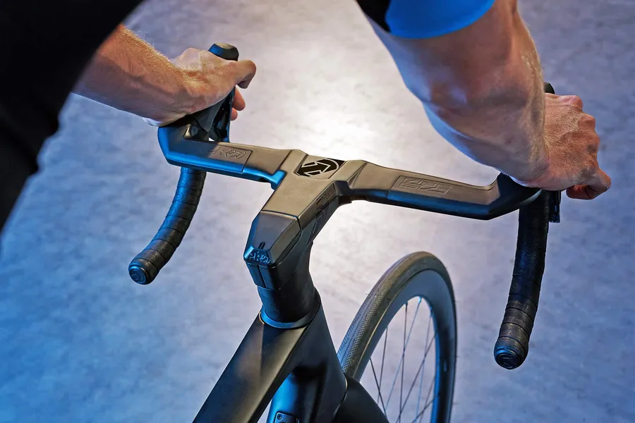

## Le tout tout premier roulage

La honte totale... En fait j'ai sauté dans une paire de basket je suis allé sur le parking à 50m de chez moi afin de rôder les plaquettes. Là, c'est classique, le vélo ça ne s'oublie pas trop. Je teste le dérailleur... La petite palette sous la manette de frein marche super bien. Pas de problème pour monter les vitesses. Oui, mais bon, comment on redescend les vitesses ?

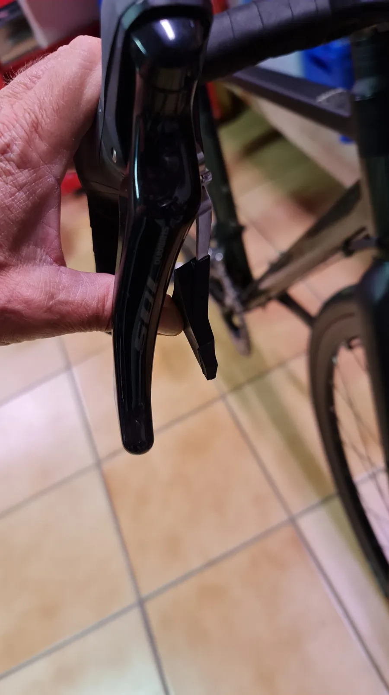

Je n'ai pas su faire. Oui, je sais, je suis une buse... Mais bon, je l'ai dit au début, j'y connais que dalle en biclou. Retour à la maison car je n'avais même pas un téléphone avec moi et j'appelle mon ami Google. Là il m'explique qu'avec les [Shimano 105](https://bike.shimano.com/fr-FR/product/component/shimano105-r7000.html) il faut utiliser la manette de frein correspondante et la pousser, elle aussi, vers l'intérieur du vélo. C'est tout bête, mais je n'ai rien vu à ce propos dans le carton ou dans la documentation livrée. Un vrai "pinpin" je te dis.

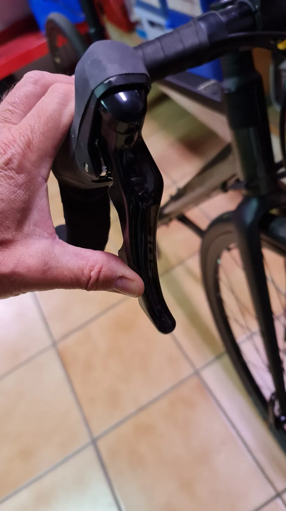

## Et depuis ?

J'ai roulé une seule fois avec (40 km) en 10 jours. Entre temps j'ai eu un [roulage moto à LFG](`NOT YET TRANSFERED`) (rsv4-sur-circuit-roulage-du-30-04-23-lfg) et d'autres trucs côté pro qui ont cassé l'agenda des trainings. Enfin bref... Lors de la première sortie ça s'est bien passé du côté de l'assise... Je m'attendais au pire... Cela dit, j'avais un short et un sous-short équipé d'une "couche de bébé". Un truc Decathlon mais bon, ça a fait le taf. Pour le reste j'ai eu un peu mal aux cervicales. C'est classique je crois. Problème de position... Il faut que je revienne sur le sujet. Sinon, depuis je n'ai pas eu le temps de remettre ça. Ah oui, je n'ai pas de casque, pas de maillot type tour de France etc.

J'ai installé des protections de manivelles et de cadre [Zefal](https://amzn.eu/d/gSn1Jri). J'ai passé la commande sur Amazon. Bonne surprise, d'origine, côté chaine, sur le triangle arrière du vélo il y a déjà un film plastique de protection. Faut passer le doigt tout doucement pour le détecter. Il est pratiquement invisible.

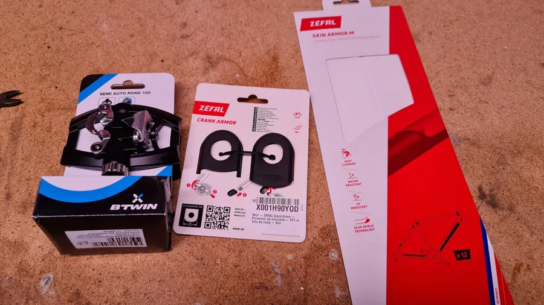

Pour coller la protection sur l'avant du cadre (juste derrière la roue donc), comme les câbles sont apparents il faut prendre son temps, être bien installé et pas s'énerver. Pour l'occasion j'avais pendu le vélo au plafond. Ça s'est bien fait. Pas de bulle, pas de soucis à part les cables avec lesquels il faut composer.

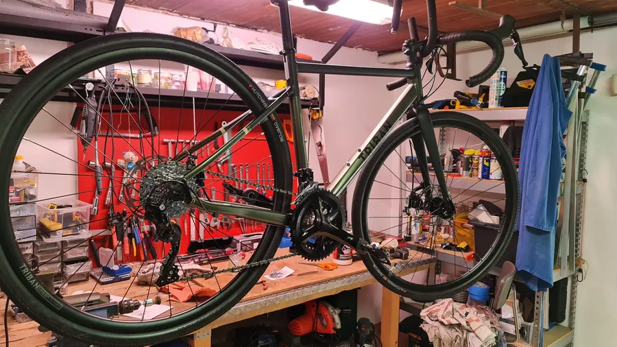

Heu... Oui, je confirme Bonemine m'a demandé entre temps de pas rester dans le salon et d'aller jouer dans le garage. 

Sinon j'ai acheté et installé des pédales "réversibles". D'un côté elles sont "normales", de l'autre on peut clipser ses chaussures. J'ai pris du [BTWIN](https://www.decathlon.fr/p/pedales-velo-semi-automatique-500-compatibles-spd/_/R-p-12213) à 35€. A priori elles font le job.

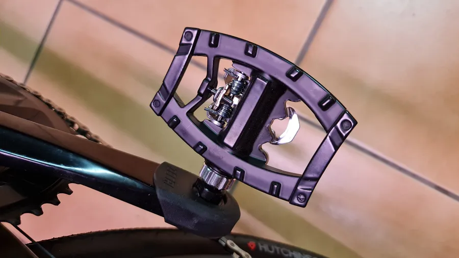

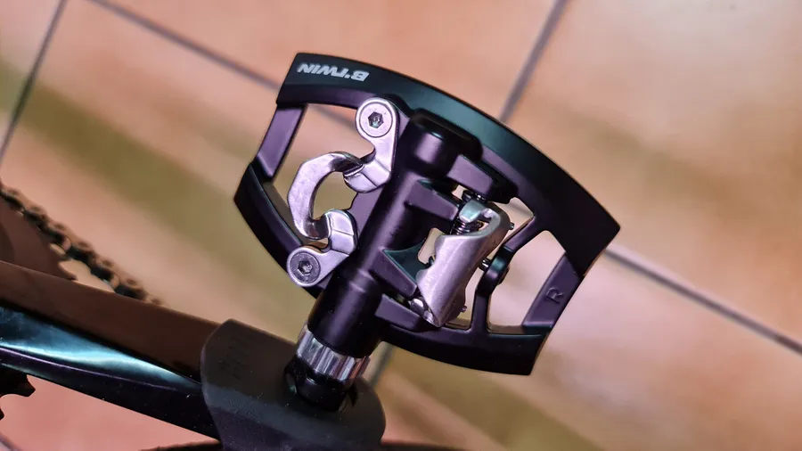

Je n'ai pas encore trouvé de chaussures. Il n'y a pas de stock dans les magasins (ou alors en 47...) et je n'ai pas le courage d'acheter des chaussures en ligne. Ça me saoule un peu ces histoires d'ailleurs.

Sinon j'ai commandé et installé un support Quad Lock pour le téléphone. Je n'ai même pas cherché ailleurs. J'utilise des Quad Lock sur mes motos et j'en suis très content. J'ai donc commandé direct (j'ai même pris un brassard Quad Lock pour fixer le portable au bras quand je vais [courir](``NOT YET TRANSFERED``)).

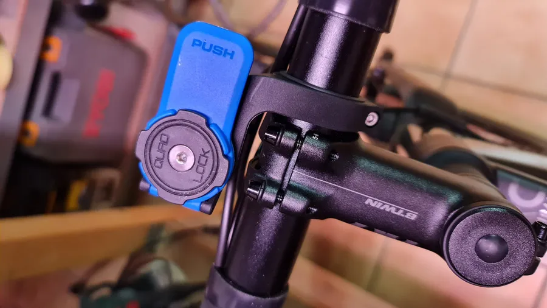

On dira ce que l'on voudra, mais pour l'instant je préfère les vélos à moteur✊.

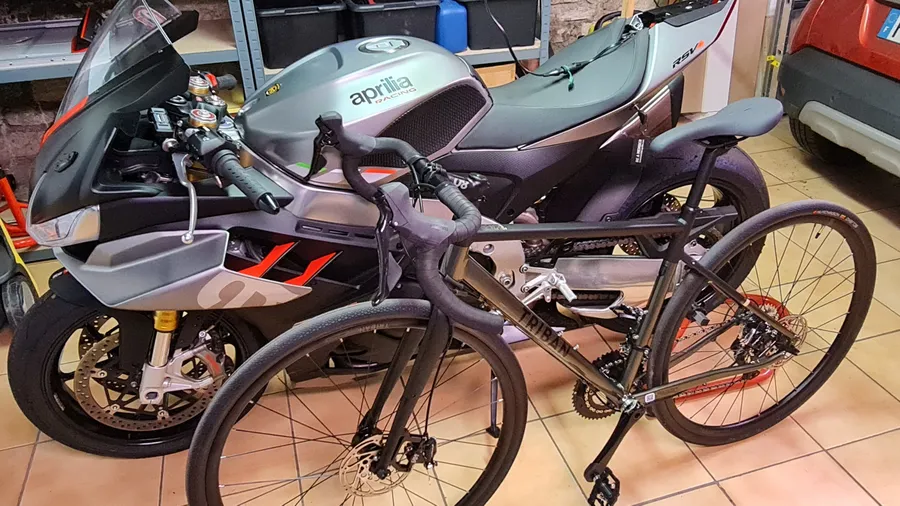

