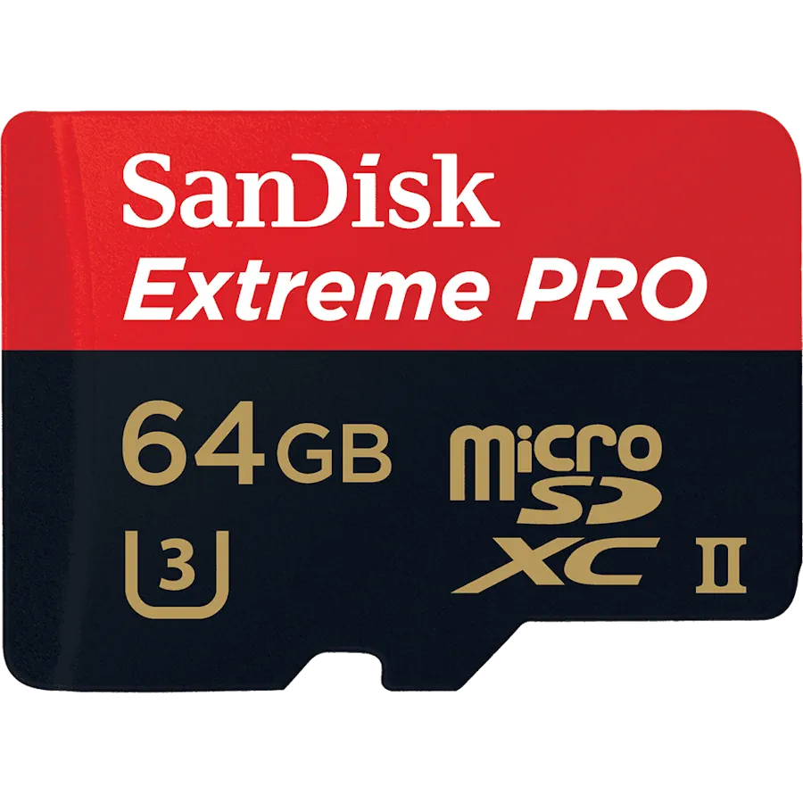
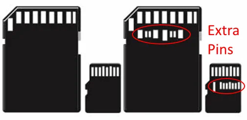
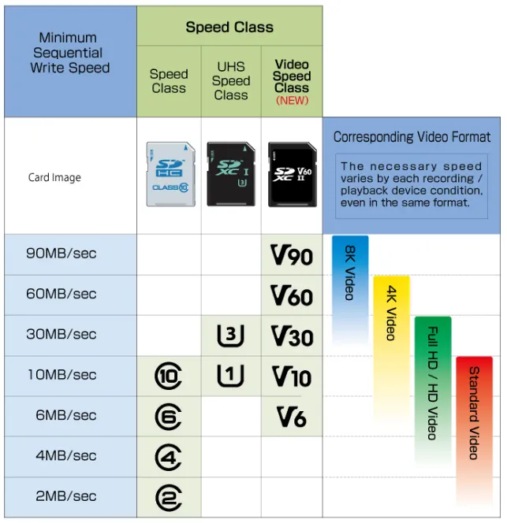

# Un point sur les cartes microSD

Voilà ce que je crois avoir compris à propos de cartes microSD.

## Les normes

À ce jour (fin 2017), trois normes sont présentes : 
1. microSD
1. microSDHC 
1. microSDXC.

Elles définissent la capacité maximale de la carte :

| Type      | Taille max. |
|:--------- | -----------:|
| microSD   |  2 GB       |
| microSDHC | 32 GB       |
| microSDXC |  2 TB       |

Dans l'image ci-dessous on retrouve bien le logo microSDXC. La carte faisant 64GB (giga octets) c'est obligatoirement une carte de type microSDXC.

Bien sûr, on ne peut pas brancher une carte microSDXC sur un téléphone qui ne supporte que des cartes de type microSD. Il faut donc commencer par vérifier le type de cartes que supporte le périphérique. 

### Note
les cartes microSD se font de plus en plus rares.

## Les vitesses de lecture théoriques

L'interface utilisée par les cartes peut être de type 
1. High Speed
1. UHS-I 
1. UHS-II. 

C'est ce qui définit le débit **théorique** maximal de l'interface. Cette dernière est qualifiée par le chiffre romain. Typiquement il y a un I ou un II qui précise la classification UHS. 

Les cartes UHS-I prennent en charge une vitesse de lecture de 104 MB/s alors que les interfaces UHS-II peuvent lire jusqu'à 312 MB/s.

|            | Débit max. théorique en lecture |
| ---------- | ------------------------------- |
| High Speed | 25 MB/s                         |
| UHS-I      | 104 MB/s                        |
| UHS-II     | 312 MB/s                        |

Je rappelle MB/s veut dire Mega Byte par seconde ou encore Mega Octets par seconde alors que Mb/s veut dire Mega bits par seconde. Il y a donc un rapport 8 entre les 2.

Il faut bien sûr un appareil **et** une carte de type UHS-II  pour profiter pleinement de la vitesse maximale. 

Ceci dit, à l'instar de ce qui se passe avec USB, les cartes UHS II  sont rétrocompatibles et fonctionnent avec un appareil UHS I.

À gauche ci-dessous une interface UHS I et à droite une interface UHS II. La partie haute rend le connecteur compatible alors que les broches supplémentaires assurent un plus haut débit le cas échéant.

## Les vitesses d'écriture minimales

Le numéro à l'intérieur du marquage "C " correspond à la Classe de Vitesse (Speed Class) lorsque la carte est utilisée dans un périphérique qui ne supporte pas l'interface UHS. 

C2 indique une vitesse d'écriture minimale de 2 MB/s alors que C10 permet d'enregistrer à 10 MB/s.

Le numéro à l'intérieur du marquage "U " correspond à la classe de vitesse UHS (UHS Speed Class). Avoir une classe de vitesse UHS U1 indique une vitesse d'écriture minimale de 10 MB/s, et une classe de vitesse UHS U3 indique une vitesse d'écriture minimale de 30 MB/s. U3 est obligatoire pour pouvoir filmer en 4K.

Pour finir il y a dorénavant le marquage "V" spécifique à la Classe de Vitesse Vidéo (Vidéo Speed Class). V30 permet des enregistrements à 30 MB/s
On retrouve tout ça dans le tableau de la [SD Association](https://www.sdcard.org/index.html)

## Les débits annoncés

Le débit en lecture est souvent annoncé, mais pas toujours celui en écriture Lorsqu'un seul débit est affiché, c'est toujours celui en lecture.

Certains constructeurs communiquent un débit en "X". Un "X" est équivalant à 150 KB/s. Une carte 600X est donc donnée à 90 MB/s.

**Attention :** Les vitesses en «X» sont toujours dérivées de la vitesse de lecture d'une carte, **PAS** de la vitesse d'écriture. Il faut donc faire attention aux cartes bon marché avec des notes «X» élevées. Elles peuvent lire rapidement, ce qui est idéal pour les gros téléchargements mais elles ne peuvent ne pas fonctionner correctement si on prend un film ou des photos en rafale (écriture faible vitesse).

## Application performance Class

Afin d'assurer un fonctionnement plus rapide des applications installées dans les cartes Micro SD dans des smartphones ou des [always connected PC](https://youtu.be/Rd7R9G1An3s), les certifications A1 et A2 ont été mises en place à partir de la révision 5.1 des spécifications SD. 

Elles garantissent un nombre minimal d’accès en entrée et sortie par seconde (IOPS, input output access per second). 
* Elles sont de 1500 IOPS en lecture, 500 IOPS en écriture et 10 MB en séquentiel pour la classe A1. 
* Pour la classes A2 les vitesses d'accès en lecture et écriture sont respectivement de 4000 et 2000 IOPS. 

Plus de détails dans ce cours [white paper](https://www.google.com/url?q=https://www.sdcard.org/downloads/pls/latest_whitepapers/Application_Peformance_Class_White_Paper.pdf&sa=U&ved=0ahUKEwjNveO6n5HYAhVDYVAKHZSTBCUQFggHMAE&client=internal-uds-cse&cx=016669442993988930814:vtyt4shdoyi&usg=AOvVaw1cnWsDVHN3JIDL8-LZKlUb) en anglais.