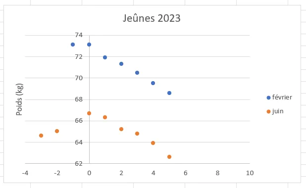

# Jeûne de 6 jours - Juin 2023

## Introduction

On est le 16 juin et je commence la rédaction ainsi que la publication de ce billet en avance de phase afin de me "motiver". Si tu tombes par hasard sur cette page, je te recommande vivement de commencer par [lire ce billet](https://www.40tude.fr/jeune-de-6-jours-fevrier-2023/) où je donne pas mal de détails sur mon précédent jeûne de 6 jours. Ici je vais tenter d'être plus synthétique.

## Mes objectifs

Je veux :

* Passer en mode [autophagie](https://youtu.be/96dv7Xrgksw) (rapport G/K entre 0.7 et 1.5) pour faire un bon gros nettoyage interne

* Perdre un peu de poids pour me stabiliser vers les 64 kg (62 kg étant la limite basse absolue que je me fixe)

* Faire plus attention que la dernière fois à reprise à la fin du jeûne

## Les mesures lors du jeûne

Ci-dessous, les mesures sont faites le matin, au levé.

| Jour | Poids (kg) | K (mmol/l) | G (mg/dl) | G (mmol/l) | G/K | Commentaires |
| --- | --- | --- | --- | --- | --- | --- |
| Vendredi 16 | 64.6 | 0.8 | 92 | 5.1 | 6.38 | Je commence à rapporter ici les valeurs pour me motiver, me mettre dans le "mood" et surtout voir la transition avant/pendant le jeûne. Running 10 km |
| Samedi 17 | 65.0 | 0.1 | 105 | 5.83 | 58.3 | Running 10 km. Monde à la maison hier soir. Trop et pas bien mangé (Curly, pain...) |
| Dimanche 18 | x | x | x | x | x | Marche 2H, 12.2 km. Fête des pères et ça a été n'importe quoi côté bouffe (midi et soir). Je pense que je vais m'en mordre les doigts. Pas de sport à part le moto GP devant la télé 🏍️ |
| Lundi 19 | 66.7 | 0 | 104 | x | x | Début du jeûne ce matin. Sortie "longue" running, 16 km à 12H00. Je bois du thé. Ai mangé quelques amandes. |
| Mardi 20 | 66.3 | 0.1 | 100 | 5.55 | 55.5 | Vélo 31 km (j'ai abrégé à cause de la pluie). J'ai mangé plus d'amandes qu'hier. |
| Mercredi 21 | 65.2 | 1.1 | 84 | 4.66 | 4.2 | Running, 10 km. Beaucoup de thé vert. Pas faim jusqu'au dîner. Ai alors craqué sur les amandes. Couché de très bonne heure. |
| Jeudi 22 | 64.8 | 1.3 | 88 | 4.88 | 3.76 | Mal au crâne le matin. Marche 2H, 12 km. Pas faim jusqu'au dîner. Ai craqué sur les amandes. Couché normalement. |
| Vendredi 23 | 63.9 | 1.6 | 78 | 4.33 | 2.7 | Pas mal au crâne au lever. Running, 10 km. J'ai couru que 7 km sur 10. Mesure de glycémie après le running 90. Je ne pige pas. |
| Samedi 24 | 62.6 | 2.6 | 84 | 4.66 | 1.79 | Je suis très dubitatif sur la mesure de poids. Marche 12.4 km (1H58). Trop chaud pour le vélo ou courir ce midi. J'arrête le jeûne ce soir et je vais essayer de faire gaffe à la reprise. |
| Dimanche 25 |  |  |  |  |  | Pas de sport à part le moto GP à Assen✊ |

## Evolution du ratio (tour de taille) / taille lors du jeûne

Je ne m'attends pas à ce qu'il évolue beaucoup en si peu de temps mais bon, on verra bien. En plus, alors que je débute la rédaction du billet cela participe à la préparation du mental. Je mesure 169 cm. Il faudrait que mon tour de taille vale la moitié, soit 84.5 cm.

À propos de la mesure du tour de taille... Je trouve que ce n'est pas si facile que ça (si besoin, tu peux regarder cette [vidéo](https://youtu.be/cAEHRZCV_9s)). J'ai donc décidé de faire toujours la même mesure, quitte à me planter mais bon ce qui compte c'est la variation, la dérivée.

Je sais, c'est un peu ridicule. D'un côté je mesure le tour de taille avec un mètre rouleau tout moisi sur lequel il y a, au mieux, 0.5 cm de précision et de l'autre je mets 4 chiffres après la virgule dans le calcul du ratio. En fait, compte tenu des valeurs utilisées pour l'évaluation du ratio je n'ai pas trop le choix. Par exemple entre 86 et 85 cm, il faut au moins 3 chiffres après la virgule pour voir quelque chose. Voir ci-dessous :

| **Tour de taille (cm)** | **Ratio** |
| --- | --- |
| 88 | 0.5207 |
| 87 | 0.5147 |
| 86 | 0.5088 |
| 85 | 0.5029 |
| 84 | 0.4970 |

Les mesures en cours de semaine. Alors que le jeûne n'a pas encore commencé je réalise qu'il est sans doute préférable de ne regarder que la valeur du tour de taille en se disant, qu'idéalement, ma cible c'est 84 cm :

| **Jour** | **Tour de taille (cm)** | **Ratio** |
| --- | --- | --- |
| Vendredi 16 | 87 | 0.5147 |
| Samedi 17 | 87 | 0.5147 |
| Dimanche 18 | x | x |
| Lundi 19 | 88 | 0.5207 |
| Mardi 20 | 88 | 0.5207 |
| Mercredi 21 | 87 | 0.5147 |
| Jeudi 22 | 87 | 0.5147 |
| Vendredi 23 | 86 | 0.5088 |
| Samedi 24 | 87 | 0.5088 |
| Dimanche 25 |  |  |

La mesure du tour de taille n'est vraiment pas facile à faire ni à reproduire chaque jour. Quant à a la précision des mesures... En ce qui me concerne je mesure là où c'est le plus large (nombril, bourrelets...) et j'essaie de ne pas serrer le ruban. Mais bon... Je ne garantis pas la qualité des mesures du tableau. À suivre dans les jours qui vont suivre.

## Remarques en vrac

* Grosse erreur au départ avec les repas de la fête des pères. Difficile de dire non le midi et le soir c'est moi qui ai merdé.

* Contrairement à la dernière fois, je n'ai pas réussi à me mettre en jeûne total. Pratiquement tous les soirs je prenais quelques amandes. Bizarre, je n'ai pas d'explication à proposer

* Comme la dernière fois j'ai perdu 4 kg. Je pense qu'il y a au moins 2 kg d'eau que je vais rapidement reprendre. Si je suis sérieux j'espère me stabiliser à 64 kg. On verra...

* Je ne comprends pas pourquoi le tour de taille n'a pas évolué. Bizarre.

* Lors du dernier jeûne j'étais en cétose dès le 3eme jour. Là, ça a pris plus de temps. Je pense que j'étais en cétose qu'aux jours 5 et 6.

* Avec un ratio G/K de 1.79, je pense que j'étais en autophagie uniquement le samedi. J'aurai aimé faire mieux, mais bon, au démarrage il a fallu compenser les excès de la fête des pères.

* Je trouve intéressant de tracer les évolutions du poids des jeûnes de février et juin. À peu de chose près on a la même pente. Au bout de 6 jours on retrouve naturellement la perte de 4 kg.

## Conclusion

* Le prochain jeûne de 6 jours aura lieu vers les 15 octobre. Il faut absolument que je m'assure que le jour d'avant (le dimanche typiquement) il n'y a pas un repas famille ou un truc comme ça où j'ai tendance à manger trop et n'importe quoi. Idem pour le premier repas après le jeûne.

