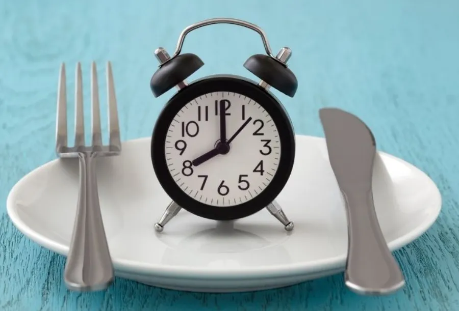
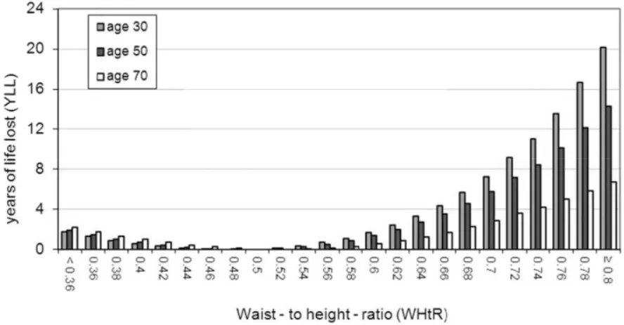
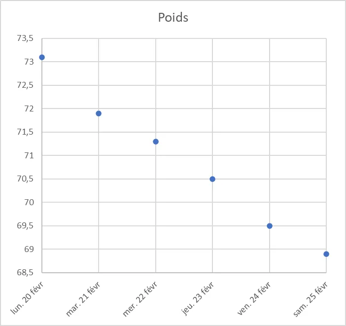
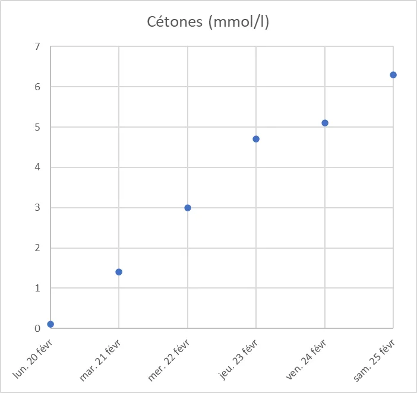
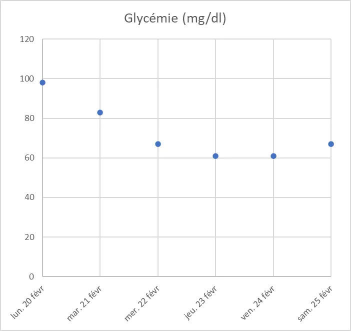

# Jeûne de 6 jours - Février 2023

## Contexte

Ce n'est pas un article sur les bienfaits ou les avantages du jeûne. Non, non, il se trouve que je viens de faire un jeûne de 6 jours (je recommence à m'alimenter ce soir - 25 02 23) et j'explique juste comment ça s'est passé pour moi, mon contexte etc.

Je sens que depuis Noël et Jour de l'An j'ai du mal à stabiliser mon poids. Normalement je suis aux alentours de 71 kg en semaine. Le WE arrive, je monte à 72-73. Ensuite, rebelotte, il me faut une semaine pour redescendre à 71 kg. Mais bon, ces derniers temps, je suis moins discipliné et la moyenne est à la hausse… On va donc dire que je suis plutôt dans la zone des 72 (pour 1.69m, donc léger surpoids selon l'IMC) avec une tendance haussière. Cela dit, je souhaite positionner mon "set point" aux alentours des 69-70 kg.

En plus, je pars au ski début mars et mon prochain [roulage moto sur circuit](`NOT YET TRANSFERED`) est prévu tout début avril. Il est donc grand temps de corriger le tir.

Je marche et cours très régulièrement (quasi quotidiennement, sauf le dimanche) mais j'ai arrêté les squats et les pompes depuis un bon moment. Je vais donc profiter de cette semaine de reprise en main pour redémarrer ma routine de musculation. Ça ne va pas chercher très loin : planche, squats, pompes...

Sinon, le reste de l'année je fonctionne en mode OMAD (One Meal A Day). En gros je ne mange rien le matin, rien le midi, je ne mange que le soir. L'idée est de limiter le long de la journée les pics d'insuline. Pour rappel, l'insuline c'est l'hormone qui indique aux cellules que c'est le moment de stocker (sous forme de gras). Je ne fais pas de jeûne alterné (manger un jour sur deux ou jeuner deux jours de suite en semaine par exemple). C'est tout bête, mais du point de vue de la logistique (courses, vie de couple...) je trouve que ce n'est pas facile.

Enfin, j'essaie de fonctionner en mode [cétogène](`NOT YET TRANSFERED`) (5% de glucide). Là aussi, je sais que depuis plusieurs semaines tout ça est un peu parti en live. Il est grand temps de siffler la fin de la récréation.

Ah oui, j'allais oublier. J'ai déjà fait un jeûne l'année dernière (3 ou 4 jours je ne sais plus trop, je n'avais pas pris de notes à l'époque). Puis un autre qui n'a pas du tout fonctionné. J'ai arrêté le second jeûne quasiment au bout d'un jour et demi. C'était ma faute. En fait, je ne "l'avais pas en tête" avant de l'entreprendre et je devais manquer de motivation. C'est finalement, je crois, le plus important. C'est pour ça, par exemple, que j'écris mes objectifs sur cette page. IMHO : "Si tu ne le sens pas, ne le fais pas". En revanche, si tu as un objectif clair en tête, un peu de motivation, si tu le "vois", si tu le "sens", vas-y. Et ne tiens pas compte de ce que va dire ton entourage.

## Mes objectifs

À l'issue de ce jeûne je veux (notez que ce n'est pas "je souhaite", mais "je veux") :

* Remettre les compteurs à zéro côté nutrition et lancer ma "prépa" physique pour avril.

* Être revenu aux alentours de 70 kg. Même si [l'IMC](https://presse.inserm.fr/obesite-et-surpoids-pres-dun-francais-sur-deux-concerne/46494/) (poids sur taille²) ne veut pas dire grand-chose pour 1 personne cela m'amènera à un IMC de 24.5 ce qui n'est pas trop mal. Je dis que l'IMC est un outil statistique car on considère généralement qu'il est surtout valable à l'échelle d'une population. De toute façon, si je baisse trop (67 kg par exemple) mon entourage me dit que j'ai une sale tête. Euh… achtung. Une semaine de ski début mars ce n'est pas ce qu'il y a de mieux pour la ligne. Oui, oui tu prends l'air et tu fais des squats sur ton snowboard mais bon, même si "In tartiflette we trust" va falloir y aller mollo (en plus, moi, je suis plutôt fan de fondue Savoyarde).

* Me rediscipliner côté bouffe pour rester dans cette zone des 70 kg. C'est tellement facile : un petit bout pain, un Curly… Tu parles… Quand je mets le nez dedans (au restaurant ou le WE typiquement car la semaine il n'y a pas de pain à la maison), c'est plutôt une demi-baguette et 3/4 d'un paquet de Curly… L'idée c'est de se dire que je n'aurai pas fait ce jeûne pour rien et que ce serait idiot de tout gâcher à cause d'un Curly (sales bêtes, je les adore mais sales bêtes quand même). À l'occasion, effectuez une recherche sur le [bliss point](https://en.wikipedia.org/wiki/Bliss_point_%28food%29) et vous comprendrez pourquoi, si on mange un Curly, on mange le paquet.

* Retrouver ma discipline vis-à-vis du [sucre](`NOT YET TRANSFERED`). Ça, c'est une vraie saloperie et en plus il y en a partout, de plus en plus. Je fais la chasse au sucre depuis des années mais bon, il y a des hauts et des bas et ces derniers temps je me suis un peu relâché (pain le dimanche, petit bout de chocolat le soir, une part de tarte pour finir le repas dominical etc.).

* Reprendre squats, pompes et planche quotidiennement (sauf le dimanche). Continuer la marche rapide et la course lente. Ça ne fait pas maigrir mais c'est surtout pour le moral (dopamine) et la moto sur piste car il faut des cuisses et du cardio.
  Je dis course lente et marche rapide car l'idée est de rester dans la zone aérobie (zone dans laquelle on doit être capable de parler). Typiquement j'essaie de me mettre à 130 battements par minute même si d'autres préconisent de rester à 120 bpm. Il y a une formule du style $70\% * (220 - \textrm{age})$ mais comme suis vieux la fréquence ainsi calculée est vraiment trop basse pour moi.

## IMC ou tour de taille ?

Je l'ai dit, l'IMC est plutôt un bon indicateur statistique. De son côté, le tour de taille est sans doute un meilleur indicateur personnel. Pour faire court, afin d'augmenter le nombre d'années de vie, idéalement le tour de taille doit être égal à 1/2 de ta taille (voir l'article de [PLoS One](https://journals.plos.org/plosone/article?id=10.1371/journal.pone.0103483) si besoin).

Exemple : je mesure 1.69m, mon tour de taille devrait être de :

$$\frac{169}{2}=84.5 \textrm{ cm}$$

On considère qu'une personne est en obésité abdominale si son tour de taille est supérieur à 102 cm pour un homme et 89 cm pour une femme. C'est ce qu'on appelle "wheat belly" ou le "beer belly" dans la littérature.

Enfin, sur le graphe précédent, on voit aussi qu'il n'est pas bon, même si c'est dans une moindre mesure d'avoir un tour de taille inférieur à la moitié de notre taille.

## Note : Le rapport taille-hanche

Un peu dans le même ordre d'idée que la note précédente... On considère que pour un homme ce rapport doit être inférieur à 0.95 et pour une femme, inférieur à 0.80. Le plus dur étant de les mesurer correctement 😊. Si besoin lire cette [page](https://global-sport.fr/rapport-taille-hanche-ou-rth-mesurer).

## Les mesures lors du jeûne

Les mesures ci-dessous sont faites avec un [Go-Keto](https://www.swisspointofcare.com/fr/brand/go-keto-fr/). Je trouve que c'est un peu le coup de fusil au niveau du prix des lancets (les petites bandes blanches) mais bon, en temps normal je n'en utilise pas tous les jours. Je fais les 2 mesures (cétonémie et glycémie) avec le même appareil, le matin, à jeun et dans les mêmes conditions afin que les choses soient comparables d'un jour à l'autre.

| Février 2023 | Commentaires | Poids(kg) | Cétones(mmol/l) | Glycémie(mg/dl) |
| --- | --- | --- | --- | --- |
| Dimanche 19 | Trop mangé le veille. Je marche le matin 2 heures, 12.2 km. Trop mangé le midi. Je ne mange pas le soir. Allez c'est parti pour le jeûne. | 73.1 |  |  |
| Lundi 20 | Pas de souci particulier pendant la journée. Je cours/marche 2H le midi. Je fais aussi des pompes et des squats. J'ai dû manger une dizaine d'amandes (IG bas) dans la journée. Sinon je n'ai rien changé à mes activités pros. | 73.1 | 0.1 | 98 |
| Mardi 21 | Mal au crâne le matin au levé. Je cours/marche 2H le midi + pompes et squats. Dès que ça tiraille dans les intestins, je bois un thé. Pas de changement dans mes activités. | 71.9 | 1.4 | 83 |
| Mercredi 22 | Je cours/marche 2H le midi. J'ai moins couru que la veille mais bon, j'ai fait les pompes et les squats. Je ne pense pas trop à la bouffe. | 71.3 | 3.0 | 67 |
| Jeudi 23 | Un peu fatigué. Pas faim. Je n'ai fait que marcher (2H-12.6 km). Pas de squats ni de pompes. Demain sera un autre jour. | 70.5 | 4.7 | 61 |
| Vendredi 24 | Levé plus tôt que d'habitude. J'ai couru lentement et marché vite + squat et pompes. Sinon, pas faim du tout de la journée mais j'ai eu un coup de barre en fin d'après-midi (dormi de 18 à 19H) | 69.5 | 5.1 | 61 |
| Samedi 25 | Couché de bonne heure, levé de bonne heure. Mal au crâne au levé. Ça s'arrête ce soir. Il faudra que je fasse attention à ne pas trop manger en sortie de jeûne. | 68.6 | 6.3 | 67 |

## Conclusion

"Like a charm" ou presque. Je pense que j'aurai pu continuer encore 2 ou 3 jours mais bon, je n'ai pas envie de casser l'ambiance ce soir et de faire suer les gens qui seront à la maison avec mes histoires.

Bon, sinon que garder en tête ?

* Faut arrêter de "conceptualiser le concept" et si tu as envie de faire un jeûne fais-le. Tu risques quoi ? Au pire tu arrêtes au bout d'un jour.

* Il faut un objectif : perdre du poids, nettoyer son organisme, se mettre en autophagie, repositionner son set point…

* Il faut aussi un peu de logistique à la maison et un peu de volonté les 2 ou 3 premier jours.

* Perte d'un peu plus de 4 kg en 6 jours. Attention, je pense qu'il y a beaucoup d'eau là-dedans (surtout le 1er jour) même si j'ai bu pas mal de thé vert cette semaine. En tout cas, je suis entre 68 et 69. Il est intéressant de noter que sur une période aussi courte, on pouvait le déduire dès les premiers points de la courbe, dès mercredi. En tout cas, c'est mieux que prévu mais, encore une fois, attention… L'important ça va être la reprise. Cela dit, je suis confiant, car ça aussi je le "visualise" bien. En plus, avec les roulages moto qui débutent en avril j'ai un élément de motivation fort.

Ci-dessous les différentes courbes :

## Note : Autophagie

Je l'ai dit un peu plus haut, on considère généralement qu'on est en cétose quand le taux mesuré est aux alentours de 3 mmol/l. Ok. En revanche, comment savoir si on est en autophagie ? Pour rappel, [l'autophagie](https://fr.wikipedia.org/wiki/Autophagie) c'est un mode dans lequel le corps fait le "grand ménage" et recycle tout ce qu'il peut : cellules malades, endommagées, mal repliées... C'est un état dans lequel on souhaite arriver lors du jeûne.

On considère qu'on est en autophagie lorsque le rapport $\frac{G}{K}$ est aux alentours de 1. Dans le ratio précédent G et K sont respectivement les mesures de glucose et ketone exprimées dans les mêmes unités. J'utilise un Go-Keto. K y est exprimé en mmol/l et G en mg/dl. Pour convertir G de mg/dl en mmol/l je commence par retrouver la formule du glucose C6H12O6 . Ensuite, je trouve un [tableau de Mendeleïev](https://fr.wikipedia.org/wiki/Tableau_p%C3%A9riodique_des_%C3%A9l%C3%A9ments) ou je me rappelle qu'une mole de carbone pèse 12 gr, une d'oxygène pèse 16 gr et une d'hydrogène pèse 1 gr. J'en déduis qu'une mole de glucose pèse $12*6 + 12*1 + 16*6 = 180$ grammes. Enfin, il ne reste plus qu'un problème de règle de trois. Par exemple, si le Go-Keto me retourne la mesure suivante :

$x$ mg/dl

Je transforme en grammes en divisant par 1000

$\frac{x}{1000}$ g/dl

Comme 180 gr correspondent à 1 mole on peut écrire

$\frac{x}{180 * 1000}$ mol/dl

On passe en mmol en multipliant par 1000

$\frac{1000* x}{180 * 1000} = \frac{x}{180}$ mmol/dl

On passe en litre en multipliant par 10

$\frac{10*x}{180} = \frac{x}{18}$ mmol/l

**À retenir**

***Pour transformer la mesure de glucose de mg/dl en mmol/l on divise par 18***

Si dans le tableau précédent on prend les mesures du samedi on a :

$$\frac{G}{K} = \frac{\frac{67}{18}}{6.3} = \frac{3.72}{6.3} = 0.59$$

Avec le même calcul on voit que le mercredi (G=67 mg/dl et K=3 mmol/l) le ratio valait 1.24 ce qui était un peu moins bien mais bon j'étais déjà en autophagie. Typiquement voilà les états en fonction des valeurs calculées :

| Valeur | Commentaire |
| --- | --- |
| 0.7 < val < 1.5 | Autophagie |
| 1.5 < val < 3 | Cétonémie élevée |
| 3 < val < 6 | Cétonémie intermédiaire |
| 6 < val < 9 | Cétonémie basse |
| 9 < val | Cétonémie absente |

Voir : <https://youtu.be/96dv7Xrgksw>

Pour finir, une vidéo d'une personne que je ne trouve pas trop mal et que je suis où il explique ce qui se passe lors d'un jeûne. Oui, oui c'est anglais mais tu peux mettre les sous-titres et baisser la vitesse de lecture à 75% si besoin (mais il parle lentement).

Voir : <https://youtu.be/Wzmacu2TgFg>

En ce qui me concerne le prochain jeûne est normalement prévu dans 3 mois et demi, W25, du dimanche 18 juin au soir au samedi 24 juin au soir.

