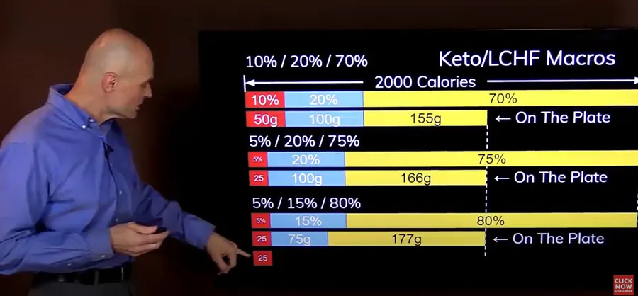

# Mon régime Keto

## Introduction

En ce qui me concerne, depuis [2017](`NOT YET TRANSFERED`) (regime-alimentation-activite-physique/) les choses ont un peu évolué du côté de la nutrition. J'en profite donc pour mettre à plat dans cette page ce que je crois avoir compris du régime cétogène (faible en glucides c'est à dire en sucre et en amidon) et expliquer comment je fais au jour le jour. Je ne suis pas médecin ni nutritionniste. Je partage juste mon expérience.

{: .warning }
Le plus important à retenir, c'est sans doute les 3 lignes qui suivent:

* Glucides : C'est une limite à ne pas dépasser
* Protéines : C'est un objectif à atteindre
* Lipides : C'est une variable d'ajustement

On ne doit donc pas dépasser la quantité de glucides, tout faire pour atteindre la quantité de protéines mais surtout, on n'est pas obligé d'atteindre la quantité de lipides. Ça, je n'avais pas bien compris au début.

Le deuxième truc à garder en tête c'est que, régime ou pas, cétogène ou pas, **tout excès sera stocké**. C'est donc une erreur que de manger trop de gras en régime cétogène.

## Comment calculer ?

Je connais mon âge, ma taille, ma morphologie, mon genre etc. Je peux donc déterminer assez rapidement mon poids cible. 

On peut aussi raisonner en pourcentage et dire qu'on souhaite perdre 10% de son poids actuel. Attention, l'[IMC](https://www.caloris.fr/obesite-de-ladulte/adulte-calculer-votre-imc/) (poids/taille², doit être inférieur à 25) c'est surtout un indice statistique valable pour des populations et pas si utile que ça pour un individu. Cela peut toutefois donner une idée mais pour confirmer à titre individuel si on doit (ou pas) perdre du poids mais bon, il est préférable de mesurer son **tour de taille**. 

Ce dernier doit être inférieur à 1/2 de notre taille (j'en parle [dans cette page]()). 

Bon bref, pour l'exemple, et dans la suite de ce billet, on va dire que je souhaite, en régime stabilisé, être à 69 kg.

Cela dit, une fois qu'on a son poids cible en mains, je trouve qu'il est très difficile de déterminer le nombre de calories dont on a besoin. 

On dit 2 000 kcal pour un homme. Moi, perso, je n'y arrive pas, c'est trop. De plus, j'imagine que deux femmes qui ont le même poids cible mais des morphologies différentes auront des besoins en calories différents. Bref, ci-dessous je propose une base de départ qu'il faudra ajuster.

* Quantité de protéines quotidienne = 2 fois le poids cible = 69 x 2 = 138 gr
* Les glucides, c'est une valeur constante = 20 gr
* Les lipides = protéines - glucides = 138 - 20 = 118 gr
* La quantité de lipides minimum = 69 x 1.2 = 83 gr

C'est donc relativement simple et on peut presque le faire de tête. 
* 20 gr de glucides
* Deux fois le poids du corps pour les protéines
* Lipides = la différence entre protéines et glucides 

## Résumé en gr
Avec une cible à 69 kg

| Macronutriments | gr |
| --------------- | --- |
| Protéines       | 138 gr |
| Glucides        | De 0 à 20 gr maximum |
| Lipides         | De 83 gr à 118 gr maximum |

## Résumé en kcal

| Macronutriments | Calcul              | kcal |
| --------------- | ------------------- | --- |
| Protéines       | 138 x 4             | 552 kcal |
| Glucides        | De 0 x 4 à 20 x 4   | De 0 à 80 kcal |
| Lipides         | De 83 x 9 à 118 x 9 | De 747 à 1062 kcal |
|                 | **Total**           | De 1 299 à 1 694 kcal |

## Résumé en % de calories

| Macronutriments | Range                   | %   |
| --------------- | ----------------------- | --- |
| Protéines       | 552/1694                | 32% |
| Glucides        | 80/1694                 | De 0 à 4,7% |
| Lipides         | De 747/1694 à 1062/1694 | De 44% à 62% |

Avec un 2x du poids du corps pour les protéines, il y en a plus que dans d'autres régimes mais bon ce n'est pas complètement à côté de la plaque. N'hésitez pas à voir la vidéo ci-dessous.

**MàJ d'Avril 2023**

Finalement, je suis dorénavant sur une répartition 
* 5% glucide
* 20% proteines
* 75% lipides 
* un nombre de kcal légèrement supérieur à la la limite basse précédente 1 350 kcal

&nbsp;

&nbsp;

Je trouve que Eckberg est plutôt sensé et raisonnable dans ses vidéos.

<https://youtu.be/NW0-m0x1sZ8>

Sinon, si vous souhaitez directement partir du nombre de calories dont vous avez besoin par jour, puis appliquer des pourcentages, vous pouvez essayer ce type de [calculateur en ligne](https://sagessesante.fr/calories-par-jour/). Dans le poids, pensez à mettre le poids cible et pas votre poids actuel. En ce qui me concerne j'ai une différence de 4% entre les 2 valeurs (1690 vs 1622 kcal).

&nbsp;

&nbsp;

Bon sinon, j'ai beaucoup, beaucoup de mal à atteindre la quantité de protéines. Il y en a sans doute trop, beaucoup trop.

Avec les chiffres précédents, dans l'application [MyFitnessPal](https://www.myfitnesspal.com/fr) je rentre donc :

* 1690 kcal comme objectif
* Protéines 35% (138 gr, 552 kcal)
* Glucides 5% (c'est un max, 20 gr, 80 kcal)
* Lipides 60% (45% minimum, 118 gr maximum, 1062 kcal max)

Dans MyFitnessPal la résolution n'est que de 5% donc il ne faut pas essayer d'être au % près. 

De plus, il ne faut pas hésiter à ajuster lipides et protéines en augmentant les lipides si on n'arrive pas à atteindre le niveau de protéines. 

Pour info on considère que 2 fois le poids du corps pour les protéines c'est plutôt pour ceux qui font de la musculation etc. Sinon j'ai lu assez souvent des valeurs de l'ordre de [1.2 à 1.7](https://sportchezsoi.com/combien-de-proteine-par-jour-muscler-mincir/). 

De toute façon vous avez maintenant la méthode mais bon 1.7 c'est moins facile à utiliser que 2. Ou alors… On peut faire -5% en protéines et +5% en lipides en faisant attention à ne pas aller trop haut en lipides. Généralement je trouve assez facile d'atteindre le niveau de lipide (un peu plus de vinaigrette, un peu plus de beurre…).

## Pour le reste

* Je ne renie pas tout ce que je disais dans [ce billet](`NOT YET TRANSFERED`) (regime-alimentation-activite-physique)mais certaines choses ont évolué.
* Oui, je me pèse tous les matins
* Oui, je rentre du mieux que je peux, les informations nutritionnelles de ce que je mange dans MyFitnessPal. Pas toujours facile surtout en déplacement ou le week-end en famille. Là, je ne rentre généralement rien et je regarde la balance quand je rentre ou après le week-end.
* De plus, quand je compare les valeurs de certains aliments avec les données de l'[ANSES](https://ciqual.anses.fr/) je suis très dubitatif. Du coup, j'ai créé mes propres aliments avec des valeurs vérifiées deux ou trois fois sur différentes sources. C'est un peu lourdingue au début mais je pense que cela vaut vraiment le coup sur le long terme car on mange un peu toujours pareil.
* Je suis régulièrement en mode régime intermittent (pas de petit déjeuner par exemple) ou OMAD (one meal a day, pas de petit déjeuner ni de déjeuner). Il m'arrive de [jeûner quelques jours par an]() mais il faut alors le "visualiser", le voir et un peu de support à la maison pour que cela se passe bien.
  
Le but du jeu dans les 3 cas précédents est d'espacer les moments où on mange et où le niveau d'insuline remonte.

L'insuline c'est l'hormone qui signale qu'il faut faire diminuer le taux de glucose dans le sang. Ce dernier est alors stocké dans le foie et les muscles squelettiques. Si cela ne suffit pas, le reste du glucose est alors transformé (en triglycéride) et stocké dans les cellules adipeuses. C'est pour ça qu'on dit parfois que l'insuline c'est l'hormone du stockage.

Bref, il faut qu'on mange, c'est sûr, mais on n'est pas obligé de manger 3 fois par jour et de grignoter 3 fois par jour entre les repas (à chaque fois c'est des pics d'insuline qui indiquent au corps qu'il faut stocker, stocker, stocker. )

Quand je suis en régime intermittent (2 repas par jour) ou OMAD (1 repas par jour) je mange en une (ou deux) fois presque toutes les calories que je devrais manger. Cela dit, il y a une restriction calorique naturelle due à la mécanique car je n'arrive tout simplement pas à manger tout ça en un seul repas.

Je ne vais pas faire ici une page sur le jeûne mais… Le jeûne c'est complètement différent du fait de ne pas pouvoir manger à sa faim ou de manger mais de manger très peu dans la journée (famine). Lors du jeûne on ne mange rien. Le corps change donc rapidement (au bout de 1 ou 2 jours typiquement, le temps de consommer les réserves de glucose du foie) de filière énergétique et il utilise alors le gras stocké. D'un autre côté, quand on réduit fortement les calories (régime drastique), les pics d'insuline apparaissent quand on mange (même un peu) et le corps n'a alors aucune raison de passer en mode "utilisation du gras". On se fait alors plus de mal que de bien : on a faim, on ne déstocke rien et on pense à manger toute la journée. C'est le régime de **la double peine**.

* En ce qui me concerne supprimer le pain c'est ce qu'il y a de plus dur. Ah oui, au fait, que le pain soit complet ou non n'a strictement aucune importance (vérifiez par vous même les indices glycémiques pour vous en convaincre). Ils sont donc à supprimer tous les 2. Les autres types de sucres (soda, jus de fruits, desserts, plats ou sauce industriels, sucre de table…) ça va, j'arrive à m'en passer facilement.

* Le week-end, en famille, au restaurant je ne fais pas suer le monde et je profite à fond du moment et des personnes autour de moi. Oui, oui bien sûr j'essaie d'éviter le pain (mais bon, je l'ai dit, ça c'est dur), j'ai du mal avec les Curly et les gateaux salés mais généralement je n'ai pas trop de mal à ne pas prendre de dessert ou de thé gourmand. Et puis... Si y a craquage, y a craquage. Pas la peine de se prendre la tête. On va se peser demain matin et on corrigera le tir dans les jours à venir.

* Je fais un peu de sport mais faut pas se leurrer la perte ou le maintien de poids c'est lié à 80% à l'alimentation. Cela dit, le sport c'est super pour le cardio, les muscles, le mental etc.

## Ajustements en fin de journée

Généralement je ne le fais pas. J'essaie de m'améliorer le jour d'après. 

Cela dit, prenons un exemple pour fixer les idées et disons qu'en fin de journée, dans MyFitnessPal, la situation est la suivante :

| Macronutriments | gr    | Note            |
| --------------- |:-----:| --------------- |
| Protéines       | 87 gr | 138 à atteindre |
| Glucides        | 16 gr | C'est OK c'est inférieur à 20 gr |
| Lipides         | 86 gr | C'est OK c'est entre 83 et 118 gr |

### Option 0

* Je regarde où j'en suis en pourcentage dans MyFitnessPal
* J'essaie de corriger mais bon je n'y passe pas 3H
* Bien souvent je ne fais rien et la pesée du lendemain matin me rappelle à l'ordre

### Option 1

* Je suis à 16 gr de glucides et 86 gr de lipides
* Je devrais être à 16 + 86 = 102 gr de protéines
* Comme je suis à 87 gr de protéines il me manque 5 gr protéines
* Ça doit se trouver dans une tranche de jambon blanc (20% en proteines). Ooui, oui, je sais, il y aura aussi des glucides et des lipides dans la tranche en question.

### Option 2

* Je suis à 87 gr de protéines et à 16 gr de glucides
* Je devrais être à 87 - 16 = 71 gr de lipides
* C'est mort parce que je suis déjà à 86 gr

### Option 3

* Je suis à 87 gr de protéines.
* Il me manque 138 - 87 = 51 gr de protéines
* Ça va être chaud à trouver à moins de s'enfiler de la whey en intra-veineuse 😁 mais bon, je ne suis pas un grand fan. 

### Ma recommandation
Ne pas se prendre la tête en fin de journée **mais** se peser le lendemain matin

## À lire

* <https://amzn.eu/d/0M1DyzH>
* <https://amzn.eu/d/bpuvNra>
* <https://amzn.eu/d/ir5gGMK>

