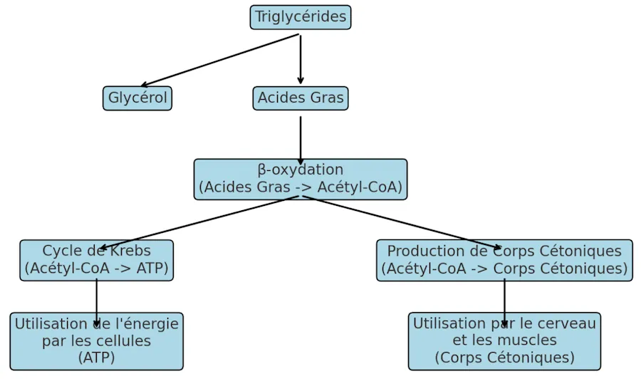

# Corps cétoniques
{: .no_toc }

## Table of Contents
{: .no_toc .text-delta}
- TOC
{:toc}

## Introduction
Molécules produites par le foie lorsque **le corps utilise les graisses comme source principale d'énergie au lieu des glucides**. Ce processus se produit principalement lors de situations où les réserves de glucose (la forme de sucre utilisée par le corps pour produire de l'énergie) sont faibles, comme pendant un jeûne prolongé, une alimentation très pauvre en glucides (comme le régime cétogène justement), ou lors de diabète mal contrôlé.

Il existe trois types principaux de corps cétoniques :
1. **L'acétoacétate (AcAc)** : C'est le premier corps cétonique produit pendant la dégradation des acides gras. Il peut être converti en deux autres corps cétoniques : le bêta-hydroxybutyrate ou l'acétone.
2. **Le bêta-hydroxybutyrate (BHB)** : Bien que techniquement ce ne soit pas une vraie cétone, il est souvent considéré comme tel. Le BHB est la principale forme de transport des corps cétoniques dans le sang, et il est utilisé par les cellules pour produire de l'énergie.
3. **L'acétone** : C'est le produit secondaire de la dégradation de l'acétoacétate. L'acétone est une molécule volatile qui est souvent éliminée du corps par la respiration (ce qui peut donner une haleine avec une odeur caractéristique).

Les corps cétoniques fournissent une source alternative d'énergie, surtout pour des organes comme le cerveau, qui dépendent principalement du glucose en temps normal. Dans des conditions comme la cétose (induite justement par le régime cétogène) ou la cétose diabétique, les niveaux de corps cétoniques dans le sang augmentent. Dans le cadre d'une cétose contrôlée (comme avec un régime), cette augmentation est sans danger et même recherchée. En revanche, dans le diabète non contrôlé, une accumulation excessive de corps cétoniques peut conduire à une acidocétose diabétique, une condition potentiellement mortelle.

## Transformation des graisses
On a dit plus haut que **le corps utilise les graisses comme source principale d'énergie au lieu des glucides**. Il faut cependant comprendre que le gras n'est pas directement transformé en glucides. Ce serait trop facile... Ce qui se passe est plus complexe, et c'est pourquoi le corps produit des corps cétoniques.

En gros... Le foie génère des corps cétoniques à partir des acides gras lorsque les réserves de glucose sont basses. Ces corps cétoniques servent alors de carburant alternatif pour les organes qui dépendent normalement du glucose, comme le cerveau. Ce mécanisme permet au corps de maintenir ses fonctions vitales en période de faible apport en glucides.

En détails... 
### 1. Utilisation des glucides vs. graisses pour l'énergie
{: .no_toc }
- **Glucides** : Normalement, le corps préfère utiliser les glucides (glucose) comme source principale d'énergie. Le glucose est facilement disponible et est rapidement métabolisé pour produire de l'ATP, la molécule d'énergie.
- **Graisses** : Lorsque les réserves de glucose sont faibles (comme lors d'un jeûne prolongé ou d'un régime très pauvre en glucides), le corps commence à décomposer les graisses stockées en acides gras pour les utiliser comme source d'énergie.

### 2. Transformation des Graisses en Acides Gras et Glycerol
{: .no_toc }
- **Les graisses (ou triglycérides) sont décomposées en acides gras et en glycérol**. Le glycérol peut être converti en glucose par un processus appelé **néoglucogenèse**, mais cela ne suffit pas à fournir toute l'énergie nécessaire au corps, surtout pour des organes comme le cerveau, qui consomment beaucoup de glucose.

### 3. Production de corps cétoniques
{: .no_toc }
- **Acides Gras** : **Les acides gras sont transportés au foie**, où ils sont convertis en acétyl-CoA via un processus appelé **β-oxydation**. Normalement, l'acétyl-CoA entre dans le cycle de Krebs pour produire de l'ATP.
- **Quand le glucose est faible** : En cas de carence en glucose, le cycle de Krebs ne fonctionne pas à pleine capacité car il dépend aussi de certains dérivés du glucose (comme l'oxaloacétate). **C'est l'excès d'acétyl-CoA qui est alors détourné pour produire des corps cétoniques.**

### 4. Rôle des corps cétoniques
{: .no_toc }
- Les corps cétoniques sont solubles dans l'eau et peuvent être transportées par le sang jusqu'aux organes comme le cerveau, qui les utilisent alors comme une source d'énergie alternative au glucose.
- Cela permet au corps de continuer à fonctionner même en l'absence de glucose suffisant, tout en utilisant les réserves de graisse comme carburant.

## Question de proportions
On a dit que **les graisses (ou triglycérides) sont décomposées en acides gras et en glycérol**. Ok mais en quelles proportions? 

Les triglycérides, forme principale de stockage des graisses dans le corps, sont composés d'une molécule de glycérol et de trois acides gras. Lors de la décomposition des triglycérides (un processus appelé **lipolyse**), ils sont donc scindés en :
- **1 molécule de glycérol**
- **3 molécules d'acides gras**

Donc pour chaque triglycéride décomposé, on obtient **1/4 de glycérol** et **3/4 d'acides gras** en termes de nombre de molécules produites.

### Rôles 
{: .no_toc }
- **Glycérol** : Le glycérol peut être converti en glucose via la néoglucogenèse dans le foie, mais la quantité de glucose produite à partir du glycérol est relativement faible.
- **Acides gras** : **Les acides gras sont transportés vers les cellules** pour être utilisés dans la production d'énergie (par β-oxydation), ou vers le foie pour être transformés en corps cétoniques en cas de besoin.

## Métabolisme des acides gras
Quand on parlait des proportions, on a dit que : **Les acides gras sont transportés vers les cellules** pour être utilisés dans la production d'énergie (par β-oxydation), ou vers le foie pour être transformés en corps cétoniques en cas de besoin.

Quand on parlait de la Production de Corps Cétoniques, on a dit aussi que : **Les acides gras sont transportés au foie**, où ils sont convertis en acétyl-CoA via un processus appelé β-oxydation.

Il faut sans doute rentrer dans les détails...Les deux phrases décrivent les étapes du métabolisme des acides gras, mais avec un angle différent : l'une se concentre sur le transport et la destination des acides gras (cellules ou foie), tandis que l'autre se focalise sur le métabolisme des acides gras spécifiquement au niveau du foie.

### 1. Première phrase
{: .no_toc }
- **Transport des acides gras** : Les acides gras sont transportés vers deux endroits potentiels :
  1. **Les cellules** : Pour y être utilisés directement comme source d'énergie via la β-oxydation. Dans ce cas, les acides gras sont décomposés en acétyl-CoA qui entre ensuite dans le cycle de Krebs pour produire de l'ATP (énergie).
  2. **Le foie** : Lorsqu'il y a un besoin accru de production d'énergie et que le glucose est insuffisant (comme lors d'un jeûne prolongé), les acides gras sont transportés vers le foie pour être convertis en corps cétoniques.

### 2. Deuxième phrase
{: .no_toc }
- **Concentration sur le foie** : Cette phrase précise que, lorsqu'ils sont transportés au foie, les acides gras sont décomposés en acétyl-CoA via la β-oxydation. Ce processus est commun, que l'acétyl-CoA soit ensuite utilisé pour :
  1. **Cycle de Krebs** : Pour produire de l'énergie (ATP) en conditions normales, lorsque le glucose est disponible.
  2. **Production de corps cétoniques** : Lorsque le glucose est en faible quantité, l'acétyl-CoA est utilisé pour produire des corps cétoniques, qui serviront de carburant alternatif pour le corps.

### Synthèse 
{: .no_toc }
- **β-oxydation et Acétyl-CoA** : Que ce soit dans les cellules ou au foie, les acides gras sont d'abord décomposés en acétyl-CoA par la β-oxydation.
- **Destination de l'acétyl-CoA** : Selon l'état énergétique du corps et la disponibilité du glucose, l'acétyl-CoA peut soit entrer dans le cycle de Krebs pour produire de l'ATP, soit être transformé en corps cétoniques au niveau du foie.

1. **Triglycérides** : Décomposés en **Glycérol** et **Acides Gras**.
2. **Acides Gras** :
   - Subissent la **β-oxydation** pour être transformés en **Acétyl-CoA**.
   - **Acétyl-CoA** a deux destinations possibles :
     - **Cycle de Krebs** : Pour produire de l'énergie sous forme d'ATP, utilisée par les cellules.
     - **Production de Corps Cétoniques** : Lorsque l'acétyl-CoA est transformé en corps cétoniques dans le foie, utilisés comme source d'énergie par le cerveau et les muscles.

## Combien de jours jeûne avant la cétose?

Le passage du corps à l'utilisation des corps cétoniques comme principale source d'énergie, un état appelé **cétose**, dépend de :
* la durée du jeûne
* l'état métabolique de la personne
* son niveau d'activité physique.

### En gros 
{: .no_toc }
- **Les premières 24 heures de jeûne** : Le corps utilise principalement le glucose stocké sous forme de glycogène dans le foie et les muscles. Le glycogène est rapidement dégradé en glucose pour maintenir les niveaux d'énergie.
- **Après environ 24 à 48 heures de jeûne** : Les réserves de glycogène commencent à s'épuiser. Le corps augmente alors la production de glucose à partir du glycérol (issu de la décomposition des triglycérides) et d'acides aminés (provenant de la dégradation des protéines musculaires) via la néoglucogenèse. Cependant, cette production de glucose est limitée.
- **À partir de 2 à 4 jours de jeûne** : Le corps entre en cétose. Le foie commence à produire des corps cétoniques à partir des acides gras pour répondre aux besoins énergétiques, notamment ceux du cerveau, qui ne peut pas utiliser directement les acides gras pour produire de l'énergie. Les corps cétoniques deviennent alors une source majeure d'énergie.

### Facteurs qui influencent l'entrée en cétose 
{: .no_toc }
- **Alimentation préalable** : Les personnes ayant une alimentation riche en glucides peuvent mettre un peu plus de temps à entrer en cétose par rapport à celles qui suivent déjà une alimentation pauvre en glucides ou cétogène.
- **Activité physique** : L'exercice physique peut accélérer l'épuisement des réserves de glycogène et donc accélérer l'entrée en cétose.
- **Réserves de glycogène** : Les réserves de glycogène varient d'une personne à l'autre, ce qui peut affecter le moment où la cétose commence.
