# Débuter la course à pied
{: .no_toc }

## Table of Contents
{: .no_toc .text-delta}
- TOC
{:toc}

<!-- 
{: .note }
Il y a un **Update août 2022** au bas de la page 
-->

## Introduction

Si tu es jeune, beau et sportif... Passes ton chemin, cette page n'est pas pour toi... Désolé. En fait, ici on part résolument du niveau zéro, on ne présume de rien, on veut juste débuter la course à pied dans la joie et la bonne humeur.

&nbsp;
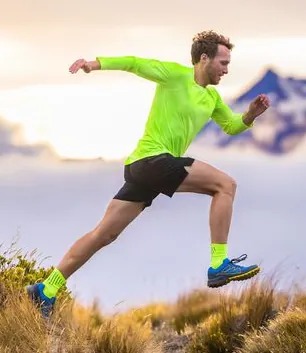
&nbsp;

Cependant, si tu te sens lourd, gros, gras et qu'en complément d'un régime tu souhaites faire un peu d'activité physique, alors là, je te propose :

* De commencer par lire cette page
* De ne PAS me faire confiance et d'aller en lire d'autres sur le web
* De te faire ta propre opinion
* Mais surtout... De sortir aujourd'hui (personne ne peut le faire à ta place 😁)

&nbsp;
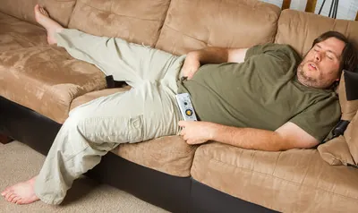
&nbsp;

Je me place dans un contexte de [perte de poids](). Typiquement, en complément du régime qui est responsable à 90% de la perte de poids, tu souhaites débuter la course à pied afin de te tonifier, de récupérer du souffle, de mieux dormir le soir etc.

Cela dit, même si tu ne fais pas de régime et que tu veux juste te mettre ou te remettre à courir, vas-y, fais-toi plaisir et lis le reste de ce billet.

## Courir en 5/5
On ne va pas perdre de temps et pour bien débuter la course à pied, on va passer à la pratique tout de suite. J'imagine que tu n'as pas couru depuis longtemps et qu'à force de regarder des vidéos sur YouTube tu te dis qu'il faudrait que tu t'y mettes vraiment.

Bon, et ben tu sais quoi ? Arrête de lire cette page, ferme ton PC et commence par aller marcher une heure dehors.

Arrête de lire je te dis, vas marcher, là maintenant. Allez, ouste, dehors !

&nbsp;
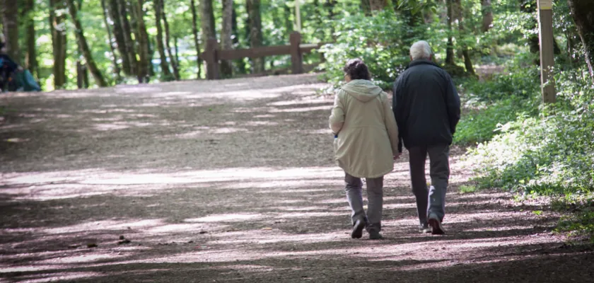
&nbsp;

Ayé, tu es revenu ? T'es pas mouru?

<iframe width="560" height="315" src="https://www.youtube.com/embed/_qEe6Krz5JI?si=cIu0-Yq2E-y2WSpP" title="YouTube video player" frameborder="0" allow="accelerometer; autoplay; clipboard-write; encrypted-media; gyroscope; picture-in-picture; web-share" referrerpolicy="strict-origin-when-cross-origin" allowfullscreen></iframe>

Oui, bien sûr, ce n'est pas de la course à pied, c'est de la marche mais en tout cas c'est un début d'activité physique en mode **aérobie** et c'est déjà pas mal. En plus, tu t'es prouvé que tu pouvais **trouver une heure** pour faire une activité physique plutôt que de procrastiner devant ta tablette.

### *C'est quand qu'on court ?*
Pour ta prochaine sortie, je te propose de sortir une heure (ou une demi-heure, au début on s'en fiche un peu) et de suivre le programme suivant (il te faut une montre au poignet)

* Tu marches 5 min.
* Tu cours 5 min.

Attention, **tu commences par la marche**. Elle sert d'échauffement et à dérouiller les articulations. Tu ne cours donc pas tout de suite en sortant de chez toi.

Après avoir couru la troisième fois (marche, *course*, marche, *course*, marche, *course*), tu fais demi-tour et tu reviens sur tes pas avec la même séquence (marche, *course* etc.). Elle n'est pas belle la vie ? C'est pas sympa de débuter la course à pied dans ces conditions ?

Heu... Je n'ai pas parlé de montre connectée (j'en ai une et j'en suis très content) ni de musique dans les oreilles (oui, oui j'ai aussi un téléphone portable). Pour débuter la course à pied, tu n'as besoin de rien ni de personne. Bien sûr, si tu as un téléphone et si tu veux absolument de la musique en marchant alors mets-le en mode avion et allume ta musique pendant les 5 minutes de marche. Tu le couperas dans les périodes de course. En effet, au départ **je ne recommande pas** la musique en courant car elle a tendance à te faire courir trop vite.

&nbsp;

&nbsp;

### *Heu... Je cours comment ?*
C'est une très bonne question ! J'imagine qu'actuellement tu es en train de lire cette page à l'intérieur (maison, bureau...) alors je te propose de te lever et de sauter à pieds joints une dizaine de fois (un peu comme si tu faisais de la corde à sauter)

&nbsp;

&nbsp;

Tu atterris comment ? Sur les talons ou sur l'avant des pieds ? Normalement, si tu ne viens pas d'une autre planète, tu atterris sur l'avant des pieds.

Oh, by the way, tu faisais du bruit ou pas ? Normalement en atterrissant sur l'avant du pied tu ne devrais pas faire de bruit (gardes ça en tête).

OK, recommence à sautiller. Maintenant penche le haut de ton corps un peu vers l'avant. Normalement tu dois avoir le sentiment de tomber et pour te rattraper tu mets naturellement, par réflexe, un pied devant. Ayé, tu es parti, tu t'es remis à la course à pied !

&nbsp;

&nbsp;

C'est cette attitude qu'il va falloir retrouver en courant. Si un jour tu as du mal à la retrouver, arrêtes toi, sautille quelques secondes, penche-toi en avant et repars. Y a pas de honte à avoir. On est en train de débuter la course à pied, donc tout n'est pas parfait, et 100 fois sur l'ouvrage on remettra notre métier. On fait le job quoi !

De la même façon, si un jour tu réalise que tu fais autant de bruit qu'une armée Romaine en train de défiler, arrêtes toi, sautilles, penche-toi et repars. Bien sûr pour s'entendre il ne faut pas de musique dans les oreilles.

&nbsp;
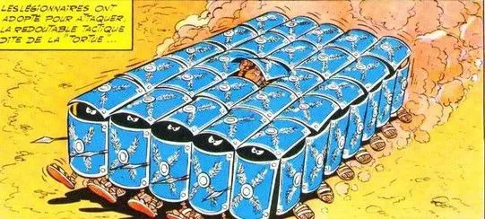
&nbsp;

### *OK, mais je cours à quelle vitesse ?*
Heu... Comment te dir mon petit lapin... Ne le prends pas mal mais je crains que ta carrière Olympique soit plus derrière toi que devant toi alors pour l'instant on va éviter de parler de chronos. OK ?

&nbsp;
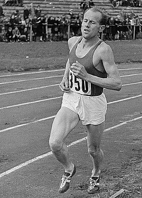
&nbsp;

Mouai... C'est gentil, je me moque gentiment de toi mais bon, ça répond pas à ta question... Bon... Il y a deux composantes dans la vitesse de course :

* La longueur des foulées
* Le rythme des foulées

Je te propose de courir à peine plus vite que quand tu marches.

Non, non je ne rigole pas. Pour bien débuter la course à pied, on va courir excessivement lentement et on va tout faire pour ne pas accélérer (ça, ça va être difficile). C'est d'ailleurs pour ça que je ne recommande pas la musique dans les oreilles car elle nous incite à accélérer le rythme et à allonger la foulée.

### *Mouai... Et je fais ça comment ?*

Idéalement, il faudrait que le pied qui se pose au sol, se pose juste devant la pointe de celui qui est déjà au sol. Ça fait des foulées ridicules, je sais. Cela dit, c'est l'idée générale. On n'est pas au centimètre près. Tiens, regarde l'image ci-dessous :

&nbsp;
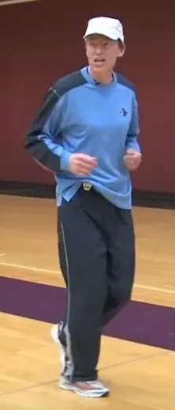
&nbsp;

Regarde bien où se trouve le talon de son pied avant par rapport à la pointe de son pied arrière.

En revanche, il faut absolument éviter de voir le pied avant se poser à 40 ou 60 cm du pied qui est au sol. Si ça arrive, il faut en prendre conscience et raccourcir volontairement sa foulée. C'est facile, tu baisse les yeux et tu vérifies où se pose ton pied avant. Bref, tu évites absolument de faire ça :

&nbsp;
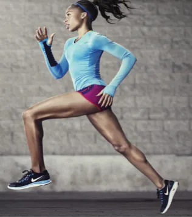
&nbsp;

En cela, le fait de marcher 5 minutes entre 2 phases de course à pied, permet "d'effacer l'ardoise", de faire une remise à zéro des compteurs et de repartir avec une toute petite foulée.

On a parlé de la longueur des foulées. Quid du rythme de ces dernières ? Afin de pouvoir se préparer pour plus tard l'idée serait d'avoir un rythme de 180 pas minute. Donc un des 2 pieds doit se poser 90 fois par minute ou 22 fois toutes les 15 secondes.

Là, il n'y a pas 36 solutions, faut faire des tests à la maison avec une montre et se mettre le rythme dans la tête (1, 2, 3, 4...1, 2, 3, 4...). Pour info, 180 bpm c'est le rythme de "I'm so excited" des Pointer Sisters.

<iframe width="560" height="315" src="https://www.youtube.com/embed/8iwBM_YB1sE?si=TCLWXrQI7dOIEqOv" title="YouTube video player" frameborder="0" allow="accelerometer; autoplay; clipboard-write; encrypted-media; gyroscope; picture-in-picture; web-share" referrerpolicy="strict-origin-when-cross-origin" allowfullscreen></iframe>

Un bon indicateur c'est qu'en faisant comme ça (foulée courte et rythme soutenu) tu dois être capable de parler sans avoir l'impression de mourir ou de courir en ne respirant que par le nez. Si tu es tout seul, récites une [fable de la Fontaine](https://youtu.be/0Q_V7yZaEDE?si=BThSt1mx2ANAgIZ3&t=9) ou la [table de multiplication]().

### Débuter la course à pied - Synthèse
* Tu atterris sur l'avant de tes pieds (silencieux comme un Ninja)
* Tu fais de toutes petites foulées et tu cours très lentement
* Le haut de ton corps est légèrement penché vers l'avant
* Tu regardes à 50 m devant (la distance entre 2 poteaux électriques)
* Tu imagines que tu as une ficelle attachée sur le haut du crâne et qui te tire vers le haut
* Tes coudes sont pliés à 90° et tes mains viennent te toucher au niveau des hanches (en tout cas, elles ne sont pas sous ta poitrine ni sur tes cuisses)
* Tes mains ne se croisent PAS et restent de leur côté respectif
* Tu alternes 5 minutes de marche et 5 minutes de course

### *Oui mais j'ai l'air d'un con!*
C'est sûr, le papy de 70 ans qui vient de te doubler t'as mis un coup au moral.

&nbsp;
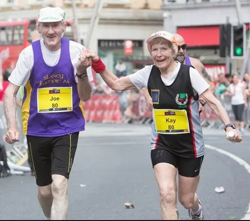
&nbsp;

De plus, je sais, je t'ai vu. Tu n'as pas eu le courage de croiser le regard des trois minettes de 20 ans, belles comme des cœurs qui filaient au moins à 12 km/h.

Laisse tomber... Tu investis du temps sur toi. Tu le fais pour toi, pas pour les autres. De toute façon papy ça fait 40 ans qu'il court, il a participé à 10 marathons et personne dans le quartier ne peut le suivre.

Quant aux minettes... De toute façon, elles allaient dans l'autre sens donc, dans tous les cas, c'était râpé...

&nbsp;
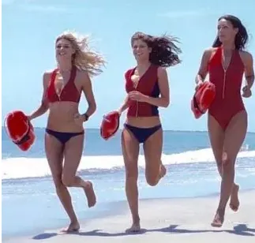
&nbsp;

Plus sérieusement, y a un vrai risque au début à vouloir accélérer et/ou à vouloir aller trop vite. Tu vas allonger ta foulée. Naturellement tu vas avoir tendance à atterrir sur tes talons. Les vibrations vont remonter le long des jambes et tu vas te blesser.

Tu débutes. Cette page s'appelle "Débuter la course à pied". Tu n'as pas le niveau. Accepte-le, sois fier des progrès que tu fais. Ce qui compte, c'est de te comparer à toi-même, pas aux autres. Quels sont les progrès par rapport à ta dernière sortie ? Si tu compares à la semaine dernière ou au mois dernier, y a du mieux ? En fait c'est ça qui compte.

### *On termine par 5 minutes de course. Ce n'est pas très malin...*
Pas de problème, on s'adapte... Tu termines ta dernière session de 5 minutes de course, tu arrives à la maison et... Tu t'arrêtes pas. Tu fais un tour de pâté de maison en marchant 5 minutes.

Cependant, si tu veux absolument montrer aux autres de la tribu que tu te bouges, rentrer en sueur c'est pas con... Nan, je plaisante. Va plutôt marcher 5 minutes de plus.

### *Courir tout seul ou à plusieurs ?*
Je m'en fous. Ton problème c'est de te remettre à sortir et à te bouger. Si le fait d'aller avec un ou des potes t'aide à débuter la course à pied, tant mieux. Sinon, assume ta décision de t'y remettre et sors tout seul. Encore une fois personne ne peut le faire à ta place. Le reste c'est de la poésie ou des discussions de comptoir. 

&nbsp;
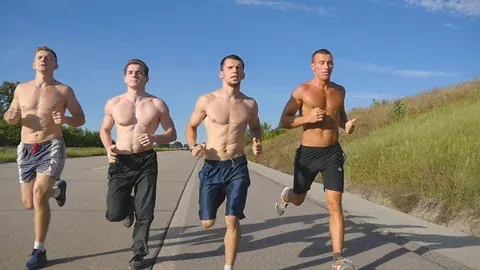
&nbsp;

Attention à un truc si tu sors avec des potes. Il faut que les niveaux, les objectifs et les motivations soient de niveaux similaires. Ne sors pas avec un marathonien même s'il est de très bonne volonté. De même, si après un mois ta sœur veut venir avec toi dis-lui de faire quelques sorties toute seule et/ou retrouve là pour le dernier quart d'heure mais ne partez pas ensemble car vos niveaux sont trop différents et c'est un coup à la dégoûter.

&nbsp;

&nbsp;

### *Il ne fait pas beau et je n'ai pas envie d'y aller*
C'est l'éternel problème. En tout cas, moi c'est sûr, je ne suis jamais en manque de course à pied et je peux très bien vivre sans aller courir.

Il n'y a pas de solution miracle. C'est une question de motivation et de coup pied aux fesses.

C'est quoi ton objectif ? Courir 30 min sans t'arrêter ? Courir une heure ? Perdre 10 kg ? Récite ton objectif **à voix haute** (pas dans la tête, c'est important).

Maintenant, poses toi la question : "**Aujourd'hui, qu'est-ce que j'ai fait pour me rapprocher de mon objectif ?**". Si la réponse est : "Encore rien". Alors, il est possible que le fait de mettre tes pompes et d'aller dehors t'aide. À toi de voir. T'es un grand garçon et je ne suis pas ta mère.

By the way, à l'occasion, achètes et lis [ce livre](https://www.amazon.fr/One-Thing-Surprisingly-Extraordinary-Results/dp/1885167776) (en anglais). Je me demande si il n'existe pas une version traduite. Vérifies.

&nbsp;
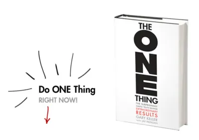
&nbsp;

En ce qui me concerne, j'ai une alarme dans mon téléphone qui s'allume 15 minutes avant l'heure à laquelle je dois aller courir. Si jamais je ne sors pas, j'ai toujours un peu honte lorsque j'ignore l'alarme. Essaies, ça peut, peut être t'aider...

Ensuite, le truc qui marche pour moi c'est de commencer à m'équiper. Une fois que je lève mes fesses et que je m'habille, c'est bon, je ne recule plus et je pars.

Enfin, c'est aussi l'avantage de commencer par 5 minutes de marche. C'est plus facile de marcher que de courir, on le sait et ça, ça doit t'aider à décoller tes fesses de ta chaise.

### *Oui mais moi, la marche ça va mais quand je cours, au bout de 3 minutes je suis à 2 doigts de mourir.*
Simple... Arrêtes de courir. Remets-toi à la marche. Quand tu seras redescendu en température et en rythme cardiaque, que tu en aura envie et que tu auras atteint le prochain multiple de 5 sur ta montre, tu repars en courant avec l'idée de tenir 5 min.

&nbsp;

&nbsp;

### *Oui mais si j'y arrive toujours pas ?*
Pas de problème. Tu veux débuter la course à pied. C'est ce qu'il y a de plus dur. Donc te prends pas la tête. Si ça arrive, tu t'arrêtes et tu reprends la marche le temps qu'il faut... Si tu dois marcher pendant un mois avant de pouvoir tenir 5 minutes de course, ce n'est pas un problème.

&nbsp;
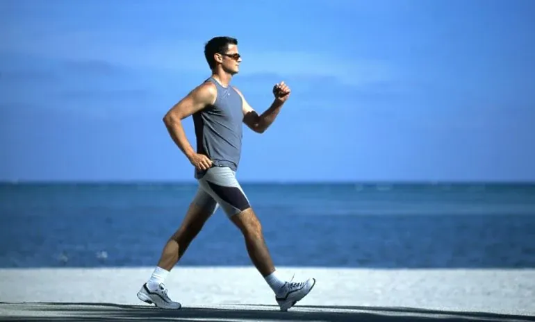
&nbsp;

### *Oui mais si au bout d'une heure j'ai couru finalement que 5 minutes et marché 55 minutes ?*
Eh bien dis-toi que c'est déjà ça de pris et qu'en comparaison de la semaine dernière il y a du plus. À la prochaine sortie repars avec l'idée de suivre le rythme de 5 minutes de marche puis 5 minutes de course. Si tu ne tiens pas, il n'y a pas mort d'homme. Cours moins et marche plus.

### *Oui mais moi je suis toujours en train de regarder ma montre*
Et? Franchement, c'est quoi le problème ? T'en bave, t'en as marre, t'as envie de marcher... Et tu regardes ta montre... La belle affaire. Te prends pas la tête avec ça, c'est normal.

Focalise plutôt ton attention sur les choses importantes : avant du pied, regard au loin, bras à 90° et mains au niveau des hanches par exemple. Pour le reste si tu regardes ta montre... Tout le monde s'en fout. Regarde ta montre et cours, allez cours Forest, cours !

&nbsp;
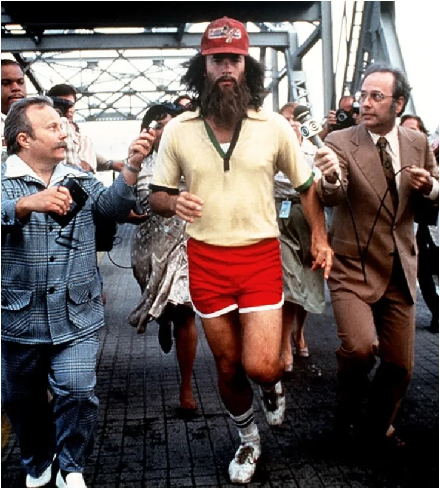
&nbsp;

### *Quelle fréquence pour les sorties ?*
Une tous les jours ce n'est pas possible ni raisonnable à long terme. Une tous les 2 jours c'est super. Une seule fois le samedi à 11H du matin, ce n'est tout simplement pas assez. Tu peux te bercer d'illusions, te dire que c'est déjà bien. Oui... Mais non. Une fois par semaine c'est pas assez. Sur une semaine, idéalement, il faudrait arriver à sortir :

* Lundi
* Mercredi
* Vendredi
* Samedi

Heu... Attention, je n'ai pas dit que tu devais sortir pour aller faire 40 km à chaque fois. On est toujours dans la partie "Courir en 5/5" dans laquelle on alterne marche et course.

Le truc c'est de **mettre en place une routine**, une discipline. Après, c'est toujours pareil, on s'adapte. Si tu ne peux vraiment pas le mercredi, ce n'est pas grave. Sécurise et sanctuarise le vendredi qui vient. Heu... Vendredi pas d'excès... Tu te tiens à l'agenda et tu sors 1H. Vas pas faire des bêtises et sortir 2H sous prétexte de vouloir "rattraper" la séance de mercredi. Elle est perdue. N'y pense plus et assures toi de la qualité de la sortie du jour.

Le samedi tu vas faire les courses et franchement t'as autre chose à faire que de t'occuper de toi. OK, pas de problème. Supprime la session du samedi et reste sur 3 sorties par semaine ce qui est déjà vraiment très très bien.

En tout cas, un jour de repos entre 2 sorties c'est bien. La sortie du samedi tu peux envisager de taper un peu plus dans l'organisme (plus tard on va transformer cette sortie en en "sortie longue"). Quoi qu'il en soit, Dimanche c'est relâche.

### *À quel moment aller courir ?*
À ce stade on s'en fout. Sors et cours. On verra après...

Bon, maintenant si tu es déjà sorti plusieurs fois tu as dû remarquer que si tu cours le soir, ensuite tu es tout excité, tonique etc. Conclusion, le soir ce n'est pas le meilleur moment car ensuite tu peux avoir du mal à t'endormir.

&nbsp;
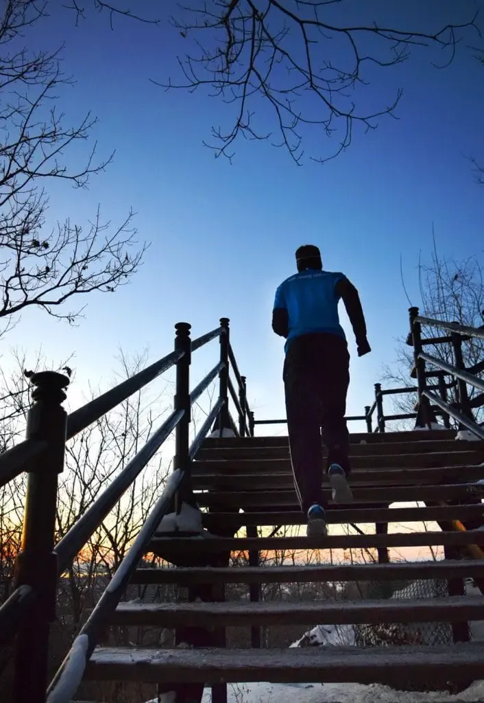
&nbsp;

Il te reste le matin ou le midi.

Perso, à part en vacances, l'été, je n'arrive pas à me lever pour aller courir. C'est pô po-ssi-bleu...

&nbsp;

&nbsp;

Finalement, j'essaie d'aller courir le midi et bien sûr, comme je n'ai pas le temps, je cours en fin de journée après le boulot. Pas top, mais c'est toujours pareil.... Mieux vaut courir en fin d'après-midi que de ne pas sortir du tout...

### *Faut que j’emmène à boire et à manger ?*
Non. Tu ne t’embarrasse pas avec tout ça. En été tu n'es pas débile au point de sortir à midi en plein cagnard. Tu sortiras le matin ou en fin d'après-midi. Attention, l'été en fin d'après-midi ce n'est vraiment pas top car il fait encore très chaud et il y a encore beaucoup de réverbération. L'été le mieux c'est donc le matin et vu qu'on est en 5/5 tu peux survivre à la soif.

Si maintenant tu as vraiment un problème emmène une "petite" bouteille d'eau et gardes-la en main (c'est vite chiant, je te préviens). À notre niveau, pas besoin d'investir dans une ceinture de marathonien ou un camel bag. Ce serait ridicule.

1 heure de marche alternée avec un peu de course ne nécessite pas non plus que tu emmènes des bananes ou des barres énergisantes. Faut se calmer... On marche puis on court comme des papy pendant une heure. On devrait survivre...

&nbsp;

&nbsp;

### Le 5/5 - Synthèse
* Bouge-toi ! Sors! C'est le plus dur, le plus important et personne ne peut le faire à ta place.
* Mets en place une routine, une discipline.
* Une paire de shoes neuves (voir plus bas) et une montre "normale" au poignet
* Pas de musique, pas de téléphone
* Tu pars 30 minutes dans un sens en alternant marche et course puis tu reviens.
* Ne pas oublier de toujours commencer par la marche
* On court très lentement
* Si tu n'arrives pas à courir 5 minutes, tu reprends la marche.
* Tant que tu n'arrives pas à alterner 5 minutes de marche et 5 minutes de course pendant une heure tu continues et ce n'est pas grave si ça prend 6 mois pour se mettre en place.

### *T'as rien à dire à propos des étirements ?*
Nan! Je suis nul et je n'ai jamais rien compris... En revanche il y a pas mal de choses intelligentes qui sont dites dans cette vidéo.

<iframe width="560" height="315" src="https://www.youtube.com/embed/wTU4BM_FxCY?si=DUKd6m2ABER6OcBt" title="YouTube video player" frameborder="0" allow="accelerometer; autoplay; clipboard-write; encrypted-media; gyroscope; picture-in-picture; web-share" referrerpolicy="strict-origin-when-cross-origin" allowfullscreen></iframe>

Par exemple, mollets 1/2 :

&nbsp;
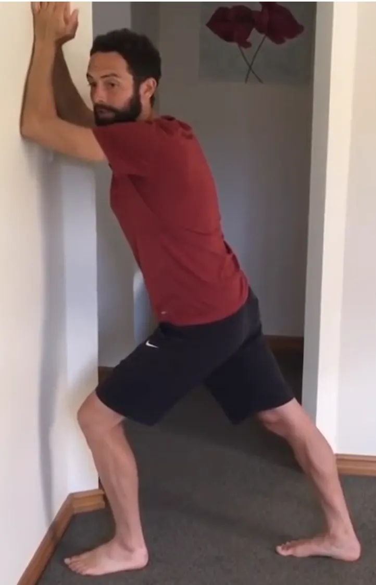
&nbsp;

Puis mollets 2/2.

&nbsp;
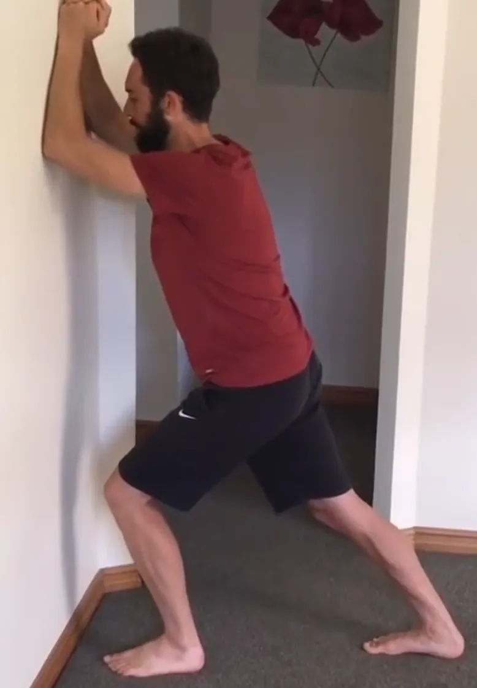
&nbsp;

## Courir en 10/10
Peu importe le temps que ça prend : 1 mois, 2 mois, 6 mois... Toujours est-il que maintenant, depuis 2 ou 3 semaines, tu arrives à marcher et à courir alternativement 5 minutes pendant une heure (ou 45 min. ça dépend tu format que tu as choisi). Il est temps de quitter les pistes vertes et de t'élancer sur les pistes bleues. Bienvenue dans le 10/10!

&nbsp;
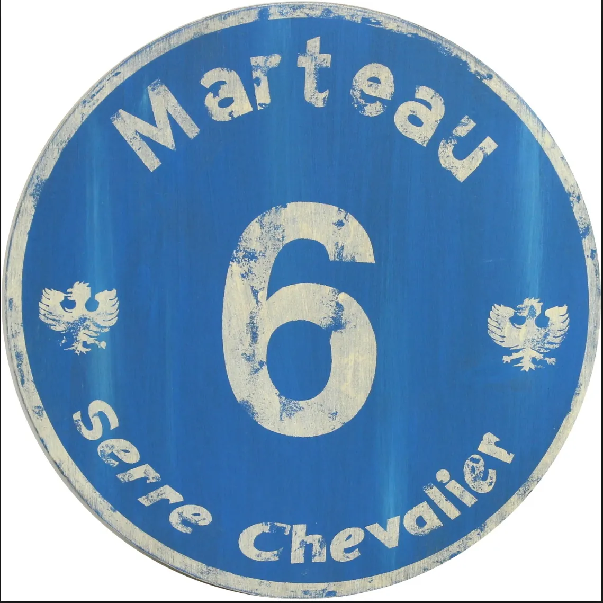
&nbsp;

En fait, ça va être très court... C'est tout pareil que le 5/5, mais tu marches 10 minutes puis tu cours 10 minutes.

La marche ça va aller. Là où ça peut coincer c'est courir 10 minutes. Cela dit la méthode tu l'as. Si tu as trop mal, si tu es tout rouge, si ton coeur bat la chamade, si tu n'es plus en aérobie... Tu t'arrêtes de courir et tu marches. Quand tu es prêt physiquement (pouls, température...) et dans ta tête, tu repars au prochain multiple de 10 avec l'idée de courir 10 minutes.

Tu ne changes rien! Ni dans ta foulée, ni dans ton agenda... Rien. Ah si quand même, pour fêter l’événement tu peux aller t'acheter un short ou un T-Shirt.

## Courir en 5/15
Quelques mois sont peut-être passés mais depuis 3 ou 4 semaines tu tiens le 10/10. Bienvenue sur les pistes rouges, tu passes en 5/15.

&nbsp;

&nbsp;

Autrement dit tu gardes le même agenda, le même rythme etc. Mais tu marches 5 minutes et tu cours 15 min.

Ouai... Allez, va t'acheter un autre T-Shirt...

## Courir 30 min.
Là, ça rigole plus. Ca a pris le temps que ça a pris mais depuis 1 mois tu tiens le 5/15. Tu veux tâter de la piste noire ? Allez, "Bienvenido, mi casa es tu casa" te voilà dans le club des grands.

&nbsp;

&nbsp;

Cela dit on se calme... Même foulée, même rythme, même agenda et mêmes réflexes si ça se barre en vrille. Tu t'arrêtes, tu marches et tu repars. On ne change pas une formule qui gagne.

Ah oui... J'allais oublier... Tu sors de la maison, tu marches 5 minutes et ensuite tu cours 30 minutes... Vas pas me la faire à l'envers, partir en courant et te blesser au bout de 50 m.

## Et après ?
Après, y a 12 000 pros sur YouTube qui peuvent t'inspirer. Moi je te recommande d'allonger tes séances et graduellement afin de passer de 30 minutes à 60 minutes de course. Tu peux par exemple allonger de 5 min. toutes les 2 ou 3 semaines ou tous les mois. Prends ton temps.

Une fois que tu es à 60 minutes, il faut voir où tu en es. Tu as perdu du poids, tu te sens bien, tout va bien... Bon, ben gardes le rythme et ne changes rien (c'est d’ailleurs aussi valable une fois que tu arrives à tenir 45 minutes non-stop).

Tu cours 60 minutes, tu es très content mais tu voudrais aller un peu plus vite. "No problemo". Tu as le souffle, tu sais ce que c'est que de courir une heure. Vas-y mais vas-y dou-ce-ment. Il faudra peut-être investir dans une montre qui te donnera ta cadence (c'est l'inverse de la vitesse) pour savoir en combien de minutes tu parcours un kilomètre. Prends alors une montre simple, pas trop cher. Idéalement tu veux ta cadence et peut être, je dis bien peut être ton rythme cardiaque. Tu pêteras ta tirelire dans une montre à 2 millions de $ plus tard. 

Tu cours 60 minutes, tu es très content mais tu voudrais aller un peu plus loin. Là aussi, "No problemo". Tu as le souffle, tu sais ce que c'est que de courir une heure. Vas-y mais vas-y doucement. Par exemple, tu peux ajouter 10 minutes de course (5 dans un sens et 5 dans l'autre). Tenir la distance pendant deux ou trois semaines puis rallonger la distance de 10 minutes.

Tu notes que je parle en minute et pas en kilomètre. Tu peux aussi faire de la sortie du samedi une **sortie plus longue** que les autres (c'est sans doute l'option qui a ma préférence).

À toi de vérifier sur YouTube ce qui te tente le plus puis de le confirmer en vrai par la pratique. En tout cas tu es physiquement et moralement équipé pour progresser. Si tu as le temps de courir autant, allez, enjoy!

## *Quel équipement pour débuter la course à pied ?*

À part pour les chaussures, on s'en fout. Sors! On discutera ensuite...

Oui, oui je sais ton survet' te fais ressembler à Rocky et tu as la honte mais, encore une fois, tu cours pour toi, pas pour les autres. Ensuite, cours un mois et là tu pourras te faire plaisir et acheter un short qui ressemble à quelque chose. Avant un mois, il ne me paraît pas raisonnable de dépenser des sous (à part pour les chaussures)

&nbsp;
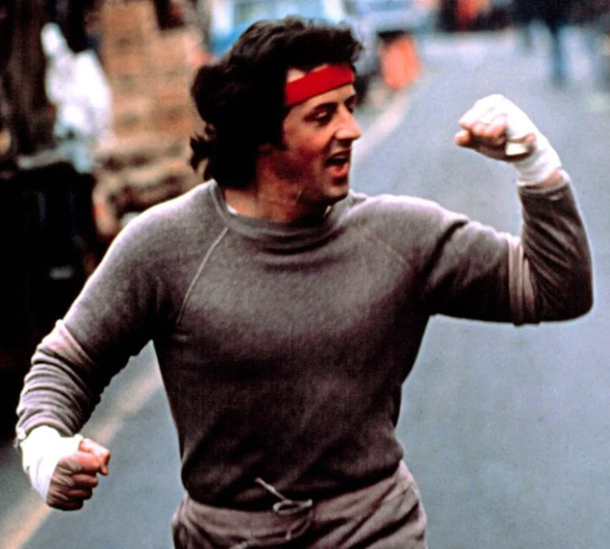
&nbsp;

En tout cas fais lite (au sens propre) au niveau des fringues. Tu vas vite monter en température alors méfiance. Ne pars pas avec 4 couches sur le dos... Penses à mettre des T-Shirt amples car sinon, et ce n'est pas une blague, tu vas avoir mal aux seins.

Bon, de toute manière tu vas te faire avoir une ou deux fois et tu vas apprendre. Sors plusieurs fois de suite et on en rediscutera...

Ah si quand même... En cas de pluie, que tu portes des lunettes ou pas, le mieux c'est encore la casquette.

### À propos des chaussures
C'est **le seul truc** où il ne faut pas trop plaisanter. Avant de faire ta première vraie sortie en 5/5, tu vas chez Décathlon (ou un autre) et tu t'achètes une paire de pompes pas trop cher (évite les tout premiers prix quand même). 

Oui, oui je sais, tu as au fond d'un placard les pompes que tu utilisais il y a 5 ans quand tu t'étais remis du tennis... Bon, je t'arrête tout de suite. Elles sont cuites tes tennis. Mieux vaut aller en acheter une paire neuve que tu réserveras à la course à pied.

&nbsp;
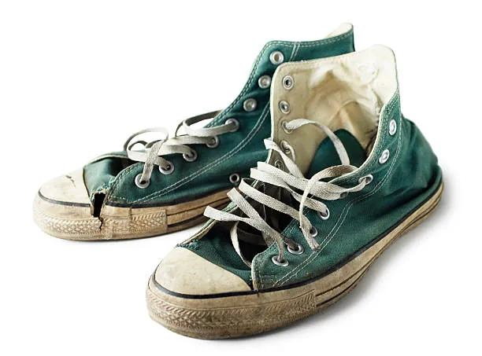
&nbsp;

Prends des chaussures pas trop chères, comme ça, si tu arrêtes de courir dans 2 semaines tu pourras continuer à dormir sans imaginer que les huissiers vont venir taper à la porte le lendemain.

Ne prends pas non plus un modèle fluo, hyper spécialisé. Tu ne pourras pas l'utiliser pour faire autre chose si tu arrêtes la course à pied à la fin du mois.

&nbsp;
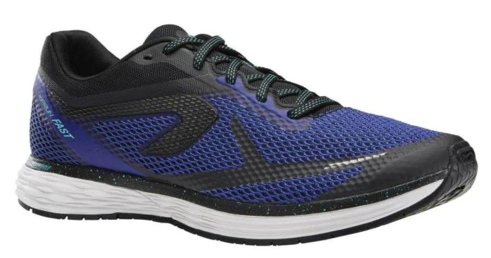
&nbsp;

Pense aussi à acheter 2 paires de chaussettes. Il faut quelles remontent au-dessus de l'arrière de la chaussure car sinon tu vas faire des soufflettes. Quand tu as confirmé que les chaussettes ne glissent pas dans chaussures, que tu n'as pas de soufflettes, que c'est les bonnes... Tu vas en acheter 2 autres paires (bien sûr tu prends les mêmes).

### À propos des chaussures - Synthèse
* Ne prends pas le premier prix 
* Prends une pointure au-dessus
* Réserve ces chaussures à la course
* Typiquement une paire de pompe c'est 1000 km 
* Tu ne serres pas tes lacets comme un sourd et tu fais un **double noeud** (non négociable)
* Coupe-toi les ongles de pieds régulièrement
* Mets des chaussettes dans tes chaussures

## Des vidéos que j'aime bien sur le sujet

<iframe width="560" height="315" src="https://www.youtube.com/embed/9L2b2khySLE?si=sy0FHbXuykb_HxRq" title="YouTube video player" frameborder="0" allow="accelerometer; autoplay; clipboard-write; encrypted-media; gyroscope; picture-in-picture; web-share" referrerpolicy="strict-origin-when-cross-origin" allowfullscreen></iframe>

<iframe width="560" height="315" src="https://www.youtube.com/embed/rYNZUioUdHQ?si=ucv8y61kJetDQtw-" title="YouTube video player" frameborder="0" allow="accelerometer; autoplay; clipboard-write; encrypted-media; gyroscope; picture-in-picture; web-share" referrerpolicy="strict-origin-when-cross-origin" allowfullscreen></iframe>

<iframe width="560" height="315" src="https://www.youtube.com/embed/4FsCbkMrtOg?si=R_r8RmV3lfMXj0w3" title="YouTube video player" frameborder="0" allow="accelerometer; autoplay; clipboard-write; encrypted-media; gyroscope; picture-in-picture; web-share" referrerpolicy="strict-origin-when-cross-origin" allowfullscreen></iframe>

<iframe width="560" height="315" src="https://www.youtube.com/embed/Xu36I2rEcQw?si=cJuy9JIRgeqOMGxN" title="YouTube video player" frameborder="0" allow="accelerometer; autoplay; clipboard-write; encrypted-media; gyroscope; picture-in-picture; web-share" referrerpolicy="strict-origin-when-cross-origin" allowfullscreen></iframe>

<iframe width="560" height="315" src="https://www.youtube.com/embed/_ydJvCNxapM?si=JueOV-NVhwlaT9at" title="YouTube video player" frameborder="0" allow="accelerometer; autoplay; clipboard-write; encrypted-media; gyroscope; picture-in-picture; web-share" referrerpolicy="strict-origin-when-cross-origin" allowfullscreen></iframe>

## Update août 2022
Une vidéo qui explique dans le détail pourquoi, si on veut perdre du poids, il est préférable de courir en mode aérobie (120 pulsations par min. environ)

<https://youtu.be/GoQ_Qt2REgQ?si=zH920zk3xuGm25yL>

<iframe width="560" height="315" src="https://www.youtube.com/embed/GoQ_Qt2REgQ?si=Mx9NOihrsWtSsQc6" title="YouTube video player" frameborder="0" allow="accelerometer; autoplay; clipboard-write; encrypted-media; gyroscope; picture-in-picture; web-share" referrerpolicy="strict-origin-when-cross-origin" allowfullscreen></iframe>

Dans la vidéo ci-dessous il est principalement question de nutrition mais vers 14:00 on y voit ces 2 courbes qui disent la même chose que précédemment. Si on veut brûler du gras faut le faire à un rythme cardiaque lent (autour des 120 BPM). Sinon, au-delà, en **mode anaérobie**, c'est surtout le glycogène qu'on consomme quand on se bouge.

&nbsp;

&nbsp;

<iframe width="560" height="315" src="https://www.youtube.com/embed/HcenVfig1fc?si=3FKFPsO_8mDvZf9G" title="YouTube video player" frameborder="0" allow="accelerometer; autoplay; clipboard-write; encrypted-media; gyroscope; picture-in-picture; web-share" referrerpolicy="strict-origin-when-cross-origin" allowfullscreen></iframe>

Allez, un dernier pour la route... Sur [cette page](https://www.running-addict.fr/conseil-running/bruler-les-graisses-pour-courir-plus-longtemps/) l'article qui s'adresse surtout à des amateurs qui veulent courir pour courir et pas courir pour perdre du poids, confirme que pour courir longtemps il faut utiliser le gras comme source principale d'énergie et que pour cela il y a une zone optimale qui va de 65 à 80% de la fréquence cardiaque maximale.

&nbsp;
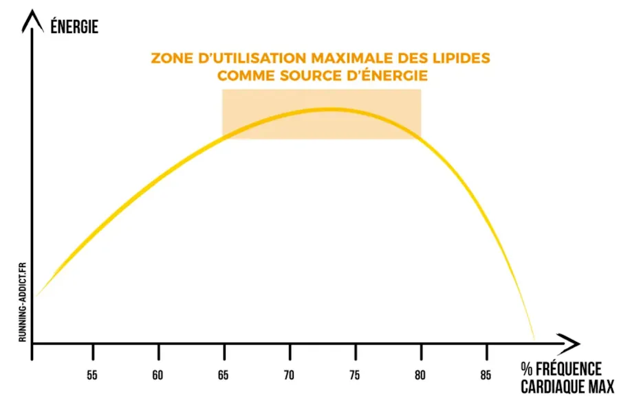
&nbsp;

En ce qui me concerne, à la mi 2022, 65% de ma fréquence cardiaque max (183 bpm) correspond à 120 bpm et 80% correspondent à 140 bpm.

C'est pour cela que depuis quelques mois déjà je pars en marche rapide (100 bpm) puis je cours au bout de quelques minutes quand je le sens bien. Je cours doucement, quand j'arrive dans la zone des 130-140 bpm je marche à nouveau jusqu'à descendre jusqu'à 110-120 bpm puis je repars alors en courant.

Sur mon circuit habituel il y a une côte. Du coup, je fais un peu de HIIT en donnant mon max dans la cote en question pendant 30 secondes environ. Sur un circuit habituel je monte la cote 5 à 6 fois.

Enfin, mais cela n'a rien à voir avec la course à pied et/ou la perte de poids, tous les kilomètres je fais alternativement une série de levées de bras, puis au prochain km une série de pompes puis au suivant une série de squats. Oui je confirme j'utilise une montre qui mesure les bpm et les km.
