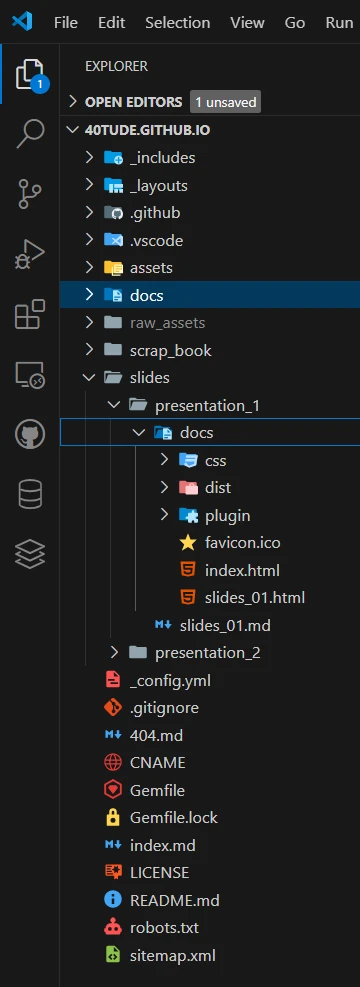

# Publish Slides On GitHub with revealjs

<div align="center">

</div>


## 1. Install Node.js & Check
In an Admin terminal

```powershell
choco install nodejs-lts -y
```

<div align="center">

</div>


```powershell
refreshenv
node -v
npm -v

```
<div align="center">

</div>

Close the terminal


## 2. Install reveal-md
* Open a terminal (no need to be Admin)
* Install ``reveal-md`` tool globally. It converts a Markdown file into a Reveal.js presentation.

```powershell
npm install -g reveal-md
```

<div align="center">

</div>


## 3. Create slides

```markdown
# Welcome !

---

## Slide II

This is a   **Reveal.js** presentation written in Markdown.

---

## Code !

```python
def hello():
    print("Hi Pr Falken")
```


## 4. Local Check

Let's run the slides in a local server

```powershell
reveal-md slides.md
```


<div align="center">

</div>

**TADAA !**

<div align="center">

</div>


## Push the slides to GitHub

### Set up directories. 

In my case I want to extend [40tude.fr](https://www.40tude.fr/) with some presentations. The web site is already hosted on GitHub. It is based on Jekyll and a ``Just The Docs`` theme. Everything work fine and I don't want to break anything !

As you can see below, I added a `slides` directory. I have one directory per presentation. Each directory will have one ``./docs`` sub-directory and one ``index.html`` file. More info about ``./docs`` in the next paragraph.

<div align="center">

</div>


### Generate the content of the ./docs directory 

Open a terminal where the markdown of the slides presentation is. According the previous screen capture I open a terminal in ``../slides/presentation_1``. This can and should be done within VSCode. 

Then issue the following command. 

```powershell
reveal-md .\slides_01.md --static docs
```

<div align="center">

</div>

This create a local ``./docs`` dir which contains whats need to be committed onto GitHub. 

At this step, it is just a matter of commit/push to GitHub 

## Testing
The 2 links help me to test the links and the organization of the directories.

* [Slidedeck 1]()
* [Slidedeck 2]()

## Notes
1. Works like a charm on cell phone. Make sure to be landscape oriented
1. I did'nt find out yet an easy way to leave the slides and come back to the page where the link to the presentation was.  
1. [revealjs](https://revealjs.com/) web site for much more info

