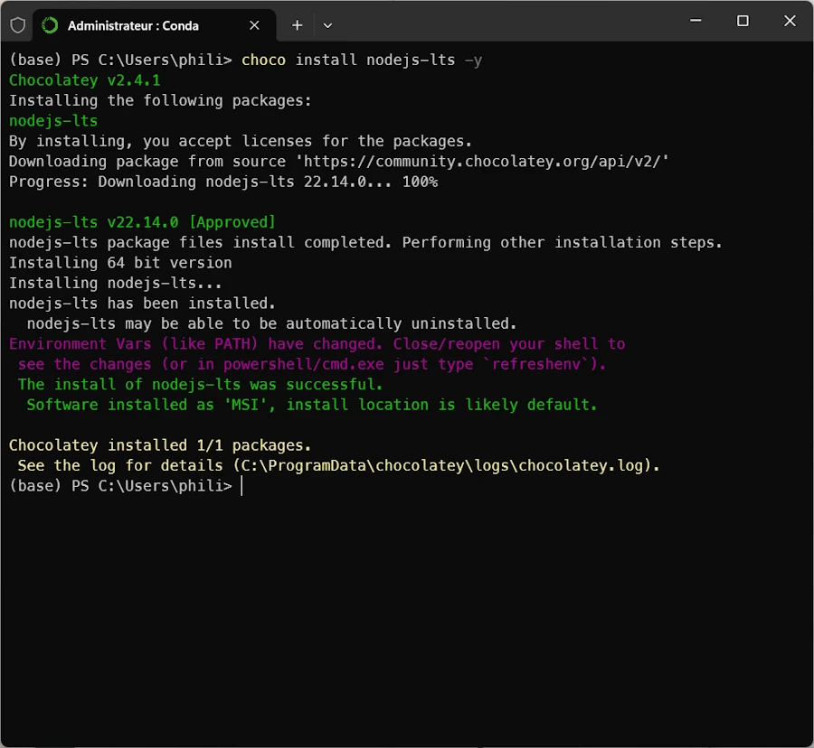
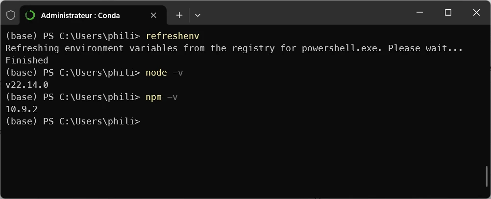
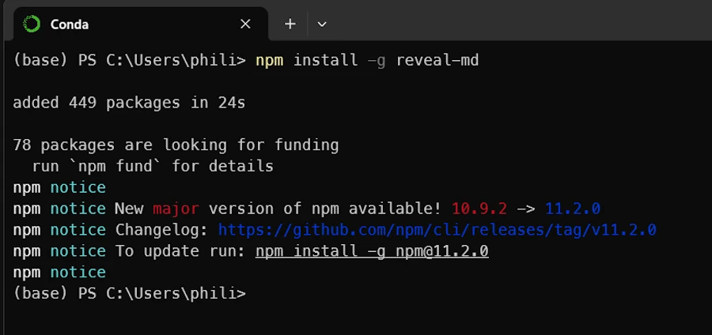
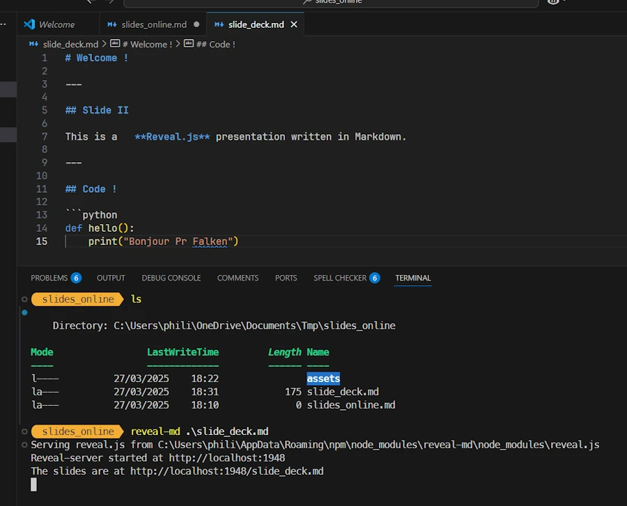
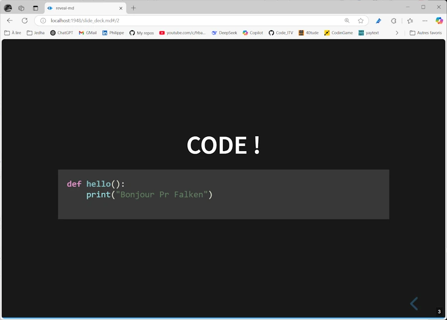
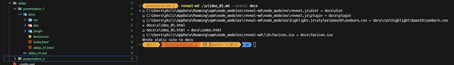

# Publish Slides On GitHub with revealjs

## 1. Install Node.js & Check
In an Admin terminal

```powershell
choco install nodejs-lts -y
```

<div align="center">

</div>


```powershell
refreshenv
node -v
npm -v

```
<div align="center">

</div>

Close the terminal


## 2. Install reveal-md
* Open a terminal (no need to be Admin)
* Install ``reveal-md`` tool globally. It converts a Markdown file into a Reveal.js presentation.

```powershell
npm install -g reveal-md
```

<div align="center">

</div>


## 3. Create slides

```markdown
# Welcome !

---

## Slide II

This is a   **Reveal.js** presentation written in Markdown.

---

## Code !

```python
def hello():
    print("Hi Pr Falken")
```


## Local Check

Let's run the slides in a local server

```powershell
reveal-md slides.md
```


<div align="center">

</div>

**TADAA !**

<div align="center">

</div>


## Push the slides to GitHub

* Set up directories. 
* Open a terminal where the markdown of the slidedesk is and issue the next command. This create a local ``./docs`` dir. It contains whats need to be commit on GitHub.

```powershell
reveal-md .\slides_01.md --static docs
```

<div align="center">

</div>


## Testing

* [Slidedeck 1]()
* [Slidedeck 2]()


