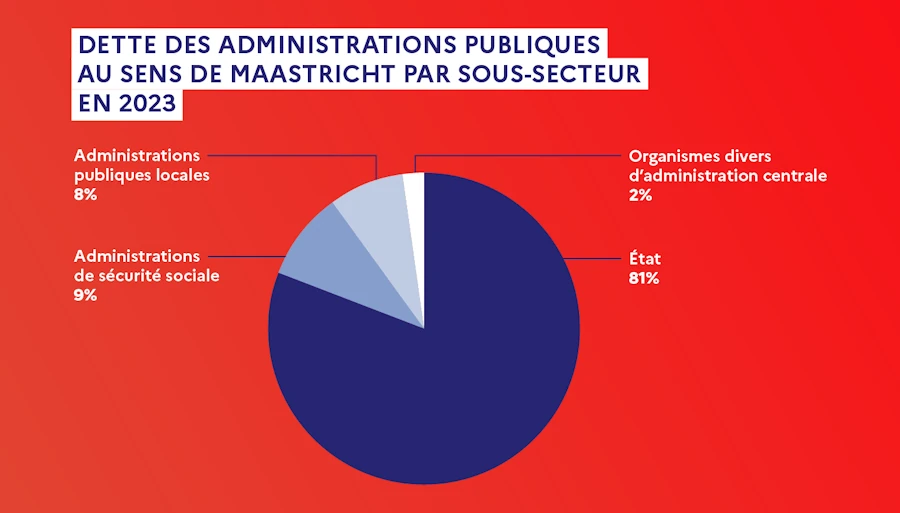
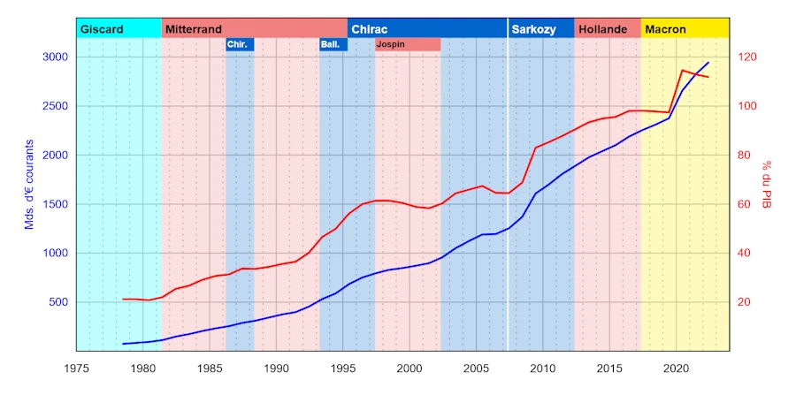

# Déficit et dette de la France : comprendre l’essentiel avec la règle des 80/20

<h2 align="center">
<b>Still under construction</b>    
</h2>

## TL;DR
- Depuis 73 la dette française ne cesse d'augmenter (Giscard est ministre des finances)
- Fin Q1 2025 elle est de 3350 milliards d'€ ([lien](https://www.economie.gouv.fr/decryptage-5-minutes-pour-comprendre-la-dette-publique))
- Le focus d'Août 2025 sur le chiffre de 1000 milliards ne concerne que la période 2017-2025 (présidence Macron)
- La règle de Pareto est respectée et **90 %** de ce déficit n'est dû qu'à 3 causes
- Dans l'ordre :  
  1. **Retraites** (celles de la fonction publique, celles des régimes spéciaux, 500 Mds€) 
  2. **Dépenses de crise** (Covid, énergie, inflation, 260 Mds€)
  3. **Baisses d’impôts et cotisations** (taxe d'habitation, IS, 230 Mds€)  
- Dans chaque catégorie, la règle de **Pareto** est encore vérifiée: une minorité de sous-catégories est responsable de 80% des montants (dans les retraites, 80 % du déficit = pensions fonctionnaires + CNRACL + régimes spéciaux)
- Il n'est pas suffisant de dire “les retraites” : une analyse **Pareto²** montre que seules quelques catégories expliquent l’essentiel du déficit
- Il est nécessaire de nommer les causes pour ne pas culpabiliser inutilement tout le monde, établir les priorités et réfléchir sur ce qui compte vraiment  

 
<!-- In space, no one can hear you scream.  -->

## Trois définitions

Je veux juste m'assurer qu'on est bien sur la même ligne.

### Principe de Pareto
Le **principe de Pareto**, aussi appelé **règle des 80/20**, tire son nom de l’économiste italien [Vilfredo Pareto](https://fr.wikipedia.org/wiki/Vilfredo_Pareto) qui avait observé au XIXᵉ siècle que 80 % des terres en Italie étaient possédées par 20 % de la population. Plus largement, ce principe décrit une régularité fréquente : **une minorité de causes produit la majorité des effets**. Cela ne signifie pas que les chiffres soient toujours exactement 80/20, mais plutôt que les phénomènes sont souvent très concentrés.

Exemples:
* Dans une armoire, **20 % des vêtements sont portés 80 % du temps**. By the way, si t'as pas mis cette chemise l'année dernière, donne-la, tu ne le remettras plus.
* En entreprise, **20 % des clients génèrent 80 % du chiffre d’affaires**.
* Dans un service informatique, **20 % des bugs causent 80 % des incidents signalés**.

On entend aussi parler de la règle du 50/1. C'est la même chose. **1% des clients qui appellent le support technique représentent 50% des appels**. On parle aussi de loi de puissance mais ça c'est vraiment pour se la péter à table en famille.

### Déficit
Le **déficit budgétaire** désigne le solde négatif des finances publiques sur une période donnée (sur un an par exemple) : c’est la différence entre les recettes et les dépenses sur cet exercice, cette durée ([lien](https://fr.wikipedia.org/wiki/D%C3%A9ficit_public_de_la_France)). 

Pour faire le parallèle avec une personne, c'est, à la fin de l'année, la différence entre ce qui est rentré (salaire, héritage, loto...) et ce qui est dépensé (2 Porsche, 4 Rolex...)

### Dette
La **dette publique** c'est le **cumul** à un instant `t` de tous les déficits non résorbés. C'est l’ensemble des emprunts accumulés par les administrations publiques au fil du temps, résultant de la somme des déficits annuels non résorbés ([lien](https://fr.wikipedia.org/wiki/Dette_publique_de_la_France#:~:text=engagements%20financiers%2C%20sous%20forme%20d%27emprunts%2C,des%20d%C3%A9ficits%20publics%20annuels%20cumul%C3%A9s)). 

Pour faire le parallèle avec une personne. Par exemple, 5 ans après qu'il a commencé à travailler, il se pose, il fait l'inventaire de tout ce qu'il doit rembourser et il vérifie combien ça lui coûte par an ou par mois.

**Note 1:**
On parle de la dette publique, pas de la dette de l'État. 
* **Dette de l’État** = uniquement les emprunts du **budget de l’État central** (ministères, trésor public).
* **Dette publique** = dette de **toutes les administrations publiques** au sens européen, au sens dit de Maastricht. C'est la référence utilisée par l’Union européenne pour surveiller les finances des États membres :
  * État central,
  * Collectivités locales,
  * Sécurité sociale (dont Unédic, retraites, hôpitaux),
  * et divers organismes publics.

La dette publique est plus large que la dette de l’État car elle englobe **l’ensemble du secteur public**. 

**Note 2:**
C'est toujours pour m'assurer qu'on est alignés. 

C'est pas grave d'avoir de la dette. À notre époque, c'est même plutôt considéré comme une bonne chose. En effet, qui dit dette, dit emprunt auprès d'une banque (pour acheter une maison par exemple). Contrairement à ce que l'on pense la banque ne sort les sous de ses coffres. Elle n'a tout simplement pas assez de liquidités pour le faire mais par contre l’État lui a donné le droit de créer, à partir de rien, de la monnaie : la banque crée de la monnaie fiduciaire à qui tout le monde fait confiance. Cet argent "fictif" est injectée dans l'économie réelle pour payer les artisans et les matériaux et c'est ça qui fait tourner l'économie. Mais bon, ç'est pas le sujet ici. Ce qu'il faut retenir c'est que c'est OK d'avoir de la dette. 

Par contre il est important pour une personne (comme pour un pays) d'être capable de payer ses traites (intérêts et capital) tous les mois. Là, pour le coup, on revient à notre sujet car si y a trop de dettes, le remboursement de la dette va coûter tellement cher qu'on sera même plus capable de payer les intérêts. On ne remboursera jamais le capital et on va trainer cet emprunt ad vitam æternam. 

Heu... Par contre faut pas oublier qu'une personne est mortelle ce qui n'est généralement pas le cas d'un pays. C'est peut être un détails pour vous mais pour moi ça veut dire beaucoup. Ca veut dire, en autres, qu'un pays à généralement plus de marges de manœuvre qu'un particulier. C'est vrai jusqu'au moment où il n'en a plus et où ses créanciers lui envoient le troïka du FMI (ou les huissiers). Et là... Ca saigne...    

Bref, le déficit de chaque année vient grossir la dette. In other words, le déficit est une grandeur mesurée sur une période donnée, la dette est un stock mesuré à un moment donné ([lien](https://www.vie-publique.fr/fiches/21878-les-differences-entre-le-deficit-budgetaire-et-la-dette-de-letat)). 

## La dette publique

On l'a dit, en France, la dette publique englobe l’État (budget de l’État central), les collectivités locales et les administrations de sécurité sociale ([lien](https://fr.wikipedia.org/wiki/Dette_publique_de_la_France#:~:text=La%20dette%20publique%20de%20la,des%20d%C3%A9ficits%20publics%20annuels%20cumul%C3%A9s) [Ministère de l'économie](https://www.economie.gouv.fr/decryptage-5-minutes-pour-comprendre-la-dette-publique)).

<!-- [Insee](https://www.insee.fr/fr/statistiques/7895860)  -->

 
<!-- In space, no one can hear you scream.  -->

Exemples : 
* En 2024, la dette publique française représente environ **112 % du PIB** (3 228 milliards €, les critères de Maastricht demandent 60%), reflet de décennies de déficits répétés ([Wiki](https://fr.wikipedia.org/wiki/Dette_publique_de_la_France#:~:text=absolue%20comme%20rapport%C3%A9e%20au%20PIB)).  
* À l’inverse, le **déficit public annuel** (toutes administrations confondues) a été ramené autour de 5–6 % du PIB récemment (après le pic exceptionnel de 2020 lié au Covid). Il est prévu à ~7 % du PIB en 2025 si aucune correction n’est faite.  

Depuis **1975, le budget de l’État est chaque année déficitaire** en France ([Wiki](https://fr.wikipedia.org/wiki/Dette_publique_de_la_France#:~:text=politique%20du%20gouvernement%20au%20pouvoir)).

 
Milliards à gauche - % du PIB à droite. 

## Le chiffre de "1000 milliards":

En août 2025 on parle beaucoup des "1000 milliards d’euros de déficit". Perso je ne comprenais pas d'où ça venait car j'avais en tête un chiffre beaucoup plus élevé.

En fait ce chiffre fait référence à l’augmentation de la dette publique sur la dernière décennie environ. En particulier, depuis 2017 (début du premier quinquennat Macron). C'est donc hyper politisé ce truc et du coup j'ai plein de petites LED qui se mettent à clignoter.

Quoiqu'il en soit, jusqu’à aujourd’hui (mi-2025), la dette a gonflé d’environ 800 à 1000 Mds. Par exemple, entre fin 2017 et fin 2023, la dette publique est passée d’environ 2 262 Mds€ à 3 101 Mds€, soit +839 Mds€ ([ifrap.org](https://www.ifrap.org/budget-et-fiscalite/les-crises-successives-sont-responsables-de-26-de-la-dette-francaise-accumulee-depuis-2017#:~:text=Entre%202017%20et%202023%2C%20la,pour%20environ%2080%20milliards%20d%E2%80%99euros))

D’ici fin 2025, on atteindra près de 1000 Mds d’endettement supplémentaire sur les deux quinquennats en cours. On parle de dette publique, ce chiffre couvre donc l’ensemble des administrations publiques :

* État
* Collectivités
* Sécurité sociale

<!-- On ne se cantonne pas au seul budget de l’État et il s’agit donc bien de dette publique additionnelle cumulée, résultant des déficits accumulés sur la période. -->

<!-- Cette augmentation s’explique par plusieurs facteurs qu'on va identifier et détailler afin de comprendre précisément de quoi on parle car on entend à peu près tout et son contraire et pour finir, moi le premier, on mélange tout. -->

Pour comprendre cette augmentation, il faut revenir aux causes réelles : elles sont multiples, mais le débat public les brouille tellement qu’on finit par tout confondre — moi le premier.

Par exemple, une commission d'enquête présidée par le sénateur Gay annonce cet été [211 milliards](https://www.publicsenat.fr/actualites/economie/un-cout-annuel-de-211-milliards-deuros-la-commission-denquete-du-senat-sur-les-aides-publiques-aux-entreprises-reclame-un-choc-de-transparence) annuels d'aides publics aux entreprises. Allez, un autre exemple pour la route avec le premier ministre Bayrou qui annonce que "sur les 1 000 Mds€ de dette supplémentaires accumulées en dix ans, les retraites représentent 50% ([basta.media](https://basta.media/selon-bayrou-la-dette-publique-serait-due-au-financement-des-retraites-c-est-faux#:~:text=%C2%AB%C2%A0Sur%20les%20plus%20de%201000,rien%C2%A0%C2%BB%2C%20souffle%20l%E2%80%99%C3%A9conomiste%20Micha%C3%ABl%20Zemmour), [bfmtv.com](https://www.bfmtv.com/economie/economie-social/finances-publiques/francais-bayrou-s-en-prend-aux-boomers-les-retraites-beneficient-ils-d-un-traitement-privilegie_AV-202508280516.html#:~:text=%3E%20Mais%20,a%20expliqu%C3%A9%20l%27%C3%A9lu)).

C'est vrai, c'est pas vrai? J'en sais rien. Et puis par exemple dans le cas des retraites, on parle de quelles retraites exactement. Le truc auquel je cotise est en faillite? Il pourra pas payer ma retraite? C'est pas clair cette histoire...

## Analyse de Pareto des causes du déficit cumulé récent (≈2017–2025)

Si l’on cumule les déficits de ces dernières années (ce qui correspond à l’augmentation d’environ 1000 Mds€ de dette), on constate qu’ils proviennent d'un nombre limité de blocs de dépenses (ou de moindres recettes). 

Une analyse de la Cour des comptes (note de Jean‐Pascal Beaufret, 2024) et d’autres travaux permettent de dégager un "Pareto" des causes principales ([ifrap.org](https://www.ifrap.org/budget-et-fiscalite/les-crises-successives-sont-responsables-de-26-de-la-dette-francaise-accumulee-depuis-2017#:~:text=Il%20en%20r%C3%A9sulte%20que%20la,d%C3%A9penses%20additionnelles%20non%20gag%C3%A9es%2011)) :

### Financement des retraites 
* 40 à 50 % du total ([ifrap.org](https://www.ifrap.org/budget-et-fiscalite/les-crises-successives-sont-responsables-de-26-de-la-dette-francaise-accumulee-depuis-2017#:~:text=Il%20en%20r%C3%A9sulte%20que%20la,d%C3%A9penses%20additionnelles%20non%20gag%C3%A9es%2011), [ifrap.org](https://www.ifrap.org/budget-et-fiscalite/les-crises-successives-sont-responsables-de-26-de-la-dette-francaise-accumulee-depuis-2017#:~:text=dont%C2%A0%20retraites))
* C’est de loin le premier facteur : près de la moitié du déficit public cumulé (la dette donc) provient de dépenses liées aux régimes de retraite qui ne sont pas couvertes par des cotisations. Les mots sont importants. 50% du déficit public est dû à des cotisations qui ne sont pas payées.

### Dépenses exceptionnelles de crise (Covid-19, plan de relance, inflation…) 
* ~26 % du total ([ifrap.org](https://www.ifrap.org/budget-et-fiscalite/les-crises-successives-sont-responsables-de-26-de-la-dette-francaise-accumulee-depuis-2017#:~:text=Il%20en%20r%C3%A9sulte%20que%20la,d%C3%A9penses%20additionnelles%20non%20gag%C3%A9es%2011))
* Les mesures d’urgence et de soutien prises face aux crises récentes constituent un quart environ de l’augmentation de la dette.

### Allègements fiscaux et sociaux  
* ~23 % du total ([ifrap.org](https://www.ifrap.org/budget-et-fiscalite/les-crises-successives-sont-responsables-de-26-de-la-dette-francaise-accumulee-depuis-2017#:~:text=Il%20en%20r%C3%A9sulte%20que%20la,d%C3%A9penses%20additionnelles%20non%20gag%C3%A9es%2011))
* Il s'agit de baisse d’impôts, exonérations de cotisations non compensées... Là, c'est de la politique pure, la mise en application d'un programme etc.

### Autres dépenses non compensées 
* ~10 % restant ([ifrap.org](https://www.ifrap.org/budget-et-fiscalite/les-crises-successives-sont-responsables-de-26-de-la-dette-francaise-accumulee-depuis-2017#:~:text=sur%20la%20p%C3%A9riode,d%C3%A9penses%20additionnelles%20non%20gag%C3%A9es%2011)). 
* Il s’agit de dépenses nouvelles sans recettes en face. Cela regroupe par exemple des revalorisations sectorielles ou des investissements publics non financés par ailleurs.

Quoiqu'il en soit, avec uniquement 3 postes on explique 90% (89 = 50 + 26 + 23) de la dette publique sur la période 2017-2025. Du coup, si on veut parler de la dette, c'est pas la peine de perdre son temps a essayer de comprendre les autres sources. On en reparlera quand il n'y aura plus que ça à résoudre. Pour l'instant concentrons nous sur ce qui compte. 

Allez, on va suivre le lapin blanc. On va faire pareil mais pour chacun des 3 postes précédents : on va les décomposer en sous-postes et ne retenir que les plus importants qui comptent cumulativement pour 80% environ.

### Heu... T'es en train de dire que le chômage ne participe pas à la dette? 

Oui, c'est vrai ça. On en a pas parlé et pourtant ça doit coûter un bras cette histoire. 

En fait, le chômage en France est géré par [l’Unédic](https://www.unedic.org/), un organisme paritaire (géré par les syndicats et le patronat), financé par les **cotisations employeurs et salariés**. Il fonctionne en dehors du budget de l’État au sens strict, même si du point de vue européen (Maastricht, tout ça, tout ça) il est comptabilisé dans les administrations publiques.

**Note :** Je fais un petit rappel parce que ces histoires de Pole Emploi, France Travail, Assedic et Unédic c'était pas clair non plus pour moi. En 2008, c'est la fusion de l’ANPE et des Assedic (les caisses locales de l’Unédic qui collectaient les cotisations et versaient les allocations). Du coup lors de l'opération, l’Unédic a été réduite à un rôle de pilote financier et réglementaire. Elle reste gestionnaire du régime d’assurance chômage (budget, règles d’indemnisation, convention d’assurance chômage). Elle a délégué l’exécution (versement des allocations, gestion des dossiers) à France Travail (guichet unique). L’Unédic est passée en back-office : elle ne verse plus directement les allocations, mais elle en finance le paiement (par France Travail).

#### Est-ce que l’Unédic contribue au déficit public ?

* Oui quand l’Unédic est en déficit, son besoin de financement s’ajoute au déficit public (car Eurostat consolide l’ensemble APU (admin. publique) : État, Sécurité sociale, collectivités locales, organismes divers).
* À l’inverse, quand l’Unédic est en excédent, il contribue à réduire le déficit public.

**Exemple:**

* **2020–2021 (Covid)** : l’Unédic est massivement déficitaire à cause du chômage partiel, mais l’État a pris en charge la quasi-totalité de cette dépense. Du coup, le déficit lié au chômage partiel s’est en fait inscrit dans les comptes de l’État et non de l’Unédic.
* **2022–2023** : amélioration économique → l’Unédic redevient excédentaire (≈ +3 Mds€ en 2023 selon ses comptes), ce qui allège légèrement le déficit public global.

#### Impact sur la dette publique

* On l'a dit, le chômage contribue au déficit et à la dette si l’Unédic est déficitaire. Il y a alors émission d’obligations Unédic sur les marchés. Cette dette est comptabilisée dans la dette publique au sens Maastricht.
* Depuis 2022, l’Unédic est plutôt excédentaire, donc actuellement le chômage ne pèse pas sur le déficit global, au contraire.
* Sur la période 2017–2025 qui nous intéresse, l’effet chômage est secondaire par rapport aux retraites, aux crises ou aux baisses d’impôts : il ne fait pas partie des "gros blocs" de l'analyse de Pareto. 

#### Déficit ou excédent de l’Unédic sur la période 2017-2025
Bien sûr les chiffres sont arrondis

| Année        | Solde Unédic (≈) | Contexte principal                               | Contribution au déficit public |
|--------------|------------------|--------------------------------------------------|--------------------------------|
| 2017–2019    | ~ -2 à -1 Md€/an | Croissance modérée, déficit limité               | Légère aggravation             |
| 2020         | ~ -18 Md€        | Covid : chômage partiel massif (pris en charge par l’État mais comptabilisé via Unédic) | Forte aggravation |
| 2021         | ~ -9 Md€         | Prolongation dispositifs Covid                  | Aggravation                    |
| 2022         | ~ +4 Md€         | Reprise économique                              | Allègement du déficit          |
| 2023         | ~ +3 Md€         | Marché du travail dynamique, recettes élevées    | Allègement du déficit          |
| 2024 (prévu) | ~ équilibre      | Retour à une situation normale                  | Effet neutre                   |
| 2025 (prévu) | ~ équilibre      | Hypothèses macro Unédic prudentes               | Effet neutre                   |
| **2017–2025** |                  | **Globalement neutre** (fort déficit 2020–21 compensé par excédents récents) |  |

* L’Unédic a lourdement pesé en 2020–2021 (près de -27 Md€ cumulés).
* Depuis 2022, ses excédents réduisent légèrement le déficit global.
* Sur la période 2017–2025, l’effet net du chômage est secondaire par rapport aux 3 causes qu'on a listé. On parle de quelques Mds vs quelques centaines de Mds. Ca reste des milliards d'euros mais y a un rapport 100 entre les deux.

Ceci étant précisé, revenons à nos 3 gagnants du jour
1. Financement des retraites
1. Dépenses de crise
1. Allègements fiscaux et sociaux

## 1. Financement des retraites : ~50 % du déficit cumulé

Officiellement, le "déficit du système de retraites" est faible (quelques milliards d’€ par an selon le Conseil d'Orientation des Retraites (COR)) car on ne compte généralement que l’écart cotisations/prestations dans les caisses de retraite. Cependant, l’État complète massivement le financement des retraites par des subventions et des impôts affectés, et ces montants pèsent lourdement sur le budget. 

Une mission flash de la Cour des comptes a chiffré la contribution réelle des retraites au déficit public à -69 Mds€ en 2023 (et -81 Mds€ prévus en 2024), soit près de la moitié du déficit public annuel ([fondapol.org](https://www.fondapol.org/etude/contribution-a-la-mission-flash-de-clarification-du-financement-des-retraites/#:~:text=match%20at%20L578%20administrations%20publiques%2C,de%20la%20nation%2C%20s%E2%80%99il%20existait)). 

Sur 2018–2023, cela cumule environ -420 Mds€ imputables aux retraites, ce qui représente environ 50 % des déficits publics de la période ([ifrap.org](https://www.ifrap.org/budget-et-fiscalite/les-crises-successives-sont-responsables-de-26-de-la-dette-francaise-accumulee-depuis-2017#:~:text=dont%C2%A0%20retraites)). 

Ces ordres de grandeur confirment l’intuition que "la moitié du trou budgétaire, c’est les retraites" (même si la manière de présenter ce chiffre a pu prêter à débat).

Ok, très bien mais quelles composantes expliquent un besoin de financement aussi énorme du côté des retraites ? On peut identifier quelques sous-blocs majeurs (par ordre d’importance décroissante) :

### Les pensions de la fonction publique d’État: 
Le régime des pensions civiles et militaires (PCMR) des fonctionnaires d’État est très déséquilibré. En 2023, il verse près de 60 Mds€ de prestations pour seulement ~19 Mds€ de cotisations des agents. Ca fait un rapport 3 quand même... Du coup, on  laisse à la charge de l’État environ 41 Mds€ cette année-là ([ifrap.org](https://www.ifrap.org/budget-et-fiscalite/les-crises-successives-sont-responsables-de-26-de-la-dette-francaise-accumulee-depuis-2017#:~:text=des%20services,par)). Ce besoin de financement (couvrant les retraites des fonctionnaires civils, enseignants, militaires…) est directement comblé par le budget de l’État et constitue la composante principale du déficit lié aux retraites. L’État-employeur paye des “surcotisations” très élevées pour ses agents, et c'est un transfert budgétaire massif vers le système de retraite.

### Les retraites des fonctions publiques locale et hospitalière: 
Le régime de retraite CNRACL (agents des collectivités locales et personnels hospitaliers) est déficitaire. En 2024, il présente environ 63 Mds€ de dépenses pour seulement ~19 Mds€ de cotisations normales, soit un besoin de financement de ~44 Mds€ ([fondapol.org](https://www.fondapol.org/etude/contribution-a-la-mission-flash-de-clarification-du-financement-des-retraites/#:~:text=match%20at%20L735%20besoin%20de,charges%20couvert%20par%209%20Mds)). 
Une partie est couverte par des surcotisations employeurs des communes/hôpitaux (environ 9 Mds€), le reliquat (~12 Mds€ annuels) est comblé via la CADES (caisse d’amortissement de la dette sociale) c’est-à-dire par de la dette publique reprise par l’État ([fondapol.org](https://www.fondapol.org/etude/contribution-a-la-mission-flash-de-clarification-du-financement-des-retraites/#:~:text=besoin%20de%20financement%20de%2044,charges%20couvert%20par%209%20Mds))
Du coup, les retraites des agents publics locaux/hospitaliers pèsent elles aussi lourdement sur les finances publique mais c'est un peu moins visible car ça transite par de la dette sociale.

### Les régimes spéciaux déficitaires: 
Plusieurs régimes de retraite spécifiques (SNCF, RATP, Mines, marins, Opéra, etc.) ont des dépenses bien supérieures à leurs cotisants. L’État comble ces déséquilibres récurrents à hauteur d’environ 8 Mds€ par an ([fondapol.org](https://www.fondapol.org/etude/contribution-a-la-mission-flash-de-clarification-du-financement-des-retraites/#:~:text=3,des%20Marins%2C%20dont%20le%20d%C3%A9s%C3%A9quilibre)). 
Par exemple, les régimes des cheminots ou des employés de la RATP reçoivent des subventions d’équilibre pour payer les pensions. Ce poste, quoique moins massif que les fonctions publiques, représente tout de même près de ~8 à 10 % du total du "trou" des retraites.

### Les dispositifs non contributifs au sein du système de retraites: 
Une part non négligeable des dépenses de retraite est couverte par la solidarité nationale car il s’agit de droits non financés par des cotisations directes. 

Par exemple, l’État prend en charge certaines majorations ou minima de pension : 
* La majoration de 10 % pour les parents de 3 enfants (coût ~5,2 Mds€ ([fondapol.org](https://www.fondapol.org/etude/contribution-a-la-mission-flash-de-clarification-du-financement-des-retraites/#:~:text=match%20at%20L885%203%20enfants%2C,et%20des%20auxiliaires%20m%C3%A9dicaux%2C%20d%C3%A9cid%C3%A9es)))
* Les droits gratuits accordés aux parents au foyer (≈5,6 Mds€)
* La validation de trimestres pendant le chômage pour le compte des régimes complémentaires (≈3,7 Mds€) ([fondapol.org](https://www.fondapol.org/etude/contribution-a-la-mission-flash-de-clarification-du-financement-des-retraites/#:~:text=ils%20sont%20directement%20imputables%20aux,la%20S%C3%A9curit%C3%A9%20sociale%20et%20l%E2%80%99UNEDIC))
* Ces dépenses, relevant de la politique familiale ou sociale, pèsent sur le budget général plutôt que sur les cotisations retraite. 

De plus, l’État a choisi ces dernières années d’alléger les cotisations pour certains assurés. Par exemple, des baisses de cotisations retraite sur les bas salaires ont été compensées par une subvention publique. 

En 2023, environ 31 Mds€ de ressources publiques servaient à compenser de tels allègements de cotisations pour les assurés ([fondapol.org](https://www.fondapol.org/etude/contribution-a-la-mission-flash-de-clarification-du-financement-des-retraites/#:~:text=En%20plus%20des%20cotisations%2C%20les,all%C3%A9ger%20les%20cotisations%20des%20assur%C3%A9s)). Cela augmente d’autant le besoin de financement public du système de retraite.

### Heu...T'es en train de dire que CNAV et Agirc-Arrco  n'impactent pas la dette publique ?

En deux mots, vite fait. 

#### CNAV:
* Caisse nationale d’assurance vieillesse, régime de base des salariés du privé
* Elle est intégrée à la **Sécurité sociale**, donc ses déficits **pèsent directement** sur le déficit et la dette publique.
* Exemple : en 2023, la CNAV a affiché un **déficit** d’environ –3,6 Md€.

#### Agirc-Arrco 
* Ccomplémentaire des salariés du privé
* Organisme **paritaire et autonome**, non financé par l’État (rappelle toi Barbara, l'Unédic)
* En 2023, elle a enregistré un **excédent** de **+4,6 Md€** et elle dispose de réserves financières.
* Son solde **n’est pas consolidé** dans la dette publique, car l’État n’a pas à couvrir ses pertes (et elle n’en fait pas porter le poids aux finances publiques).

#### Pourquoi ça reste secondaire dans l’analyse Pareto
* Seule la CNAV peut peser négativement sur la dette publique certaines années.
* Sur la période 2017–2025, son déficit cumulé reste modeste comparé aux 500 Mds€ liés au financement des retraites publiques (fonctionnaires, CNRACL, régimes spéciaux, compensations).

Une **évaluation très approximative**, à prendre avec beaucoup de précaution :

| Année               | Solde estimé CNAV (Md€)                                     |
| ------------------- | ----------------------------------------------------------- |
| 2017–2018           | **Excédent** (≈ +1 à +2 Md€ par an)                         |
| 2019                | **Équilibre** / léger déficit                               |
| 2020–2022           | **Déficits** cumulés ≈ –(3,7 + 2 à 3) ≈ –6 à –7 Md€         |
| 2023–2025           | **Probable continuation** : déficit modéré (–1 à –2 Md€/an) |
| **Total 2017–2025** | **Déficit cumulé estimé entre –8 et –12 Md€**               |

Ce que l'on sait: 
* La CNAV a été **excédentaire** entre 2016 et 2018.
* Elle est retournée au **déficit** dès 2020, avec environ –3,7 Md€ en 2020 estimés, puis –2,2 Md€ en 2022 (prévisions) ([Cour des comptes][1], [Wikipédia][2]).
* Les résultats montrent un retournement marqué avec la crise sanitaire, sans que des chiffres précis année par année pour 2021, 2023, etc., soient systématiquement publiés dans les sources accessibles ([Wikipédia][2], [Cour des comptes][3]).

[1]: https://www.ccomptes.fr/sites/default/files/2025-02/20250220-Situation-financiere-et-perspectives-du-systeme-de%20retraites_0.pdf?utm_source=chatgpt.com "Situation financière et perspectives du système de retraites"
[2]: https://fr.wikipedia.org/wiki/Caisse_nationale_d%27assurance_vieillesse?utm_source=chatgpt.com "Caisse nationale d'assurance vieillesse"
[3]: https://www.ccomptes.fr/sites/default/files/2024-05/20240529-Ralfss-2024-Situation-financiere-SS.pdf?utm_source=chatgpt.com "Chapitre I La situation financière de la sécurité sociale"

### Récapitulons

En regroupant ces éléments, on explique l’essentiel du "déficit retraites" supporté par l’État. Environ 80 % de ce déficit provient du combo fonctionnaires (d’État, locaux) + régimes spéciaux. Le solde vient des mesures de solidarité (famille, minima) et des allègements de charges. 

Il faut noter que les autres branches de la Sécurité sociale (maladie, famille, chômage) ne contribuent pas autant : certaines étaient même légèrement excédentaires récemment (famille : +14 Mds hors transferts en 2023 ; Unédic : +3 Mds) tandis que l’Assurance Maladie affichait un déficit (env. -10 Mds) ([fondapol.org](https://www.fondapol.org/etude/contribution-a-la-mission-flash-de-clarification-du-financement-des-retraites/#:~:text=CNAF%20%3A%20exc%C3%A9dents%20de%2014,r%C3%A9gimes%20sociaux%20et%20avec%20l%E2%80%99%C3%89tat)). 

La retraite (de la fonction publique) demeure donc de loin le premier poste explicatif des déficits publics français de ces dernières années.

## 2. Dépenses de crise (Covid, énergie…) : ~26 % du déficit cumulé

Le deuxième grand facteur est lié aux crises exceptionnelles qu’a traversées la France depuis 2020. Face à la pandémie de Covid-19, puis à la flambée de l’inflation en 2022–2023, l’État a engagé des dépenses massives et ponctuelles pour soutenir l’économie et les ménages (politique du "quoi qu’il en coûte"). 

Selon la Cour des comptes, ces mesures d’urgence, de relance et anti-inflation représentent environ 26 % de l’augmentation de la dette sur 2017–2023 ([ifrap.org](https://www.ifrap.org/budget-et-fiscalite/les-crises-successives-sont-responsables-de-26-de-la-dette-francaise-accumulee-depuis-2017#:~:text=Il%20en%20r%C3%A9sulte%20que%20la,d%C3%A9penses%20additionnelles%20non%20gag%C3%A9es%2011)), soit 223 Mds€ nets (271 Mds€ bruts avant prise en compte des contributions de l’UE et des producteurs d’énergie) ([ifrap.org](https://www.ifrap.org/budget-et-fiscalite/les-crises-successives-sont-responsables-de-26-de-la-dette-francaise-accumulee-depuis-2017#:~:text=,271%20milliards%20d%E2%80%99euros%20bruts%29%5B2%5D)). 

En d’autres termes, un peu plus du quart du déficit cumulé ces 10 dernières années provient de dépenses directement liées aux crises.

Décomposition des dépenses de crise majeures :

### Pandémie de Covid-19 (2020–2021) 
L’année 2020 a connu un choc budgétaire historique : le déficit public a bondi à 211,5 Mds€ (9,2 % du PIB), alors qu’il n’était que 3,1 % du PIB en 2019 ([insee.fr](https://www.insee.fr/fr/statistiques/5347882#:~:text=Le%20d%C3%A9ficit%20public%20pour%202020,La%20dette%20des)). 

Pour amortir la récession due aux confinements, l’État a financé le chômage partiel à grande échelle, des aides aux entreprises (fonds de solidarité, prêts garantis), des achats de matériel sanitaire, etc. Au total, des dizaines de milliards ont été dépensés en quelques mois. 

La Cour des comptes a estimé qu’en 2020 la hausse des dépenses liées à la crise atteignait ~83 Mds€ (sur +96 Mds€ de dépenses publiques au total cette année-là) ([vie-publique.fr](https://www.vie-publique.fr/en-bref/281423-covid-19-le-cout-de-la-crise-sanitaire-pour-letat#:~:text=La%20Cour%20s%27est%20attach%C3%A9e%20%C3%A0,des%20d%C3%A9penses%20publiques%2C%20soit%2013%2C7%C2%A0milliards)). 

En 2021, de nouvelles dépenses sont venues avec le plan de relance (≈100 Mds€ sur plusieurs années) et le soutien continu à certains secteurs. Ces mesures Covid ont été partiellement compensées par des financements européens (le plan de relance de l’UE a apporté des subventions à la France, ~40 Mds€ étalés). 

Quoi qu’il en soit, la gestion de la crise sanitaire a creusé la dette d’environ 20 points de PIB en deux ans ([vie-publique.fr](https://www.vie-publique.fr/en-bref/281423-covid-19-le-cout-de-la-crise-sanitaire-pour-letat#:~:text=,de%20PIB%2C%20soit%202%C2%A0650%C2%A0milliards%20d%27euros)) ([vie-publique.fr](https://www.vie-publique.fr/en-bref/281423-covid-19-le-cout-de-la-crise-sanitaire-pour-letat#:~:text=en%20co%C3%BBte,de%20PIB%2C%20soit%202%C2%A0650%C2%A0milliards%20d%27euros)).

### Crise inflationniste et énergétique (2022–2023) 
Alors même que le déficit Covid se résorbait, la flambée des prix de l’énergie et de l’inflation généralisée en 2022 a conduit l’État à intervenir de nouveau massivement. Un "bouclier tarifaire" a été mis en place pour plafonner les tarifs du gaz et de l’électricité pour les ménages et petites entreprises, l’État compensant aux fournisseurs la différence : cette mesure, prolongée sur 2022 et 2023, a coûté des dizaines de milliards d’euros (par exemple, ~24 Mds€ rien que pour contenir les prix de l’électricité en 2023 d’après Bercy). 

Par ailleurs, des aides inflation (chèque énergie, indemnité carburant, revalorisation du point d’indice des fonctionnaires, etc.) ont été déployées pour soutenir le pouvoir d’achat. Ces dépenses de crise énergétique sont en partie financées par des recettes exceptionnelles (taxation des "superprofits" des producteurs d’énergie, dividendes élevés d’EDF/Engie reversés à l’État, etc.), mais au net elles ont tout de même aggravé le déficit. 

Par exemple, la seule indexation exceptionnelle des pensions sur l’inflation a engendré plus de 15 Mds€ de dépenses supplémentaires en 2022-2023 ([bfmtv.com](https://www.bfmtv.com/economie/economie-social/finances-publiques/francais-bayrou-s-en-prend-aux-boomers-les-retraites-beneficient-ils-d-un-traitement-privilegie_AV-202508280516.html#:~:text=En%20revanche%2C%20il%20est%20vrai,constat%20en%202022%20et%202023)) (ce qui rejoint aussi le poste retraites). 

Selon les estimations, l’ensemble mesures anti-inflation de 2022–2023 représente environ 74 Mds€ de besoin de financement public (net des contributions privées)([ifrap.org](https://www.ifrap.org/budget-et-fiscalite/les-crises-successives-sont-responsables-de-26-de-la-dette-francaise-accumulee-depuis-2017#:~:text=26%2C4)).

## 3. Allègements fiscaux et sociaux : ~23 % du déficit cumulé

Le troisième grand facteur est plus structurel (décisions politiques) : il s’agit des baisses d’impôts et cotisations décidées ces dernières années sans compensation budgétaire équivalente. Ces mesures, visant à diminuer la pression fiscale pour les ménages et entreprises, ont eu pour contrepartie une baisse des recettes de l’État (ou de la Sécu) et donc un creusement du déficit si aucune économie correspondante n’était réalisée. 

D’après l’analyse de la Cour des comptes, les allègements fiscaux et sociaux représentent environ 23 % de l’augmentation de la dette depuis 2017 ([ifrap.org](https://www.ifrap.org/budget-et-fiscalite/les-crises-successives-sont-responsables-de-26-de-la-dette-francaise-accumulee-depuis-2017#:~:text=Il%20en%20r%C3%A9sulte%20que%20la,d%C3%A9penses%20additionnelles%20non%20gag%C3%A9es%2011)), soit un manque à gagner cumulé de l’ordre de 195 Mds€ sur 2017–2023 ([ifrap.org](https://www.ifrap.org/budget-et-fiscalite/les-crises-successives-sont-responsables-de-26-de-la-dette-francaise-accumulee-depuis-2017#:~:text=sur%20la%20p%C3%A9riode,d%C3%A9penses%20additionnelles%20non%20gag%C3%A9es%2011)) ([ifrap.org](https://www.ifrap.org/budget-et-fiscalite/les-crises-successives-sont-responsables-de-26-de-la-dette-francaise-accumulee-depuis-2017#:~:text=,271%20milliards%20d%E2%80%99euros%20bruts%29%5B2%5D)). C’est donc un contributeur du même ordre de grandeur que les dépenses de crise.

Listons par ordre décroissants les principales baisses de recettes depuis 2017. 

### Suppression de la taxe d’habitation pour les ménages
Cette réforme fiscale a éliminé progressivement, de 2018 à 2023, la taxe d’habitation sur les résidences principales. Pour les ménages, le gain est d’environ 18,5 Mds€ par an une fois la mesure pleinement en place ([vie-publique.fr](https://www.vie-publique.fr/parole-dexpert/287097-la-suppression-taxe-dhabitation-quelle-reforme-pour-quels-enjeux#:~:text=des%20foyers%20restants%2C%20les%20m%C3%AAmes,s%27%C3%A9talent%20de%202021%20%C3%A0%202023)) ([vie-publique.fr](https://www.vie-publique.fr/parole-dexpert/287097-la-suppression-taxe-dhabitation-quelle-reforme-pour-quels-enjeux#:~:text=Cette%20mesure%20repr%C3%A9sente%20une%20baisse,les%20pr%C3%A9l%C3%A8vements%20obligatoires%20des%20m%C3%A9nages)). L’État a dû compenser cette perte de ressources pour les communes, principalement en leur transférant une part de TVA et de taxe foncière ([vie-publique.fr](https://www.vie-publique.fr/parole-dexpert/287097-la-suppression-taxe-dhabitation-quelle-reforme-pour-quels-enjeux#:~:text=Cette%20mesure%20repr%C3%A9sente%20une%20baisse,les%20pr%C3%A9l%C3%A8vements%20obligatoires%20des%20m%C3%A9nages)) ([vie-publique.fr](https://www.vie-publique.fr/parole-dexpert/287097-la-suppression-taxe-dhabitation-quelle-reforme-pour-quels-enjeux#:~:text=Le%20m%C3%A9canisme%20de%20,%C3%A0%20compenser%20les%20collectivit%C3%A9s%20locales)). 

Au bout du compte, c’est l’État qui a renoncé à ces 18,5 Mds€ de recettes annuelles (transférant d’autres recettes aux collectivités pour les dédommager). Sur la période, la suppression de la taxe d’habitation explique donc plusieurs dizaines de milliards du creusement du déficit public.

### Baisse de l’impôt sur les sociétés (IS)

Le taux nominal de l’IS a été abaissé graduellement de 33,3 % à 25 % entre 2017 et 2022, pour aligner la France sur la moyenne européenne. Cette réduction de taux a mécaniquement diminué les rentrées fiscales de l’État. D’après les documents financiers, chaque point de baisse d’IS coûte quelques milliards d’euros. En rythme de croisière, la réforme de l’IS représente environ -11 Mds€ par an de recettes par rapport à la situation antérieure (estimation rapporteur PLF 2022). Certes, on espère des effets positifs sur l’investissement, mais à court terme le manque à gagner budgétaire est bien réel.

### Allègements de cotisations sociales (transformation du CICE, exonérations)

En 2019, le crédit d’impôt CICE accordé aux entreprises a été converti en baisse pérenne de cotisations patronales. Cette mesure pro-emploi s’est traduite par une double dépense pour l’État en 2019 (cumul du dernier crédit et de la première baisse de charges), puis par une diminution durable des recettes de cotisations financées par l’État. Le coût du CICE transformé était d’environ 20 Mds€ par an. 

Par ailleurs, le gouvernement a exonéré certaines cotisations salariales : par exemple, en 2018 la cotisation chômage des salariés a été supprimée (–2,4 % de salaire) et compensée par l’État via une hausse de CSG. 

D’autres exonérations ciblées sur les bas salaires ou heures supplémentaires ont été élargies. L’ensemble de ces mesures d’allègement des prélèvements sociaux en faveur de l’emploi et du pouvoir d’achat a un coût cumulé significatif (plusieurs dizaines de milliards sur la période). 

Une partie est intégrée dans le fameux 31 Mds€ annuels de compensations de cotisations dont nous parlions pour le financement des retraites ([fondapol.org](https://www.fondapol.org/etude/contribution-a-la-mission-flash-de-clarification-du-financement-des-retraites/#:~:text=En%20plus%20des%20cotisations%2C%20les,all%C3%A9ger%20les%20cotisations%20des%20assur%C3%A9s)).

### Autres baisses d’impôts

On peut citer la diminution de l’impôt sur le revenu pour certaines tranches (baisse de 20 % de la tranche à 14 % en 2020, coût ~5 Mds€/an), la défiscalisation des heures supplémentaires (réactivée en 2019), la suppression de certaines "petites" taxes à faible rendement, etc. 

Individuellement, ces mesures ont un impact plus modeste, mais cumulées elles contribuent à la baisse tendancielle du ratio de prélèvements obligatoires. Par exemple, la loi TEPA dès 2018 a rétabli des exonérations d’heures sup (gain pour les salariés, manque à gagner pour l’État) et réduit l’ISF en IFI, allégeant la charge fiscale des contribuables fortunés (coût budgétaire de l’ordre de 3–4 Mds€/an).

En synthèse, ces choix de politique fiscale – bien qu’ils puissent se justifier économiquement ou socialement – ont privé l’État de recettes substantielles. Comme les dépenses n’ont pas été réduites d’autant en face, ils ont creusé le déficit. 

Sur 2018–2023, la baisse des impôts sur les ménages et entreprises est d’ailleurs visible : le taux de prélèvements obligatoires est passé d’environ 45 % à 43–44 % du PIB, ce qui correspond à ces 10aines de milliards redistribués en moins dans les caisses publiques. 

Cela explique environ un quart du "trou" de 1000 Mds€.

*(À noter : certaines de ces mesures ont des effets indirects positifs – par ex. stimuler la croissance – qui peuvent à terme générer des recettes supplémentaires. L’analyse ci-dessus reste comptable, à court terme.)*

## 4. Autres postes (reste du déficit, ~10 %)

Enfin, le solde des causes (environ 10 % du cumul de déficit) provient d’une multitude d’autres évolutions budgétaires plus secondaires. On peut citer : les dépenses publiques courantes en hausse dans divers domaines sans hausses d’impôts équivalentes (par exemple, l’augmentation des dépenses de défense et de sécurité ces dernières années, les revalorisations du point d’indice des fonctionnaires hors inflation exceptionnelle, certaines mesures sectorielles comme le Ségur de la santé – hausse des salaires hospitaliers – qui coûtent ~7 Mds€/an, etc.). 

De même, des décisions comme la création de postes dans l’Éducation ou la Justice, le financement de nouvelles politiques (transition écologique, etc.) sans recettes dédiées, contribuent modestement mais sûrement au déficit si aucune économie n’est faite ailleurs. Pris isolément, ces postes n’ont pas un poids déterminant dans la dérive de 1000 Mds€, mais additionnés ils en expliquent environ 1/10. 

Il convient toutefois de relativiser leur impact par rapport aux trois grands facteurs détaillés plus haut. Dans une optique Pareto, il est plus efficace de concentrer l’attention sur les retraites, les dépenses de crise et les baisses d’impôts, qui constituent l’essentiel du problème, plutôt que sur ces éléments plus diffus.

## Résumé de Pareto

### Les postes principaux

| Poste                        | % du déficit cumulé | Montant estimé 2017–2025 |
|------------------------------|---------------------|--------------------------|
| Retraites                    | ~50 %               | ~500 Mds€                |
| Dépenses de crise            | ~26 %               | ~260 Mds€                |
| Allègements fiscaux/sociaux  | ~23 %               | ~230 Mds€                |
| Autres dépenses              | ~10 %               | ~100 Mds€                |
| **Total**                    | **100 %**           | **≈ 1000 Mds€**          |

Sources: 
* Dette +839 Md€ 2017–2023 (Insee)  
* [Fondation IFRAP](https://www.ifrap.org/budget-et-fiscalite/les-crises-successives-sont-responsables-de-26-de-la-dette-francaise-accumulee-depuis-2017?utm_source=chatgpt.com)
* [Le Monde.fr](https://www.lemonde.fr/les-decodeurs/article/2024/09/20/budget-2025-quels-impots-ont-ete-supprimes-ou-baisses-sous-la-presidence-macron_6325526_4355770.html?utm_source=chatgpt.com)
* [Cour des comptes](https://www.ccomptes.fr/fr/publications/situation-financiere-et-perspectives-du-systeme-de-retraites?utm_source=chatgpt.com)

### Pareto² sur les retraites

| Retraites                                                      | % de 500 Mds€ | Montant estimé 2017–2025 |
|----------------------------------------------------------------|---------------|--------------------------|
| Pensions civiles & militaires (fonction publique d’État)       | ~45 %         | ~225 Mds€                |
| FP territoriale & hospitalière (CNRACL / besoins récurrents(i))| ~25 %         | ~125 Mds€                |
| Régimes spéciaux (SNCF, RATP, Mines, Opéra...)                 | ~10 %         | ~ 50 Mds€                |
| Mesures non contributives & compensations de cotisations(ii)   | ~20 %         | ~100 Mds€                |
| **Total “Retraites”**                                          | **100 %**     | **≈ 500 Mds€**           |

Sources: 
* (i) CNRACL : besoins de financement et tensions de trésorerie (emprunts 2024–2025), soutien via CADES/FRR et hausses de cotisations employeurs ; poste agrège l’effet État/para-public sur la période.
* (ii)Majorations familiales, validations chômage, droits gratuits, et compensations d’allègements de cotisations retraite.

Sources : 
* contribution État aux pensions FPE ≈45 Md€ en 2023 ; régimes spéciaux « un peu moins de 8 Md€ »/an ; mission flash : contribution retraites au déficit public ~69 Md€ (2023) / ~81 Md€ (2024) ; tensions CNRACL (emprunts 11–13 Md€ ; rôle CADES/FRR).
* [Cour des comptes](https://www.ccomptes.fr/sites/default/files/2025-02/20250220-Situation-financiere-et-perspectives-du-systeme-de%20retraites_0.pdf?utm_source=chatgpt.com)
* [Assemblée Nationale](https://www.assemblee-nationale.fr/dyn/17/rapports/colter/l17b1422_rapport-information?utm_source=chatgpt.com)
* [cades.fr](https://www.cades.fr/pdf/rapportactivite/Rapport%20financier%20annuel%202024.pdf?utm_source=chatgpt.com)

### Pareto² sur les dépenses de crise

| Dépenses de crise                                           | % de 260 Mds€ | Montant estimé 2017–2025 |
|-------------------------------------------------------------|---------------|--------------------------|
| Mesures d’urgence Covid (activité partielle, aides, etc.)   | ~58 %         | ~150 Mds€                |
| Plan France Relance (part budgétaire nette sur période)     | ~23 %         | ~ 60 Mds€                |
| Boucliers énergétiques (coût net État)                      | ~ 8 %         | ~ 20 Mds€                |
| Autres mesures anti-inflation / indexations exceptionnelles | ~11 %         | ~ 30 Mds€                |
| **Total “Crises”**                                          | **100 %**     | **≈ 260 Mds€**           |

Sources: 
* « près de 260 Md€ » pour Covid+énergie (Le Monde, synthèse gouvernementale) ; boucliers : coût net ~20,4 Md€ (CRE/Vie-publique) ; fonds de solidarité 2020–2021 : 40,9 Md€ (DGFiP) ; plan de relance : 100 Md€ annoncés (part budgétaire exécutée prise en compte).
* [Le Monde](https://www.lemonde.fr/politique/article/2024/04/09/deficit-budgetaire-les-pistes-d-economies-du-gouvernement-pour-2025_6226761_823448.html?utm_source=chatgpt.com)
[vie-publique.fr](https://www.vie-publique.fr/en-bref/295067-boucliers-energetiques-263-milliards-deuros-entre-2021-et-2024?utm_source=chatgpt.com)
[La Tribune](https://www.latribune.fr/climat/energie-environnement/bouclier-tarifaire-sur-l-energie-une-facture-de-20-4-milliards-d-euros-pour-l-etat-1003007.html?utm_source=chatgpt.com)
[impots.gouv.fr](https://www.impots.gouv.fr/sites/default/files/media/9_statistiques/0_etudes_et_stats/0_publications/dgfip_analyses/2023/num03_03/dgfip_analyses_03_2023.pdf?utm_source=chatgpt.com)
[Assemblée Nationale](https://www.assemblee-nationale.fr/dyn/content/download/615622/file/Fiche%20ex%C3%A9cution%20Plan%20de%20relance.pdf?version=1&utm_source=chatgpt.com)

### Pareto² sur les allègements fiscaux

| Allègements fiscaux/sociaux (sous-blocs)                                  | % de 230 Mds€ | Montant estimé 2017–2025 |
|----------------------------------------------------------------------------|---------------|--------------------------|
| Suppression taxe d’habitation (perte État, comp. collectivités)            | ~25 %         | ~ 57 Mds€                |
| Baisse du taux d’IS (33,3 % → 25 %)                                        | ~20 %         | ~ 46 Mds€                |
| Transformation CICE → baisses pérennes de cotisations (coût net)           | ~22 %         | ~ 50 Mds€                |
| PFU + ISF→IFI + baisses IR / heures sup / CAP audiovisuel (ménages/capital)| ~20 %         | ~ 46 Mds€                |
| Autres (CVAE partielle→totale 2027, taxes diverses)                        | ~13 %         | ~ 31 Mds€                |
| **Total “Allègements”**                                                    | **100 %**     | **≈ 230 Mds€**           |

Sources : 
* Taxe d’habitation ≈18,5 Md€/an (plein effet) ; IS : −11,1 Md€/an ; ISF→IFI : −4,5 Md€/an ; PFU : −1,8 Md€/an ; CAP (redevance) : −3,1 Md€/an ; CVAE en extinction d’ici 2027 (−5 Md€/an à terme). Répartition agrégée pour 2017–2025 à partir de ces coûts de croisière et calendriers de mise en œuvre. 
* [vie-publique.fr](https://www.vie-publique.fr/parole-dexpert/287097-la-suppression-taxe-dhabitation-quelle-reforme-pour-quels-enjeux?utm_source=chatgpt.com)
* [Le Monde.fr](https://www.lemonde.fr/les-decodeurs/article/2024/09/20/budget-2025-quels-impots-ont-ete-supprimes-ou-baisses-sous-la-presidence-macron_6325526_4355770.html?utm_source=chatgpt.com)

**Notes:** 

* Les pourcentages dans les sous-tables sont calibrés pour refléter l’ordre de grandeur des postes dominants (logique Pareto) et sommer au total (500/260/230 Md€).
* Les sources fournissent des points d’ancrage (valeurs annuelles ou nettes) ; l’extrapolation à 2017–2025 suppose des profils réalistes (montée en charge, années pleines, extinctions).
* Pour les retraites, la mission flash 2025 (Cour des comptes) confirme un besoin public massif (≈69 Md€ en 2023, ≈81 Md€ en 2024) et documente précisément : contribution État FPE ≈45 Md€ (2023) et régimes spéciaux ≈8 Md€/an. Les tensions CNRACL sont établies par les rapports IGAS/IGF et l’Assemblée (emprunts 11–13 Md€ en 2024–2025), et reflètent un besoin récurrent de financement couvert in fine par des mécanismes publics (CADES/FRR, hausses de taux employeurs, etc.). 
* [Cour des comptes](https://www.ccomptes.fr/sites/default/files/2025-02/20250220-Situation-financiere-et-perspectives-du-systeme-de%20retraites_0.pdf?utm_source=chatgpt.com)
* [Assemblée Nationale](https://www.assemblee-nationale.fr/dyn/17/rapports/colter/l17b1422_rapport-information?utm_source=chatgpt.com)
* [Igas](https://igas.gouv.fr/sites/igas/files/2024-09/Rapport%20Igas-IGF-%20IGA%20Situation%20financi%C3%A8re%20de%20la%20cnracl.pdf?utm_source=chatgpt.com)

## Conclusion
Je n'aime pas du tout l'idée faire focaliser notre attention sur les derniers 1000 Mds€ de dette et d'occulter par la même occasion le problème de fond : les 3350 Mds€ de dettes que nous avons alors que notre PIB était de [2917](https://fr.wikipedia.org/wiki/Produit_int%C3%A9rieur_brut_de_la_France) Mds€ en 2024. 

Faut juste pas oublier qu'on paie des intérêts sur les 3350 Mds€ de dette et pas uniquement sur les 1000 derniers. Y a un facteur 3 entre les deux.

Ceci posé, une analyse Pareto du déficit public français accumulé sur la dernière décennie fait ressortir les causes dominantes suivantes: 
* le financement des retraites arrive en tête (la moitié du total)
* suivi par les dépenses exceptionnelles liées aux crises (un quart+)
* les allègements fiscaux/socials consentis sans contrepartie budgétaire (un quart-)

Ces trois blocs expliquent à eux seuls près de 90 % du déficit cumulé. Chacun de ces blocs présente lui-même une concentration interne : par exemple, dans les retraites, le déficit des régimes publics (fonctionnaires d’État, territoriaux, régimes spéciaux) constitue l’essentiel.

L'approche 80/20 a le mérite de faire ressortir rapidement les leviers d’action qu'il faut comprendre et dont on doit parler en premier avant de se disperser sur des sources mineures du déficit. 

Par contre, une fois les blocs identifiés, il faut faire l'effort de refaire l'analyse Pareto sur chacun d'entre eux. En effet, si on ne le fait pas, on lâche le mot "retraites" en pâture sur les plateaux télé sans expliquer que cela ne concerne que les retraites des fonctionnaires. Ou bien on parle de "cadeaux fiscaux" en oubliant de préciser que le premier d'entre eux sur la période c'est la suppression de la taxe d'habitation.

Vu que je propose de faire du Pareto sur du Pareto, on pourrait presque parler de Pareto².

Bref : 
1. maîtrise du financement des retraites publiques
1. contrôle des dépenses en cas de choc 
1. compensations des baisses de recettes fiscales 

Le reste c'est de la poésie.

