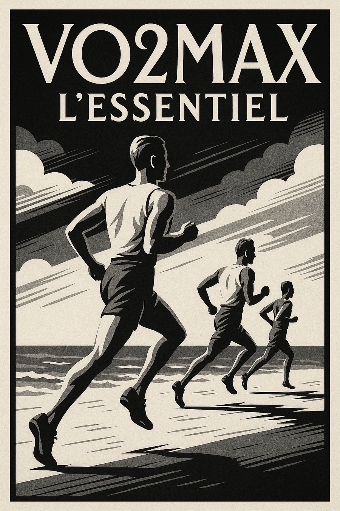
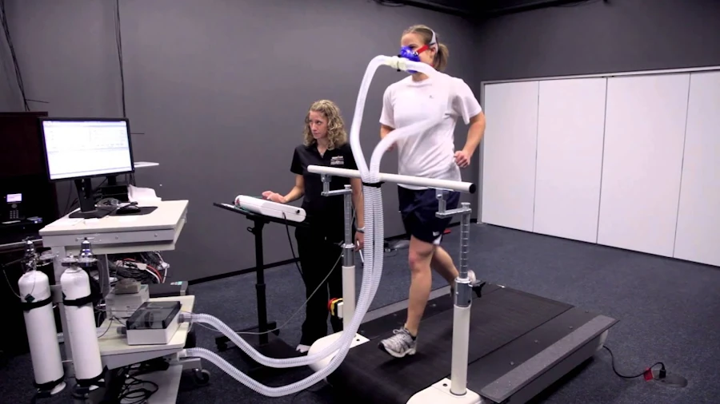
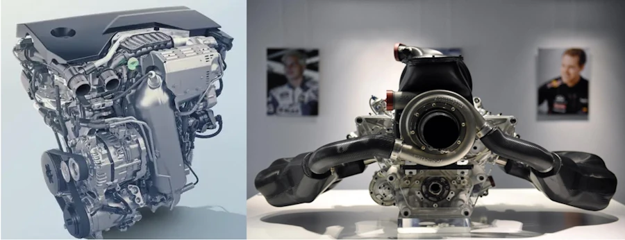
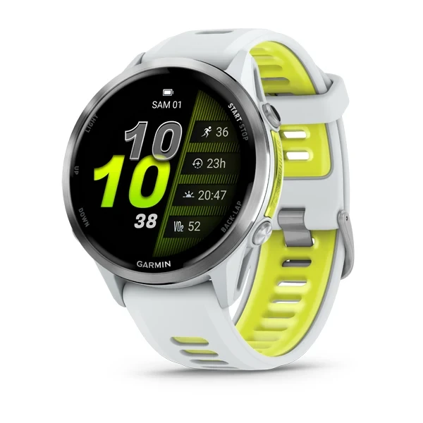
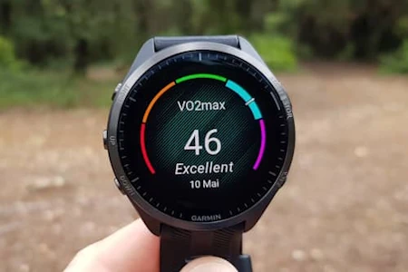
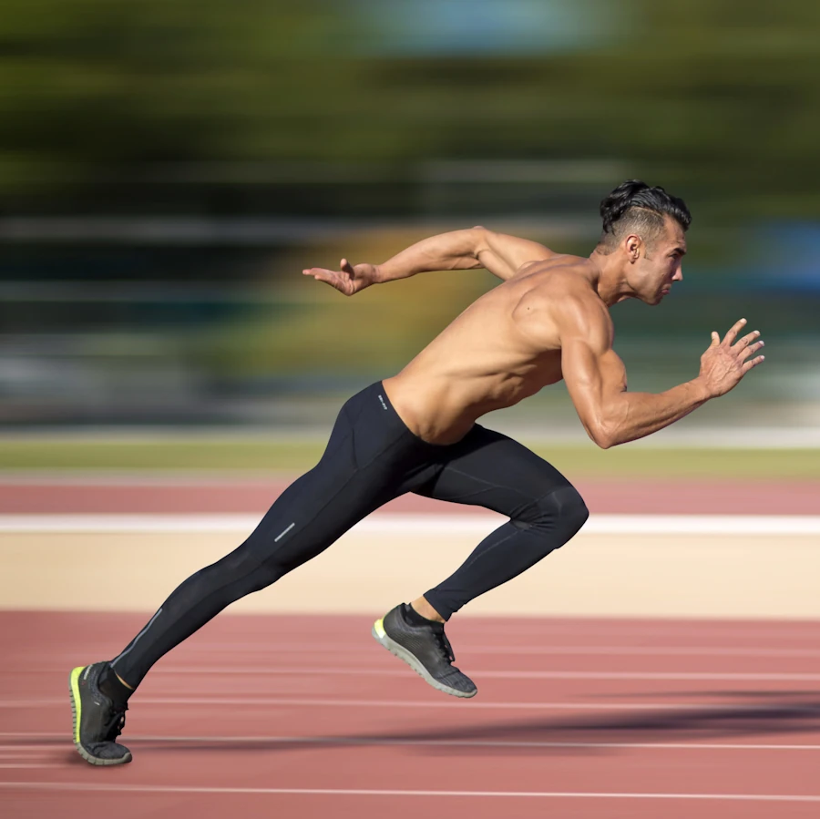
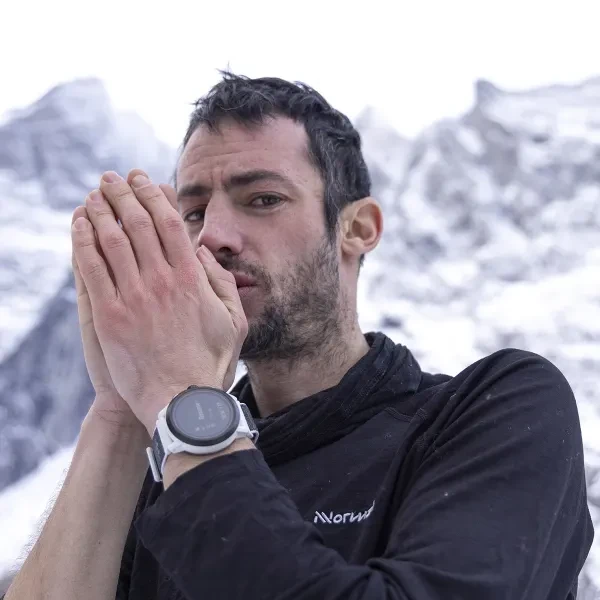

# VO2Max, l'essentiel
{: .no_toc }

<!-- <h2 align="center">
<b>Almost finished</b>    
</h2> -->

## TL;DR
{: .no_toc }

- La consommation maximale d’oxygène que le corps peut utiliser 
- En ml/min/kg
- Un prédicteur de tes performances sur les efforts longs
- Mode aérobie
- Sur les montres, c'est un proxi, une estimation indirecte
- Suivre l'évolution dans le temps sur plusieurs mois
- Un entraînement planifié, régulier et diversifié améliore la VO2Max jusqu’à un certain point (retarde la baisse liée à l’âge) 
- HIIT en 30-30
- Frac long de 4x4 min. entre coupé de 2 min. de récup
- Seuil en 2x15 min. avec 5 min. de récup   
- Côtes pendant 30s à 1 min.

 
T'as vu le film "Les Chariots de feu"?  

## Table of Contents
{: .no_toc .text-delta}
- TOC
{:toc}

## Introduction
J'ai écrit il y a de ça pas mal de temps (la première version de l'article date de 2019) un billet où j'expliquais comment [débuter la course à pied](). Bien sûr, t'as rien écouté et après 3 runs t'as acheté une Garmin au top du top. Du coup, t'as lu la doc en diagonale et t'es tombé sur ces histoires de VO2Max mais bon, si t'as compris que plus ça monte, mieux c'est... Ça reste encore un peu flou, et t'es pas sûr de pouvoir expliquer clairement à tes potes ce que ta montre affiche à la fin de chaque sortie. Pas de panique Monique, on va faire le point gentiment.

## C'est quoi la VO2Max ?

La VO2Max (pour “Volume d’Oxygène Maximal”) désigne la **consommation maximale d’oxygène que le corps peut utiliser** lors d’un effort physique intense. C’est une mesure de ta capacité cardio-respiratoire et un indicateur de ton [endurance aérobie][1] (tu courre en **aérobie** quand tu es encore capable de parler). La VO2Max c'est la quantité maximale d’oxygène (exprimée en millilitres, faut 1000 millilitres pour faire un litre) que l’on peut transformer par minute et par kilogramme de poids corporel (ml/min/kg) lors d’un effort prolongé et intense. Plus cette valeur est élevée, plus tu es capable de maintenir un effort intense sur une [longue durée][2].

***Heu... J'ai rien compris aux unités. Tu peux revenir là-dessus?*** Si c'est pas clair, t'as raison de m'arrêter tout de suite. On a dit consommation d'oxygène par minute et par kilogramme de poids corporel (ml/min/kg). L'oxygène tu vois ce que c'est? Ben si, quand même... L'oxygène c'est un gaz ($$0_2$$) qui occupe un certain volume et les volumes s'expriment normalement en mètre cube (1m par 1m par 1m). Bon, mais cette unité est un peu trop grande si on la compare à nos poumons, au nombre de litres de sang qu'on a dans le corps etc. Donc on va utiliser des millilitres pour exprimer le volume d'oxygène. OK, ça normalement c'est bon.

Maintenant, on veut mesurer combien de millilitres d'oxygène tu es capable de transformer par minute. En fait c'est ça le truc qui est le plus important. OK... Du coup quand tu vas dans un centre médical pour sportifs, on te met un masque sur la tronche avec une entrée et une sortie d'air, tu montes sur un tapis et tu courre en suivant les instructions qu'on te donne. Là, on est capable de mesurer ce qui rentre et ce qui sort et plus tu vas transformer d'oxygène plus ton score va augmenter. Imagine... Je courre et je consomme 100 litres en 10 minutes (ici on se fiche des unités, c'est juste pour fixer les idées). Résultat : je consomme 10l/min. Toi tu arrives et tu consommes 20l/min. Au final, ton score est donc 2 fois meilleur que le mien.  

 
Y a un ptit côté Dark Vador fait du sport...  

Mouai... C'est bien mais c'est pas top. En effet, j'ai 10 ans et des barbelés plein les dents. Toi t'as 22 ans... La comparaison n'est donc pas trop équitable car t'es beaucoup plus musclé que moi et on comprend bien que ta "machine" va transformer beaucoup plus que la mienne. Afin de pouvoir comparer des pommes avec des pommes on a décidé de prendre la valeur précédente et de la diviser par le poids du sportif. Dans notre exemple je pèse 30 kg tout mouillé et toi 75 kg. Du coup nos scores deviennent respectivement 0.33 et 0.26 et finalement, "bouboule", mon score est meilleur que le tien.

Bon, maintenant oublies les unités des exemples précédents mais garde en tête qu'on prend le volume d'oxygène que tu as consommé pendant une minute et qu'on divise ce chiffre par ton poids.

### Physiologie 

La VO2Max reflète les limites de ton moteur en mode aérobie. Sur le plan physiologique, elle dépend à la fois de la capacité de ton cœur et de tes poumons à acheminer l’oxygène vers les muscles, et de la capacité de tes muscles à extraire et à utiliser cet oxygène pour produire de l’énergie. On peut modéliser cela par [le principe de Fick](https://en.wikipedia.org/wiki/Fick_principle) :

$$VO_2 = Q * (C_aO_2 - C_vO_2)$$

Commence pas à râler. Tu vas voir c'est simple. $$Q$$ c'est le débit cardiaque (volume de sang pompé par le cœur par minute), $$C_aO_2$$ la teneur en oxygène du sang artériel et $$C_vO_2$$ celle du sang veineux. 

- Le premier membre $$Q$$ c'est la capacité de ton cœur et de tes poumons (voir plus haut);
- Le second terme, la différence $$C_aO_2 - C_vO_2$$, c'est la capacité de tes muscles à extraire (c'est pour ça qu'il y a un signe moins) et à utiliser cet oxygène (voir plus haut).

En d’autres termes, une VO2Max élevée implique à la fois un **cœur puissant** ($$Q$$ grand) capable d’éjecter un grand volume de sang oxygéné, et **des muscles entraînés** dotés d’une riche vascularisation et de nombreuses [mitochondries](https://fr.wikipedia.org/wiki/Mitochondrie). Ces dernières sont en charge, entre autres, de la production d’énergie sous forme d’ATP par la voie aérobie. Ce que l'on veut, c'est quelles utilisent un maximum de cet oxygène ce qui va donner une différence $$(C_aO_2 - C_vO_2)$$ grande. La VO2Max représente ainsi le “plafond” de nos capacités aérobies et on la compare souvent à la cylindrée du moteur d’une voiture.

***La cylindrée d'un moteur d'une voiture... T'explique?*** Imagine le moteur d'une voiture. La VO2Max, c'est la cylindrée (exprimée en $$cm^3$$) du moteur. Elle représente ta puissance aérobie brute potentielle. Un moteur avec une plus grosse cylindrée peut potentiellement produire plus de puissance et te faire aller plus vite. Bien sûr, si tu compare les 1.6 litres d'un moteur de F1 (si si je t'assure un moteur de F1 c'est 1600 $$cm^3$$, pas plus) à celui de ta Citroën C5 Aircross... Y a pas photo... Y a un des deux moteurs qui est affûté et l'autre... Comment te dire les choses sans être désobligeant... On va dire qu'il y a encore un peu de boulot et pas mal de poids à perdre.

 

### Rôle de la VO2Max dans la course à pied. 
En running, la VO2Max est **un proxi**, une mesure indirecte du **potentiel aérobique maximal** du sportif. Un coureur avec une VO2Max élevée dispose d’une grande "réserve" d’oxygène à exploiter, ce qui favorise des allures soutenues sur la durée. En effet, chez les athlètes d’endurance, la VO2Max est corrélée à la performance sur des distances allant du 5 km au marathon – certaines études estiment qu’elle peut expliquer à elle seule jusqu’à 50% de la performance sur un semi ou un marathon. 

Ceci étant, faut noter que si il est important, ce n’est pas le seul facteur de la performance en [course à pied][2] ([lien][5]). Des coureurs ayant une VO2Max un peu plus faible peuvent parfois battre des coureurs à VO2Max plus élevée, grâce à d’autres déterminants essentiels : l’économie de course (efficacité technique), le seuil lactique (capacités à maintenir un pourcentage élevé de VO2Max sans accumuler trop de lactate), la stratégie de course, etc. La VO2Max fixe le “potentiel maximal” de ton moteur aérobie, mais la performance réelle dépend non seulement de ce potentiel mais aussi de ta technique et, en compétition, de ta stratégie.

### Mesure de la VO2Max
La mesure directe de la VO2Max se fait en laboratoire lors d’un test d’effort maximal, généralement sur tapis roulant. Le coureur porte un masque relié à un analyseur de gaz qui mesure précisément l’oxygène consommé et le gaz carbonique ($$CO_2$$) expiré à mesure que l’effort augmente jusqu’à l’épuisement. Le point où la consommation d’oxygène ne parvient plus à augmenter malgré l’augmentation de l’intensité correspond à la VO2Max. Ce protocole étant contraignant (matériel, effort maximal contrôlé en labo...), on utilise souvent des tests indirects ou des estimations terrain pour approximer la VO2Max.

<!-- ### Pourquoi c'est important?
Une VO2Max élevée est corrélée à une meilleure santé cardiovasculaire, une meilleure endurance et une meilleure récupération. C'est un excellent **prédicteur de tes performances**, surtout sur les efforts longs (course à pied, cyclisme, natation). -->

### Les facteurs qui influencent la VO2Max
* **Génétique** : Compte pour environ 20 à 30% de la valeur. Là c'est mort, on peut rien faire.
* **L'âge** : La valeur atteint son pic vers 20-30 ans et décline ensuite lentement. Tisane de tisane... On peut rien faire non plus là dessus.
* **Le sexe** : En moyenne, les hommes ont une VO2Max 10 à 20% plus élevée que les femmes. Ah quand même... Il va nous rester kekchose! Non mais, qui c'est qui pisse debout 😁. Trêve de plaisanterie, on peut pas non plus changer grand chose (et commencez pas à me chauffer sur le sujet sinon je vais chercher tonton Trump)
* **L'entraînement** : Enfin! C'est **LE** facteur sur lequel nous pouvons agir. Il se dit qu'un entraînement structuré peut l'augmenter de 15 à 20%, voire plus pour les débutants.

## Estimation de la VO2Max sur les Garmin 

Il est possible **d’estimer** sa [VO2Max][2] en conditions de running, sans passer par un laboratoire. Garmin, en partenariat avec [Firstbeat Analytics](https://www.firstbeat.com/en/), a été pionnier dans cette fonctionnalité. 

Faut juste se calmer et toujours garder en tête que ta Garmin ne mesure pas directement la VO2Max comme le ferait un test en labo avec un masque et en meuserant les volumes de gaz qui rentrent et qui sortent. Elle **l'estime** et ce qui va compter pour toi c'est pas tant sa valeur à l'instant `t` mais **son évolution dans le temps**. Sur les 6 derniers mois, ta VO2Max monte ou descend?

 

### Données utilisées

L'algo analyse la relation entre la fréquence cardiaque et l’allure de course pour estimer la [VO2Max][7] ([lien][2]). Concrètement, plusieurs paramètres sont pris en compte :

* **Fréquence cardiaque** – mesurée soit par le capteur cardio optique au poignet, soit par une ceinture thoracique.
* **Vitesse/Allure de course** – déterminée via le GPS pour quantifier l’intensité de l’effort.
* **Variations de l’effort** – l’algorithme analyse différents segments de la sortie (par intervalles de ~20-30 secondes) à des [intensités variables][9], afin d’établir la courbe d’efficacité cardiaque. Autrement dit, il évalue à quel point ton cœur s’élève pour une certaine allure.
* **Historique d’entraînement et fatigue** – les calculs peuvent intégrer l’état de forme courant. Par exemple, plusieurs sorties sont utilisées pour affiner l’estimation, et un état de fatigue élevé peut temporairement influencer le [résultat][2].

L’hypothèse de base est la suivante : plus tu peux courir vite à une fréquence cardiaque donnée (modérée), plus ta VO2Max estimée sera élevée. À l’inverse, si ta fréquence cardiaque grimpe vite pour une allure modeste, l’algorithme estimera une VO2Max plus faible. 

En pratique, la montre va extraire de ton activité des segments stables et fiables (quelques dizaines de secondes chacun) où le signal GPS est bon et le rythme cardiaque régulier, puis corréler tout ça avec les données de tests d’effort d'une BdD.

Par exemple, sur terrain plat, on peut estimer le VO2 requis pour une allure donnée par la formule simplifiée VO2 (ml/kg/min) ≈ 3,5 × vitesse (en km/h) ([lien][9]). 

Ensuite, en comparant ce VO2 “théorique” à l’intensité cardiaque relative (% de FCmax) observée, l’algorithme détermine quelle fraction de VO2Max tu utilises à cette allure. De fil en aiguille, il en déduit ta VO2Max.

### Conditions requises 

Pour que l’estimation soit pertinente, certaines conditions d’enregistrement doivent être réunies. Garmin recommande notamment : 

* Courir au moins une dizaine de minutes en extérieur avec un signal GPS stable, et à une intensité suffisante (idéalement au moins ~70 % de ta fréquence cardiaque maximale sur une [durée continue][9]). Si tu n’atteins pas un niveau d'effort conséquent, l’algorithme manque de données exploitables pour extrapoler la VO2Max. 
* De plus, il est important d’avoir configuré correctement ton profil utilisateur (âge, sexe, poids, FC max réelle, etc.), car ces informations servent de base au calcul. Une fréquence cardiaque maximale mal renseignée peut fausser l’estimation de ta VO2Max de plusieurs [points][9]. 

### Précision et limites de l’estimation 

Encore une fois, ta montre fournit une estimation (via un proxy) de ta VO2Max et non une mesure directe – il faut donc l’interpréter avec prudence. Le calcul repose sur des données indirectes (fréquence cardiaque, vitesse + modèle d'une base de données) et ne peut égaler la précision d’un test d’effort avec analyse des [gaz respiratoires][2]. 

Évidement, ta montre ignore complètement la quantité réelle d’oxygène que tu consommes, puisqu’elle ne fait que déduire un VO2 à partir de la corrélation cardiaque/allure/modèle BDD. Il y a donc une marge d’erreur inévitable. 

D’après Firstbeat (la boîte à l’origine de l’algo), si toutes les données sont de bonne qualité, la VO2Max estimée peut se rapprocher à 95 % de la valeur réelle (une erreur typique de l’ordre de ±3,5 ml/kg/min ([lien][9])). 

Autrement dit, l’algorithme est assez impressionnant de fiabilité pour un usage terrain. Néanmoins, plusieurs facteurs peuvent dégrader la précision : 
* mesure de fréquence cardiaque erronée (capteur optique mal positionné, latence, etc.)
* mauvais calibrage des zones de FC
* un terrain vallonné ou un vent fort (qui faussent la relation allure/effort)
* un état de fatigue inhabituel le jour de la sortie

En pratique, l’intérêt de l’estimation de la VO2Max sur montre c'est de **suivre l’évolution** dans le temps plutôt que la [valeur absolue][2]. Si ta VO2Max "montre" passe de 45 à 48 ml/kg/min au fil des mois, il y a de fortes chances que ta condition physique aérobie se soit réellement améliorée – même si la valeur en elle-même reste une approximation. 

Inversement, une baisse graduelle peut révéler un creux de forme, du surmenage ou l’effet de l’âge (tisane de tisane). 

Il convient donc de surveiller la tendance, tout en gardant du recul : faut se calmer suite à une légère fluctuation (à la hausse ou à la baisse) et ne pas baser toute sa préparation uniquement sur ce [chiffre][2]. 

Pour une mesure scientifique et individualisée, y a pas photo, un test en laboratoire restera la référence.

## Comment améliorer ta VO2Max?

On l'a déjà dit. T'écoute ou pas? Tu peux augmenter ta VO2Max grâce à l’entraînement, en particulier lorsque tu débute ou que t'as pas encore exploité pleinement ton potentiel. Toutefois, les gains ne sont ni illimités ni uniformes selon les individus. 

On l'a dit aussi, la VO2Max a une composante génétique et tend à plafonner à un niveau propre à chacun, malgré l’entraînement. De plus, elle diminue graduellement avec l’âge (environ 1% par an à partir de 25 ans si l’on ne fait rien pour contrer ce déclin). 

Mais bon, un entraînement régulier permet de retarder et de réduire cette baisse liée à l’âge, et même d’améliorer la VO2Max jusqu’à un certain point.

 

### Principes généraux 

Pour faire progresser la VO2Max, l’objectif est de stimuler au maximum le système cardio-respiratoire et musculaire sur des intensités élevées. 

En pratique, cela signifie incorporer des séances où l’on atteint ou frôle sa zone de travail aérobie maximal. Les méthodes d’entraînement les plus efficaces pour cela sont les séances fractionnées à haute intensité (**High Intensity Interval Training**, [HIIT][4]). 

Plusieurs études et l’expérience terrain montrent en effet que les HIIT produisent de meilleurs gains de VO2Max que les sorties continues en [endurance uniquement][4]. 

En complément, le travail au seuil anaérobie (allure soutenue mais sub-maximale) peut améliorer l’endurance spécifique et repousser la fatigue, ce qui permet d’exploiter une plus grande fraction de ta VO2Max en course. 

Enfin, le volume d’endurance fondamentale (allures faciles) constitue la base de la pyramide aérobie et améliore l’efficacité cardio-vasculaire de fond – il ne faut pas le négliger même s’il n’augmente pas drastiquement la VO2Max en lui-même.

### Types d’entraînement recommandés

1. **HIIT court** – Des intervalles très rapides de **15 s à 1 min**, alternant avec des récupérations équivalentes ou légèrement plus longues. Par exemple, les classiques **30-30** (30 secondes à haute intensité ≈ 100 % VMA, suivies de 30 s de récupération, répétées en séries). Ces efforts **brefs et violents** sollicitent le cœur à des fréquences proches de la FCmax et engagent un grand volume musculaire, ce qui stimule l’augmentation du débit cardiaque et la capacité enzymatique des muscles. Ils permettent d’accumuler plusieurs minutes à intensité VO2max sur une séance.

 

1. **Fractionné long** – Des intervalles de 2 à 5 minutes à une intensité élevée (typiquement ~90 % de la VMA ou **~90-95 % de la FCmax**), entrecoupés de récupérations incomplètes de 1 à 3 minutes. Exemples : 5 × 1000 m à allure 95 % vVO2max (récup 2’) ou **4 × 4 minutes intense avec 2 minutes de trot de récupération**. Ce format d’entraînement est connu pour améliorer efficacement la VO2Max et est largement utilisé y compris chez les coureurs de haut niveau. Il impose au système cardio-respiratoire de travailler quasiment à pleine capacité pendant plusieurs minutes d’affilée, ce qui stimule des adaptations centrales importantes (augmentation du volume d’éjection systolique du cœur, meilleure contractilité) et des adaptations périphériques (plus de mitochondries et de capillaires dans les [fibres musculaires][4]).

1. **Séances au seuil** – Courir à allure seuil (environ l’allure que l’on peut tenir ~1h, correspond souvent à ~85-90 % de la FCmax) sur des durées de 10 à 30 minutes en continu, ou en fractions longues (ex : **2 × 15 min au seuil avec 5 min de récup**). Ce travail améliore le lactate threshold (seuil lactique), c’est-à-dire la capacité à maintenir une fraction élevée de votre VO2Max sur la durée sans accumuler de déchets métaboliques excessifs. Indirectement, en repoussant ce seuil, on peut soutenir des intensités plus proches de la VO2Max plus longtemps en course, ce qui améliore la performance. Le seuil n’augmente pas forcément la VO2Max elle-même autant que le fractionné, mais il optimise l’utilisation qu’on en fait.

1. **VMA et côtes** - VMA = Vitesse Maximale Aérobie. C'est la vitesse atteinte lorsque tu consommes ta VO2Max lors d’un test progressif. Travailler à des vitesses proches de la VMA revient à travailler à VO2Max. Les séances de VMA sont donc généralement des fractions intenses comme décrites ci-dessus (30/30, 400 m répétitions, etc.) et sont très efficaces pour développer la VO2Max. Par ailleurs, intégrer du travail en côte (sprints en montée sur 100 à 200 m, ou **côtes de 30 s à 1 min**) peut être un excellent moyen d’augmenter l’intensité tout en te [renforçant musculairement][1]. Les montées font rapidement grimper le cardio et la puissance développée, participant aux mêmes adaptations bénéfiques.

 

1. **Entraînement croisé et renforcement** – Bien que la course à pied doive rester prioritaire pour améliorer spécifiquement la VO2Max en course, des activités d’endurance complémentaires (vélo, natation, ski de fond…) peuvent contribuer à augmenter le volume aérobie sans surcharger le système musculo-squelettique du coureur. De même, un renforcement musculaire général peut améliorer l’efficacité de course et le rendement énergétique. Ces facteurs ne font pas monter directement la VO2Max, mais ils soutiennent l’entraînement intense en prévenant les blessures et en améliorant l’économie de mouvement.

### Fréquence et durée d’entraînement

Pour stimuler la VO2Max, 1 à 2 séances intenses par semaine suffisent. Par exemple, un plan hebdomadaire peut comporter une séance de fractionné court (type 30/30) et une séance de fractionné long ou de seuil, le reste des sorties étant en endurance fondamentale. Il est **contre-productif** d’enchaîner trop de séances dures : la qualité de récupération en pâtit et le risque de blessure augmente, sans parler du surentraînement. Chaque séance de haute intensité doit être précédée d’un bon échauffement et suivie d’une récupération adéquate. La régularité est clé : mieux vaut quelques semaines bien structurées et progressives que des efforts extrêmes ponctuels suivis de coupures forcées. Par ailleurs, le volume global d’entraînement aérobie (kilomètres hebdomadaires en endurance) constitue le socle qui permet de tirer le plein bénéfice des séances de VO2Max. Faut pas oublier de développer l'endurance de base parallèlement aux intervalles.

### Délai pour constater une amélioration

On estime qu’avec un entraînement optimal, un coureur peut commencer à observer une hausse significative de sa VO2Max en ~6 à 8 semaines. Des études indiquent qu’en 8 semaines de travail ciblé, une personne peu entraînée peut gagner de l’ordre de +10 à +20 % de [VO2Max][7]. Par exemple, un débutant passant de 40 à 46 ml/kg/min. Les plus gros gains surviennent chez les sédentaires ou débutants, car ils avaient une marge de [progression importante][2]. En revanche, plus on se rapproche de son potentiel génétique (chez les athlètes confirmés), plus les améliorations de VO2Max sont difficiles à obtenir et modestes (parfois seulement +1 ou 2 ml/kg/min malgré des mois d’efforts). Il n’est pas rare qu’un coureur expérimenté atteigne un plateau de VO2Max et doive miser sur d’autres axes (vitesse spécifique, économie de course, seuil) pour continuer à progresser en compétition.

### Autres Facteurs à prendre en compte
* La perte de poids : C'est mathématique. Comme la VO2Max est exprimée par kg de poids corporel, perdre de la masse grasse (sans perdre de muscle) améliore mécaniquement la valeur.
* Le renforcement musculaire : Des muscles plus forts et plus efficaces demandent moins d'oxygène pour le même effort, améliorant ainsi l'efficacité globale.

### Résumé 
1. construire une base d’endurance solide
1. privilégier les entraînements fractionnés intenses de type VMA
1. compléter avec du travail au seuil 
1. faire un planning, s'y tenir, être patient

Avec une bonne **planification** (y en a plein sur le web en fonction des objectifs, du nombre de sorties par semaine...), il y aura des progrès en quelques semaines/mois. 

Faut pas oublier que le repos fait partie intégrante de l’entraînement : c’est pendant les phases de récupération que l’organisme **surcompense** et améliore ses capacités (montée de VO2Max, entre autres). Un sommeil de qualité et des jours allégés après de grosses séances sont indispensables pour récolter les bénéfices de votre travail. Le planning on te dit!

## Valeurs typiques de VO2Max par âge et par sexe (en ml/min/kg)

| Niveau de Condition | Âge 20-29 | Âge 30-39 | Âge 40-49 | Âge 50-59 | Âge 60-69 | Âge 70-79 |
| :------------------ | :-------: | :-------: | :-------: | :-------: | :-------: | :-------: |
| **Hommes**          |           |           |           |           |           |           |
| Très faible         |  < 38     |  < 37     |  < 35     |  < 33     |  < 30     |  < 28     |
| Faible              |  38-43    |  37-41    |  35-39    |  33-36    |  30-33    |  28-30    |
| Moyenne             |  44-51    |  42-48    |  40-45    |  37-42    |  34-38    |  31-35    |
| Bonne               |  52-56    |  49-53    |  46-51    |  43-48    |  39-43    |  36-39    |
| Excellente          |  57-62    |  54-59    |  52-56    |  49-54    |  44-48    |  40-44    |
| Élite               |  > 62     |  > 59     |  > 56     |  > 54     |  > 48     |  > 44     |
| **Femmes**          |           |           |           |           |           |           |
| Très faible         |  < 29     |  < 28     |  < 26     |  < 24     |  < 22     |  < 21     |
| Faible              |  29-34    |  28-33    |  26-31    |  24-29    |  22-27    |  21-25    |
| Moyenne             |  35-43    |  34-41    |  32-39    |  30-37    |  28-34    |  26-32    |
| Bonne               |  44-48    |  42-46    |  40-44    |  38-42    |  35-39    |  33-36    |
| Excellente          |  49-53    |  47-51    |  45-49    |  43-47    |  40-44    |  37-41    |
| Élite               |  > 53     |  > 51     |  > 49     |  > 47     |  > 44     |  > 41     |

### Comment Interpréter Les Valeurs ?
{: .no_toc }

1. Garde en tête que ces valeurs sont des **fourchettes de référence**. Une VO2Max se compare avant tout à soi-même pour mesurer ses progrès.

1.  **La baisse avec l'âge est normale** : Le déclin de la VO2Max avec l'âge est un processus physiologique naturel. On estime qu'elle diminue d'environ **1% par an** après 25-30 ans, et ce déclin peut s'accélérer après 50-60 ans si on ne fait rien pour lutter contre. Un entraînement régulier permet de ralentir considérablement ce déclin.

1.  **Les athlètes d'élite** : Les valeurs des athlètes d'endurance sont dans une ligue à part. Par exemple :
    *   **Marathonien/ Coureur de fond** : Souvent entre 70 et 85+ (Exemple : Kilian Jornet ~90, Mo Farah ~85)
    *   **Cycliste professionnel** : Régulièrement entre 80 et 90+ (Exemple : Greg LeMond ~92.5, Tadej Pogačar ~90+)
    *   **Ski de fond** : Les sports qui sollicitent le plus de groupes musculaires ont souvent les VO2Max les plus élevées (Exemple : Bjørn Dæhlie ~96, record mesuré en labo).

 

### Points de Vigilance
{: .no_toc }

*   **Ce n'est qu'un nombre** : Une VO2Max élevée ne fait pas tout. L'efficacité de la foulée (Running Economy en anglais), la force mentale, la technique et la stratégie sont tout aussi importants pour la performance. Un coureur avec une VO2Max "seulement" bonne mais très économe peut battre un coureur avec une VO2Max excellente mais qui gaspille son énergie.
*   **Contexte de santé** : Pour une personne sédentaire, passer d'une valeur "faible" à "moyenne" est un énorme progrès pour la santé (réduction des risques cardiovasculaires etc.), souvent bien plus significatif que pour un athlète qui cherche à gagner 2-3 points pour performer.
*   **Les limites de l'estimation** : On l'a dit, les valeurs données par ta Garmin sont des estimations. Elles sont excellentes pour suivre une **tendance** (est-ce que mon chiffre monte ou descend sur plusieurs semaines ?) mais il faut être prudent sur la valeur absolue à l'instant `t`.

Il faut donc utiliser les tables précédentes comme une référence générale pour se situer, mais faut pas être obsédé par ce chiffre. L'objectif est de voir une **évolution** dans le temps, se sentir mieux et en meilleure santé.

## Conclusion

La VO2Max est un outil, pas une fin en soi. C'est un proxi, une mesure indirecte de ta capacité respiratoire et cardiovasculaire. Améliore-la autant que possible avec un entraînement intelligent (planifié, régulier, diversifié) mais n’oublie pas qu’elle s’inscrit dans un ensemble plus large de qualités (vitesse, endurance spécifique, technique) à développer pour exceller en course à pied. 

PS : 
Y a pas mal de liens dans ce billet. Prends le temps de lire, notamment les guides et études sur la [VO2Max][4] ([lien][9]), les articles de fond sur l’entraînement fractionné et la VMA, ou encore les tableaux de classification de la VO2Max par âge ([Cooper Institute][34]). Après, je suis pas ta mère, Google et YouTube sont tes amis pour la vie.

[1]: https://nutriandco.com/fr/pages/vo2-max "VO2 max homme et femme, âge tableau, calcul et exercices"
[2]: https://www.wanarun.net/blog/vo2-max-73269.html "Vo2 max en course à pied"
[3]: https://upsidestrength.com/fr/vo2max/ "VO2max: Le Guide Complet"
[4]: https://courir-mieux.fr/ameliorer-vo2-max/ "Comment améliorer VO2 max ? Trail et course à pied -"
[5]: https://www.running-addict.fr/test-running/montres-running/statistiques-de-performance-des-montres-garmin/ "Attention avec les statistiques de performance des montres Garmin & Co"
[7]: https://www.firstbeat.com/en/science-and-physiology/fitness-level/ "Fitness Level - Firstbeat"
[9]: https://marathonhandbook.com/how-accurate-is-garmin-vo2-max/ "How Accurate Is Garmin VO2 Max?"
[20]: https://drbandelier-medecin.ch/augmentez-votre-vo2max-et-boostez-votre-sante-cardiovasculaire-  "Augmentez votre VO2max et boostez votre santé cardiovasculaire"
[23]: https://upsidestrength.com/fr/blog/fractionne-vo2max/ "Les meilleures séances de fractionné pour développer sa VO2max"
[25]: https://www.running-addict.fr/category/conseil-running/vma-fractionne/ "VMA / Fractionné - Running Addict"
[34]: https://www8.garmin.com/manuals/webhelp/fenix3/EN-US/GUID-1FBCCD9E-19E1-4E4C-BD60-1793B5B97EB3.html "fēnix 3/HR - VO2 Max. Standard Ratings"
