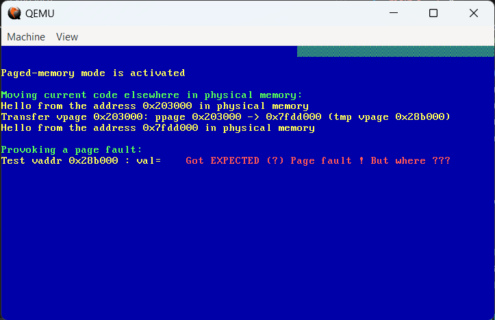

# Billet 0/0 

Ceci est mon premier billet 

## Sous-titre
Donec ligula ante, volutpat a arcu at, scelerisque porta nibh. Morbi commodo elementum mauris, pharetra condimentum tellus placerat at. Aliquam quis orci commodo, dapibus lacus id, pharetra leo. Nam maximus mauris sit amet facilisis tincidunt. Nullam tincidunt lectus at diam dictum, quis vehicula ligula pulvinar. Pellentesque rutrum mollis erat vitae aliquam. Mauris odio diam, varius nec tellus in, mollis molestie lacus. Cras ut diam lacinia, pellentesque urna ac, vehicula ex. Aenean aliquam vel nisl vel rhoncus. Ut vel rhoncus odio, non tempus eros. Curabitur dignissim, enim imperdiet bibendum elementum, neque tortor accumsan lorem, sed suscipit lorem libero sed lectus. Mauris interdum consequat commodo. Proin est elit, sodales in ex ut, elementum dignissim nibh.

Voici un paragraphe avec **du texte en gras** et *du texte en italique*.

- Point 1
- Point 2
- Point 3

## Exemple de code

```python
# -----------------------------------------------------------------------------
def on_produce(err: int, msg: Message) -> None:
    global g_Delivered_Records
    # Delivery report handler called on successful or failed delivery of message
    if err is not None:
        print(f"Failed to deliver message: {err}", flush=True)
    else:
        g_Delivered_Records += 1
        print(
            f"Produced record to topic {msg.topic()} partition [{msg.partition()}] @ offset {msg.offset()}", flush=True
        )

```

## Exemple de d'équation?
Dans une ligne $$E=mc^2$$ de texte.      
Dans une équation :    

$$ E = mc^2 $$


## Exemple d'image ?
Avec une référence à : site.url


En utilisant `../assets/images`




En utilisant une `div` pour centrer l'image et pouvoir continuer avec du markdown ensuite

<div align="center">

</div>

[Lien vers un autre site](https://example.com)  

If you want to maintain your docs in the `docs` directory of an existing project repo, see [Hosting your docs from an existing project repo](https://github.com/just-the-docs/just-the-docs-template/blob/main/README.md#hosting-your-docs-from-an-existing-project-repo) in the template README.


 
