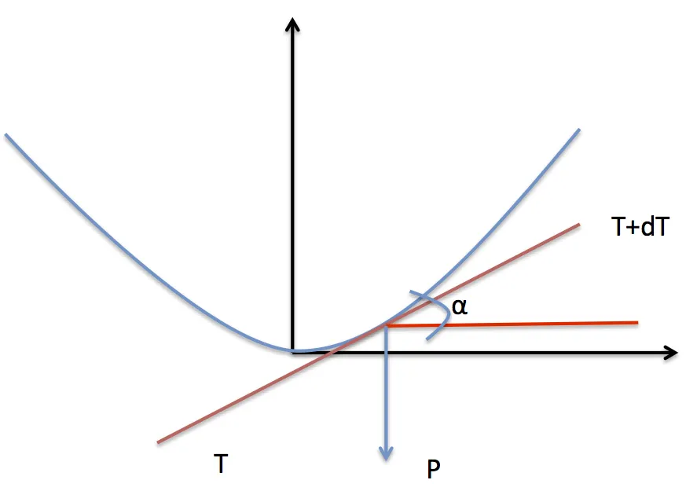
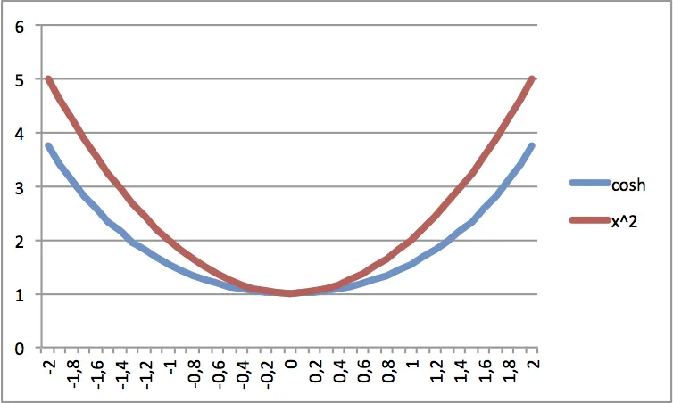

## Intro\mathrm{d}uction

L'autre jour en rentrant de Dunkerque, sur l'autoroute, alors que tout le monde dormait dans la voiture, j'ai, je ne sais pas pourquoi, commencé à regarder les pylônes électriques. Entre autres, je me suis demandé qu'elle était la courbe décrite par le fil électrique mais aussi et surtout quel était le paramètre qui était minimisé. De retour à la maison, un tour sur Google et zou, j'avais la réponse : équation de la chaînette. Cela dit, afin de retenir et de comprendre un peu mieux j'ai commencé à gribouiller sur le papier. Vous trouverez ci-dessous mes explications et ce que je crois avoir compris.

### Note :

Si vous êtes prof de math fuyez ! Je ne suis pas sûr que ce qui suit soit très orthodoxe...

## Schéma

## Mise en équation

$$\sum{}{}\vec{F} = m \vec{\gamma} $$

Comme le système est au repos, l'accélération est nulle. On a donc :

$$\sum{}{}\vec{F} = \vec{0} $$

$$\vec{-T} + \vec{T+\mathrm{d}T} + \vec{P} = \vec{0} $$

On projette sur les axes x et y

Sur x : $$\cos(\alpha)\mathrm{d}T = 0$$

Sur y : $$\sin(\alpha)\mathrm{d}T - \mu g\mathrm{d}L = 0$$

Dans l'équation ci-dessus on a: $$ P = mg = \mu \mathrm{d}Lg $$

Où μ est la masse linéique, \mathrm{d}L est un élément de longueur et g est l'accélération de pesanteur

Ensuite, on intègre l'équation de la projection sur l'axe x : $$\int{}{}{\cos(\alpha)\mathrm{d}T} = K$$

Il vient : $$T\cos(\alpha) = K$$

Autrement dit, à chaque endroit, le long \mathrm{d}u cable, la projection de la tension sur l'axe horizontal est constante. Si on se place à l'endroit le plus bas de la courbe, alors l'angle $$\alpha$$ est nul et K=To.

On intègre maintenant l'équation de la projection sur l'axe y : $$\int{}{}{\sin(\alpha)\mathrm{d}T} = \int{}{}{\mu g\mathrm{d}L}$$

Il vient : $$T\sin(\alpha) = \mu gL$$

Mouai... Et on fait quoi maintenant avec les deux équations en question ?

(1) $$T\cos(\alpha) = K$$

(2) $$T\sin(\alpha) = \mu gL$$

Si on divise (2) par (1) il vient : $$\tan{\alpha} = \frac{\mu g}{K} L$$

Mouai... Then what? Essayons de différencier l'équation ci-dessus : $$d(\tan{\alpha}) = \frac{\mu g}{K}d(L)$$

Maintenant, remarquons que

$$\tan{\alpha} = \frac{\mathrm{d}y}{\mathrm{d}x}$$

Et que

$$\mathrm{d}L^2 = \mathrm{d}x^2 + \mathrm{d}y^2$$

Soit encore

$$\mathrm{d}L = \sqrt{\mathrm{d}x^2 + \mathrm{d}y^2}$$

Bref, notre équation précédente devient

$$d(\tan{\alpha}) = \frac{\mu g}{K} d(L)$$

$$d(\frac{\mathrm{d}y}{\mathrm{d}x}) = \frac{\mu g}{K} \sqrt{\mathrm{d}x^2 + \mathrm{d}y^2}$$

À ce niveau, ce qui serait bien, se serait d'avoir une équation homogène. Pour cela on aimerait avoir un \mathrm{d}y/\mathrm{d}x dans le membre de droite. Qu'à cela ne tienne allons-y. L'équation devient :

$$d(\frac{\mathrm{d}y}{\mathrm{d}x}) = \frac{\mu g}{K} \sqrt{\mathrm{d}x^{2} + \mathrm{d}y^{2}}$$

$$d(\frac{\mathrm{d}y}{\mathrm{d}x}) = \frac{\mu g}{K} \frac{\sqrt{\mathrm{d}x^2 + \mathrm{d}y^2}} {\mathrm{d}x} \mathrm{d}x$$

$$d(\frac{\mathrm{d}y}{\mathrm{d}x}) = \frac{\mu g}{K} \sqrt{\frac{\mathrm{d}x^2}{\mathrm{d}x^2} + \frac{\mathrm{d}y^2}{\mathrm{d}x^2}} \mathrm{d}x$$

$$d(\frac{\mathrm{d}y}{\mathrm{d}x}) = \frac{\mu g}{K} \sqrt{1 + \frac{\mathrm{d}y^2}{\mathrm{d}x^2}} \mathrm{d}x$$

$$d(\frac{\mathrm{d}y}{\mathrm{d}x}) = \frac{\mu g}{K} \sqrt{1 + \frac{\mathrm{d}y}{\mathrm{d}x}^{2}}\mathrm{d}x$$

Faisons un peu le ménage histoire d'y voir plus clair

$$d(u) = \frac{\mu g}{K} \sqrt{1 + u^{2}}\mathrm{d}x$$

$$\mathrm{d}u = C \sqrt{1 + u^{2}}\mathrm{d}x$$

$$\frac {\mathrm{d}u}{\sqrt{1 + u^{2}}} = C \mathrm{d}x$$

Bon, ben, on y va, on intègre

$$\int{}{}{\frac {\mathrm{d}u}{\sqrt{1 + u^{2}}}} = \int{}{}{C \mathrm{d}x}$$

$$\int{}{}{\frac {\mathrm{d}u}{\sqrt{1 + u^{2}}}} = Cx$$

Hein, hein... Et l'intégrale de gauche... On fait comment ?

### Moyen mnémotechnique

En fait, je me rappelle que $$\cos^2(x) + \sin^2(x) = 1 $$ (ben, si, ça quand même je peux m'en rappeler) et que (en faisant migrer \sin de l'autre côté) on a aussi $$ch^{2}(x) = 1 + sh^{2}(x)$$

Allez, on continue. Le membre de droite ressemble à ce qu'il y a sous la racine. J'effectue un changement de variable et je pose

$$u = sh(x)$$

En différenciant on a

$$\mathrm{d}u = ch(x)\mathrm{d}x$$

L'intégrale (le membre de gauche) s'écrit alors

$$\int{}{}{\frac {\mathrm{d}u}{\sqrt{1 + u^{2}}}}$$

$$\int{}{}{\frac{ch(x)}{\sqrt{1 + sh^{2}(x)}}\mathrm{d}x}$$

$$\int{}{}{\frac{ch(x)} {\sqrt{ch^{2}(x)}}\mathrm{d}x}$$

$$\int{}{}{\frac{ch(x)}{ch(x)}\mathrm{d}x}$$

$$\int{}{}{\mathrm{d}x}$$

$$x$$

Comme on avait posé

$$u = sh(x)$$

C'est à dire

$$arcsh(u) = x$$

On en dé\mathrm{d}uit que l'intégrale vaut arcsh(u)

On se retrouve donc avec

$$\int{}{}{\frac {\mathrm{d}u}{\sqrt{1 + u^{2}}}} = Cx$$

$$arcsh(u)= Cx$$

$$u= sh(Cx)$$

On a presque terminé... Faut cependant se rappeler qu'on avait écrit

$$u=\frac {\mathrm{d}y} {\mathrm{d}x}$$

Et donc, on se retrouve à résoudre l'équation suivante

$$\frac {\mathrm{d}y} {\mathrm{d}x}= sh(Cx)$$

$$\mathrm{d}y= sh(Cx)\mathrm{d}x$$

On pose

$$u = Cx$$

On a donc

$$\mathrm{d}u = C\mathrm{d}x$$

$$\mathrm{d}x = \frac {\mathrm{d}u}{C}$$

L'équation devient

$$\mathrm{d}y= sh(Cx)\mathrm{d}x$$

$$\mathrm{d}y= \frac {1}{C sh(u)}\mathrm{d}u$$

$$\int{}{}{\mathrm{d}y}= \frac{1}{C} \int{}{}{sh(u)\mathrm{d}u}$$

$$y= \frac{1}{C} ch(u)$$

$$y= \frac{1}{C} ch(Cx)$$

Comme on a dit que $$C = \frac {\mu g}{K} $$ avec K=Cte=To

$$y= \frac {K}{\mu g} ch ( \frac {K}{\mu g} x)$$

L'équation \mathrm{d}u fil électrique entre 2 poteaux est donc un \cosh et non une simple parabolique comme on pourrait "intuitivement" s'y attendre. Voilà par ailleurs les 2 courbes (la parabole est rehaussée pour que les 2 points bas coïncident) :

