# Pourcentages, croissance, gestion des ressources...

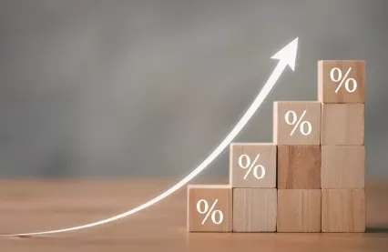

## Introduction

Je ne suis pas sûr de vraiment bien comprendre ce qu'est un pourcentage. Dans ce billet, je vais donc repartir de zéro avec des exemples très simples. Ensuite je vais voir s'il y a quelques enseignements à tirer de tout cela. Enfin, je regarderai comment cela peut s'appliquer à la gestion des ressources finies (pensez au pétrole par exemple) dans un monde en croissance etc. Mais bon, trêve de bavardages, on file chez Mamie...

## Le premier challenge de Mamie - Utilisation classique

C'est vrai, elle est sympa Mamie. Elle est très vieille, mais elle est sympa. C'est mon anniversaire, je viens d'avoir 16 ans et elle me demande de venir la voir.

Alors, mon petit Marty (mes parents étaient des fans de Retour vers le futur) je te propose la chose suivante : je peux, au choix, te donner 1 000 € ou alors, sous réserve que tu sois capable de le calculer, te donner le montant correspondant aux 1 000 € que j'ai placé il y a de ça 35 ans et qui depuis, ont été rémunérés à 5% par an. Tiens, voilà un papier et un stylo, tu as 5 min pour trouver la valeur.

Bon, je n'ai pas trop le choix. Je sens que c'est plus avantageux de récupérer les sous qui ont été placés mais bon, elle est gentille Mamie, j'ai un peu la pression là...

Sur le papier je commence par faire un schéma qui ressemble à ça :

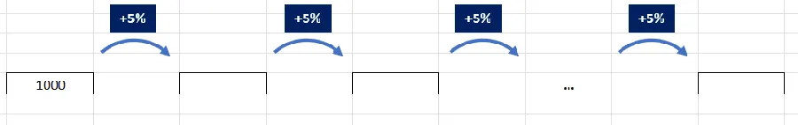

À gauche on a les 1 000€ de départ. Ensuite, chaque année, on rajoute 5% et au bout, à droite (après 35 sauts à +5%) on aura le montant final.

### Au fait quand on dit 5%, ça veut dire quoi ?

Il y a deux choses importantes : la syntaxe (notation) et la sémantique (signification)

**Notation :** C'est un truc tout bête mais quand on voit écrit 5% il faut lire $$\frac {5}{100} $$. Le signe "%" veut dire "prend la valeur qui est à gauche et divise-la par 100". Ce n'est pas plus compliqué que ça. Autrement dit, on ne peut pas avoir un signe "%" tout seul. Si besoin, dans une phrase, on écrit en toutes lettres le mot "pourcentage". De plus, c'est l'ensemble des deux signes "5" et "%" qu'il faut considérer. Par exemple, en typographie il y a normalement un espace entre les 2 signes mais ce dernier est insécable (on ne peut donc pas séparer le "5" de son "%" favori). Perso, je ne mets pas d'espace entre le "5" et le signe "%". Tiens, vas-y, fais-moi un procès si t'es pas content... 😊

**Signification :** Je vous propose le truc suivant. À partir d'aujourd'hui et jusqu'à votre arrivée au cimetière, à chaque fois que vous lisez ou que vous entendez un truc du style "5%", dans votre tête, vous rajoutez "de quoi ?".

Si c'est dans une conversation, et si ce n'est pas clair pour vous, n'hésitez surtout pas interrompre votre interlocuteur. Peut-être qu'il essaie de vous embrouiller la tête (vendeur de voitures, banquier, assureur...), peut-être que c'est très clair pour lui, peut-être qu'il n'a rien compris lui non plus...

Il ne faut pas oublier que si "5%" représente la valeur $$\frac {5}{100}$$, il ne peut pas exister tout seul. C'est toujours une proportion (un ratio, un rapport de 2 nombres l'un sur l'autre) d'une autre chose : 5% de votre salaire annuel, 5% de la population est rousse (c'est vrai), 5% des extra-terrestres sont verts (c'est vrai aussi). Un pourcentage, c'est toujours le pourcentage de quelque chose d'autre. C'est aussi pour cela que du point de vue pratique, si je veux signifier la valeur 0.05 il est préférable d'utiliser 0.05 plutôt que d'écrire (ou de dire) 5%. En effet si j'utilise 5%, on va se demander "5% de quoi" alors que le 0.05 dont je voulais parler n'était que le résultat d'un calcul.

### Retour au challenge de Mamie

Bon OK, on ajoute 5%, "de quoi ?", de la somme précédente. Autrement dit, au bout de la première année, dans la première case vide du dessin précédent il y aura :

$$V_1 = V_0 + 5\% \textrm{ de } V_0$$

De mon point de vue et en français, cela veut dire qu'au bout d'un an, le montant de la première année $$V_1$$ vaut le montant initial $$V_0$$ augmenté de 5% du montant initial $$V_0$$.

Oui, je sais, je suis lourd, tout ça c'est évident et il n'y a pas besoin de faire 10 phrases pour l'expliquer. C'est peut-être vrai pour certains, mais je préfère ne faire aucune supposition, partir sur de bonnes bases et m'assurer qu'on comprend tous la même chose. Bon, Ok, maintenant on peut écrire :

$$V_1 = V_0 + 5\% * V_0$$

### Stop ! In the name of love, 🎶

Bon, là, je m'arrête car je dois faire une remarque qui n'est pas liée spécifiquement aux pourcentages mais qui est une règle générique.

La règle dit que (à lire avec une grosse voix qui fout un peu la trouille) :

***Si dans une expression mathématique, un truc apparait plusieurs fois, tu ne cherches pas, tu le mets en facteur.***

Oui, certains ronchons diront qu'il y a des cas où, justement, il ne faut pas mettre en facteur. Cela dit, dans le doute commençons toujours par mettre en facteur ce qui peut l'être. Dans la grande majorité des cas on sera gagnant.

### Retour au challenge de Mamie

Dans l'égalité précédente, à droite, on voit que $$V_0$$ apparaît deux fois. Donc, je ne réfléchis pas, je mets le terme $$V_0$$ en facteur et je me retrouve avec l'égalité suivante :

$$V_1 = V_0 * (1 + 5\%)$$

En cas de doute, prends deux secondes pour distribuer $$V_0$$ sur le contenu entre parenthèses et confirmer que l'on retrouve bien l'égalité précédente.

D'autre part, je décide de laisser "1 + 5%" écrit de cette façon car cela fait bien ressortir le pourcentage et si demain ce dernier change (il passe à 2% ou à 8% par exemple) j'aurai juste à le mettre à jour.

À ce niveau, cela vaut peut-être le coup de réfléchir deux minutes. En effet, ce que l'on vient d'écrire c'est simplement quelque chose qui dit : le montant au bout d'un an, c'est le montant précédent multiplié par "1 plus 5%". En fait on a commencé avec le montant initial et la première année mais finalement ce que l'on a écrit est aussi valable pour n'importe quelles années n et n+1. Par exemple, sans trop réfléchir, je peux écrire :

$$V_2 = V_1 * (1 + 5\%)$$

Bon, ben, c'est gagné on peut facilement calculer le montant au bout des 35 ans. On a qu'à écrire :

$$V_{35} = V_{34} * (1 + 5\%)$$

Oui, mais non. Ça ne marche pas mon histoire. En effet, je ne connais pas la valeur de $$V_{34}$$. Mamie... Tu vas mal finir la journée... Bon, Marty, pas de panique, reviens au calcul de $$V_2$$. On a dit :

$$V_2 = V_1 * (1 + 5\%)$$

Mais dans ce cas, $$V_1$$ je le connais. On avait dit :

$$V_1 = V_0 * (1 + 5\%)$$

Donc je peux écrire :

$$V_2 = V_1 * (1 + 5\%)$$

$$V_2 = V_0 * (1 + 5\%) * (1 + 5\%)$$

$$V_2 = V_0 * (1 + 5\%)^2$$

Et ça c'est cool car, comme je connais le montant de $$V_0$$, je peux calculer $$V_2$$ directement sans avoir besoin de calculer $$V_1$$.

Si maintenant je fais la même chose pour le calcul de $$V_3$$ j'écris :

$$V_3 = V_2 * (1 + 5\%)$$

Or

$$V_2 = V_0 * (1 + 5\%)^2$$

Donc

$$V_3 = V_0 * (1 + 5\%)^2 * (1 + 5\%)$$

Finalement on obtient :

$$V_3 = V_0 * (1 + 5\%)^3$$

### Stop ! In the name of love, 🎶

Tu le vois venir le motif, le pattern... ? On a :

$$V_3 = V_0 * (1 + 5\%)^3$$

$$V_2 = V_0 * (1 + 5\%)^2$$

$$V_1 = V_0 * (1 + 5\%) = V_0 * (1 + 5\%)^1$$

Et comme $$x^0 = 1$$, on peut même dire que :

$$V_0 = V_0 * (1 + 5\%)^0$$

Alors, le pattern, ça vient ? Oui, en fait, vu comme ça, "on voit bien" qu'on a un motif qui ressemble à :

$$V_n = V_0 * (1 + 5\%)^n$$

### Retour au challenge de Mamie

Haha! Mamie je pense que tu vas devoir passer à la caisse... Pour moi on a :

$$V_{35} = V_0 * (1 + 5\%)^{35}$$

$$V_{35} = 1000 * 1.05^{35}$$

Heu... Mamie, tu peux utiliser ton téléphone et calculer cette valeur pour moi ?

$$V_{35} = 1000 * 1.05^{35} = 5 516 €$$

Ah oui quand même... Ça me parait énorme et je n'ai pas envie de vider tes comptes.

T'inquiète Marty ma paupiette. Ce n'est pas tous les jours qu'on a 16 ans. J'avais donc décidé de marquer le coup. Considère ça comme ma contribution à tes [roulages moto sur circuit](https://www.40tude.fr/pilotage-moto/). Tu as trouvé la solution. Bravo. Je suis très fière de toi.

Pour le reste, cet argent je ne l'ai pas mis à la banque il y a 35 ans. Nan, en fait, à l'occasion d'un petit héritage en 2004, j'ai acheté de l'or avec cette somme sur laquelle je ne comptais pas. Crois-le si tu veux, depuis les cours de l'or ont été multipliés par 6 (voir ci-dessous). Ensuite, je me suis arrangé pour te raconter une histoire d'intérêts composés afin de te motiver un peu... 💰

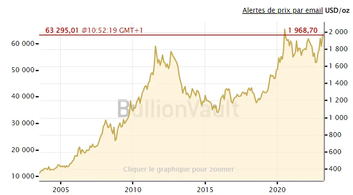

Je ferai le transfert électronique ce soir. Ma banque va encore prendre un temps infini pour exécuter mon ordre sur mon argent (on est très loin des films où on voit les millions de dollars circuler d'un continent à un autre en quelques secondes). Attends-toi à avoir les sous sur ton compte d'ici la fin de la semaine prochaine, pas avant.

## Le second challenge de Mamie - Période de doublement de la mise

Marty, tu as l'air d'avoir compris comment ça marche. J'ai maintenant une question pour toi mais cette dernière ne te rapportera rien. Imagine la même valeur initiale (1 000 €), le même pourcentage (5%). Peux-tu calculer au bout de combien d'années le montant initial aura été multiplié par 2 ?

On va essayer... Je sais que au bout de $$n$$ années, le montant vaut :

$$V_n = V_0 * (1 + 5\%)^n$$

Tu veux donc que je trouve $$n$$ tel que :

$$V_n = 2 * V_0$$

Autrement dit, il faut trouver $$n$$ tel que :

$$2* V_0 = V_0 * (1 + 5\%)^n$$

J'ai $$V_0$$ à gauche et à droite de l'égalité. Comme je suppose que $$V_0$$ n'est pas nul, je peux donc diviser par $$V_0$$ à gauche et à droite. Il vient :

$$2 = (1 + 5\%)^n$$

Là, avant d'aller plus loin, je remarque que l'égalité ci-dessus signifie que la période de doublement de la mise ne dépend QUE du pourcentage (et pas de la somme de départ). On pouvait s'en douter mais c'est bien de le dire.

Bref, je cherche $$n$$ mais là, je suis un peu coincé. On pourrait prendre la calculatrice et essayer différentes valeurs de $$n$$. Non ?

### Stop ! In the name of love, 🎶

*Si besoin, pour comprendre le titre de cette section, effectuez une recherche sur YouTube sur les [Supremes](https://youtu.be/UGJQPkfwlAc) en 1965, mais bon, cela n'a vraiment, vraiment rien à voir avec le second challenge* 😊.

Marty, en maths, il y a une recommandation qui dit à peu près ceci (ne pas oublier la grosse voix) :

***Si dans une égalité une inconnue apparaît comme un exposant, essaies d'utiliser les logs***

Allez, c'est parti. On avait :

$$2 = (1 + 5\%)^n$$

J'applique le log à gauche et à droite. L'égalité devient :

$$\ln(2) = \ln((1 + 5\%)^n)$$

Du coup, je peux faire descendre l'exposant de son perchoir car $$\ln(x^n) = n*\ln(x)$$. On a donc :

$$\ln(2) = n * \ln(1 + 5\%)$$

$$\frac{\ln(2)}{\ln(1 + 5\%)} = n$$

Si on fait le calcul numérique il vient :

$$n = \frac{\ln(2)}{\ln(1 + 5\%)} = \frac{\ln(2)}{\ln(1.05)} = 14.2 \textrm{ années }$$

Avec un taux à 5% par an, si on veut recevoir deux fois ce que l'on a déposé, il faut donc attendre au minimum 14.2 année. Comme les intérêts sont payés en fin année, il faudra attendre 15 ans.

### Question subsidiaire toute théorique pour se faire les dents

Marty, ça vaut ce que cela vaut mais sur cette [page](https://www.toupie.org/Textes/Empreinte_ecologique_par_habitant.htm#:~:text=Surface%20totale%20de%20la%20Terre,(soit%2026%2C3%25).) je lis que la planète dispose de 1 500 millions d'hectares habitables. Si on considère qu'on est [8 Mds](https://fr.wikipedia.org/wiki/Population_mondiale) d'humains et que la croissance démographique mondiale qui est aux alentours de [1%](https://fr.wikipedia.org/wiki/Population_mondiale) va le rester, peux-tu me dire dans combien de temps il y aura un humain par mètre carré habitable ?

Un hectare c'est 10 000 m² donc la planète dispose de $$1500 * 10^6 * 10^4 $$ m² soit $$15 * 10^{12}$$ m². Si on suppose que la croissance restera à 1% dans les années à venir, il faut trouver $$n$$ tel que :

$$15 * 10^{12} = 8 * 10^9 * (1 + 1\%)^n$$

$$\frac{15 * 10^{12}}{8 * 10^9} = (1 + 1\%)^n $$

$$1875 = (1 + 1\%)^n $$

Mon inconnue $$n$$ est en exposant, j'utilise donc les logarithmes (voir pourquoi un peu plus haut si besoin).

$$\ln(1875) = n * \ln(1 + 1\%) $$

Du coup

$$n = \frac{\ln(1875)}{\ln(1 + 1\%)} = 757 $$

Donc, si on continue comme ça, dans moins de mille ans, on est 1 par mètre carré. Ça va être sympa.

## Le troisième challenge de Mamie - Découverte de la règle du 70

Pas mal, pas mal mon p'tit Marty mais bon, je repense à ces histoires de doublement de la valeur initiale. C'est un peu compliqué à calculer. Pourrais-tu me trouver une approximation qui me permette de faire le calcul de tête ?

Tes désirs sont des ordres... Je repars de cette égalité :

$$n = \frac{\ln(2)}{\ln(1 + 5\%)}$$

Cela dit, je ne vois pas trop ce que je peux simplifier...

Marty, as-tu déjà entendu parler des développements limités ? Non ? Ce n'est pas grave, tu verras ça un peu plus tard. Quoiqu'il en soit je te donne un indice. Pour $$x$$ faible on peut écrire :

$$\ln(1 + x) = x - \frac{x^2}{2} + ...$$

Ce qui pour les valeurs très faibles de $$x$$ peut encore s'arrondir à $$x$$. Vas-y, fais le test avec ma calculatrice.

$$\ln(1 + 5\%) = \ln(1.05) = 0.04879 $$

$$\ln(1 + 5\%) = 5\% - \frac{5\%^2}{2} = 0.05 - \frac{0.05^2}{2} = 0.04875 $$

Il faut comparer ces 2 valeurs à celle de $$x$$ (0.05). L'approximation n'est vraiment pas mal.

Du coup je peux écrire

$$n = \frac{\ln(2)}{\ln(1 + 5\%)}$$

$$n = \frac{\ln(2)}{5\% + 5\%^2}$$

Je vire le $$5\%^2$$ car c'est vraiment très faible (0.0025). Il vient :

$$n = \frac{\ln(2)}{5\%}$$

$$n = \frac{\ln(2)}{\frac{5}{100}}$$

$$n = \frac{100 * \ln(2)}{5}$$

Comme $$\ln(2) = 0.69 $$ on a :

$$n = \frac{100 * \ln(2)}{5}$$

$$n = \frac{100 * 0.69}{5}$$

$$n = \frac{69}{5}$$

Histoire que ce soit encore plus simple pour les calculs de tête j'écris :

$$n \approx \frac{70}{5}$$

Comme $$7 * 5 = 35$$ et que $$2 * 35 = 70$$ j'en déduis de tête qu'il faudra un peu plus de 14 ans et donc attendre 15 ans pour recevoir au moins le double de ce que l'on a déposé à la banque.

## La règle du 70

Pour approximer le nombre $$n$$ d'années nécessaires pour doubler la valeur initiale quand le rendement est de $$r\%$$ on peut utiliser la formule :

$$n \approx \frac{70}{r}$$

Attention : si le rendement est de 7%, dans la formule, on divise par 7 (pas par 7%).

Avec l'exemple précédent, on voit tout de suite que si la population d'une ville nouvelle croit de 7% par an, le nombre d'habitants aura doublé en 10 ans. Au niveau d'une ville cela veut dire qu'en 10 ans, il faudra doubler le nombre d'écoles, de HLM, prévoir les routes, les parkings, les centres commerciaux, l'aménagement des rues... Il ne va pas falloir trainer.

Bien, bien, bien... Me dit Mamie. Passons à autre chose maintenant. Si on estime que la [population](https://datacommons.org/ranking/Count_Person/Country/europe?h=country%2FFRA&hl=fr) française est passée de 56M en 1990 à 67M en 2019 peux-tu me calculer la croissance annuelle que cela représente ?

En fait on cherche $$x$$ tel que :

$$67 = 56 (1 + x\%)^{29}$$

$$\frac{67}{56} = (1 + x\%)^{29}$$

$$\sqrt [29]{\frac{67}{56}} = 1 + x\%$$

$$\sqrt [29]{\frac{67}{56}} -1 = x\%$$

Si on prend une calculatrice on trouve

$$x\% = \sqrt [29]{\frac{67}{56}} -1 = 0.00620 = 0.62\% \approx 0.70\%$$

Et donc, toutes choses égales par ailleurs, tu en déduis quoi mon petit Marty ?

Ben... J'en déduis que si on continue à ce rythme la population française aura doublée dans 100 ans ($$\frac{70}{0.70}$$). Bien sûr, il ne faut pas qu'entre temps des évènements extraordinaires viennent semer le brin dans le pays : afflux de réfugiés climatiques, épidémies ou autres guerres en Europe par exemple.

Sur cette page [Wikipédia](https://fr.wikipedia.org/wiki/Population_mondiale), je peux lire que la croissance démographique mondiale est tombée de 2.1% en 1960 à environ 1% en 2020. Vite fait, comme ça, à la louche ça t'inspire quoi mon petit lapin ?

Toujours pareil Mamie. Si la croissance démographique se stabilise à 1% je peux t'assurer que dans 70 ans (3 générations environ) la population mondiale aura doublé ainsi que ses besoins en eau potable, protéines etc. En plus, 70 ans au niveau d'une planète ce n'est rien. Il y a 10 000 ans (400 générations), c'était le Néolithique, les Sapiens étaient entre 3 et 4 millions (on est 8 Mds) et ils se mettaient tout juste à l'agriculture et à l'élevage. 10 000 ans vs 70 ans... On rêve. Je ne vois pas comment on va gérer cette croissance en si peu de temps.

Cela dit elle est vraiment top la règle du 70. Merci de me l'avoir faire découvrir.

## Le quatrième challenge de Mamie - Croissance au bout de 70 ans

OK, je vois que tu connais dorénavant la règle du 70 qui permet, connaissant le taux de croissance, d'estimer facilement le temps qu'il faudra pour doubler la quantité initiale.

Cela dit, maintenant je voudrais que tu cherches et que tu trouves une règle simple qui permette de déterminer de combien la quantité initiale va croître, sur une période de 70 ans (la vie d'un homme en gros, un peu moins de 3 générations de 25 ans chacune) si on connait le pourcentage de croissance.

Mouai... Si je prends le cas avec 1% de croissance sur 70 ans. La mise initiale va doubler au bout de :

$$n = \frac{70}{1}= 70$$

Et donc

$$V_f = V_i * 2$$

Prenons le cas 2%. La quantité initiale va être doublée au bout de $$\frac{70}{2}= 35$$ années. Et donc, comme en 70 ans on peut faire 2 sauts de 35 ans, ici on aura :

$$V_f = V_i * 2 * 2 = V_i * 2^2$$

Ensuite, c'est toujours pareil et je peux donc dresser le tableau suivant :

| Si sur 70 ans, la croissance est de | Alors la valeur finale est multipliée par |
| --- | --- |
| 1% | 2^1 = 2 |
| 2% | 2^2 = 4 |
| 3% | 2^3 = 8 |
| 4% | 2^4 = 16 |
| 5% | 2^5 = 32 |

## Le cinquième challenge de Mamie - Des bactéries dans un bocal

Ma grand-mère me regarde alors droit dans les yeux. On va changer de registre me dit-elle. On va se transformer en bactéries et s'attaquer à une devinette hyper classique qu'on raconte soit avec des nénuphars soit avec des bactéries. Imagine, dans un bocal, une bactérie. Cette dernière se dédouble toutes les minutes. Les laborantins constatent qu'à 9H il y a une bactérie dans le bocal et qu'à 10H le bocal est plein.

Question : à quelle heure le bocal était rempli à moitié ?

J'imagine qu'il y a un piège mais bon, comme je te connais, qu'on a fait pas mal de calculs autour des doublements de populations etc. Je vais réfléchir à voix haute. Voilà ce qui me viens en tête...

Qu'est-ce que je sais ? Je sais que la bouteille est pleine à 10H et que la population de bactéries double toute les minutes. Si au lieu de partir du début (1 bactérie, puis 2, puis 4...) je pars de la fin alors je peux dire que... À 10H c'est plein donc à 9H59 c'est à moitié plein. Allez, Jean-Pierre, c'est mon dernier choix, le bocal était à moitié rempli à 9H59.

Très bien, bravo ! La plupart des gens disent 9H30 car ils raisonnent de manière linéaire (proportionnelle) alors qu'en fait ici la croissance est exponentielle. Faible au départ la quantité ajoutée est de plus en plus grande.

Sinon, dis-moi Marty, tu te rappelles être déjà allé dans une salle de cinéma pour découvrir que cette dernière est à moitié pleine ? Comment tu te sentais ? Tu étais à l'aise, tu avais de la place, tout allait bien ? Si vous aviez été des bactéries, d'après toi, qui aurait eu le courage de tirer la sonnette d'alarme pour prévenir que dans une minute, la salle serait comble, l'air irrespirable etc.

Bien sûr, le cas est ici extrême mais bon, pense aux histoires de doublement de population en 10 ans dans une ville quand la croissance est de 7%. Qui, 10 ans en avance, va crier au loup pour dire qu'il faut, dès maintenant se mettre à chercher des budgets puis lancer les travaux pour construire de nouvelles stations d'épuration, construire des maternelles, des écoles et des lycées, revoir l'accès à la ville par les autoroutes etc. Tout le monde s'en fout. On est bien, y a de la place, le maire ne pense qu'à sa réélection de l'année prochaine, le reste on verra plus tard.

Un dernier mot... Tu es une bactérie, tu rentres dans la salle de cinéma et la salle est remplie au quart. On est laaaaarge, la salle est vide aux 3/4. Combien de temps il te reste avant que vous soyez les unes sur les autres ? 2 minutes. Oui mon gars, 2 petites minutes. Et tu crois que tu vas te lever pour aller prévenir la direction que dans 2 minutes ça va être l'émeute, que les bactéries vont se battre pour les sièges etc. ?

Imagine maintenant le cas où tu rentres à 9H55. La salle est vide à 96% (voir le tableau ci-dessous). Est-ce qu'à ce moment-là tu peux imaginer que dans 5 minutes ça va être la guerre pour la ressource "fauteuil" dans la salle de cinéma ?

Tiens, regardes attentivement le tableau ci-dessous :

| Heure | % de remplissage de la salle | Espace vide |
| --- | --- | --- |
| 10H00 | 100% plein | 0 |
| 09H59 | 1/2 - 50% plein | 1/2 vide - Vide à 50% |
| 09H58 | 1/4 - 25% plein | 3/4 vide - Vide à 75% |
| 09H57 | 1/8 | 7/8 vide - Vide à 87% |
| 09H56 | 1/16 | 15/16 vide - Vide à 93% |
| 09H55 | 1/32 | 31/32 vide - Vide à 96% |
| 09H54 | 1/64 | 63/64 vide - Vide à 98% |

À quelle heure tu prends conscience qu'il va y avoir un problème de gestion de la ressource "fauteuil" ?

Pour être complet, la fin de l'histoire originale des bactéries se poursuit ainsi. On ne sait pas pourquoi mais une bactérie nommée Colomb sort de la bouteille, explore les alentours et revient ensuite vers ses pairs pour leur annoncer, à 10H00, une excellente nouvelle : Hé les gars, j'ai résolu notre problème de surpopulation, j'ai trouvé 3 nouvelles bouteilles vides. C'est top, non ?

Question : Marty, en tant que bactérie, il nous reste combien de temps ?

Mamie, la situation n'est pas si top que ça. Il ne nous reste que 2 minutes. À 10H00 la bouteille est pleine, à 10H01, 2 bouteilles sont pleines et à 10H02 les 4 bouteilles sont pleines. Mais bon, tes histoires de bouteilles et de bactéries, tout ça, c'est très théorique.

Bien sûr, Marty, c'est une fable mais il ne faut pas se leurrer mon petit gars. Tu peux prendre les pourcentages que tu veux, on parle de croissances exponentielles. Et qu'il s'agisse d'eau potable, de pétrole, de population... Les temps de doublement vont varier (70 ans, 1 siècle, 5 minutes...), les pourcentages paraitront plus ou moins innocents (1%, 3%, 5%...) mais fondamentalement ce sont tous, toujours, des problèmes de croissance exponentielle.

Ton père (pauvre garçon) est directeur commercial. Tu crois que s'il annonce fièrement que l'année prochaine il va s'attacher à consolider sa position auprès des clients existants et faire 0% de croissance avec son équipe il va rester longtemps en place ? Le conseil d'administration ne veut rien entendre en dessous de 15% de croissance par an et pour les banques auprès desquelles sa boîte a des emprunts c'est encore pire.

On est piqué à la croissance : que ce soit à propos des salaires, du nombre de télés dans la maison... On en veut plus, toujours plus. On veut "progresser" et depuis trop longtemps nos politiques (qui ont, eux aussi, les mains liées par les banques car les maries, les régions, le pays, l'Europe... contractent des prêts avec des taux d'intérêt) ont fait du mot "croissance" un synonyme du mot "progrès". Du coup, si tu proposes de réfléchir au coup d'après, de lever le pied, tu es "has-been", tu prônes la décroissance, tu veux nous voir revenir à l'âge de pierre et porter des peaux de bêtes etc.

Bref, pas simple de se faire entendre quand les gens n'ont toujours pas compris que ces histoires de pourcentages c'étaient toujours des histoires de croissances exponentielles et que ces dernières ne sont tout simplement pas soutenables dans un monde aux ressources finies (quand il n'y a plus de cuivre, il n'y a plus de cuivre. Point).

## Le sixième challenge de Mamie - L'échiquier de Sissa

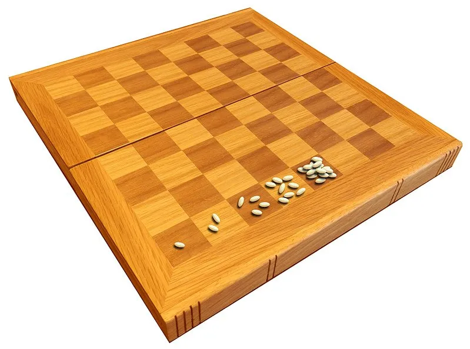

À ce propos Marty je voudrais être sûr que tu as bien compris ce qu'est une croissance exponentielle. Tu es d'accord avec moi que, quel que soit le pourcentage de croissance annuel, dans plus ou moins longtemps, il y a aura un moment où on aura doublé la mise. OK ? Alors, laisse-moi te raconter l'histoire de [l'échiquier de Sissa](https://fr.wikipedia.org/wiki/Probl%C3%A8me_de_l%27%C3%A9chiquier_de_Sissa).

Enjolive ça comme tu veux avec tes potes à l'école mais, en gros, un prince est tellement content du boulot que vient de faire l'un de ses arpettes qu'il lui propose de choisir sa récompense. Le gars regarde autour de lui, repère un échiquier et dit : sur la première case vous allez faire déposer un grain de blé, 2 sur la seconde, 4 sur la quatrième... Et ce, jusqu'à ce que toutes les cases aient leur lot de grains de blé. Telle sera ma récompense.

Bien sûr c'est une fable, une parabole, mais est-ce que tu comprends qu'on peut la regarder comme un problème de croissance à 100% ?

Oui, c'est clair pour moi. On double à chaque case, tout se passe donc comme si on avait une croissance de 100%.

Au fait, Marty, tu comprends bien que lorsqu'on dit "augmentation de 300%", cela revient à multiplier par 4 la quantité de départ et donc ici, si on fait 100% de croissance ça double. Tu peux me l'expliquer avec tes mots ?

En fait, si on a +300% d'augmentation on peut écrire :

$$V_f = V_o + V_o * 300\% $$

$$V_f = V_o * (1 + 300\%)$$

$$V_f = V_o * (1 + 3)$$

$$V_f = V_o * 4 $$

En conclusion, si on dit augmentation de "$$x\%$$" cela revient à multiplier la quantité initiale par $$(x + 1)$$.

Ici on a 100% d'augmentation donc on multiplie par 2.

OK, j'ai une autre question pour toi. Combien y a-t-il de grains de blé sur la dernière case ?

Facile. On a 100% de croissance, une valeur initiale de 1 et 63 cases à remplir donc :

$$V_f = V_o * (1 + 100\%)^{63}$$

$$V_f = 1 * (1 + 1)^{63}$$

$$V_f = 2^{63} = 9223372036854775808 = 9.22 * 10^{18}$$

Ah oui, quand même... Respect.

Marty, on estime qu'un grain de blé pèse [0.05 gr](https://seppi.over-blog.com/2017/08/les-mathematiques-du-ble-et-du-pain.html#:~:text=Un%20grain%20de%20bl%C3%A9%20%3D%200,de%2035%20%C3%A0%2050%20grammes).). Donc on a $$9.22 * 10^{18} * 0.05 = 4.61 * 10^ {17}$$ grammes. Une tonne c'est 1 000 kg, c'est donc $$10^6$$ grammes. Pour finir, sur la dernière case il y a $$4.61 * 10^ {11}$$ tonnes de blé ou $$4.61 * 10^ {5}$$ millions de tonnes de blé. Si on considère [qu'on produit](https://www.yara.fr/fertilisation/solutions-pour-cultures/ble/production-mondiale-ble/#:~:text=Le%20bl%C3%A9%2C%20fleuron%20du%20march%C3%A9%20mondial%20des%20c%C3%A9r%C3%A9ales&text=Chaque%20ann%C3%A9e%2C%20650%20%C3%A0%20685,tonnes%20sont%20entrepos%C3%A9es%20en%20r%C3%A9serves.) 700 millions de tonnes de blé par an c'est environ 660 ans de production annuelle qu'il faut déposer sur la dernière case. Du délire... Et je ne te parle même pas du total de tout ce qui a été déposé sur les autres cases...

Le drame des croissances exponentielles c'est qu'on commence avec 1 ou 2 grains de blé et qu'on termine avec 1000 fois la production annuelle... Faut vraiment en être conscient si on ne veut pas raconter de bêtises ou demander n'importe quoi à la planète.

## Le septième challenge de Mamie -

Marty, on n'en a pas terminé avec l'échiquier mais, comme je n'ai pas envie que tu me dises que "tout ça c'est très théorique" on va parler production. Choisis ce que tu veux : pétrole, cuivre, farine, motos... Peu importe. De plus, je te propose de prendre 5% de croissance annuelle et comme valeur de départ, on va prendre 100 si cela ne te fais rien. Tiens, j'ai préparé ce tableau prévisionnel pour toi.

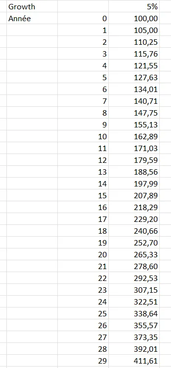

Tu remarques que je suis allé jusqu'à l'année 29 car elle correspond à la deuxième période de doublement de la valeur initiale. En effet si tu divises 70 par 5 tu trouves 14. Dans le tableau ci-dessus à T=15 on a bien doublé la valeur initiale et en T=29 on l'a quadruplé. C'est bon pour toi ? OK, on continue.

Question : quelle est la somme des valeurs entre l'indice 0 et l'indice n ? Cela n'a rien à voir avec les pourcentages, mais on en a besoin pour la suite. Aie confiance, crois en moi 🎶...

Heu là... Ça me rappelle un truc mais je sais plus quoi. On avait vu ça avec les suites, les suites géométriques je crois. Ah oui, ayé, ça me revient.

Je pars de ce que je sais, soit :

$$V_n = V_0 * (1 + 5\%)^n$$

Ce que je peux encore écrire sous la forme :

$$V_n = V_0 * q^n$$

Comme ça, ça ressemble à une suite géométrique comme on a l'habitude de les voir. Il faudra juste ne pas oublier que :

$$q = 1 + 5\%$$

Maintenant, ce que tu me demandes c'est de calculer la somme suivante :

$$S_n = V_0*q^0 + V_0*q^1 + \ldots + V_0*q^n$$

C'est bien ça que tu veux que je calcule ?

Oui, oui, c'est exactement ça.

Du coup, la ruse pour s'en sortir c'est d'écrire et de raisonner sur les deux lignes suivantes.

$$S_n = V_0*q^0 + V_0*q^1 + \ldots + V_0*q^n$$

$$q*S_n = V_0*q^1 + \ldots + V_0*q^n + V_0*q^{n+1}$$

Là, ce n'est pas bien aligné et on ne voit pas vraiment bien mais il faut remarquer que dans les 2 sommes $$S_n$$ et $$q*S_n$$ il y a énormément de termes en commun. Du coup on peut les faire disparaitre si on soustrait une ligne de l'autre. Par exemple, si je soustrais la première de la seconde je peux écrire :

$$q*S_n - S_n = V_0*q^{n+1} - V_0*q^0$$

C'est magique ! Tous les termes ont disparu. Allez, je continue et je remplace le $$*q^0$$ par 1 que je fais disparaître. Il vient :

$$q*S_n - S_n = V_0*q^{n+1} - V_0$$

Je mets en facteur les termes qui sont répétés :

$$S_n * (q -1) = V_0*(q^{n+1} - 1)$$

Pour finir je trouve :

$$S_n = V_0* \frac{(q^{n+1} - 1)}{q -1}$$

Très bien Marty. Peux-tu vérifier ton résultat avec une calculatrice et mon tableau Excel. Ce n'est pas une preuve mais c'est rassurant et satisfaisant. Prends $$n=18$$ par exemple.

Avec la formule j'écris :

$$S_{18} = V_0* \frac{(q^{19} - 1)}{q -1}$$

Comme on a dit que $$V_0=100$$ et que $$q=1.05$$ j'écris :

$$S_{18} = 100* \frac{(1.05^{19} - 1)}{1.05 -1}=3053.90$$

Dans Excel ça va beaucoup plus vite, je sélectionne les cellules de $$n=0$$ à $$n=18$$ et je lis directement le résultat en bas dans le bandeau noir :

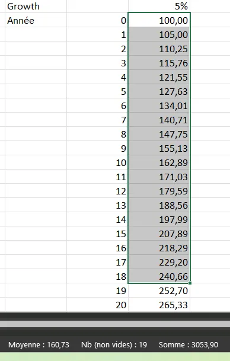

3053.90. Ouf l'honneur est sauf, on trouve la même valeur.

Bien Marty. J'aurai pu commencer par ça mais bon, maintenant, je te pose la même question mais pour la somme des valeurs comprises entre $$n_1$$ et $$n_2$$.

Je veux bien Mamie, mais bon, je crois qu'on s'éloigne "grave" des histoires de pourcentages. Toutefois, je me dis que ça peut aller vite ton histoire car je pense que, là aussi, il y a un motif, un pattern. Allez, je n'hésite pas et je me lance. On avait écrit :

$$S_n = V_0* \frac{(q^{n+1} - 1)}{q -1}$$

Quand les indices vont de 0 à $$n$$. Je te propose donc :

$$S_{n1-n2} = V_0* \frac{(q^{n_2+1} - q^{n_1})}{q -1}$$

Quand les indices vont de $$n_1$$ à $$n_2$$.

En fait je me dis que le $$q^{n+1} - 1$$ de la première somme peut être réécrit sous la forme $$q^{n+1} - q^0$$. Là, je vois que les indices de départ et d'arrivée se retrouvent comme exposants et j'en déduis la formule pour les indices $$n_1$$ et $$n_2$$.

Pas mal raisonné Marty. Afin d'assurer le coup, fais le calcul à la main et avec Excel pour les indices 3 et 10 par exemple.

OK. Je vais vite mais la formule devient :

$$S_{n1-n2} = V_0* \frac{(q^{n_2+1} - q^{n_1})}{q -1}$$

$$S_{10-3} = 100* \frac{(1.05^{11} - 1.05^{3})}{1.05 -1} = 1105.43$$

Avec Excel voilà ce que je vois

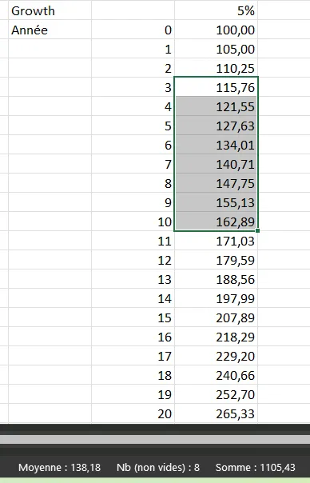

On retrouve bien les mêmes valeurs. Ce n'est pas une preuve mais ça sent bon. Heu... Mamie on peut revenir aux croissances exponentielles ?

Oui, oui justement, on y revient. Compte tenu de ce que tu viens de retrouver, peux-tu me démontrer que le total de la production pendant une période de doublement est toujours supérieur à ce qui a été produit depuis la nuit des temps jusqu'au début de la période en question ?

Heu... Pouvez répéter la question ?

Tiens Marty, j'ai remanié mon tableau de valeurs :

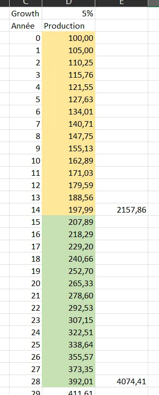

Par exemple, je te demande de me prouver que la production entre $$n=15$$ et $$n=28$$ (la seconde période de doublement) est supérieur à tout ce qui a été produit entre les indices $$n=0$$ et $$n=14$$. Bien sûr, j'attends une démonstration générale, pas un cas particulier.

OK... Je le redis avec mes mots pour être sûr d'avoir compris. Tu veux que je compare tout ce qui est produit pendant une période de doublement de valeur avec tout ce qui a déjà été produit avant cette même période de doublement.

Exactement !

Hmmm... Qu'est -ce que je sais ? Mais oui, mais c'est bien sûr, je vais utiliser ce que je viens de faire et on va comparer les sommes de $$n=0$$ à $$n_1$$ avec la somme de $$n_1+1$$ à $$n_2$$. Il faudra garder en tête qu'à l'indice $$n_2$$ la valeur produite est le double de la valeur produite à l'indice $$n_1$$. Voilà ce que j'ai en tête :

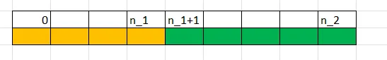

Du coup, ce qui a été produit depuis la nuit des temps c'est la somme de 0 à n1. Elle vaut :

$$S_{n1} = V_0* \frac{(q^{n_1+1} - 1)}{q -1}$$

Ensuite la somme de n1+1 à n2 vaut :

$$S_{n1+1-n2} = V_0* \frac{(q^{n_2+1} - q^{n_1+1})}{q -1}$$

Maintenant il faut vérifier que l'on a :

$$V_0* \frac{(q^{n-1+1} - 1)}{q -1} < V_0* \frac{(q^{n_2+1} - q^{n_1+1})}{q -1}$$

On peut déjà commencer par faire le ménage et comme $$V_0$$ n'est pas nul, on peut diviser à droite et à gauche par cette valeur. Ensuite on peut virer le $$q-1$$ qu'on retrouve dans les dénominateurs. Il ne reste plus que :

$$q^{n_1+1} - 1 < q^{n_2+1} - q^{n_1+1}$$

Je regroupe les termes de même puissance :

$$2 * q^{n_1+1} - 1 < q^{n_2+1}$$

Et là... Là, je sèche un petit peu. Sauf que... Sauf que je connais une relation entre $$q^{n_1}$$ et $$q^{n_2}$$. En effet on a :

$$V_0 * q^{n_2} = 2 * V_0 * q^{n_1}$$

Cela traduit juste le fait que la valeur en $$n_2$$ vaut deux fois la valeur en $$n_1$$. Je commence par supprimer $$V_0$$ et il vient :

$$q^{n_2} = 2*q^{n_1}$$

Comme dans l'inégalité précédente je me retrouve avec $$q^{n_1+1}$$ et des $$q^{n_2+1}$$, je vais multiplier à gauche et à droite par $$q$$ et l'égalité devient :

$$q^{n_2+1} = 2*q^{n_1+1}$$

J'avais cette inégalité :

$$2 * q^{n_1+1} - 1 < q^{n_2+1}$$

Si je remplace $$q^{n_2+1}$$ par sa valeur alors on a :

$$2 * q^{n_1+1} - 1 < 2 * q^{n_1+1}$$

Et ça c'est tout le temps vrai. En langage compliqué par les indices et les exposants ça veut dire que 2 bananes moins 1 c'est inférieur à 2 bananes. Bref, CQFD.

### Le truc à retenir

*Ne pas oublier la grosse voix* 😊.

**Durant une période de doublement de production, on produit plus que tout ce qui a été produit avant cette même période.**

Il faut vraiment garder ça en tête, c'est important. Regardez cette [vidéo](https://www.youtube.com/live/FkiMqLD3_YQ?feature=share&t=436) par exemple.

https://www.youtube.com/watch?v=FkiMqLD3_YQ&t=436s

Cela permet aux politiques et aux journalistes de faire des gros titres alarmistes mais en fait ce type d'annonce n'est qu'une conséquence de la nature exponentielle de la croissance commentée. Il y a donc des cas où il faut donc rester impassible (car on sait d'où ça vient et que cela n'a rien de magique) et d'autres où il faut carrément remettre son interlocuteur en place tout simplement parce qu'il dit des choses qui sont des aberrations.

## Le huitième challenge de Mamie - À propos des ressources non renouvelables

*Bon, là, pour certains va peut-être falloir s'accrocher un peu. Si vous ne pigez pas tout, ce n'est pas grave. Continuez à lire, vous en retiendrez toujours quelque chose et, en tout cas, je vais faire tout mon possible pour expliquer ce qui se passe.*

Je sens bien que Mamie est chaude comme la braise sur ces sujets de pourcentage et de croissance. Aussi, quand elle se lève pour aller regarder par la fenêtre, je sais que je n'en ai pas encore tout à fait terminer.

Marty, il est temps qu'on parle des ressources de notre planète me dit-elle.

Ok... C'est quoi le problème ?

Prenons le cas emblématique du pétrole. On l'extrait de la terre, on le transforme un peu. On remplit nos réservoirs, on le crame dans nos moteurs et finalement il disparait (je passe les détails sur le CO2, le réchauffement climatique, les ours polaires etc.). C'est une ressource non renouvelable dont la quantité enfouie dans le sol est limitée, finie, bornée. OK ?

Admettons maintenant que je t'annonce qu'avec le niveau de consommation actuel $$c$$ on a des réserves pour $$T$$ années.

Pour commencer, peux-tu me faire un schéma qui résume tout ça ?

Après quelques essais j'arrive finalement à ce graphique :

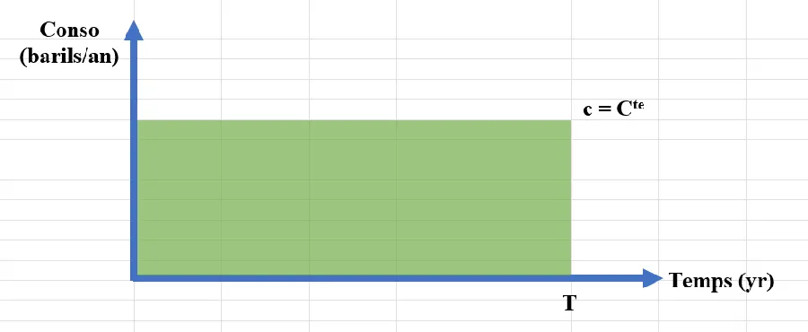

L'axe des abscisses, l'axe horizontal, c'est le temps en années. Avec d'autres ressources cela pourrait être des millénaires, des secondes. En fait, on s'en fout.

L'axe des ordonnées (l'axe vertical) c'est la consommation annuelle. Là, par contre, il faut faire attention. Il faut que ce soit une consommation par la même unité de temps que celle utilisée sur l'axe des abscisses. La consommation est donc ici exprimée en nombre de barils par an.

Comme le niveau de consommation mondiale est stable (c'est toi qui l'as dit), je tire un trait horizontal à partir d'une ordonnée quelconque et je le prolonge jusqu'à $$T$$. Ensuite, il n'y a plus de consommation (elle retombe à zéro) car, comme tu l'as dit aussi, à cette date, il n'y a plus de pétrole, tout a été consommé et c'est Mad Max sur la planète.

Ok Marty. C'est d'ailleurs bien que tu ais rempli la zone sous le niveau de consommation. Peux-tu me dire ce que représente vraiment la surface de ce rectangle ?

En fait, la surface du rectangle vert c'est Longeur fois Largeur. C'est donc un temps en années (l'axe des x) multiplié par une consommation en barils par an (l'axe des y). Si je ne regarde que les unités, on a donc quelque chose du style :

$$Surface = Ans * \frac{Barils}{Ans} = Barils$$

La surface verte représente donc le nombre total de barils disponibles. C'est ça ?

Oui, oui, c'est bien ça. Maintenant, la population mondiale ne fait qu'augmenter et même si elle n'augmentait pas, il y a de plus en plus de classe moyenne en Chine et il en sera de même un jour en Inde. Penses-tu vraiment que le niveau de consommation va rester constant ? Si une population croit de $$x\%$$ par an, la croissance est, on l'a vu, exponentielle et donc la consommation va croître le la même façon. Peux-tu compléter ton schéma et faire apparaître le nouveau temps $$T_2$$ auquel il n'y aura plus de pétrole ?

C'est simple, je modifie le niveau de consommation qui dorénavant croît, comme la population, de manière exponentielle. Bien sûr, la courbe rouge est supérieure à la courbe verte mais idéalement (ce n'est sans doute pas le cas sur mon dessin) la surface rouge doit être égale à la surface verte. En effet, le nombre de barils (les surfaces sous les courbes) reste le même. En revanche, comme on consomme de plus en plus au fil du temps, on va consommer moins longtemps et donc $$T_2$$ se trouve quelque part avant $$T$$

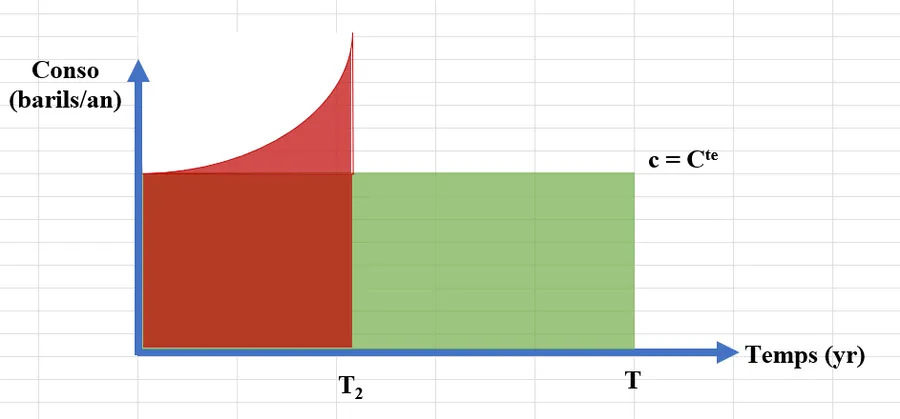

Tu t'en sors rudement bien Marty. Tu es mon digne petit fils ! Bon, allez, maintenant calcule moi $$T_2$$ si tu es un homme 😊

Heu... Qu'est-ce que je sais ? Je sais que les surfaces sous les courbes doivent être égales. J'aurai tendance à partir de là et à écrire quelque chose comme ça :

$$\textrm{ Surface Rouge } = \textrm{ Surface Verte }$$

Pour le membre de droite ça va, on vient d'en parler et je peux donc écrire :

$$\textrm{ Surface Rouge } = T * c$$

Pour la surface rouge le seul truc que je peux écrire c'est ça pour l'instant :

$$ \int_{0}^{T_2} f_{Rouge}(t) = T * c$$

Là, je suis coincé car je ne connais pas l'expression de la fonction que j'ai appelé $$f_{Rouge}$$. Tu peux m'aider ? Tu as une idée ?

Oui, bien sûr que j'ai une idée, sinon je ne serais pas une super Mamie. On l'a dit, c'est une croissance exponentielle. Son niveau de départ c'est $$c$$ et elle varie avec le temps. Je te propose d'utiliser une fonction du style :

$$f(t) = c * e^{kt} $$

Dans l'expression précédente $$c$$ c'est la consommation que tu as déjà utilisée, $$t$$ c'est le temps qui passe et $$k$$ c'est une constante avec laquelle on va pouvoir jouer. Tiens prends mon PC, ouvre l'excellent Excel et trace moi cette fonction histoire de te convaincre que c'est bien ce que l'on veut.

Après quelques essais j'arrive à ça. J'ai tracé 2 courbes une bleue avec $$k=0.1$$ et une autre, orange, où $$k=0.15$$. On voit que les deux courbes démarrent bien de $$c=5$$ et pas de zéro. Ensuite ça grimpe d'autant plus fort que $$k$$ est élevé.

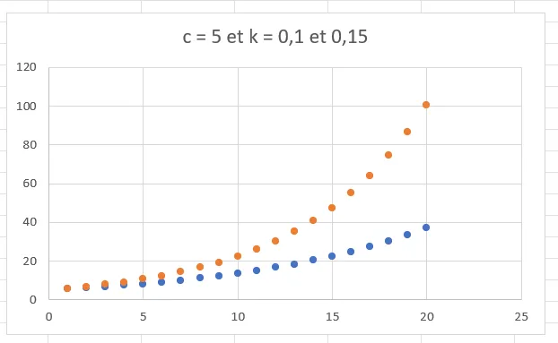

Dis-moi, je ne savais pas que tu te débrouillais si bien avec Excel. Tu es vraiment un garçon plein de ressources.

Bon, ce n'est pas tout ça mais en fait j'ai triché. En toute logique, le terme $$k$$ représente un pourcentage (oui, encore un pourcentage). C'est le taux d'augmentation de la consommation. Finalement, et tu vas voir que cela ne change pas grand-chose, pour la fonction rouge, je te propose d'utiliser cette expression :

$$f(t) = c * e^{k\%*t}$$

À toi de jouer maintenant petit padawan !

Je repars de ce que j'avais écrit précédemment :

$$ \int_{0}^{T_2} f_{Rouge}(t) = T * c$$

J'introduis la fonction que tu viens de me donner :

$$ \int_{0}^{T_2} c * e^{k\%*t} = T * c$$

Je sors la constante $$c$$ de l'intégrale :

$$ c * \int_{0}^{T_2} e^{k\%*t} = T * c$$

Comme $$c$$ n'est pas nul, je peux simplifier à droite et à gauche :

$$ \int_{0}^{T_2} e^{k\%*t} = T $$

Là, c'est plutôt cool car la primitive d'une exponentielle c'est une exponentielle. Il faut juste faire attention au coefficient de la variable $$t$$ :

$$ \frac{1}{k\%}[e^{k\%*t}]_0^{T_2} = T $$

$$ \frac{1}{k\%} * (e^{k\%*T_2} - 1) = T $$

Je fais passer un max de choses à droite pour garder $$T_2$$ à gauche :

$$ e^{k\%*T_2} = k\%*T + 1$$

On cherche $$T_2$$ qui est en exposant, donc on prend le log de l'égalité (voir plus haut pourquoi si besoin) :

$$ k\%*T_2 = \ln(k\%*T + 1)$$

Finalement je trouve :

$$ T_2 = \frac{\ln(k\%*T + 1)}{k\%}$$

Ok, c'est juste mais ce n'est pas très parlant. Vu que tu maitrises Excel, peux-tu me sortir un graphe ou un tableau qui nous permette d'apprécier la situation ?

Après quelques réflexions, j'arrive à ça :

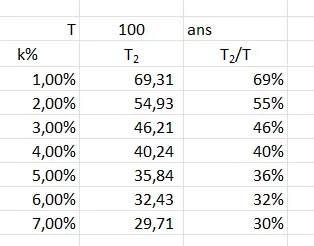

Le tableau s'explique de la façon suivante :

* En haut on a la période T pendant laquelle on va pouvoir encore extraire telle ou telle ressource non renouvelable au rythme actuel.

* Ensuite, dans la première colonne on a la croissance de la consommation. En gros, au lieu d'être stable, on dit qu'elle va augmenter de 1%...7% par an.

* Ensuite dans la seconde colonne je calcule $$T_2$$ mais, suite à des tests, je me suis rendu compte que ce n'était pas très significatif.

* Du coup dans la troisième colonne je fais apparaître le rapport $$\frac{T_2}{T}$$.

À l'aide de ce petit tableau on peut dire que :

* Si la consommation reste stable (aucune croissance), on va pouvoir utiliser telle ou telle ressource non renouvelable pendant 100 ans. Typiquement c'est ce que l'on nous dit, c'est ce que nous promettent les experts.

* En revanche, si la consommation de la ressource augmente ne serait-ce que de 1% par an dans les prochaines années alors on ne pourra la consommer que pendant 69 ans (-30% par rapport au 100 ans qu'on nous avait promis).
  Pour bien te rendre compte de quoi on parle, va voir ton banquier et expliques-lui qu'au lieu des 10 000€ que tu as empruntés, tu ne vas lui rembourser que 7 000 €. Tu vas voir la tronche qu'il va faire (notes qu'en plus, dans mon exemple le prêt était sans intérêt).

* Enfin, si la consommation de la ressource augmente de 7% par an, là, pour le coup on ne pourra plus la consommer que pendant 30% du temps initial.

Attention, dans la dernière équation on avait :

$$ T_2 = \frac{\ln(k\%*T + 1)}{k\%}$$

Autrement dit, la situation dépend aussi de $$T$$ (la période de temps à consommation stable). À titre indicatif, voilà ce que cela donne avec 1 000 ans et 250 ans. Il faut vraiment prendre le temps de comparer les 3 tableaux :

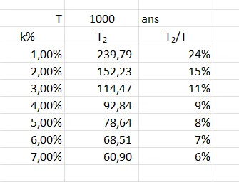

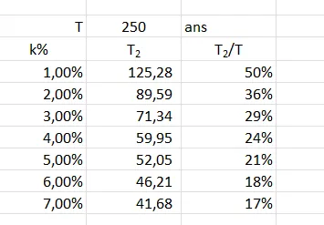

Si jamais on nous dit que telle ressource non renouvelable est, au taux de consommation actuel, disponible pour les 250 ans à venir. Il faut tout de suite se rappeler que si la consommation n'augmente que de 1% alors le temps de disponibilité de la ressource est divisé par 2. Ce n'est pas neutre, loin de là. Est-ce que votre interlocuteur le sait ?

Dans le cas T=1 000 ans, toujours avec 1% de croissance, c'est pire car la ressource ne sera disponible que le quart du temps initialement prévu. Et il dit quoi ton interlocuteur ? Quelles mesures on prend ? En tout cas, on ne pourra pas dire qu'on ne savait pas.

Une dernière remarque. Parfois, on n'a pas accès à T, la durée pendant laquelle on va pouvoir, au rythme actuel, consommer telle ou telle ressource non renouvelable. Dans ce cas-là, pour s'en sortir, il faut trouver 2 autres valeurs :

2. Le montant des réserves estimées.

6. Le taux d'extraction (ou de consommation) actuel.

Ensuite, il ne faut pas sortir du [MIT](https://www.mit.edu/) pour faire la division du premier par le second et retrouver T.

Allez, Marty, mettons ça en pratique.

2. Sur ce [site](https://fr.statista.com/statistiques/571213/reserves-de-cuivre-dans-le-monde-par-pays/) tu trouves que les réserves de cuivre sont de 815 millions de tonnes

6. Sur ce [site](https://www.strategie.gouv.fr/sites/strategie.gouv.fr/files/atoms/files/fs-2020-dt-consommation-metaux-du-numerique-juin.pdf) tu trouves que la consommation de cuivre est de 24 millions de tonnes par an

10. Sur le même site on t'indique que depuis 1900 la consommation progresse de 3.4% par an

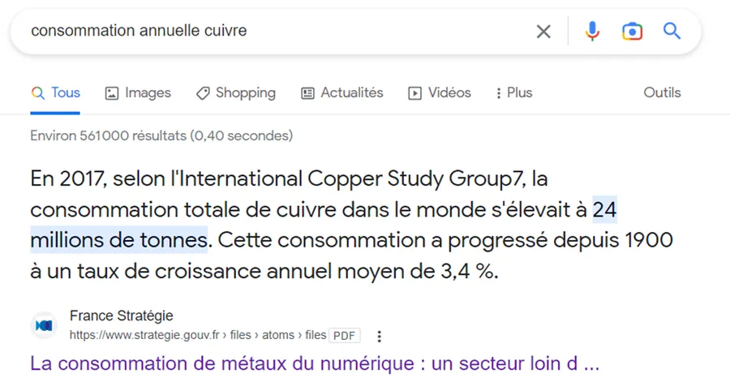

Ensuite, vite fait, rentre tout dans Excel. On va prendre l'hypothèse basse qu'on va garder les 3.4% de croissance par an mais franchement, je suis dubitative quand je vois que dans une voiture thermique il y a 20 kg de cuivre, 80kg dans une voiture électrique, 100 kg par prise dans une borne de recharge et je ne compte pas tout le cuivre des câbles pour alimenter ces dernières. Enfin bref, rentres tout ça et donne-moi ton commentaire :

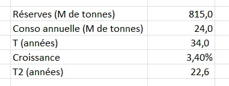

En divisant 815 par 24 je trouve 34. Je suis effaré. Cela veut dire que si on ne découvre pas de nouvelles mines de cuivre, selon les chiffres ci-dessus, il ne nous reste que pour une génération et demie de cuivre sur la planète (une génération c'est 25 ans).

Je n'y crois pas. Du coup je vais sur le web et je cherche un peu. Sur ce [site](https://www.planetoscope.com/matieres-premieres/172-production-mondiale-de-cuivre.html), au bas de la page, lui parle de 31 ans. Franchement je ne sais pas quoi dire mais le pire est encore à venir...

En effet, maintenant j'ai $$T$$, je peux donc utiliser notre dernière formule pour calculer $$T_2$$

$$ T_2 = \frac{\ln(k\%*T + 1)}{k\%}$$

Là, je trouve 22.6 années. Moins d'une génération...

Quand, pour me rassurer, je vérifie la quantité de cuivre recyclé annuellement au niveau mondial, je trouve 4M de tonnes. C'est à dire le 6eme de la production annuelle. Cela me parait très loin d'être suffisant pour compenser quoique ce soit.

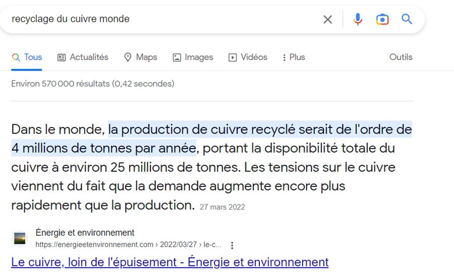

Dans la vidéo ci-dessous on retrouve les chiffres du cuivre précédent MAIS, il explique pourquoi il en est ainsi. Toute la vidéo est vraiment superbe mais je pointe sur la section qui m'interesse. Prenez le temps de tout regarder, ça vaut vraiment le coup.

https://youtu.be/UmbFaPrXFcE?t=1144

## Récapitulatif

* Quand on lit 5% il faut lire $$\frac {5}{100} $$

* Quand on lit 5%, il faut toujours rajouter "de quoi ?"

* $$V_n = V_0 * (1 + x\%)^n$$

* Quand le rendement est de $$r\%$$, le temps pour doubler la valeur initiale peut être approximé avec $$t \approx \frac{70}{r}$$

* Avec un rendement de $$r\%$$, au bout de 70 ans, la valeur initiale sera approximativement multipliée par $$2^r$$

* Si on a une augmentation de $$x*100\%$$ (100%, 200%, 500%...) cela revient à multiplier la quantité initiale par $$(x + 1)$$ (2, 3, 6...)

* Durant une période de doublement, on produit/consomme plus que tout ce qui a été produit/consommé avant la période en question.

* $$ T_2 = \frac{\ln(k\%*T + 1)}{k\%}$$

## Conclusion

*À écrire.*

##

