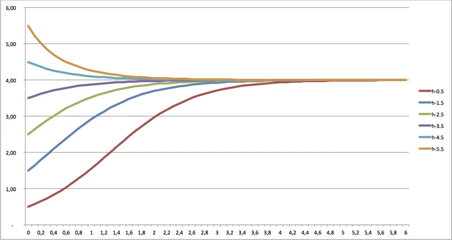

# Equations de Bernoulli

## Introduction

Les équations de Bernoulli sont des équations différentielles du premier ordre un peu particulières. Dans un [précédent article]() on a vu que les équations différentielles du premier ordre pouvaient s'écrire sous la forme :

$$y ^{\prime} + p(x)y = q(x)$$

Avec les mêmes notations, les équations de Bernoulli vont s'écrire :

$$y ^{\prime} + p(x)y = q(x)y^{n}$$

## Principe de résolution

Le décor étant planté, on va tout faire pour se ramener à une équation différentielle du premier ordre "classique". On le voit bien, on n'a pas 36 solutions, faut au moins qu'on commence par diviser à droite et à gauche par yn. Ensuite arrivera ce qui arrivera et on verra bien... Allez on y va :

$$y^{\prime} + p(x)y = q(x)y^{n}$$

$$\frac {y ^{\prime}}{y^{n}} + \frac {p(x)y}{y^{n}} = q(x)$$

$$\frac {y ^{\prime}}{y^{n}} + \frac {p(x)}{y^{n-1}} = q(x)$$

Halte au feu ! On lève la tête et on réfléchit. Ayé, vous avez-vu ? On y est presque... Oui, bravo ! En effet, l'équation ci-dessus ressemble presque à ce que l'on veut. On a juste un petit problème de notation. Allez, on va faire un essai et on pose :

$$u = \frac {1}{y^{n-1}}$$

Vu que dans la suite on va avoir besoin de remplacer y', différentions l'expression ci-dessus

$$u = \frac {1}{y^{n-1}}$$

$$u = y^{1-n}$$

$$\mathrm{d}u = (1-n)y^{-n}\mathrm{d}y$$

$$\mathrm{d}y = \frac {y^n}{(1-n)} \mathrm{d}u$$

En utilisant : $$u^{\prime} = \frac {\mathrm{d}u}{\mathrm{d}x}$$

On ré-écrit notre équation

$$\frac {y ^{\prime}} {y^{n}} + \frac {p(x)} {y^{n-1}} = q(x)$$

$$\frac {\mathrm{d}y} {\mathrm{d}x} \frac {1}{y^n} + \frac {p(x)} {y^{n-1}} = q(x)$$

$$\frac {y^n}{(1-n)} \mathrm{d}u \frac {1} {\mathrm{d}x} \frac {1}{y^n} + \frac {p(x)} {y^{n-1}} = q(x)$$

$$\frac {\mathrm{d}u} {\mathrm{d}x} \frac {1}{(1-n)} + u * p(x) = q(x)$$

$$\frac {u ^{\prime}} {(1-n)} + u * p(x) = q(x)$$

$${u ^{\prime}} + (1-n) * u * p(x) = (1-n) * q(x)$$

Bon, ben voilà, on s'est ramené à une équation du premier ordre sous sa forme linéaire standard. On est maintenant en terre connue. On peut appliquer la méthode en 4 points dont on a déjà discuté. Faudra juste penser à ne pas oublier le changement de variable qu'on a fait en cours de route.

## Exemple

On souhaite résoudre l'équation suivante : $$y ^{\prime} + \frac{y}{x} = y^{3}$$

On divise à gauche et à droite par y3

$$\frac {y ^{\prime}} {y^{3}} + \frac {1}{y^2} \frac{1}{x}  = 1$$

On pose

$$u = \frac {1}{y^2}$$

$$u = y^{-2}$$

On différencie et on détermine $$\mathrm{d}y$$

$$\mathrm{d}u = -2y^{-3}\mathrm{d}y$$

$$\mathrm{d}y = \frac {\mathrm{d}u} {-2 y^3}$$

On réécrit l'équation

$$\frac {y^{\prime}} {y^{3}} + \frac {1}{y^2} \frac{1}{x}  = 1$$

$$\frac {\mathrm{d}y}{\mathrm{d}x y^3} + \frac {1}{y^2} \frac {1}{x}  = 1$$

$$\frac {\mathrm{d}u y^3}{-2 \mathrm{d}x y^3} + u \frac{1}{x}  = 1$$

$$\frac {\mathrm{d}u}{-2\mathrm{d}x} + u \frac{1}{x}  = 1$$

Au final on se retrouve avec une équation sous la forme standard linéaire qui est l'étape 1 de la méthode en 4 points

$$\frac {\mathrm{d}u}{\mathrm{d}x} - \frac {2}{x} u  = -2$$

Calcul du facteur d'intégration en intégrant le coefficient de u

Le coefficient de u c'est $$ - \frac {2}{x} $$

On cherche donc à intégrer $$ \int{}{}{- \frac {2}{x} \mathrm{d}x}$$

$${-2} \int{}{} \frac {1}{x} \mathrm{d}x$$

$$-2 ln(x)$$

Le facteur d’intégration est donc $$e^{-2 ln(x)}=(e^{ln(x)})^{-2}=x^{-2}$$

On multiplie par le facteur d’intégration l’équation initiale

$$\frac {\mathrm{d}u}{\mathrm{d}x} - \frac {2}{x} u  = -2$$

$$\frac {\mathrm{d}u}{\mathrm{d}x} x^{-2} - \frac {2}{x} u x^{-2} = -2 x^{-2}$$

$$\frac {\mathrm{d}u}{\mathrm{d}x} \frac{1}{x^2} - \frac {2}{x^{3}} u = \frac {-2}{ x^2}$$

On vérifie bien que

$$(u \frac{1}{x^2})^{\prime} = \frac {\mathrm{d}u}{\mathrm{d}x} \frac{1}{x^{2}} - \frac {2}{x^3}u$$

On a donc

$$(u \frac{1}{x^2})^{\prime} = \frac {-2}{ x^2}$$

On intègre l'équation précédente

$$u \frac {1}{x^2}= \int{}{} \frac {-2}{ x^2}\mathrm{d}x + K$$

$$u \frac {1}{x^2} = 2 \int{}{} \frac{-1}{x^2}\mathrm{d}x + K$$

$$u \frac {1}{x^2} = {2} \frac{1}{ x} + K$$

$$ u= 2x + Kx^2$$

N'oublions pas le changement de variable que nous avions effectué un peu plus haut

$$u = \frac {1}{y^2}$$

$$y^2 = \frac {1}{u}$$

$$y^2 = \frac {1}{2x + Kx^2}$$

$$y = \frac {1}{\sqrt{2x + Kx^2}}$$

## Exemple d'application pratique

Pour être clair, j'ai pas mal cherché sur le web et dans divers bouquins mais je n'ai pas réussi à trouver un truc bien cool où par exemple une des forces appliquées à un mobile en mouvement à la vitesse v serait du style :

$$F = \lambda_1v + \lambda_2v^{2}$$

Quoiqu'il en soit lorsqu'on étudie les modèles d'évolution de populations, le modèle de [Verhulst](http://ibit.ly/prhe) va nous permettre de mettre en application ce que l'on vient d'apprendre. Dans ce modèle, une variable suit le modèle suivant :

$$\frac {dP}{dt}  = rP(1 - \frac{P}{K})$$

Dans l'équation ci-dessus r est le taux de croissance maximum et K est la capacité limite. Oublions le "P" et utilisons le "y" de manière "classique". Il vient :

$$\frac {\mathrm{d}y}{dt}= r y (1- \frac{y}{K})$$

$$\frac {\mathrm{d}y}{dt}= ry - \frac{r}{K} y^{2}$$

$$\frac {\mathrm{d}y}{dt} - ry = - \frac{r}{K} y^{2} $$

Maintenant on divise par $$y^2$$

$$\frac {\mathrm{d}y}{dt} \frac{1}{y^2} - \frac {r}{y} = -\frac {r}{K}$$

On pose $$u = \frac {1}{y}$$

On a donc $$\mathrm{d}u = \frac {-1}{y^2} \mathrm{d}y$$

Soit $$\mathrm{d}y = -\mathrm{d}u * y^{2}$$

Avec le changement de variable, l'équation devient

$$-y^2 \frac {\mathrm{d}u}{dt} \frac{1}{y^2} - ru = - \frac {r}{K}$$

$$-\frac{\mathrm{d}u}{dt} - ru = -\frac {r}{K}$$

$$\frac{\mathrm{d}u}{dt} + ru = \frac {r}{K}$$

On résout cette équation avec la méthode en quatre points (facteur d'intégration)

L'équation est déjà écrite sous sa forme standard linéaire. On intègre le facteur de u pour trouver le facteur d'intégration. On doit donc calculer

$$\int{}{}{rdt} = rt$$

Le facteur d'intégration est donc $$e^{rt}$$

On multiplie l'équation par le facteur d'intégration

$$\frac{\mathrm{d}u}{dt} + ru = \frac {r}{K}$$

$$\frac{\mathrm{d}u}{dt} e^{rt} + rue^{rt} = \frac {r}{K}e^{rt}$$

On reconnait $$(ue^{rt})^{\prime} = \frac {r}{K}e^{rt}$$

On intègre

$$\int{}{}{(ue^{rt})^{\prime}} = \int{}{}{\frac {r}{K}e^{rt}} + C$$

$$ue^{rt} = \frac {r}{K} \frac {1}{r} e^{rt} + C$$

$$ue^{rt} = \frac {1}{K} e^{rt} + C$$

$$u = \frac {1}{K} + Ce^{-rt}$$

On a presque terminé. Faut juste qu'on n'oublie pas le changement de variable qu'on a effectué : $$u = \frac {1}{h}$$

L'équation devient donc

$$\frac {1}{y} = \frac {1}{K} + Ce^{-rt}$$

$$y = \frac {1}{( \frac{1}{K} + Ce^{-rt})}$$

$$y = \frac {K}{(1 + C_1e^{-rt})}$$

A t=0 on a $$y=y_o$$. On peut donc déterminer C

$$y_o = \frac {K}{(1 + C_1)}$$

$$(1 + C_1) = \frac {K}{y_o}$$

$$C_1 = \frac {K}{y_o} -1$$

Au final y(t) vaut :

$$y = \frac {K}{(1 + (\frac{K}{y_o} -1)e^{-rt})}$$

### Application numérique :

Si on s'amuse à poser K=4, r=1.5 et à faire varier yo de 0.5 à 5.5 voilà le réseau de courbes obtenu sous Excel

