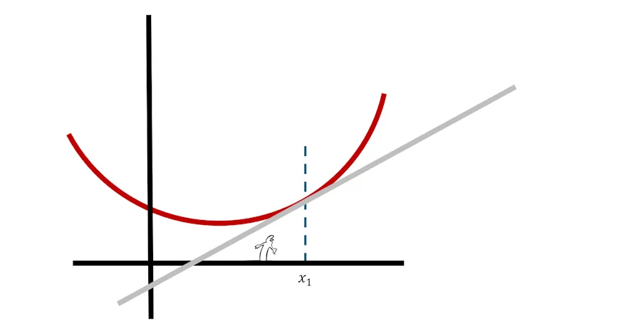

# Angle, tangente et dérivée

## Intro
Imagine... On est sur la mer. On a 3 bateaux (rouge, vert et jaune). Au top départ on met les gaz à fond et on part dans 3 directions légèrement différentes. Ce que tu vois là, c'est la vue de dessus.

Bon, maintenant la question à 1 millon de dollars... C'est quoi un angle? Comment on peut comparer des angles, comment on peut dire que tel angle est plus grand que tel autre etc.

## Angle

Dans la figure précédente, "on voit bien" que le bateau jaune s'écarte plus du bateau rouge que le bateau vert. Comment on qualifie cette situation ?

*Heu...Je sais pas. Déjà on pourrait peut être simplifier la situation et ne garder que 2 bateaux. Le rouge et le vert par exemple.*

C'est une bonne idée. Et maintenant on fait quoi ? 

*Je suis pas complètement idiot. J'ai déjà vu des angles entre 2 droites. Donc je propose qu'on prolonge les "écumes" rouge et vertes jusqu'à ce qu'elles se croisent.*

C'est bon comme ça ?

*Ouai... Maintenant, comme tes couleurs me donnent mal au crâne et m'empêchent de réfléchir je the propose de passer en noir et blanc.*

Tes désirs sont des ordres mais bon tu m'as toujours pas répondu...

*Hé oh, 2 minutes. Je procrastine. Ca m'aide... Pendant que tu y es, enlève les pointillés*

*Et mets moi la droite noire à l'horizontal*

Voili, voilà...Mais bon tu en es où concernant ma question?

*Je sais pas, on peut pas mesurer la distance entre les bateaux rouge et vert ? Un peu comme avec le traits rouge ci-dessous*

On pourrait mais ça marche pas. Imgagine que le bateau rouge aille plus vite qu'il ne va actuellement. Au même instant (2 min après le départ par exemple) il serait alors plus loin sur sa direction et donc la distance entre les bateaux serait alors plus grande. Imagine en plus qu'avec ta technique, il faudrait une montre pour mesurer des angles à des temps bien précs. Enfin bref, ça marche pas ton truc.

En plus c'est toi qui m'a fait enlever le couleurs et donc les bateaux. Non, faut trouver autre chose.

*J'ai trouvé. On prend un compas. On l'ouvre et on trace l'arc de cercle entre les 2 droite. Là, en jaune on a une distance le long de l'arc...*

*Maintenant si je fais revenir le troisième bateau, l'arc qui va du premier au troisieme est plus long et zou, l'angle est plus grand.*

Bravo. Un truc quand même... C'est assez pénible de mesure la distance le long d'un arc de cercle. Tiens, voilà une équerre. Tu note que je suis sympa et que je la pose à un endroit bien précis... Alors tu dis quoi à propos des angles ?

*Oui bien sûr dans ce cas là, c'est plus simple, pour comparer les angles il suffit de comparer la longeur H2 à la longeur H1. Comme elle est plus grande, cela veut dire que l'angle est plus grand*

*Oui mais, tu serais pas en train de me prendre pour un teubé? Regarde. Si je déplace l'équerre vers la gauche, H2 est toujours plus grand que H1 mais bon, les valeurs ne sont plus les mêmes. Donc du coup on est pas en train de mesurer des angles. On est juste en train de les comparer.*

Je suis bleuffé. C'est une formidable remarque.

Tiens, laisse moi reprendre la main. Je vais annoté ta figure. Sur l'axe horizontal je fais ressortir les distances d2 et d1 qui correspondent respectivement aux mesures h2 et h1 sur l'équerre.

Accroche toi, ça va être magique. Tu vois le triangle rectangle que je viens de remplir entre l'intersection, d2 et h2? Il est vert. De la même couleur que l'equerre dans sa seconde position.

C'est moins visible pour l'instant mais j'ai rempli en jaune le triangle rectangle qui va de l'intersection à d1 puis h2.

Maintenant j'enlève l'équerre verte. Du coup on voit mieux les triangles rectangles vert et jaune. Le triangle vert recouvre en partie le jaune.

J'enlève l'équerre jaune... Alors, une idée...

*Heu... Non... Si peut être... Y a pas un truc avec les triangles semblables, Thalès ou je sais plus...*

Oui en effet, En fait, les triangles sont dits semblables. Si par exemple on multiplie d2 par 3 alors la hauteur h2 est elle aussi multipliée par 3. Autrement étudier un des triangles, c'est étudier l'autre. C'est cool car ça permet de simplifier notre figure.

Tiens, du coup regarde à quoi ça ressemble.

Au fait, une remarque avant qu'on continue. 

On a posé l'équerre sur la droite horizontale. On aurait pu la poser sur l'autre droite (voir ci-dessous). Cela revient strictement au même. On est bien en train d'étudier le même angle. Tiens, regarde cette figure et persuade toi que les 2 situations sont les identiques.

Allez, on avance.

On va faire un petit point de vocabulaire. 
1. On dit que notre triangle est un **triangle rectangle** car il possède un angle droit là où on avait posé l'équerre jaune. C'est surtout parce que si tu prends 2 de ces triangles et que tu les met tête bêche, tu peux reconstruire un rectangle.
1. Maintenant, tu prends un des deux autres coins du triangle en question. Ci-dessous j'ai pris le coin où il y a l'intersection des écumes.
1. Alors, si tu te place en ce coin et que tu regarde vers l'intérieur du triangle on appelle :
    * **Côté opposé**, celui qui est en face de toi
    * **Côté adjacent**, celui qui est à côté de toi

Du coup, on peut s'amuser à calculer d1/h1... Ah ben non, ça va pas le faire car si les droites s'écartent très très peu, alors h1 va tendre vers 0 et on sait tous que divisier par 0 c'est jamais une bonne idée.

Ok, bon ben on va calculer h1/d1. Là c'est cool parce que même si d1 est nul, alors on peut en prendre un plus grand. De plus, si h1 est petit, ça correspond bien au cas où les droites s'écartent peu l'une de l'autre. C'est bien le cas ou l'angle est faible...

*Heu oui mais... Si h1 est infini... Avec ton rapport de h1/d1 on a une valeur infinie ce qui est débile pour un angle car les angles son limité à 90°... Bravo !*

Tu as tout a fait raison. Le rapport h1/d1 n'est pas la mesure de l'angle.

*Ben c'est quoi alors?*

Le rapport h1/d1 c'est un rapport... Oui, je sais, dit comme ça, ça à l'air débile. Dit autrement, h1/d1 ce n'est rien d'autre qu'un **taux d'accroissement**. Du coup ce terme est important. 

Prenons un exemple. J'ai 2 droites qui s'écartent. Je choisis d1, je mesure h1 et je calcule h1/d1 et je trouve une valeur (1.42 par exemple). J'aurai pu prendre une autre valeur pour d1 : 2 fois plus petite, 10 fois plus grande. Comme on parle des 2 mêmes droites, du coup le ratio a toujours la même valeur (1.42) et du coup h1 aurait été respectivement 2 fois plus petit ou 10 fois plus grand.

## Tangente

**Ce qu'il faut retenir** de tout ce qui précède
 
* le rapport h1/d1 n'est pas la valeur de l'angle
* h1/d1 c'est un taux d'accroissement qui explique comment h1 augmente quand d1 augmente. 
* Par définition $$\frac{h1}{d1}=\frac{\text{Opp}}{\text{Adj}}$$, c'est la **tangente de l'angle**.
* Et du coup, pour trouver la valeur de l'angle, il faut prendre sa calculatrice et chercher la valeur de l'arc dont la tangente vaut 1.42 par exemple. On utilise la touche arctg (ou math.atan(1.42) en python) et on trouve 54.84 degrés (0.95 radians)

## Dérivée

# Conclusion 
[Lien vers un autre site](https://example.com)  

Justo urna, egestas non dolor in, auctor euismod mi. Maecenas rutrum placerat metus, a malesuada sapien dapibus eget. Vivamus porta, enim eget volutpat gravida, lacus dui pellentesque mi, quis aliquam arcu diam eget nibh. Morbi efficitur arcu in interdum porttitor. Maecenas vitae dapibus elit. Sed pulvinar velit sed facilisis pulvinar. Donec aliquet dolor et tortor pharetra, id commodo libero volutpat. Vivamus convallis enim sed pretium porttitor. Ut sed pellentesque ex.

 
