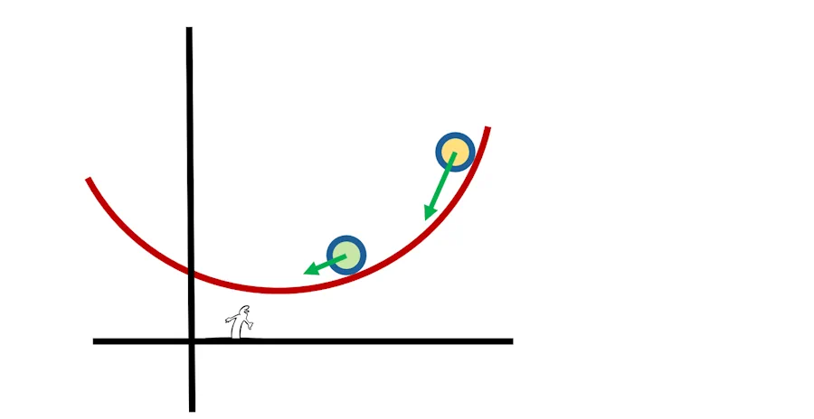

# Angle, tangente et dérivée

## Intro
Imagine... On est sur la mer. On a 3 bateaux (rouge, vert et jaune). Au top départ on met les gaz à fond et on part dans 3 directions légèrement différentes. Ce que tu vois là, c'est la vue de dessus.

Bon, maintenant la question à 1 millon de dollars... C'est quoi un angle? Comment on peut comparer des angles, comment on peut dire que tel angle est plus grand que tel autre, que tel bateau s'écarte plus vite de tel autre etc.

## Angle

Dans la figure précédente, "on voit bien" que le bateau jaune s'écarte plus du bateau rouge que le bateau vert. Comment on qualifie cette situation ?

*Heu...Je sais pas. Déjà on pourrait peut être simplifier la situation et ne garder que 2 bateaux. Le rouge et le vert par exemple.*

C'est une bonne idée. Et maintenant on fait quoi ? 

*Je suis pas complètement idiot. J'ai déjà vu des angles entre 2 droites. Donc je propose qu'on prolonge les "écumes" rouge et vertes jusqu'à ce qu'elles se croisent.*

C'est bon comme ça ?

*Ouai... Maintenant, comme tes couleurs me donnent mal au crâne et m'empêchent de réfléchir je t(e propose de passer en noir et blanc.*

Tes désirs sont des ordres mais bon tu m'as toujours pas répondu...

*Hé oh, 2 minutes. Je procrastine. Ça m'aide... Pendant que tu y es, enlève les pointillés*

*Et mets moi la droite noire à l'horizontal*

Voili, voilà...Mais bon tu en es où concernant ma question?

*Je sais pas, on peut pas mesurer la distance entre les bateaux rouge et vert ? Un peu comme avec le traits rouge ci-dessous*

On pourrait... Mais ça ne marche pas. Imagine que le bateau rouge aille plus vite qu'il ne va actuellement. Au même instant (2 min après le départ par exemple) il serait alors plus loin sur sa direction. Compte tenu de ce que tu viens de dire, si la distance entre les bateaux est plus grande cela veut dire que l'angle est plus grand. Mais on a rien changé. Donc l'angle doit être identique.

Imagine en plus qu'avec ta technique, il faudrait une montre pour mesurer des angles à des temps bien précs. Enfin bref, ça marche pas ton truc.

En plus c'est toi qui m'a fait enlever le couleurs et donc les bateaux. Non, faut trouver autre chose. Rappelle toi, on veut l'angle entre les droites...

*J'ai trouvé. On prend un compas. On l'ouvre et on trace l'arc de cercle entre les 2 droites. Là, en jaune on a une distance le long de l'arc...*

*Maintenant si je fais revenir le troisième bateau, l'arc qui va du premier au troisieme est plus long et zou, l'angle est plus grand.*

Bravo. Un truc quand même... C'est assez pénible de mesurer la distance le long d'un arc de cercle. Tiens, voilà une équerre. Tu note que je suis sympa et que je la pose à un endroit bien précis... Alors tu dis quoi à propos des angles ?

*Oui bien sûr dans ce cas là, c'est plus simple. Pour comparer les angles il suffit de comparer la longeur H2 à la longeur H1. Comme elle est plus grande, cela veut dire que l'angle est plus grand.*

*Oui mais, tu serais pas en train de me prendre pour un teubé? Regarde. Si je déplace l'équerre vers la gauche, H2 est toujours plus grand que H1 mais bon, les valeurs ne sont plus les mêmes. Donc du coup on est pas en train de mesurer des angles. On est juste en train de les comparer.*

Je suis bleuffé. C'est une formidable remarque.

Tiens, laisse moi reprendre la main. Je vais annoter ta figure. Sur l'axe horizontal je fais ressortir les distances d2 et d1 qui correspondent respectivement aux mesures h2 et h1 sur l'équerre.

Accroche toi, ça va être magique. Tu vois le triangle rectangle que je viens de remplir entre l'intersection, d2 et h2? Il est vert. De la même couleur que l'equerre dans sa seconde position.

C'est moins visible pour l'instant mais j'ai rempli en jaune le triangle rectangle qui va de l'intersection à d1 puis h1.

Maintenant j'enlève l'équerre verte. Du coup on voit mieux les triangles rectangles vert et jaune. Le triangle vert recouvre en partie le jaune.

J'enlève l'équerre jaune... Alors, une idée...

*Heu... Non... Si peut être... Y a pas un truc avec les triangles semblables, Thalès ou je sais plus...*

Oui en effet, En fait, les triangles sont dits semblables. Si par exemple on multiplie d2 par 3 alors la hauteur h2 est, elle aussi, multipliée par 3. Autrement dit étudier un des triangles, c'est étudier l'autre. C'est cool car ça permet de simplifier notre figure.

Tiens, du coup regarde à quoi ça ressemble.

Au fait, une remarque avant qu'on continue. 

On a posé l'équerre sur la droite horizontale. On aurait pu la poser sur l'autre droite (voir ci-dessous). Cela revient strictement au même. On est bien en train d'étudier le même ecart entre les mêmes droites. 

Tiens, regarde cette figure et persuade toi que les 2 situations sont les identiques. Allez, on avance...

On avance mais bon, on va faire un petit point de vocabulaire. 
1. On dit que notre triangle est un **triangle rectangle** car il possède un angle droit là où on avait posé l'équerre jaune. C'est surtout parce que si tu prends 2 de ces triangles et que tu les met tête-bêche, tu peux reconstruire un rectangle.
1. Si tu te place sur un des deux autres coins du triangle en question et que tu regarde vers l'intérieur du triangle on appelle :
    * **Côté opposé**, celui qui est en face de toi 
    * **Côté adjacent**, celui qui est à côté de toi 

Du coup, on peut s'amuser à calculer d1/h1... Ah ben non... Ça va pas le faire car si les droites s'écartent très très peu, alors h1 va tendre vers 0 et on sait tous que divisier par 0 c'est jamais une bonne idée.

Ok, bon ben on va calculer h1/d1. Là c'est cool parce que même si d1 est nul, alors on peut en prendre un autre un peu plus grand. De plus, si h1 est petit, ça correspond bien au cas où les droites s'écartent peu l'une de l'autre. C'est bien le cas ou l'angle est faible...

*Heu oui mais... Si h1 est infini... Avec ton rapport de h1/d1 on a une valeur infinie ce qui est débile pour l'angle de la figure car il est limité à 90°... Ah bah bravo !*

Tu as tout à fait raison. Le rapport h1/d1 **n'est pas** la mesure de l'angle.

*Ben c'est quoi alors?*

Le rapport h1/d1 c'est un rapport... Oui, je sais, dit comme ça, ça à l'air débile. Dit autrement, h1/d1 ce n'est rien d'autre qu'un **taux d'accroissement**. Du coup ce terme est important. 

Prenons un exemple. J'ai 2 droites qui s'écartent. Je choisis d1, je mesure h1 et je calcule h1/d1 et je trouve une valeur (1.42 par exemple). J'aurai pu prendre une autre valeur pour d1 : 2 fois plus petite, 10 fois plus grande. Comme on parle des 2 mêmes droites, du coup le ratio a toujours la même valeur (1.42) et du coup h1 aurait été respectivement 2 fois plus petit ou 10 fois plus grand.

## Tangente

**Ce qu'il faut retenir** de tout ce qui précède
 
* Le rapport h1/d1 **n'est pas** la valeur de l'angle
* h1/d1 c'est un taux d'accroissement qui explique comment h1 augmente quand d1 augmente. 
* Par définition $$\frac{h1}{d1}=\frac{\text{Opp}}{\text{Adj}}$$, c'est la **tangente de l'angle**.
* Et du coup, pour trouver la valeur de l'angle (en radians ou en degrés), il faut prendre sa calculatrice et chercher la valeur de l'arc dont la tangente vaut 1.42. On utilise la touche arctg (ou math.atan(1.42) en python) et on trouve 54.84 degrés (0.95 radians)

## Dérivée d'une fonction

Commence pas à râler... Tu vas voir, c'est exactement la même chose. 

Imagine... Imagine une belle courbe sympa que tu trace sur une feuille d'un seul coup de crayon. Tiens, voilà un exemple :

Ce que l'on peut observer c'est qu'à gauche, la courbe "descend". Ses valeurs sont de plus en plus petites alors que je me déplace de la gauche vers la droite sur l'axe des x. 

Fais le test (je peux pas le faire à ta place). Mets ton index sur l'abcisse -2. Tu lis quelle valeur? Maintenant mets ton index sur l'abscisse -1. Tu lis quelle valeurs? Tu vois bien avec la courbe précédente, elle descend (elle décroit) quand je me toruve à gauche dans la figure.

De même la courbe "monte" (croît) quand je me trouve à droite dans la figure. 

La question à 1 million de dollars, c'est : comment on pourrait qualifier (donner un qualificatif, croissante, décroissante) à la courbe? Et puis si on est dans la partie droite de la figure, comment on pourrait mesurer le fait que la courbe "monte" doucement ou qu'elle monte "rapidement" ?

Vas-y, à toi de jouer, "the floor is yours"... 

*Aucune idée. Je vois bien que si je met une bille à gauche ou à droite elle va glisser vers le bas de la cuvette. À part ça... Je vois pas trop.*

Ok, on va garder ton idée. Imagine une bille qui est sur la droite et qui descend. Comment tu indiquerai sa vitesse ?

*Ben avec un vecteur. Je suis pas débile non plus. Un vecteur attaché à la bille, dirigé vers le bas et plus ou moins long en fonction de la vélocité de la bille*

*Pour la bille verte la vitesse est moindre (flêche plus courte) que pour la bille jaune*

Outre leurs longueurs qui changent, tu ne remarques pas truc concernant les vecteurs vitesse? Concentre toi sur les directions?

*Si, si j'ai bien vu. Les directions des vecteurs vitesses changent. Par contre, si j'arrive à le dessiner, j'arrive pas trop à l'exprimer.*

Je vais t'aider. Imagine des équerres comme celles de tout à l'heure. Elles glissent le long de la courbe et leur côté vertical passe par le centre de chaque bille. Prolonge ensuite la base de chaque equerre.

Ce que tu viens de tracer, c'est la direction de la vitesse. Si j'enlève les équerres voilà à quoi ça ressemble.

Du coup je peux enlever tes billes. Et là tu me dis...

*Je te dis que pour qualifier le comportement de la courbe (elle monte doucement, elle monte rapidement) faut une equerre, la faire glisser au point qu'on veut étudier sur la courbe et tracer la droite qui passe par le base. Elle a l'air bien pourri ta méthode...*

*Heu... Non, non, non. En y regardant de plus près, en fait faut juste retrouver l'angle que font les droites vertes avec l'horizontale. Plus l'angle est grand et plus la courbe monte vite... Je suis trop malin...*

Oui c'est ça. Aller, je vais reprendre la main. Prenons une abcisse particulière sur l'axe des x (x1 ci-dessous). À partir de là, on trace une verticale et on croise la courbe rouge.

Imagine qu'on pose une équerre sur la courbe. On trace en gris la droite portée par la base de l'équerre. 

Du coup si je reprends les notations de tout à l'heure, je retrouve notre triangle jaune, la distance d1 et la hauteur h1. 

En fait d1 c'est une variation (un delta) de la variable x. Je vais donc l'appeler $$\Delta x$$ et h1 c'est une variation de y que je vais appeler $$\Delta y$$.

Mais là, on a un petit problème. Sur le figure, la variation de x est tellement grande qu'on va pas être capable d'évaluer la valeur de $$\Delta y$$.

On va donc refaire la même chose mais avec une toute petite variation de la variable x. Rigole pas il a fallu plus de 100 ans pour les scientifiques acceptent de faire ce changement d'échelle et de raisonner avec. 

Du coup, ci-dessous, on retrouve notre courbe en rouge. On retrouve aussi une abcisse x. La droite verticale pointillée qui passe par x, coupe alors la courbe à la hauteur y qui vaut f(x). 

Maintenant on va ajouter à x une toute petite valeur dx. Note que la variation de x est tellement petite qu'on dit plus Delta x mais dx avec un d minuscule.

Si la valeur de l'abcisees passe de x à x+dx, quelle est alors la valeur de la fonction? 

*Ben vas-y... Trop facile, c'est f de x plus dx (f(x+dx) pour les intimes)*

Et pour le retrouver on fait comment? 

*On fait passer par l'abcisse (x+dx) une droite verticale qui va couper la courbe rouge à une certaine hauteur. Cette hauteur c'est précisément f(x+dx).*

{: .warning }
Faut vraiment que la dernière phrase ai du sens pour toi. Si c'est pas clair, met ton index sur l'écran. Mets le en x. Déplace un peu ton index à droite. Pour cette position, quelle est la valeur de f()? 

Bon allez, on va chercher notre pote le triangle jaune et on redessine tout ça.

Ce qui est très important à comprendre c'est que dx est tellement petit (infiniment petit) qu'on va pouvoir dire que "tout se passe comme si" (mais ce n'est **PAS** vrai) que la droite grise est portée par le grand côté de notre triangle mais... Ce n'est **PAS** vrai. C'est une approximation.

Par contre, ce qui est trop cool, c'est que dans ces conditions, on va pouvoir calculer le taux d'accroissement (h1/d1) dont on avait parlé précedement et être capable de dire si la courbe monte doucement (ratio faible) ou si elle monte rapidement (ratio élevé)

Prenons un exemple et faisons les calculs pour fixer les idées.

On vient donc de calculer le taux d'accroissement et on a dit qu'il valait 2x + dx. Mais le truc c'est que si dx est infiniment petit, cela veut dire que le taux d'accroissement est très proche de 2x. Par exemple le taux d'accroissement vaut 2 si x vaut 1 et il vaut 10 si x vaut 5. On quantifie bien le fait que la courbe grimpe plus vite quand x vaut 5 que lorsque x vaut 1. On peut même affirmer que son taux d'accroissement est 5 fois plus grand (car 10 c'est 2 fois 5).

Crois le ou non mais par défintion le 2x qu'on vient de calculer c'est la dérivée de f quand cette dernière vaut x².

# Résumé 
1. On est parti des angles
1. Triangles rectangles semblables
1. Coté opposé à l'angle
1. Coté opposé sur côté adjacent, taux d'accroissemt
1. Tangente
1. Pour retrouver la valeur de l'angle on utilise "l'arc dont la tangente vaut 1.42"
1. La tangente à une courbe c'est la droite qui fait un angle avec l'horizontale dont la tangente vaut f(x+dx)-f(x)/dx
1. Petit triangle sous la courbe
1. La dérivée d'une fonction, c'est son taux d'accroissement
1. [VIDEOS](https://www.youtube.com/c/frbaucop) : avec des exemples de calcul de dérivées 

 
