# Simple OS

## Les épisodes de la série

* [Episode 0]() 
* [Episode 1]()
* [Episode 2]()
* [Episode 3]()

## Introduction

<div align="center">

</div>

En 2004, rappelez-vous, c'était l'année des Black Eyed Peas, de la sortie du film le prisonnier d'Azkaban, de l'atterrissage de Opportunity sur Mars... Le noyau Linux était en 2.6 et Chirac était président... Toute une époque... En plus, en juin de cette année-là, avec le numéro 62 de GNU Linux Magazine France, a débuté une série d'articles dont l'objectif était d'expliquer comment on pouvait écrire son propre système d'exploitation (SOS comme [Simple OS](http://sos.enix.org/fr/SOSDownload)). Je ne sais pas pourquoi, mais il y a des articles et des sujets qui vous restent dans la tête...

<div align="center">
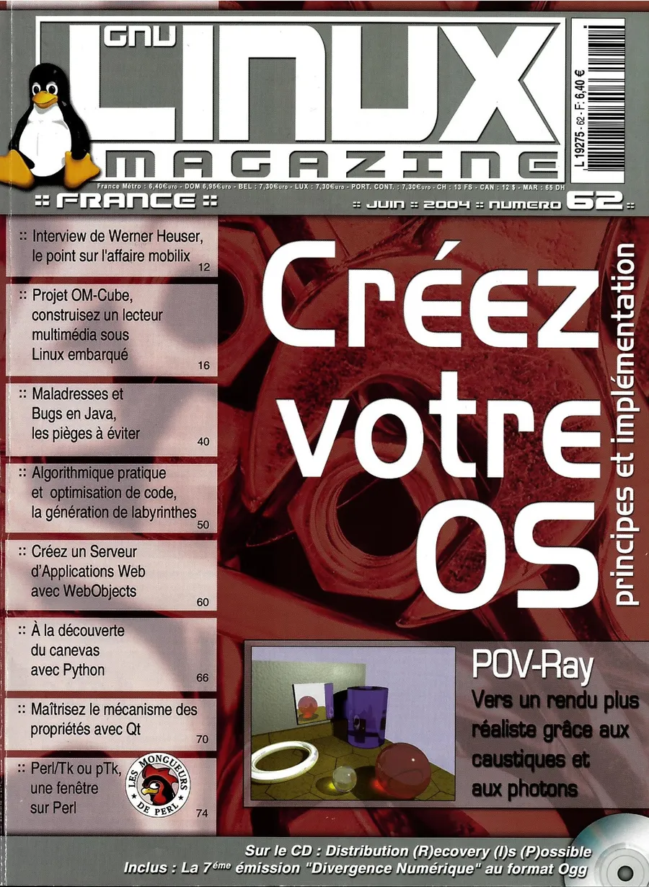
</div>


Par exemple, à la fin du premier épisode de la série (je pense qu'on peut même parler de saga...) on était capable de faire booter SOS et on avait déjà un affichage à l'écran.

<div align="center">

</div>


Sans divulguer la fin de l'histoire (mais oui, oui, ils vont se marier et avoir beaucoup d'enfants), la série s'est déployée sur 13 articles de juin 2004 à octobre 2007. Sauf erreur de ma part, rien n'a été publié par la suite (c'est dommage, j'attendais avec impatience l'implémentation de la stack réseau).

Heu... Non, non je ne suis pas nostalgique. Je n'aime pas particulièrement les voitures anciennes, je préfère bien mieux [ma récente RSV4](https://www.40tude.fr/category/rsv4-sur-circuit/) à une vieille [RG 500 Gama](https://www.motoplanete.com/suzuki/3154/RG-500-GAMMA-1985/contact.html). Cela dit, je trouve que pour ceux qui veulent comprendre ce qui se passe au démarrage d'un PC et/ou ce qui se cache dans un operating system, cette série reste d'actualité et peut être une excellente base de départ.

### Quelles sont les caractéristiques de SOS ?

* 32 bits, mode protégé
* Pas préemptif, monolithique
* Chargement par Grub 1 et multiboot 1
* Pagination mémoire
* Pas de swap
* Gestion des IT
* Clavier, écran, driver disque dur
* Partitions, Virtual File System
* Pas d'interface réseau
* Processus, threads, pas de DLL
* On part de 0 et tout est fait "maison"

Si à ce stade, il y a des caractéristiques qui te passent au-dessus de la tête, ce n'est pas très grave. Dis-toi que pour un OS "maison" c'est déjà vraiment bien et que cela va te permettre d'aborder beaucoup de sujets qui t'aideront à mieux comprendre les OS d'aujourd'hui.

Sinon... Le site de référence est [sur cette page](http://sos.enix.org/fr/SOSDownload#TOC_0_2_1). On y trouve les PDF et les codes des différents articles. Attention, pour l'épisode 10, le source est bien sur la page précédente mais pas l'article. On peut toutefois retrouver ce dernier sur [cette page](https://www.abandonware-magazines.org/affiche_mag.php?mag=303&page=8) (il faut alors prendre le N°98 d'octobre). Ce ne sera pas un beau PDF mais plutôt une suite d'images. J'ai essayé de retrouver les numéros sur le site de [Linux Mag](https://connect.ed-diamond.com/gnu-linux-magazine) mais sans succès.

## L'objectif de ce billet

Faire redémarrer SOS en utilisant des moyens contemporains.

* Docker
* Grub 2 et multiboot 2
* Git
* QEMU (dernière version)
* NASM (au lieu de GAS dans les articles de l'époque)
* VSCode
* Eviter de tout casser et de tout réécrire. Rester respectueux et humble devant ce qui a été écrit.
* Être indépendant de l'OS qu'utilise le lecteur

Là aussi, si certains sujets ne sont pas encore très clairs, pas d'angoisse on aura l'occasion de revenir dessus. Oui, bien sûr, beaucoup de choses ont évolué : 64 bits partout, UEFI, NVMe, Git a vu le jour, plus de lecteur de disquette dans les PC, plus de CD dans les magazines etc. N'empêche, tout ce qui est dit dans les articles, tout ce qui y est expliqué reste valable en grande partie encore aujourd'hui. Cerise sur le gâteau pour certains, tout est en français (j'ai pensé écrire ce billet en anglais mais ce n'était pas raccord avec les articles alors, j'ai laissé tomber l'idée).

### Note

Si tu veux avoir une idée de ce qu'il faut faire en 2023 pour faire tourner SOS dans une configuration similaire à celle de l'époque, tu peux [lire ce billet](https://www.40tude.fr/sos-2-le-retour-20-ans-apres/). Good luck, ce sera sans moi. 😊

## Qu'est-ce qui tourne aujourd'hui ?

Cet après-midi (18 nov. 2023) j'ai réussi à mettre en route le code de l'épisode 1. Voilà par exemple ce que j'étais capable d'afficher lors du boot.

<div align="center">
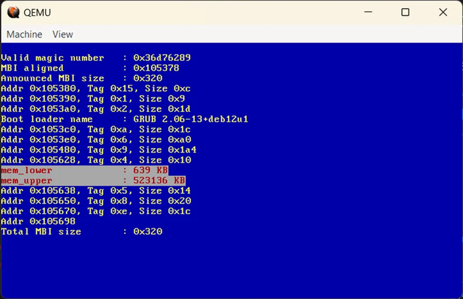
</div>


Théoriquement et sauf grosse mauvaise surprise le plus gros du travail est fait.

* Les différents outils sont en place (arborescence des fichiers, compilateur, linker, Makefile...)
* Les codes qui devaient être adaptés sont, eux aussi, en place
* À mon avis, on n'est pas trop mal. Je m'attends à ce que dans les autres articles il y ait principalement du code C auquel on n'aura pas besoin de trop toucher. Oui, c'est sûr, il y aura bien une petite louche d'assembleur ici ou là, mais ça devrait bien se passer. J'y crois.

## C'est quoi la suite ?

Déjà, je vais préciser le vocabulaire. À partir de maintenant j'appelle **SOS**, le système d'exploitation "canal historique", le vrai, celui dont il est question dans les articles. Ensuite, j'appelle **SOS2** (sans espace) la version de SOS qu'on va adapter à nos besoins.

Ok mais la suite c'est quoi ? Je vais repartir d'une page blanche, refaire toutes les étapes et tout mettre par écrit au fur et à mesure. Pendant ce temps-là, je te propose de :

* [Récupérer l'article 1](http://sos.enix.org/fr/SOSDownload#TOC_0_2_25) et de l'imprimer (pas la peine de râler, 66% du papier est recyclé)
* Le lire de manière "active" en prenant des notes, beaucoup de notes, dans les marges
* De ne pas passer trop de temps sur la section 4.2.3 qui traite du boot avec le secteur de boot d'une diskette. C'est instructif mais nous on ne va pas faire ça. En effet, SOS2 sera chargé en mémoire par Grub 2 (voir la section 4.2.2 de l'article).
* Suite à la lecture de l'article (pas de soucis si tu dois le lire 2 ou 3 fois, c'est dense, très dense), n'hésite pas à aller faire le plein d'informations complémentaires sur le web. En effet, je ne vais ni reprendre ni revenir le contenu des articles. Ce n'est pas l'objet de ce billet. Rappelle-toi Barbara, moi ce que je veux, c'est que le code "historique" puisse tourner à nouveau.

Je pense que ce billet va être le plus long de la série car c'est ici qu'on va mettre la "toolchain" en place, faire les adaptations pour le support de Grub 2 et de multiboot 2. On va aussi modifier le makefile, traduire et adapter des fichiers assembleur etc. Quand ce travail préliminaire indispensable sera terminé et que tout sera en place j'espère qu'on pourra facilement transposer les autres épisodes. On verra, on n'y est pas encore.

## 1 - Installation des outils

Je suis sous [Windows 11 (23H2)](https://www.40tude.fr/finalize-windows-11-installation-2/) mais c'est exactement la même chose si tu es sous Linux (j'ai un [host mint 21.2](https://github.com/40tude/mint_config_latitude))

### WIN11

#### Installer Docker

Soit, tu vas sur [le site de Docker](https://www.docker.com/products/docker-desktop/), soit, si tu as installé l'excellent [choco](https://chocolatey.org/). Dans ce cas tu saisis les 2 lignes ci-dessous dans un terminal PowerShell en **mode Administrateur** (WIN+X puis A). À propos de choco tu peux [aller sur cette page](https://www.40tude.fr/how-to-install-windows-11-with-a-usb-key/) et y rechercher le mot "choco". La procédure d'installation y est expliquée. Pour le reste Docker doit demander que l'on s'enregistre à un moment ou à un autre.

```powershell
choco install docker-desktop -y
Update-SessionEnvironment
```

Je crois qu'après l'installation de Docker il faut redémarrer. Je ne suis plus sûr. Si c'est le cas, attends d'avoir installé QEMU et VSCode.

#### Installer QEMU

Tu peux aller [sur cette page](https://www.qemu.org/download/) ou taper la ligne ci-dessous dans le terminal Admin déjà ouvert :

```powershell
choco install qemu -y
```
#### Installation de VSCode

Pareil. Pilule bleue ou pilule rouge. Soit, tu vas sur [la page de VSCode](https://code.visualstudio.com/download) soit tu tape cette ligne :

```powershell
choco install vscode -y
```

Ensuite

* Redémarre si besoin
* Quand c'est fait, assure-toi que tu arrives à lancer les 3 outils.
  + Dans une console normale (WIN+X puis I)
  + Tape : `code .`
  + Fermes ensuite la fenêtre VSCode
  + Tape : `qemu-system-i386`
  + Ferme la fenêtre de l'émulateur qui pleure car il ne trouve pas d'OS à faire démarrer
  + Tape : `docker --help`
  + S'il pleut ou si tu n'as pas d'amis lis ce qui est écrit, sinon passe à la suite...

### LINUX

#### Installer Docker

```bash
sudo apt install docker docker-compose docker-doc docker-registry docker.io -y
sudo usermod -aG docker $USER
```
#### Installer QEMU

```bash
 sudo apt install qemu-system -y
```
#### Installation de VSCode

```bash
sudo apt install dirmngr ca-certificates software-properties-common apt-transport-https -y
curl -fSsL https://packages.microsoft.com/keys/microsoft.asc | sudo gpg --dearmor | sudo tee /usr/share/keyrings/vscode.gpg > /dev/null
echo deb [arch=amd64 signed-by=/usr/share/keyrings/vscode.gpg] https://packages.microsoft.com/repos/vscode stable main | sudo tee /etc/apt/sources.list.d/vscode.list
sudo apt update
sudo apt install code -y
```

Ensuite

* Redémarre si besoin
* Quand c'est fait, assure-toi que tu arrives à lancer les 3 outils.
  + Dans une console
  + Tape : `code .`
  + Fermes ensuite la fenêtre VSCode
  + Tape : `qemu-system-i386`
  + Ferme alors la fenêtre de l'émulateur qui pleure car il ne trouve pas d'OS à faire démarrer
  + Tape : `docker --help`
  + S'il pleut ou si tu n'as pas d'amis lis ce qui est écrit, sinon passe à la suite...

## 2 - Création des répertoires du projet

### Comment ça va se passer ?

* T'inquiète paupiette, ça va bien se passer...
* Comme il y a peu ou pas d'intérêt à mettre par écrit toutes les instructions à suivre, on va utiliser un script.
* Ce dernier va :
  + Créer un sous-répertoire `sos2`
  + Aller chercher le code de SOS de l'article 1 et le mettre dans un sous-répertoire `download`
  + Créer les différents sous-répertoires dont on aura besoin plus tard
  + Copier, depuis le sous-répertoire `download` les sources qu'on va utiliser pour créer SOS2
  + Créer un fichier `.gitignore` (utile si tu as git sur ta machine)

À l'issue du script on sera placé dans le sous-répertoire `sos2` et on pourra vraiment commencer.

### WIN11

Déplace-toi dans le répertoire dans lequel tu veux créer le sous-répertoire `sos2` qui contiendra le projet SOS2
* Exemple : `C:\Users\phili\OneDrive\Documents\Tmp`

Copie colle le code ci-dessous dans un script `sos2.ps1` dans le répertoire en question
* Exemple : `C:\Users\phili\OneDrive\Documents\Tmp\sos2.ps1`

```powershell
New-Item sos2 -ItemType Directory
Set-Location sos2
New-Item download -ItemType Directory
Invoke-WebRequest -URI http://sos.enix.org/wiki-fr/upload/SOSDownload/sos-code-art1.tgz -OutFile ./download/sos-code-art1.tgz

tar -xvzf ./download/sos-code-art1.tgz -C ./download

New-Item build -ItemType Directory
New-Item buildenv -ItemType Directory
New-Item target/iso/boot/grub -ItemType Directory

Copy-Item ./download/sos-code-article1/bootstrap ./bootstrap -Recurse
Copy-Item ./download/sos-code-article1/drivers ./drivers -Recurse
Copy-Item ./download/sos-code-article1/hwcore ./hwcore -Recurse
Copy-Item ./download/sos-code-article1/sos ./sos -Recurse

"dist/
build/" | Out-File -FilePath ./.gitignore.txt -Encoding ascii
```

Note les précautions que prend le script avec le type d'encodage du fichier `.gitignore`. Git semble en effet incapable de gérer correctement un fichier `.gitignore` encodé en UTF. Il faut donc générer ce dernier en ASCII basique. J'en parle car il m'a fallu pas mal de temps avant de réaliser ce qui se passait.

Voilà ce que cela peut donner dans un terminal avant qu'on appelle le script

<div align="center">
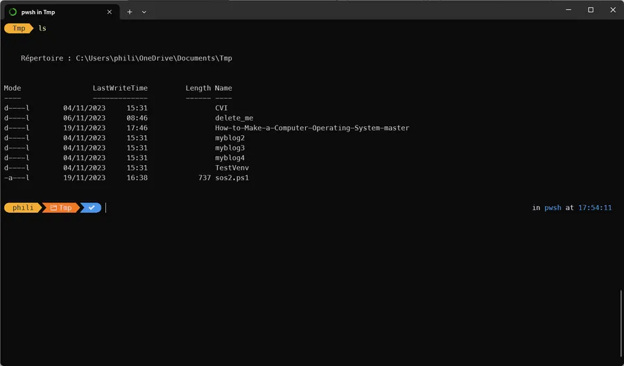
</div>


Lance le script `sos2.ps1`

À la fin, on se retrouve dans le répertoire `sos2` qui est organisé de la façon suivante

<div align="center">
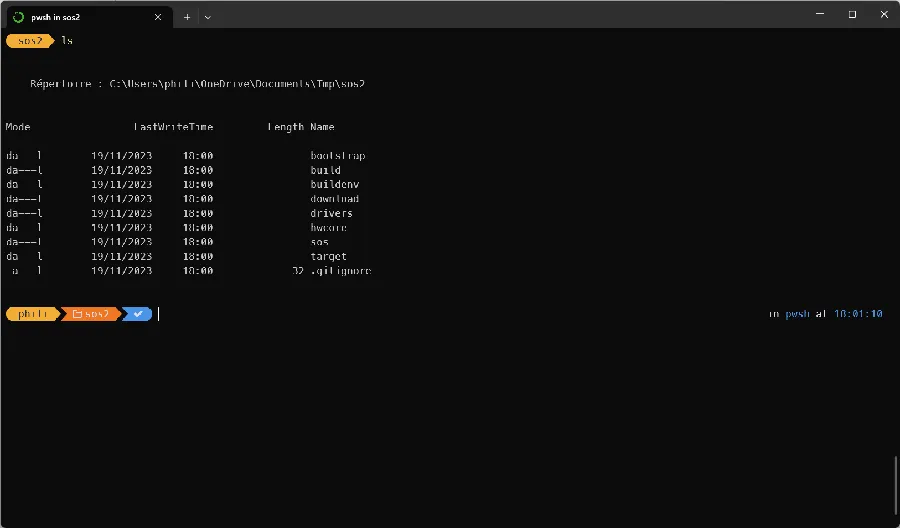
</div>


Si jamais PowerShell râle pour des raisons de sécurité...
* Ouvrir un terminal en mode **Administrateur** et saisir la commande ci-dessous qui autorise l'exécution des scripts créés localement mais qui demande que les scripts qui viennent de l'extérieur soient signés.

```powershell
Set-ExecutionPolicy -ExecutionPolicy RemoteSigned
```
### LINUX

Déplace-toi dans le répertoire dans lequel tu veux créer le sous-répertoire `sos2` qui contiendra le projet SOS2
* Exemple : `/home/philippe/temp`

Copie colle le code ci-dessous dans un script `sos2.sh` dans le répertoire en question
* Exemple : `/home/philippe/temp/sos2.sh`

Rends le script exécutable
* `chmod u+x ./sos2.sh`

```bash
#!/usr/bin/env bash

mkdir ./sos2
cd ./sos2

mkdir ./download
wget -P ./download http://sos.enix.org/wiki-fr/upload/SOSDownload/sos-code-art1.tgz
tar -xvzf ./download/sos-code-art1.tgz -C ./download

mkdir ./build
mkdir ./buildenv
mkdir -p ./target/iso/boot/grub

cp -r ./download/sos-code-article1/bootstrap ./bootstrap
cp -r ./download/sos-code-article1/drivers ./drivers
cp -r ./download/sos-code-article1/hwcore ./hwcore
cp -r ./download/sos-code-article1/sos ./sos

echo "dist/
build/" > .gitignore

```

Etat du répertoire avant d'avoir lancé le script

<div align="center">
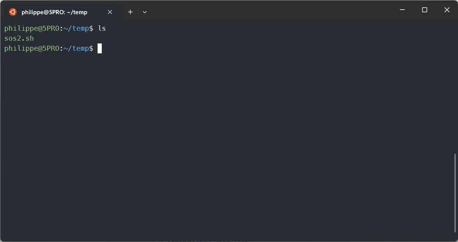
</div>


Lance le script `sos2.sh` (n'oublie pas le point devant le nom du script, je l'oublie toujours...)

```
. sos2.sh
```

À la fin, on se retrouve dans le répertoire `sos2` qui est organisé de la façon suivante

<div align="center">
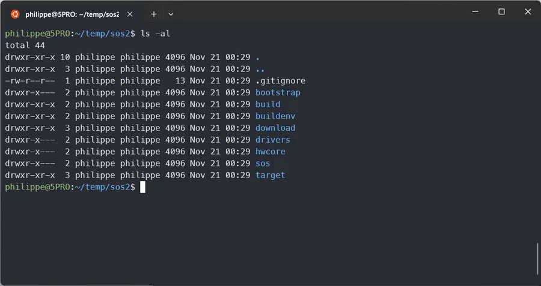
</div>

### Organisation des répertoires de travail

Je ne reviens pas sur les répertoires de SOS (`./bootstrap`, `./drivers`, `./hwcore` et `./sos`)

* `./build` : va contenir les fichiers compilés (.o). Ça évite d'avoir des fichiers .o qui "trainent" dans les répertoires `./bootstrap`, `./sos` etc. On verra par la suite si au lieu de tout mettre "à plat" dans `./build` on ne créé pas des sous répertoires du style `./build/sos`, `./build/drivers` etc.

* `./buildenv` : c'est dans ce répertoire qu'on va écrire le fichier en charge de créer l'environnement dans lequel on va compiler, linker puis graver sur CD virtuel SOS2. On en parle dans 2 minutes. C'est par lui qu'on va commencer.

* `./download` : on en a déjà parlé brièvement. C'est là qu'on met une copie des sources de SOS de l'épisode en question. Ici le 1 par exemple.

* `./target` : un répertoire dont va avoir besoin `[grub-mkrescue](https://www.gnu.org/software/grub/manual/grub/html_node/Invoking-grub_002dmkrescue.html)` afin de créer l'image .iso de SOS2. On en reparle au moment de la rédaction du `Makefile`.

## 3 - Modifications des fichiers du projet

Bon, à partir de là, que tu sois sur un host Windows ou Linux la façon de procéder va être identique. C'est tant mieux car cela va simplifier la rédaction du billet. Allez, on ne perd pas de temps et on lance VSCode depuis un terminal :

```powershell
code .
```
<div align="center">
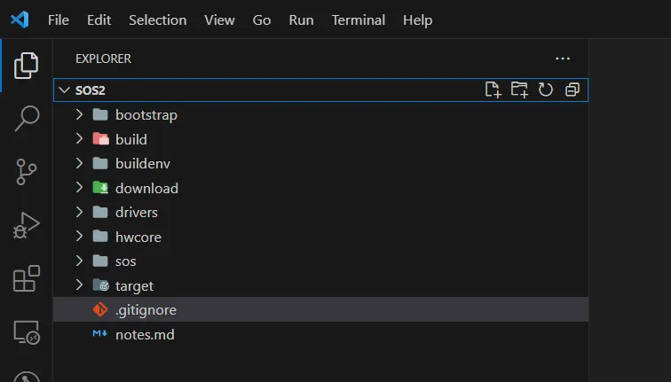
</div>

### Création du buildenv

Dans le répertoire `buildenv`

On va créer un fichier `Dockerfile` dans lequel on va copier les lignes ci-dessous

```bash
FROM gcc
RUN apt-get update
RUN apt-get upgrade -y

RUN apt-get install -y nasm
RUN apt-get install -y xorriso
RUN apt-get install -y grub-pc-bin
RUN apt-get install -y grub-common

VOLUME /root/env
WORKDIR /root/env
```

On sauve, on ouvre un terminal dans VSCode

Pas d'embrouille... Assure toi que dans le terminal tu es bien dans le répertoire `sos2`

Saisir alors la commande

```bash
docker build buildenv -t sos2-buildenv
```

Voilà ce que je vois :

<div align="center">
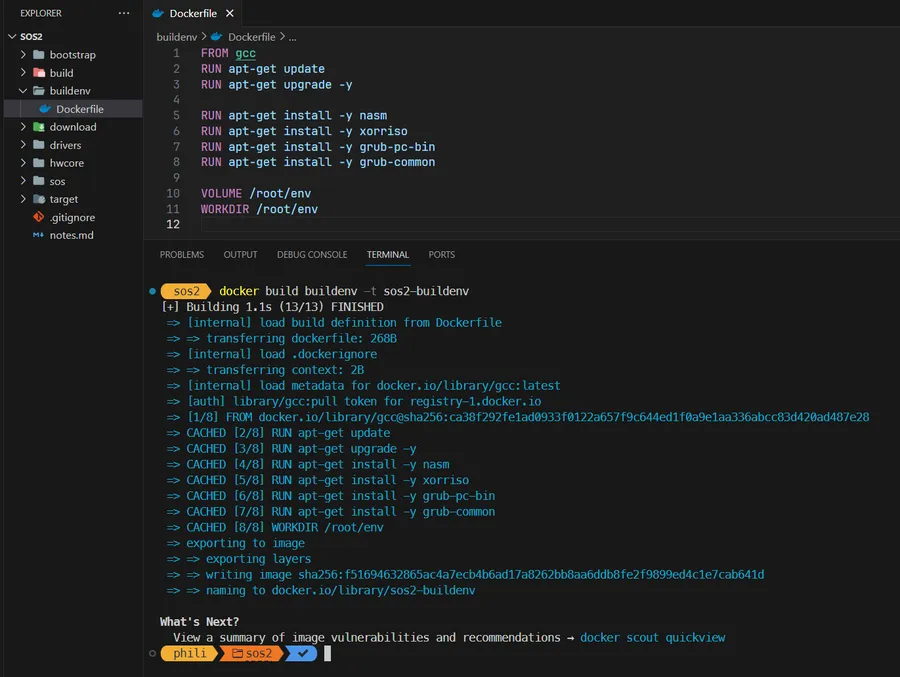
</div>

#### Séquence explications :

Docker permet de faire tourner des **images** qui, comme les vraies photos sont des instantanés. Autrement dit, dans le monde Docker, une image c'est un groupe de logiciels qu'on a mis ensemble. Un peu comme les invités sur une photo de mariage. Ceci dit, la configuration est figée. Les invités auront toujours le même âge sur la photo de même que les logiciels auront toujours les mêmes versions dans l'image Docker.

Ce qui est vraiment cool avec Docker et qu'on ne peut pas faire avec une photo, c'est qu'on peut prendre l'image et la faire "tourner", la faire "rouler" au sein d'un OS (Linux bien souvent). Quand on a une image qui tourne, on appelle ça un **container**. On doit sans doute dire conteneur en FR mais je vais continuer à écrire container.

L'exemple classique c'est celui d'un développeur qui utilise 12 000 bibliothèques pour son développement et une configuration bien pourrie que personne n'arrive à reproduire. Si la config n'est disponible que sur le disque dur du développeur c'est mort. Personne ne peut mettre en route l'application car personne ne sait comment installer tout ce qui est nécessaire (dans quel ordre, quelles versions, où...). Cependant si l'application et les bibliothèques sont dans une image Docker, bingo ! Passe-moi l'image, je peux la mettre en route dans un container sur mon PC et zou je peux tester l'application, donner du feedback etc.

Donc, en français dans le texte, dans le projet SOS2, on utilise Docker pour créer une image. Cette image s'apppuie elle-même sur une configuration Linux équipée du compilateur gcc (voir la ligne 1 du Dockerfile). Ensuite on rajoute sur cette image préexistante, deux ou trois trucs dont on a besoin (nasm, grub...) et zou on est prêt. Pour les curieux qui se demandent d'où provient l'image gcc sur laquelle on s'appuie je vous propose d'aller faire un tour sur le site [Docker Hub](https://hub.docker.com/_/gcc) (je crois que là aussi faut s'enregistrer).

La ligne de commande qu'on saisit ensuite demande à Docker de construire l'image qui s'appellera `sos2-buildenv`.

Sur ton terminal l'affichage sera différent car moi, j'ai déjà construit l'image plusieurs fois déjà et tout est en cache. Pas de panique si rien ne bouge au début. Il faut que Docker aille chercher l'image gcc sur le net, fasse des vérifications etc.

Attention c'est une image (une photo), il n'y a encore rien qui tourne.

### Lancement du container

Toujours dans le terminal de VSCode il faut maintenant saisir la commande suivante :

#### Windows

Attention au '/' avant les 2 points

```powershell
docker run --rm -it -v $pwd/:/root/env sos2-buildenv
```
#### Linux

Attention aux '(' et ')' autour de `pwd`

```bash
docker run --rm -it -v $(pwd):/root/env sos2-buildenv
```
#### Séquence explications

La ligne dit :

* Fais tourner l'image qui s'appelle `sos2-buildenv`
* Fais la tourner en mode interactif `-it`
* Quand on en aura terminé, pense à supprimer le container `-rm` (l'image, elle, sera conservée)
* Débrouille-toi pour que le contenu du répertoire local (`$pwd`, process working directory) corresponde au répertoire `/root/env` du container. Heu... Il est donc très important d'invoquer cette ligne de commande depuis le répertoire `sos2` de l'hôte.

Voilà ce que je vois quand je lance la commande. Le prompt a changé. Je suis `root` (le maître du monde, vizir à la place du vizir mais bon, un grand pouvoir implique de grandes responsabilités). La machine s'appelle `f284af14db9e` et je suis dans le répertoire `~/env` (voir si besoin les 2 dernières lignes du fichier Dockerfile).

<div align="center">
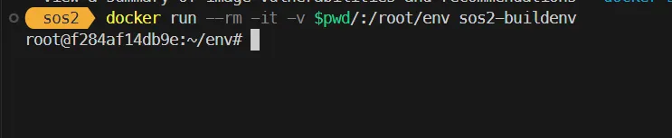
</div>


Si je tape `ls` puis `gcc --version` dans ce terminal, voilà ce que je vois

<div align="center">
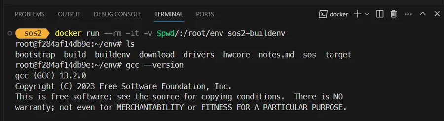
</div>


Le container est donc une machine Linux équipée d'un compilateur gcc plus deux ou trois bricoles que je peux utiliser pour compiler du code etc.

#### Note importante :

Il faut comprendre que tous les fichiers qui seront générés dans le répertoire `~/env` du container se retrouveront dans le répertoire `$pwd` du host Windows ou Linux. Par exemple sous Windows ça peut être un chemin du style : `C:\Users\phili\OneDrive\Documents\Tmp\sos2`

Ça c'est super cool car à chaque lancement du container on aura la même config soft mais on pourra sauver notre travail (persistance) sur le disque dur du host.

Si on veut un autre terminal "local", dans VScode il suffit d'appuyer sur le "+" au bout à droite. On voit alors qu'il y a un déjà terminal nommé `docker` et un autre qui se nomme `pwsh` (je suis sous Win11). Voilà ce que je vois si je tape la commande `ls` :

<div align="center">
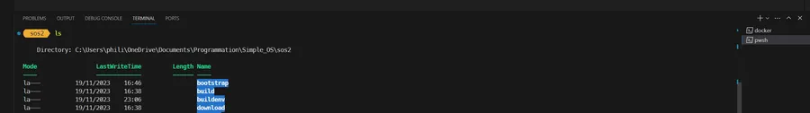
</div>

Pour quitter le container docker, il suffit de l'activer et de saisir la commande `exit`.

Si plus tard on veut relancer le container, il suffit de relancer la commande ci-dessous (pas besoin de refaire une image `sos2-buildenv` car celle-ci existe déjà).

```powershell
docker run --rm -it -v $pwd/:/root/env sos2-buildenv
```

```bash
docker run --rm -it -v $(pwd):/root/env sos2-buildenv
```

En revanche, si on voulait ajouter une lib, un outil à l'image, alors dans ce cas il suffirait de modifier le fichier Dockerfile, de reconstruire une image (avec le même nom ou pas) puis de refaire un `docker run`.

Histoire qu'on soit bien synchronisés, je te propose de quitter (exit) le container et de fermer l'autre terminal si besoin. On va s'intéresser maintenant au répertoire `bootstrap`.

### Support de Grub 2 et de multiboot 2 dans bootstrap

Dans le répertoire /bootstrap on va :

* Renommer les fichiers existants en .bak. Il suffit d'appuyer sur F2 une fois que le nom d'un fichier est sélectionné puis de le renommer.
* Créer un fichier multiboot.asm
* Créer un fichier multiboot_header.asm

Voilà ce que cela donne chez moi

<div align="center">
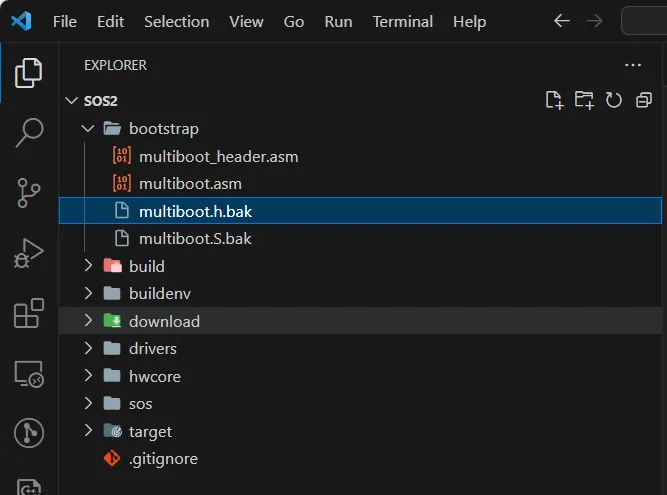
</div>


Dans le fichier multiboot_header.asm, colle les lignes suivantes :

```assembly
section .multiboot_header
header_start:
    dd 0xe85250d6                                                   ; magic number multiboot 2
    dd 0                                                            ; 32-bit protected mode of i386
    dd header_end - header_start                                    ; header length
    dd 0x100000000 - (0xe85250d6 + 0 + (header_end - header_start)) ; checksum

    ; insert optional multiboot tags here

    ; required end tag
    dw 0    ; type
    dw 0    ; flags
    dd 8    ; size
header_end:
```

Dans multiboot.asm colle ces lignes :

```assembly
MULTIBOOT_STACK_SIZE equ 0x4000                ; 16KB

section .bss
align 16
stack_bottom:
	resb MULTIBOOT_STACK_SIZE
stack_top:

global start									; entry point of the operating system
extern sos_main

section .text 									; once loaded by grub2 we are in protected mode, pagination is not set...
bits 32
start:
	mov esp, stack_top							; Set the stack

	push 0										; clear flags
	popf

	push ebx									; Push the pointer to the Multiboot information structure
	push eax									; Push the magic value

    call sos_main
	hlt											; We should never, ever come here

```
#### Séquence explications

* Il faut relire la section 4.2.2 de l'article 1
* Initialement SOS était chargé par Grub 1 et était conforme aux spécifications multiboot 1. Dorénavant il est chargé par Grub 2 et est conforme aux [spécifications multiboot 2](https://www.gnu.org/software/grub/manual/multiboot2/multiboot.html#kernel_002ec).
* multiboot.asm est l'équivalent de multiboot.S de SOS. Comme dans le code initial, on y retrouve une pile de 16 kB, on précise l'étiquette qui marque le début du code (`start`) et on déclare une fonction externe (`sos_main`) dont aura besoin l'éditeur de lien plus tard. Pour le reste, c'est du code à la syntaxe Intel qui sera compilé par NASM. Dans la section `.text` (là où on met du code, pas des données), comme avant, on initialise le pointeur de pile, on remet les flags à 0 et avant d'appeler la fonction C `sos_main`, on met sur la pile 2 paramètres importants qui nous ont été passés par Grub 2.
* Récapitulons. J'allume le PC. Grub 2 monte en mémoire et démarre. Il en profite pour initialiser tout un tas de trucs (c'est quasiment un OS avant l'OS). Quand il a terminé, le PC est en mode 32 bits protégé et Grub met de côté 2 paramètres via les registres `ebx` et `eax` avant de passer la main à `sos2`. Dans la fonction `sos_main` qui est écrite en C on récupèrera ces 2 paramètres. Cela nous permettra de vérifier qu'on a bien été invoqué par Grub 2 et on pourra vérifier tout un tas d'autres paramètres liés à la configuration du PC (taille mémoire par exemple).
* multiboot_header.asm c'est l'équivalent des lignes 24 à 42 du fichier multiboot.S de SOS. Il s'agit d'un entête qui possède un format bien précis et qui devra être placé dans les 32 premiers kB de l'image de SOS2 (voir les specs de multiboot 2).
* Pour sa part, multiboot.h n'a pas d'équivalent dans ce répertoire. On n'en a pas besoin ici.

### Adaptation de ``main.c``

On a que 2 choses à faire :

1. Mettre dans le sous-répertoire `sos` une copie du fichier `multiboot2.h`
1. Inclure `multiboot2.h` dans le fichier `main.c` et ne plus tenir compte de l'ancien fichier /bootstrap/multiboot.h (qu'on a déjà renommé en .bak de toute façon)

Pour l'étape 1 je me suis déjà fait avoir en téléchargeant de mauvaises versions. Finalement, le plus sûr mais aussi le plus pénible, c'est d'aller sur [la page des spécifications de Grub 2](https://www.gnu.org/software/grub/manual/multiboot2/multiboot.html#multiboot2_002eh), de sélectionner puis de copier (CTRL+C) le texte de multiboot2.h. C'est un peu la loose mais je n'ai pas trouvé mieux ni plus sûr jusqu'à maintenant.

<div align="center">
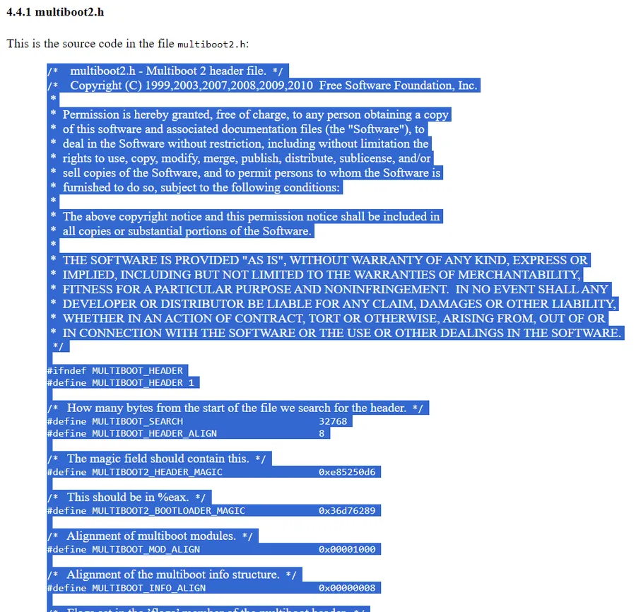
</div>


Ensuite dans le répertoire `sos`, il faut créer un nouveau fichier `multiboot2.h` et y copier tout le texte en question. Quand je colle le texte, je colle 417 lignes. Quand je sauve `multiboot2.h`, la mise en forme du code fait que je me retrouve avec 381 lignes.

Comme c'est un point qui m'a fait perdre pas mal de temps je laisse ici une copie du `multiboot2.h` que j'utilise.

```assembly
/*   multiboot2.h - Multiboot 2 header file. */
/*   Copyright (C) 1999,2003,2007,2008,2009,2010  Free Software Foundation, Inc.
 *
 *  Permission is hereby granted, free of charge, to any person obtaining a copy
 *  of this software and associated documentation files (the "Software"), to
 *  deal in the Software without restriction, including without limitation the
 *  rights to use, copy, modify, merge, publish, distribute, sublicense, and/or
 *  sell copies of the Software, and to permit persons to whom the Software is
 *  furnished to do so, subject to the following conditions:
 *
 *  The above copyright notice and this permission notice shall be included in
 *  all copies or substantial portions of the Software.
 *
 *  THE SOFTWARE IS PROVIDED "AS IS", WITHOUT WARRANTY OF ANY KIND, EXPRESS OR
 *  IMPLIED, INCLUDING BUT NOT LIMITED TO THE WARRANTIES OF MERCHANTABILITY,
 *  FITNESS FOR A PARTICULAR PURPOSE AND NONINFRINGEMENT.  IN NO EVENT SHALL ANY
 *  DEVELOPER OR DISTRIBUTOR BE LIABLE FOR ANY CLAIM, DAMAGES OR OTHER LIABILITY,
 *  WHETHER IN AN ACTION OF CONTRACT, TORT OR OTHERWISE, ARISING FROM, OUT OF OR
 *  IN CONNECTION WITH THE SOFTWARE OR THE USE OR OTHER DEALINGS IN THE SOFTWARE.
 */

#ifndef MULTIBOOT_HEADER
#define MULTIBOOT_HEADER 1

/*  How many bytes from the start of the file we search for the header. */
#define MULTIBOOT_SEARCH                        32768
#define MULTIBOOT_HEADER_ALIGN                  8

/*  The magic field should contain this. */
#define MULTIBOOT2_HEADER_MAGIC                 0xe85250d6

/*  This should be in %eax. */
#define MULTIBOOT2_BOOTLOADER_MAGIC             0x36d76289

/*  Alignment of multiboot modules. */
#define MULTIBOOT_MOD_ALIGN                     0x00001000

/*  Alignment of the multiboot info structure. */
#define MULTIBOOT_INFO_ALIGN                    0x00000008

/*  Flags set in the ’flags’ member of the multiboot header. */

#define MULTIBOOT_TAG_ALIGN                  8
#define MULTIBOOT_TAG_TYPE_END               0
#define MULTIBOOT_TAG_TYPE_CMDLINE           1
#define MULTIBOOT_TAG_TYPE_BOOT_LOADER_NAME  2
#define MULTIBOOT_TAG_TYPE_MODULE            3
#define MULTIBOOT_TAG_TYPE_BASIC_MEMINFO     4
#define MULTIBOOT_TAG_TYPE_BOOTDEV           5
#define MULTIBOOT_TAG_TYPE_MMAP              6
#define MULTIBOOT_TAG_TYPE_VBE               7
#define MULTIBOOT_TAG_TYPE_FRAMEBUFFER       8
#define MULTIBOOT_TAG_TYPE_ELF_SECTIONS      9
#define MULTIBOOT_TAG_TYPE_APM               10
#define MULTIBOOT_TAG_TYPE_EFI32             11
#define MULTIBOOT_TAG_TYPE_EFI64             12
#define MULTIBOOT_TAG_TYPE_SMBIOS            13
#define MULTIBOOT_TAG_TYPE_ACPI_OLD          14
#define MULTIBOOT_TAG_TYPE_ACPI_NEW          15
#define MULTIBOOT_TAG_TYPE_NETWORK           16
#define MULTIBOOT_TAG_TYPE_EFI_MMAP          17
#define MULTIBOOT_TAG_TYPE_EFI_BS            18
#define MULTIBOOT_TAG_TYPE_EFI32_IH          19
#define MULTIBOOT_TAG_TYPE_EFI64_IH          20
#define MULTIBOOT_TAG_TYPE_LOAD_BASE_ADDR    21

#define MULTIBOOT_HEADER_TAG_END  0
#define MULTIBOOT_HEADER_TAG_INFORMATION_REQUEST  1
#define MULTIBOOT_HEADER_TAG_ADDRESS  2
#define MULTIBOOT_HEADER_TAG_ENTRY_ADDRESS  3
#define MULTIBOOT_HEADER_TAG_CONSOLE_FLAGS  4
#define MULTIBOOT_HEADER_TAG_FRAMEBUFFER  5
#define MULTIBOOT_HEADER_TAG_MODULE_ALIGN  6
#define MULTIBOOT_HEADER_TAG_EFI_BS        7
#define MULTIBOOT_HEADER_TAG_ENTRY_ADDRESS_EFI32  8
#define MULTIBOOT_HEADER_TAG_ENTRY_ADDRESS_EFI64  9
#define MULTIBOOT_HEADER_TAG_RELOCATABLE  10

#define MULTIBOOT_ARCHITECTURE_I386  0
#define MULTIBOOT_ARCHITECTURE_MIPS32  4
#define MULTIBOOT_HEADER_TAG_OPTIONAL 1

#define MULTIBOOT_LOAD_PREFERENCE_NONE 0
#define MULTIBOOT_LOAD_PREFERENCE_LOW 1
#define MULTIBOOT_LOAD_PREFERENCE_HIGH 2

#define MULTIBOOT_CONSOLE_FLAGS_CONSOLE_REQUIRED 1
#define MULTIBOOT_CONSOLE_FLAGS_EGA_TEXT_SUPPORTED 2

#ifndef ASM_FILE

typedef unsigned char           multiboot_uint8_t;
typedef unsigned short          multiboot_uint16_t;
typedef unsigned int            multiboot_uint32_t;
typedef unsigned long long      multiboot_uint64_t;

struct multiboot_header
{
  /*  Must be MULTIBOOT_MAGIC - see above. */
  multiboot_uint32_t magic;

  /*  ISA */
  multiboot_uint32_t architecture;

  /*  Total header length. */
  multiboot_uint32_t header_length;

  /*  The above fields plus this one must equal 0 mod 2^32. */
  multiboot_uint32_t checksum;
};

struct multiboot_header_tag
{
  multiboot_uint16_t type;
  multiboot_uint16_t flags;
  multiboot_uint32_t size;
};

struct multiboot_header_tag_information_request
{
  multiboot_uint16_t type;
  multiboot_uint16_t flags;
  multiboot_uint32_t size;
  multiboot_uint32_t requests[0];
};

struct multiboot_header_tag_address
{
  multiboot_uint16_t type;
  multiboot_uint16_t flags;
  multiboot_uint32_t size;
  multiboot_uint32_t header_addr;
  multiboot_uint32_t load_addr;
  multiboot_uint32_t load_end_addr;
  multiboot_uint32_t bss_end_addr;
};

struct multiboot_header_tag_entry_address
{
  multiboot_uint16_t type;
  multiboot_uint16_t flags;
  multiboot_uint32_t size;
  multiboot_uint32_t entry_addr;
};

struct multiboot_header_tag_console_flags
{
  multiboot_uint16_t type;
  multiboot_uint16_t flags;
  multiboot_uint32_t size;
  multiboot_uint32_t console_flags;
};

struct multiboot_header_tag_framebuffer
{
  multiboot_uint16_t type;
  multiboot_uint16_t flags;
  multiboot_uint32_t size;
  multiboot_uint32_t width;
  multiboot_uint32_t height;
  multiboot_uint32_t depth;
};

struct multiboot_header_tag_module_align
{
  multiboot_uint16_t type;
  multiboot_uint16_t flags;
  multiboot_uint32_t size;
};

struct multiboot_header_tag_relocatable
{
  multiboot_uint16_t type;
  multiboot_uint16_t flags;
  multiboot_uint32_t size;
  multiboot_uint32_t min_addr;
  multiboot_uint32_t max_addr;
  multiboot_uint32_t align;
  multiboot_uint32_t preference;
};

struct multiboot_color
{
  multiboot_uint8_t red;
  multiboot_uint8_t green;
  multiboot_uint8_t blue;
};

struct multiboot_mmap_entry
{
  multiboot_uint64_t addr;
  multiboot_uint64_t len;
#define MULTIBOOT_MEMORY_AVAILABLE              1
#define MULTIBOOT_MEMORY_RESERVED               2
#define MULTIBOOT_MEMORY_ACPI_RECLAIMABLE       3
#define MULTIBOOT_MEMORY_NVS                    4
#define MULTIBOOT_MEMORY_BADRAM                 5
  multiboot_uint32_t type;
  multiboot_uint32_t zero;
};
typedef struct multiboot_mmap_entry multiboot_memory_map_t;

struct multiboot_tag
{
  multiboot_uint32_t type;
  multiboot_uint32_t size;
};

struct multiboot_tag_string
{
  multiboot_uint32_t type;
  multiboot_uint32_t size;
  char string[0];
};

struct multiboot_tag_module
{
  multiboot_uint32_t type;
  multiboot_uint32_t size;
  multiboot_uint32_t mod_start;
  multiboot_uint32_t mod_end;
  char cmdline[0];
};

struct multiboot_tag_basic_meminfo
{
  multiboot_uint32_t type;
  multiboot_uint32_t size;
  multiboot_uint32_t mem_lower;
  multiboot_uint32_t mem_upper;
};

struct multiboot_tag_bootdev
{
  multiboot_uint32_t type;
  multiboot_uint32_t size;
  multiboot_uint32_t biosdev;
  multiboot_uint32_t slice;
  multiboot_uint32_t part;
};

struct multiboot_tag_mmap
{
  multiboot_uint32_t type;
  multiboot_uint32_t size;
  multiboot_uint32_t entry_size;
  multiboot_uint32_t entry_version;
  struct multiboot_mmap_entry entries[0];
};

struct multiboot_vbe_info_block
{
  multiboot_uint8_t external_specification[512];
};

struct multiboot_vbe_mode_info_block
{
  multiboot_uint8_t external_specification[256];
};

struct multiboot_tag_vbe
{
  multiboot_uint32_t type;
  multiboot_uint32_t size;

  multiboot_uint16_t vbe_mode;
  multiboot_uint16_t vbe_interface_seg;
  multiboot_uint16_t vbe_interface_off;
  multiboot_uint16_t vbe_interface_len;

  struct multiboot_vbe_info_block vbe_control_info;
  struct multiboot_vbe_mode_info_block vbe_mode_info;
};

struct multiboot_tag_framebuffer_common
{
  multiboot_uint32_t type;
  multiboot_uint32_t size;

  multiboot_uint64_t framebuffer_addr;
  multiboot_uint32_t framebuffer_pitch;
  multiboot_uint32_t framebuffer_width;
  multiboot_uint32_t framebuffer_height;
  multiboot_uint8_t framebuffer_bpp;
#define MULTIBOOT_FRAMEBUFFER_TYPE_INDEXED 0
#define MULTIBOOT_FRAMEBUFFER_TYPE_RGB     1
#define MULTIBOOT_FRAMEBUFFER_TYPE_EGA_TEXT     2
  multiboot_uint8_t framebuffer_type;
  multiboot_uint16_t reserved;
};

struct multiboot_tag_framebuffer
{
  struct multiboot_tag_framebuffer_common common;

  union
  {
    struct
    {
      multiboot_uint16_t framebuffer_palette_num_colors;
      struct multiboot_color framebuffer_palette[0];
    };
    struct
    {
      multiboot_uint8_t framebuffer_red_field_position;
      multiboot_uint8_t framebuffer_red_mask_size;
      multiboot_uint8_t framebuffer_green_field_position;
      multiboot_uint8_t framebuffer_green_mask_size;
      multiboot_uint8_t framebuffer_blue_field_position;
      multiboot_uint8_t framebuffer_blue_mask_size;
    };
  };
};

struct multiboot_tag_elf_sections
{
  multiboot_uint32_t type;
  multiboot_uint32_t size;
  multiboot_uint32_t num;
  multiboot_uint32_t entsize;
  multiboot_uint32_t shndx;
  char sections[0];
};

struct multiboot_tag_apm
{
  multiboot_uint32_t type;
  multiboot_uint32_t size;
  multiboot_uint16_t version;
  multiboot_uint16_t cseg;
  multiboot_uint32_t offset;
  multiboot_uint16_t cseg_16;
  multiboot_uint16_t dseg;
  multiboot_uint16_t flags;
  multiboot_uint16_t cseg_len;
  multiboot_uint16_t cseg_16_len;
  multiboot_uint16_t dseg_len;
};

struct multiboot_tag_efi32
{
  multiboot_uint32_t type;
  multiboot_uint32_t size;
  multiboot_uint32_t pointer;
};

struct multiboot_tag_efi64
{
  multiboot_uint32_t type;
  multiboot_uint32_t size;
  multiboot_uint64_t pointer;
};

struct multiboot_tag_smbios
{
  multiboot_uint32_t type;
  multiboot_uint32_t size;
  multiboot_uint8_t major;
  multiboot_uint8_t minor;
  multiboot_uint8_t reserved[6];
  multiboot_uint8_t tables[0];
};

struct multiboot_tag_old_acpi
{
  multiboot_uint32_t type;
  multiboot_uint32_t size;
  multiboot_uint8_t rsdp[0];
};

struct multiboot_tag_new_acpi
{
  multiboot_uint32_t type;
  multiboot_uint32_t size;
  multiboot_uint8_t rsdp[0];
};

struct multiboot_tag_network
{
  multiboot_uint32_t type;
  multiboot_uint32_t size;
  multiboot_uint8_t dhcpack[0];
};

struct multiboot_tag_efi_mmap
{
  multiboot_uint32_t type;
  multiboot_uint32_t size;
  multiboot_uint32_t descr_size;
  multiboot_uint32_t descr_vers;
  multiboot_uint8_t efi_mmap[0];
};

struct multiboot_tag_efi32_ih
{
  multiboot_uint32_t type;
  multiboot_uint32_t size;
  multiboot_uint32_t pointer;
};

struct multiboot_tag_efi64_ih
{
  multiboot_uint32_t type;
  multiboot_uint32_t size;
  multiboot_uint64_t pointer;
};

struct multiboot_tag_load_base_addr
{
  multiboot_uint32_t type;
  multiboot_uint32_t size;
  multiboot_uint32_t load_base_addr;
};

#endif /*  ! ASM_FILE */

#endif /*  ! MULTIBOOT_HEADER */
```

Pour la seconde étape, il suffit d'ouvrir `main.c` et d'apporter les modifications ci-dessous :

```c
//#include <bootstrap/multiboot.h>
#include <sos/multiboot2.h>

```

Ceci dit, on devra revenir pour modifier le fichier `main.c`. En effet, ce dernier "cause" multiboot 1 alors que nous, on est dorénavant compatibles multiboot 2. Pas grave, on y reviendra en temps utile.

### Création d'un fichier ``grub.cfg``

Il suffit de copier le code ci-dessous dans un fichier `grub.cfg` à déposer dans `target\iso\boot\grub\grub.cfg`

```
set timeout=5
set default=0

menuentry "sos2" {
	multiboot2 /boot/sos2.bin
	boot
}
```
#### Séquence explications

C'est assez classique, c'est le fichier qui explique à Grub 2 comment il doit se comporter et présenter les choses à l'écran. Par exemple, on lui dit de présenter son menu 5 secondes. On précise aussi que si rien n'est sélectionné il doit choisir l'option 0 (l'unique option du fichier en fait). Enfin on décrit l'entrée du menu. Elle s'appellera `sos2`, elle est conforme multiboot 2 et rattachée au fichier `/boot/sos2.bin`. C'est ce que l'on va retrouver un peu plus loin. Patience petit padawan...

### Création d'un fichier ``sos2.ld``

Copie le code ci-dessous et met le dans un fichier `target\sos2.ld`. Je ne suis pas intimement persuadé que ce soit le meilleur endroit mais bon ce fichier n'est pas un morceau du kernel, c'est pas un driver ni un constituant du bootstrap. Comme en plus je souhaite limiter au maximum le nombre de fichiers à la racine du projet... Si besoin on pourra toujours le déplacer plus tard.

```assembly
ENTRY(start)

SECTIONS {
    . = 1M;

    .boot :
    {
        /* ensure that the multiboot header is at the beginning */
        *(.multiboot_header)
    }

    .text :
    {
        *(.text)
    }
}
```

#### Séquence explications

Commence par relire lannexe A.2 de l'article original. En tout cas, le fichier ci-dessus c'est l'équivalent du fichier `download\sos-code-article1\support\sos.lds` du projet SOS. Mouai... Et ? En fait on l'a dit un peu plus haut, il faut que le contenu de `multiboot_header.asm` soit dans les premiers 32 kB de l'image. Le fichier `sos2.ld` va expliquer à l'éditeur de liens (linker, LD pour les intimes) comment il doit organiser les choses. 

En gros on lui dit quelque chose du style :
* De tous les symboles (start, sos-main...) que tu vas rencontrer, le point d'entrée, le début du début c'est le code qui se trouve au niveau de l'étiquette `start`.
* Ensuite, on te demande de charger le noyau à 1MB en mémoire
* En ce qui concerne la section `.boot` te prends pas la tête. Copie colle la section `.multiboot_header`. Il faut remarquer ici qu'on ne parle pas au linker en termes de fichiers, on lui parle en termes de section de code.
* Enfin on lui indique qu'en ce qui concerne la section `.text` (celle qui contient le code), il doit regrouper toutes les sections `.text` qu'il va rencontrer.

Le plus important bien sûr ce sont les instructions qui concernent la section `.boot`.

Voilà pour finir ce à quoi ressemble la partie `target` de l'arborescence de fichiers :

<div align="center">
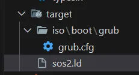
</div>

### Création d'un fichier Makefile

Malheureusement on ne peut pas réutiliser tel quel le Makefile original qui se trouve dans `download\sos-code-article1\Makefile`. Il est très bien, il n'y a pas de soucis, mais :

* Le compilateur et le linker sont des outils qui par défaut génèrent dorénavant du code 64 bits
* L'assembleur n'est plus GAS mais NASM
* On n'utilise pas les mtools
* On utilise grub-mkrescue
* On souhaite regrouper tous les fichiers compilés dans un répertoire `build`
* On souhaite générer une image sos2.iso dans un répertoire `dist`
* ...

Oui on pourrait repartir du `Makefile` original et faire toutes les modifications ligne à ligne mais finalement je te propose de copier les lignes ci-dessous et de les coller dans un fichier `Makefile` qui doit se trouver à la racine du projet, à côté du fichier `.gitignore`.

<div align="center">
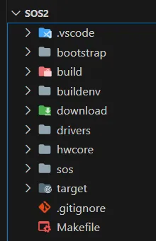
</div>


```makefile
CC      = gcc
CFLAGS  = -Wall -nostdlib -nostdinc -ffreestanding -m32
LDFLAGS = --warn-common -melf_i386
PWD     := $(shell pwd)

ASM_SOURCE_FILES := $(shell find bootstrap -name *.asm)
ASM_OBJECT_FILES := $(patsubst bootstrap/%.asm, build/%.o, $(ASM_SOURCE_FILES))

SOS_C_SOURCE_FILES := $(shell find sos -name *.c)
SOS_C_OBJECT_FILES := $(patsubst sos/%.c, build/%.o, $(SOS_C_SOURCE_FILES))

DRIVERS_C_SOURCE_FILES := $(shell find drivers -name *.c)
DRIVERS_C_OBJECT_FILES := $(patsubst drivers/%.c, build/%.o, $(DRIVERS_C_SOURCE_FILES))

OBJECT_FILES := $(DRIVERS_C_OBJECT_FILES) $(SOS_C_OBJECT_FILES) ${ASM_OBJECT_FILES}
#$(info $$OBJECT_FILES : ${OBJECT_FILES})

SOS_BIN = target/iso/boot/sos2.bin
SOS_MULTIBOOT_ISO = dist/sos2.iso

sos2 : $(SOS_MULTIBOOT_ISO)

$(SOS_MULTIBOOT_ISO): $(SOS_BIN)
	grub-mkrescue -d /usr/lib/grub/i386-pc -o dist/sos2.iso target/iso

$(SOS_BIN) : $(OBJECT_FILES)
	mkdir -p dist
	$(LD) $(LDFLAGS) -T ./target/sos2.ld -o $(SOS_BIN) $^

$(ASM_OBJECT_FILES): build/%.o : bootstrap/%.asm
	mkdir -p $(dir $@) && \
	nasm -f elf32 $(patsubst build/%.o, bootstrap/%.asm, $@) -o $@

$(DRIVERS_C_OBJECT_FILES): build/%.o : drivers/%.c
	mkdir -p $(dir $@) && \
	$(CC) -I$(PWD) -c $(CFLAGS)  $(patsubst  build/%.o, drivers/%.c, $@) -o $@

$(SOS_C_OBJECT_FILES): build/%.o : sos/%.c
	mkdir -p $(dir $@) && \
	$(CC) -I$(PWD) -c $(CFLAGS)  $(patsubst  build/%.o, sos/%.c, $@) -o $@

.PHONY: clean
clean:
	$(RM) -rf dist
	$(RM) $(SOS_BIN)
	$(RM) build/*.o build/*~

```

#### Séquence explications

Un fichier `makefile` c'est la recette qu'il faut suivre si on veut réussir son plat. Oublie les lignes qui sont après `.PHONY` et oublie aussi les premières lignes. Va directement à la ligne qui dit :

```makefile
sos2 : $(SOS_MULTIBOOT_ISO)
```

* Ça, ça veut dire que pour réussir le plat `sos2` il faut qu'on ait réussi préalablement `SOS_MULTIBOOT_ISO`
* Ok, mais pour réussir `SOS_MULTIBOOT_ISO` il faut faire quoi ? À la ligne juste en dessous on explique qu'il faut que `SOS_BIN` soit réussi et passer avec succès la commande `grub-mkrescue -d /usr/lib/grub/i386-pc -o dist/sos2.iso target/iso`
* OK, mais pour réussir `SOS_BIN` il faut faire quoi ? Je pense que tu commences à voir le pattern. Il faut réussir `OBJECT_FILES` et passer avec succès les 2 lignes de commandes (`mkdir` et `$(LD)...`)
* Je te laisse lire les autres règles de la recette. À un moment, au niveau le plus bas, le makefile explique comment compiler un fichier .c pour en faire un fichier .o et le mettre dans le répertoire `/build`. En remplaçant les variables de type `$(CC)` par leurs valeurs on retrouve les lignes de commandes qui s'affichent dans le terminal.

Cela dit, si on reprend la troisième ligne de la liste précédente, on peut se demander ce qu'est `OBJECT_FILES`, ou plus précisément ce qu'est la variable `$(OBJECT_FILES)`. Si on remonte un peu dans le fichier on voit une ligne du style :

```makefile
OBJECT_FILES := $(DRIVERS_C_OBJECT_FILES) $(SOS_C_OBJECT_FILES) ${ASM_OBJECT_FILES}
```

Autrement dit, `$(OBJECT_FILES)` c'est l'agglomération de 3 variables qui sont elles-mêmes définies encore un peu au-dessus et, en gros, `$(OBJECT_FILES)` c'est la liste de tous les fichiers compilés (.o).

Ok, ok mais justement est-ce qu'on peut revenir sur les lignes du type :

```makefile
ASM_SOURCE_FILES := $(shell find bootstrap -name *.asm)
ASM_OBJECT_FILES := $(patsubst bootstrap/%.asm, build/%.o, $(ASM_SOURCE_FILES))
```

1. La première ligne alimente la variable `ASM_SOURCE_FILES` avec la liste des fichiers de type `blablabla.asm` qui sont dans le répertoire `bootstrap`
1. La seconde est un peu plus subtile car elle met en œuvre la commande `patsubst` qui prend 3 arguments : `pattern`, `replacement` et `text`. En gros elle prend le 3me argument (`text`), elle y cherche des morceaux qui ressemblent au premier (`pattern`) et le cas échéant elle remplace alors le `pattern` par `replacement`. Dans ce cadre, le `%` joue le rôle de joker et prend la place d'une suite de un ou plusieurs caractères. En bref, la liste "`bootstrap/zoubida.asm bootstrap/marcel.asm`" est remplacée par "`build/zoubida.o build/marcel.o`"

Pour finir on a une autre recette (`clean`) qui n'a pas de dépendance mais qui est une suite de commandes à dérouler.

Avec tout ça normalement tu dois pouvoir comprendre comment le `makefile` est organisé. On voit aussi que si demain on a d'autres répertoires, d'autres fichiers à construire etc. nous n'aurons qu'à modifier le contenu du makefile.

## 4 - Création de l'image

Je vais te calmer tout de suite... Ça va partir en vrille direct mais c'est normal car on l'a dit un peu plus haut, le `main.c` du noyau "parle" multiboot 1 alors qu'on est passé en multiboot 2. Les structures de données ne sont plus les mêmes etc.

On lance le container avec l'une des 2 lignes ci-dessous selon qu'on est sous WIN11 ou Linux:
* `docker run --rm -it -v $pwd/:/root/env sos2-buildenv`
* `docker run --rm -it -v $(pwd):/root/env sos2-buildenv`

Et on lance la construction du projet : `make sos2`

<div align="center">
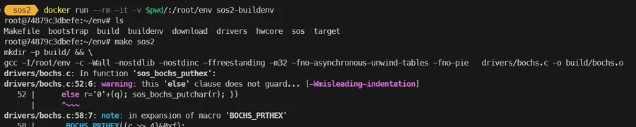
</div>


Pour le premier warning à la ligne 52 de `bochs.c` je te propose de faire un CTRL+click sur `drivers/bosch.c` dans le terminal puis de mettre la macro sur une même ligne. On passe donc de :

```c
#define BOCHS_PRTHEX(q) \
  ({ unsigned char r; if ((q) >= 10) r='a'+(q)-10; \
     else r='0'+(q); sos_bochs_putchar(r); })
```

À :

```c
#define BOCHS_PRTHEX(q) \
  ({ unsigned char r; if ((q) >= 10) r='a'+(q)-10; else r='0'+(q); sos_bochs_putchar(r); })
```

Quand c'est fait on relance un `make`. Pour le coup il y a moins d'erreurs et c'est `main.c` qui pose problème. Si on lit les messages d'erreur (il faut lire les messages d'erreurs...) à priori le compilateur ne connait pas `multiboot_info_t`.

<div align="center">
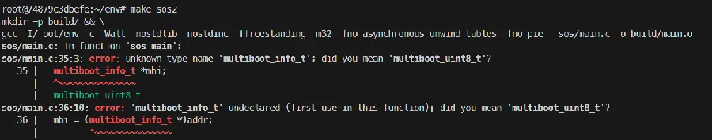
</div>


Allez, CTRL+click sur `sos/main.c:35:3`, on va aller voir ce qui se passe. Voilà ce que je vois :

<div align="center">
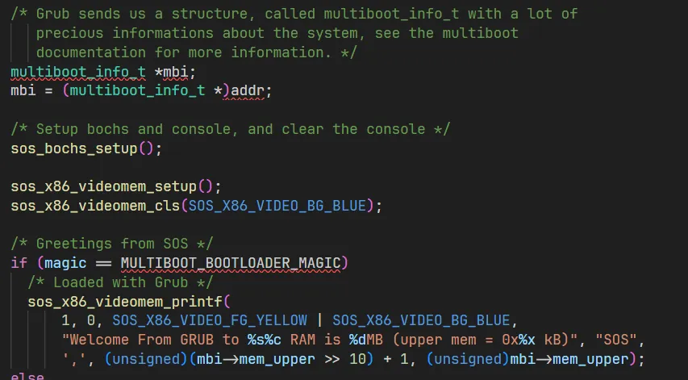
</div>


On voit qu'il y a aussi un problème avec `MULTIBOOT_BOOTLOADER_MAGIC` qu'il ne connait pas. Je propose de commenter (CTRL + /) **toute et rien que** la fonction `sos_main(...)` existante et de copier le code ci-dessous à sa suite :

```c
void sos_main(unsigned long magic, unsigned long addr) {
  sos_bochs_setup();
  sos_x86_videomem_setup();
  sos_x86_videomem_cls(SOS_X86_VIDEO_BG_BLUE);

  if (magic == MULTIBOOT2_BOOTLOADER_MAGIC) {
    sos_x86_videomem_printf(0, 0,
                            SOS_X86_VIDEO_FG_YELLOW | SOS_X86_VIDEO_BG_BLUE,
                            "Valid magic number   : 0x%x", (unsigned)magic);

  } else {
    sos_x86_videomem_printf(0, 0,
                            SOS_X86_VIDEO_FG_YELLOW | SOS_X86_VIDEO_BG_BLUE,
                            "Invalid magic number : 0x%x", (unsigned)magic);
  }

  sos_bochs_putstring("Message in a bochs");

  for (;;)
    continue;

  return;
}
```

En fait il y a très peu de modifications. Cela dit, du point de vue de la rédaction de ce billet c'est plus simple pour moi de montrer le code modifié plutôt que d'expliquer les changements à appliquer :

* Au lieu de comparer `magic` à `MULTIBOOT_BOOTLOADER_MAGIC` on le compare dorénavant à `MULTIBOOT2_BOOTLOADER_MAGIC` qui est définit dans le fichier `sos/multiboot2.h`
* On utilise plus les structures de type `multiboot_info_t` et pour l'instant, on n'affiche pas d'information sur la mémoire.
* Si on reçoit en paramètre la bonne valeur de `magic` on confirme à l'écran que SOS2 a été chargé par Grub 2.

On relance un `make` dans le terminal. "Nom de Zeus, Marty ça sent bon... Y a plus d'erreur!"

<div align="center">
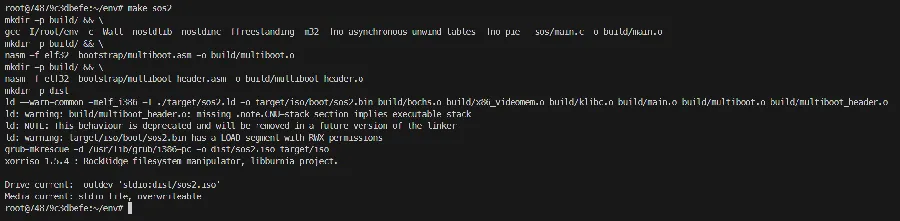
</div>


En plus, dans un nouveau répertoire `dist` on retrouve une image `sos2.iso`

<div align="center">
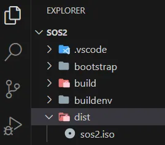
</div>


On ne quitte pas le terminal docker. On en ouvre un nouveau dans lequel on tape :

```powershell
qemu-system-i386 -cdrom ./dist/sos2.iso
```

Le menu Grub 2 apparaît à l'écran de la machine virtuelle et sos2 est bien l'option par défaut.

<div align="center">
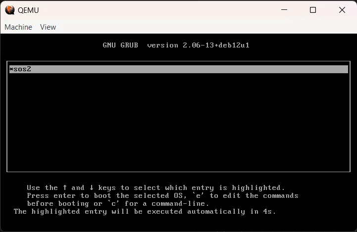
</div>


Si on ne fait rien pendant 5 secondes, la machine virtuelle boote sur sos2 et on obtient un message à l'écran. À priori `main.c` a reçu la bonne valeur dans le paramètre `magic`. Le graaal!

<div align="center">
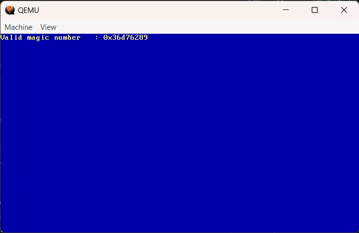
</div>


Avant de faire le ménage dans les fichiers générés, je te propose d'utiliser ton gestionnaire de fichiers favori et d'aller te promener dans `dist/sos2.iso`. Par exemple, voilà ce que je vois :

<div align="center">
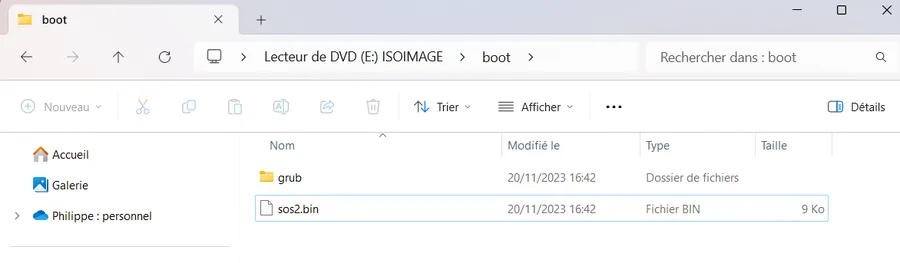
</div>


On comprend bien que l'image iso c'est la concaténation de `sos2.bin`, de `grub.cfg` et de tout un ensemble de fichiers qui sont apportés par Grub 2. Il faut prendre le temps d'aller visiter le sous-répertoire `grub` ci-dessus. Il y a de tout : polices, locales, des tonnes de fichiers .mod etc.

On ferme la machine virtuelle, on retourne dans le terminal du container qui s'appelle docker et on lance la commande suivante :

```bash
root@74879c3dbefe:~/env# make clean
```

Normalement le projet est nettoyé.

* Le répertoire `dist` et son image iso ont disparus.
* Il n'y a plus de fichiers compilés dans le répertoire `build`
* Le fichier `build.bin` a disparu lui aussi.

## 5 - Afficher les informations mémoire

Pour être tout à fait raccord avec l'épisode 1, il faut que SOS2 affiche les informations concernant la mémoire de la machine dans laquelle il s'exécute.

Je te propose de commenter la précédente fonction `sos_main(...)` et de rajouter le code ci-dessous à sa suite :

```c
void sos_main(unsigned long magic, unsigned long addr) {
  sos_bochs_setup();
  sos_x86_videomem_setup();
  sos_x86_videomem_cls(SOS_X86_VIDEO_BG_BLUE);

  int line = 0;
  line++;
  if (magic == MULTIBOOT2_BOOTLOADER_MAGIC) {
    sos_x86_videomem_printf(line, 0,
                            SOS_X86_VIDEO_FG_YELLOW | SOS_X86_VIDEO_BG_BLUE,
                            "Valid magic number   : 0x%x", (unsigned)magic);

  } else {
    sos_x86_videomem_printf(line, 0,
                            SOS_X86_VIDEO_FG_YELLOW | SOS_X86_VIDEO_BG_BLUE,
                            "Invalid magic number : 0x%x", (unsigned)magic);
  }

  struct multiboot_tag *tag;
  for (tag = (struct multiboot_tag *)(addr + 8);
       tag->type != MULTIBOOT_TAG_TYPE_END;
       tag = (struct multiboot_tag *)((multiboot_uint8_t *)tag +
                                      ((tag->size + 7) & ~7))) {

    switch (tag->type) {
    case MULTIBOOT_TAG_TYPE_BASIC_MEMINFO:
      line++;
      sos_x86_videomem_printf(
          line, 0, SOS_X86_VIDEO_FG_YELLOW | SOS_X86_VIDEO_BG_BLUE,
          "mem_lower            : %d KB",
          ((struct multiboot_tag_basic_meminfo *)tag)->mem_lower);

      line++;
      sos_x86_videomem_printf(
          line, 0, SOS_X86_VIDEO_FG_YELLOW | SOS_X86_VIDEO_BG_BLUE,
          "mem_upper            : %d KB",
          ((struct multiboot_tag_basic_meminfo *)tag)->mem_upper);
      break;
    }
  }

  sos_bochs_putstring("Message in a bochs");

  for (;;)
    continue;

  return;
}

```

Ce code utilise une partie de ce qui est expliqué sur la page des [spécifications de multiboot 2](https://www.gnu.org/software/grub/manual/multiboot2/multiboot.html). Cette dernière à l'air austère mais franchement, elle se lit bien.

Oui, je sais, dans le code il y a une boucle `for` avec un `switch` qui ne comporte qu'un seul `case`. Pas la peine de râler ni de lever les yeux au ciel. On va se servir du `case` dans 2 minutes...

Quand le fichier `main.c` est sauvegardé

1. On relance un `make` dans le terminal du container
1. On relance un `qemu-system-i386 -cdrom .\dist\sos2.iso` dans le terminal powershell

Voilà ce que j'obtiens :

<div align="center">
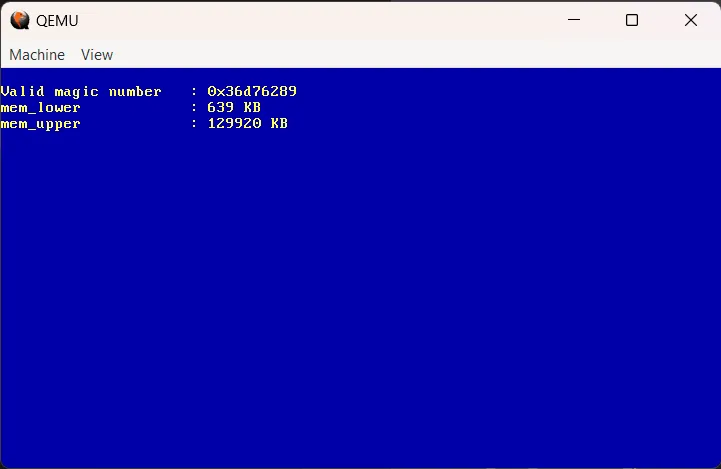
</div>


Si maintenant je relance un boot avec la ligne ci-dessous

```powershell
qemu-system-i386 -m 512M -cdrom .\dist\sos2.iso
```

Voilà ce que je vois :

<div align="center">
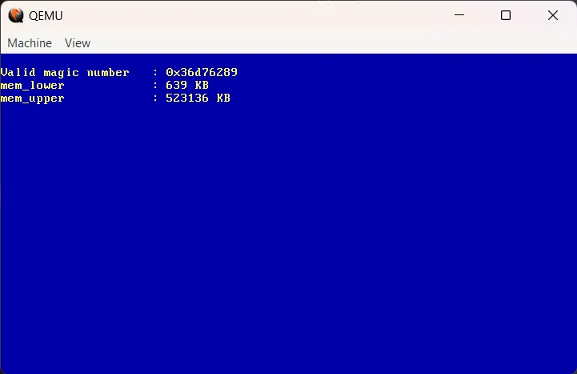
</div>


La machine virtuelle a dorénavant 512 MB de RAM et cette information est passée à SOS2 par l'intermédiaire de la multiboot info data structure (`multiboot_tag` dans le code de `sos_main.c`)

#### Séquence explications

Comme on peut le voir dans les [specs multiboot 2](https://www.gnu.org/software/grub/manual/multiboot2/multiboot.html), la multiboot info data structure peut être parcourue comme une liste chainée dont chaque maillon possède un tag, une taille et des informations spécifiques au tag en question.

Du coup dans la boucle `for`, en fonction de la nature du tag, on exécute tel ou tel `case`.

Bien sûr le type de chaque tag est dans le fichier multiboot2.h. Par exemple si le type du tag vaut `MULTIBOOT_TAG_TYPE_END` c'est qu'on est arrivé au bout de la "chaine". Sinon si il vaut `MULTIBOOT_TAG_TYPE_BASIC_MEMINFO` c'est que le tag est un pointeur sur une structure de type `multiboot_tag_basic_meminfo` dont on peut extraire les 2 valeurs etc.

Cet hiver ça vaudra peut être le coup de revenir sur la boucle `for`. Faut pas se laisser impressionner par les expressions du style `((tag->size + 7) & ~7))`. C'est juste des histoires de programmeurs. En effet, les tags sont à des adresses mémoires qui sont des multiples de 8 et `size` c'est la taille réelle, utile, du tag. Du coup il faut faire un peu d'arithmétique pour trouver l'adresse du prochain tag.

## 6 - Aller plus loin...

Pour te donner envie d'aller lire la spec je te propose d'ajouter le code ci-dessous à l'intérieur de la boucle `for` :

```c
case MULTIBOOT_TAG_TYPE_BOOT_LOADER_NAME:
      line++;
      sos_x86_videomem_printf(line, 0,
                              SOS_X86_VIDEO_FG_YELLOW | SOS_X86_VIDEO_BG_BLUE,
                              "Boot loader name     : %s",
                              ((struct multiboot_tag_string *)tag)->string);
      break;

```

Quand le fichier `main.c` est sauvegardé :

1. Relance un `make` dans le terminal du container
1. Relance un `qemu-system-i386` -m 512M `-cdrom .\dist\sos2.iso` dans le terminal powershell

Voilà alors ce que j'obtiens :

<div align="center">
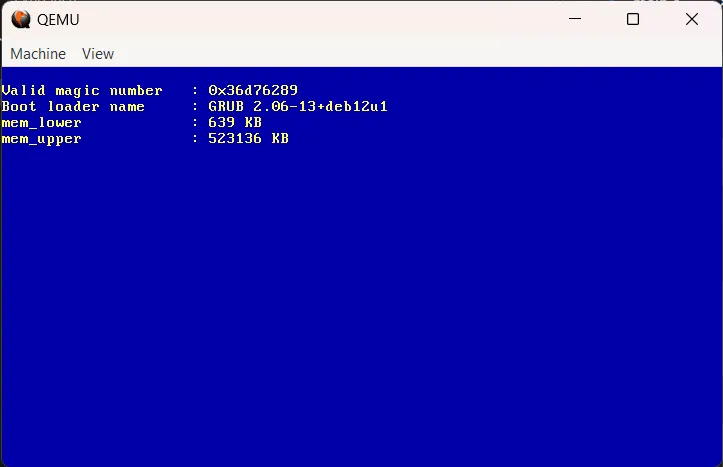
</div>

## 7 - Optionel, uniquement si tu es joueur

### 7.1 Placement en mémoire

L'objectif est de comprendre un peu mieux à quoi sert le fichier `sos2.ld`. Voilà l'organisation d'un programme en mémoire. Dans les adresses les plus basses on retrouve le code puis directement au dessus les variables initialisées, les variables non initialisées, le tas (qui grandit vers le haut) et tout en haut, la pile qui grandit vers le bas.

<div align="center">
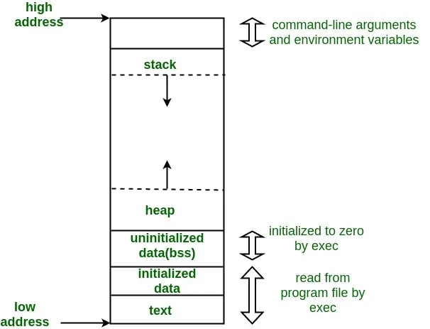
</div>


Donc... Même si je n'ai pas une idée simple pour déterminer à quelle adresse mémoire est placé le début du code noyau de SOS2, je peux approximer cette dernière en utilisant l'adresse d'une variable initialisée. En effet celle-ci sera placée après le code exécutable et donc son adresse sera obligatoirement supérieure à l'adresse de départ du code. Si ce dernier est court, la section `.text` sera courte et on devrait retrouver nos petits.

Je propose d'écrire une nouvelle version de la fonction `sos_main(...)`. Ce noyau ne fait qu'afficher l'adresse de la variable `bob` qui est initialisée et qui, bien sûr, contient [la valeur 42](https://fr.wikipedia.org/wiki/La_grande_question_sur_la_vie%2C_l%27Univers_et_le_reste).

```c
void sos_main(unsigned long magic, unsigned long addr) {
  sos_bochs_setup();
  sos_x86_videomem_setup();
  sos_x86_videomem_cls(SOS_X86_VIDEO_BG_BLUE);

  int bob = 42;
  sos_x86_videomem_printf(0, 0, SOS_X86_VIDEO_FG_YELLOW | SOS_X86_VIDEO_BG_BLUE,
                          "Adr of an initilized variable    : 0x%x",
                          (unsigned)(&bob));

  for (;;)
    continue;

  return;
}

```

Ensuite, on ne change rien. On garde `sos2.ld` en l'état avec son point de chargement à 1MB. Voir ci-dessous :

<div align="center">
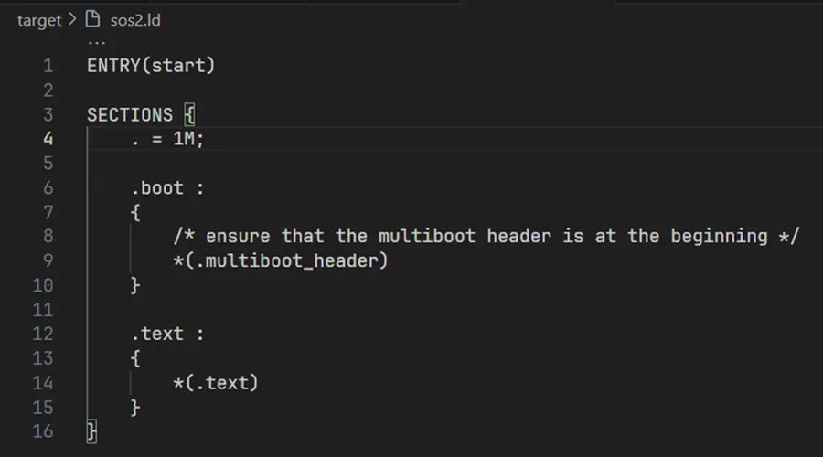
</div>


Je passe les détails mais voilà ce que l'on voit à l'exécution. Bonne nouvelle 0x104BF4 c'est bien au delà de 1MB. Le noyau semble avoir été chargé à l'adresse 1MB.

<div align="center">
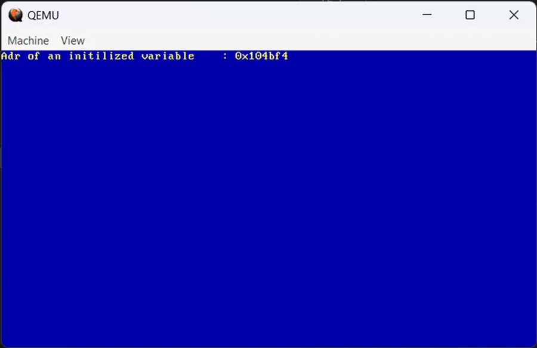
</div>


Maintenant, on recompile et on relance le noyau mais en ayant modifié `sos2.ld` de la façon suivante (voir le `. = 3M;`) :

<div align="center">
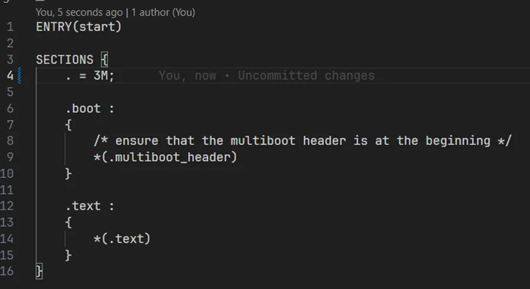
</div>


Bingo ! L'adresse de la variable `bob` est dorénavant 0x304BF4 ce qui la situe au delà des 3MB. Le noyau semble donc bien avoir été chargé à l'adresse 3MB.

<div align="center">
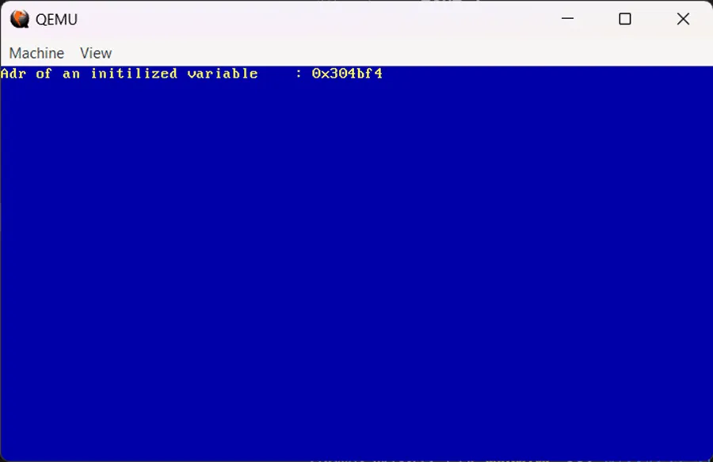
</div>


Pour information, sur [OS Dev.org](https://wiki.osdev.org/Memory_Map_%28x86%29) on retrouve le mapping de la mémoire d'un PC quand il est encore en mode réel. Vu le monde qu'il y a on comprend l'intérêt qu'il y a à placer rapidement le PC en mode protégé et à placer le noyau de l'OS au-delà de 1MB (0x100000)

<div align="center">
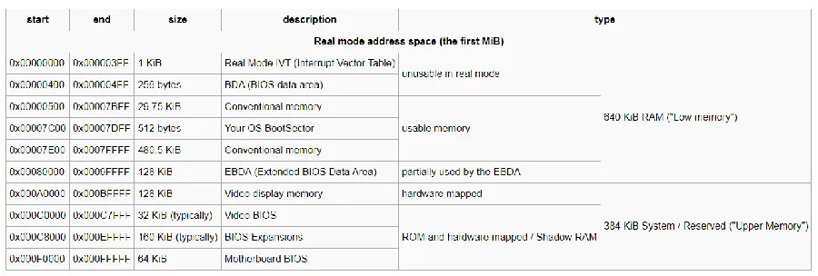
</div>

### 7.2 Les différentes sections

On ne touche pas au code, mais sur docker, au prompt, on invoque la commande suivante :

```bash
readelf -a ./target/iso/boot/sos2.bin
```

Voilà ce que je vois

<div align="center">
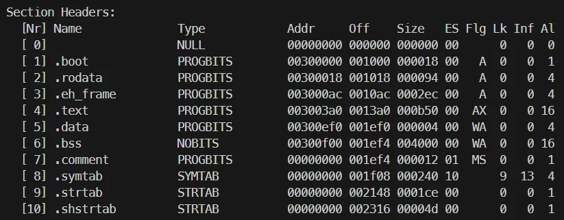
</div>


On retrouve en partie ce dont il est question dans l'annexe A.1 de l'article initial. L'autre truc, c'est que si on remonte un peu dans le texte qui est à l'écran, on peut voir ceci :

<div align="center">
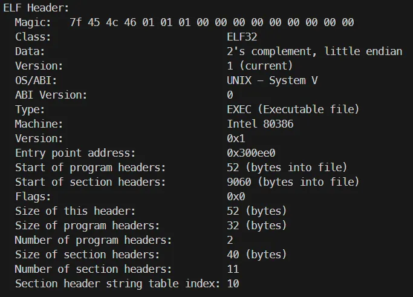
</div>


C'est rassurant, sos2.bin est bien un code au format ELF32. De plus on apprend que le "Entry point" se situe à l'adresse 0x300EE0 (au delà des 3M donc). Enfin si on descend on peut voir que le point d'entree `start` est effectivement à l'adresse 0x300EE0 :

<div align="center">
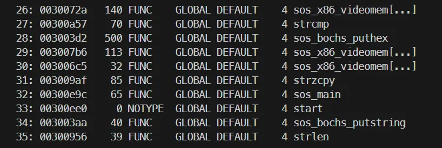
</div>


Histoire de "jouer" avec l'organisation de notre binaire (sos.bin) je te propose de modifier `sos2.ld` comme suit :

* On repasse à 2M
* On renomme la section .boot

```assembly
ENTRY(start)

SECTIONS {
    . = 2M;

    .zoubida :
    {
      /* ensure that the multiboot header is at the beginning */
      *(.multiboot_header)
    }

    .text :
    {
      *(.text)
    }
}

```

Je fais court :

* make clean
* make
* qemu-system-i386 -cdrom ./dist/sos2.iso (côté PowerShell pour se rassurer)
* readelf -a ./target/iso/boot/sos2.bin (côté Docker)

Voilà ce que je vois :

<div align="center">
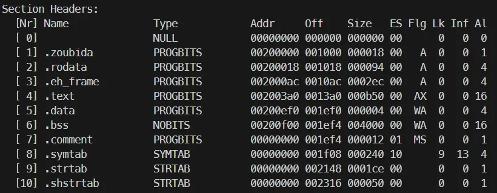
</div>


On retrouve une section `.zoubida` en tête. C'est normal c'est la première du fichier `sos2.ld` et c'est ce que l'on veut. En effet elle contient le code étiqueté `.multiboot_header` qui doit absolument être dans les premiers 32k du binaire si on veut qu'il soit retrouvé par Grub 2 (voir les specs de Grub2). Donc, le truc à comprendre c'est que dans le fichier sos2.ld, ce qui compte, c'est l'ordre et qu'on a une certaine liberté en ce qui concerne les noms de section.

Par contre on observe que des sections ont été rajoutées. Là aussi, il en est question dans l'annexe A.1 de l'article original :

* `.text` : code
* `.data` : variables initialisées
* `.rodata` : variables initialisées en lecture seule
* `.bss` : variables non initialisées
* `.symtab` : table des symboles

Par contre il y a des sections avec des noms de l'espace... `.shstrtab` (contient les noms de sections ?), `.comment`(?), `.eh_frame` (ça me fait penser aux exceptions C++, bizarre on est en C ANSI classique).

Afin de supprimer la section .eh_frame je te propose d'ajouter `-fno-asynchronous-unwind-tables` à `CFLAGS` dans le fichier `Makefile` :

```bash
CFLAGS  = -Wall -nostdlib -nostdinc -ffreestanding -m32 -fno-asynchronous-unwind-tables
```

Si on compile et qu'on liste les sections voilà ce que je vois (`.eh_frame` a disparu, il n'y a plus que 10 sections de 0 à 9) :

<div align="center">
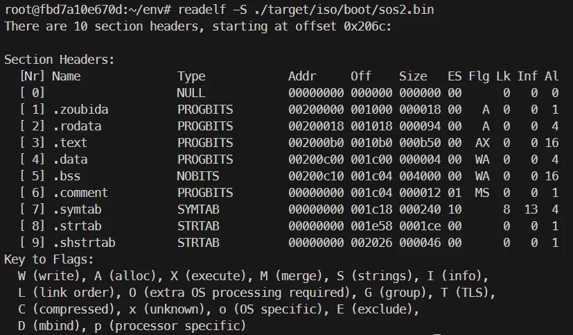
</div>


On peut aller plus loin et se rapprocher de l'organisation du fichier `sos.lds` de l'article. N'oublie pas, tu as accès à ce fichier, il est dans `download\sos-code-article1\support\sos.lds`). Je te propose de modifier sos2.ld comme suit :

```assembly
ENTRY(start)

SECTIONS {
    . = 2M;

    .zoubida :
    {
      /* ensure that the multiboot header is at the beginning */
      *(.multiboot_header)
    }

    .text ALIGN(4096) :
    {
      *(.text)
    }

    .data . :
    {
      *(.data*)
    }

    .rodata . :
    {
      *(.rodata*)
    }

    .bss SIZEOF(.rodata) + ADDR(.rodata) :
    {
      *(.bss)
    }

    /DISCARD/ :{
      *(.comment)
    }
}
```

J'ai gardé zoubida. C'est cadeau, ça me fait plaisir...

Sinon on aligne la section .text et on force l'ordre des sections .data, .rodata etc.

Après faut aller potasser la syntaxe du script attendu par ld. Voir les liens à la fin de cette section.

C'est presque évident mais "`.text ALIGN(4096) :`" veut dire qu'il faut que la section `.text` commence au début d'une page.

De même, le second "`.`" de "`.data . :`" demande à ce que la section `.data` commence là où se termine la précédente section. Personnellement je comprend les "`.`" comme "les adresses de là où on est au moment où on les lis".

Je passe les détails mais à la fin voilà ce que l'on peut voir dans le terminal :

<div align="center">
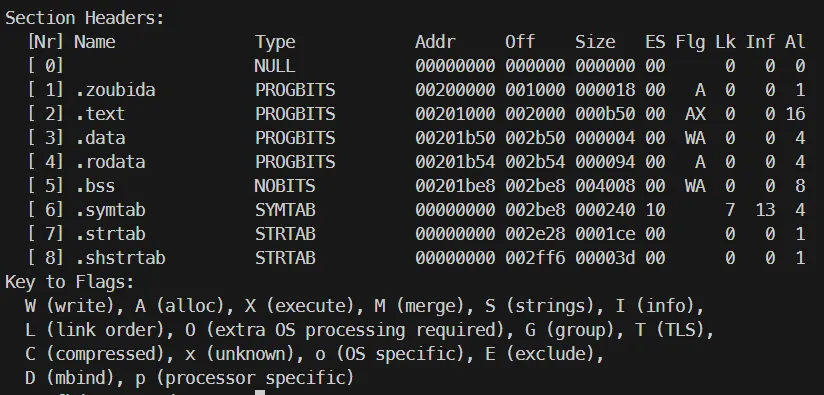
</div>

#### À lire

* <https://www.cs.princeton.edu/courses/archive/spring09/cos217/lectures/02_SimplePrograms.pdf>

* <https://man7.org/linux/man-pages/man5/elf.5.html>

* /DISCARD/ : <https://sourceware.org/binutils/docs/ld/Output-Section-Discarding.html>

Bon, allez, on va siffler la fin de la récré car sinon on va y passer la nuit. Je te propose de passer dans le terminal du container, de faire un `make clean` suivit d'un `exit`, de repasser sur ton terminal puis de mettre tout ça sur [GitHub](https://github.com/40tude/sos2/tree/main) à partir de VSCode.

## Conclusion

Si on prend un peu de recul, à part `main.c` on a touché aucun des fichiers du répertoire `sos`. Même chose pour les répertoires `drivers` et `hwcore`. Oui, bien sûr, on a touché au répertoire `bootstrap` mais bon, au final, on peut attaquer dans la joie et la bonne humeur les autres épisodes de la série. On a une toolchain moderne, solide, indépendante de l'OS qui l'héberge... Et nom de Zeus, réalise qu'on a fait un peu de bouche à bouche à un code qui a 20 ans et zou il est reparti. Moi, perso, je trouve ça vraiment cool.

Maintenant, ce qui m'excite le plus, c'est d'attaquer le second épisode de la série qui traite de la segmentation mémoire et des interruptions. J'ai hâte de voir comment l'adaptation va se passer. Cela fera sans doute l'objet d'un second billet de blog.

*Allez, à plus et la suite au prochain épisode...*

### PS-1 : Warnings lors du make sos2

Si on lit attentivement tous les messages lors d'un make sos2, on peut voir les lignes suivantes :

```bash
ld: warning: build/multiboot_header.o: missing .note.GNU-stack section implies executable stack
ld: NOTE: This behaviour is deprecated and will be removed in a future version of the linker
ld: warning: target/iso/boot/sos2.bin has a LOAD segment with RWX permissions
```

Google est notre ami... Pour y remédier je propose de faire 2 choses.

1 - Modifier le fichier ``sos2.ld`` comme ci-dessous :

```assembly
ENTRY(start)

SECTIONS {
    . = 2M;

    .zoubida :
    {
      /* ensure that the multiboot header is at the beginning */
      *(.multiboot_header)
    }

    .text : ALIGN(CONSTANT(MAXPAGESIZE))
    {
      *(.text)
    }

    .data : ALIGN(CONSTANT(MAXPAGESIZE))
    {
      *(.data*)
    }

    .rodata : ALIGN(CONSTANT(MAXPAGESIZE))
    {
      *(.rodata*)
    }

    .bss : ALIGN(CONSTANT(MAXPAGESIZE))
    {
      *(.bss)
    }

    /DISCARD/ :{
      *(.comment)
    }
}
```

On ne retrouve pas les `__b_load` et autres qu'il y avait dans le fichier `sos.lds` car ces symboles étaient utilisés dans `multiboot.S` ou `sos_bsect.lds` (cas de `__b_load` par exemple). Comme ils ne sont pas utilisés jusqu'à présent dans sos2, autant ne pas charger sos2.ld inutilement.

2 - Rajouter la ligne ci-dessous tout en bas des fichiers `multiboot.asm` et `multiboot_header.asm`.

```assembly
section .note.GNU-stack noalloc noexec nowrite progbits             ; https://wiki.gentoo.org/wiki/Hardened/GNU_stack_quickstart
                                                                    ; https://stackoverflow.com/questions/73435637/how-can-i-fix-usr-bin-ld-warning-trap-o-missing-note-gnu-stack-section-imp
```

Par exemple, voilà ce à quoi ressemble la fin de `multiboot_header.asm`

<div align="center">
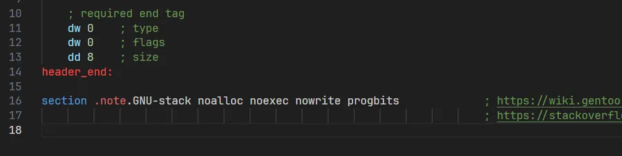
</div>

#### À lire

* <https://osdev.org/Linker_Scripts> à propos du warning RWX permissions et de la solution

* <https://www.redhat.com/en/blog/linkers-warnings-about-executable-stacks-and-segments>

### PS-2 :
* À l'attention des développeurs du soi-disant "éditeur" de WordPress... Je vous hais d'une force messieurs... Vous ne pouvez pas imaginer.
* 02 01 2025 : qu'est ce que je suis content d'avoir quitté Wordpress et de tout éditer sous VSCode 😁
