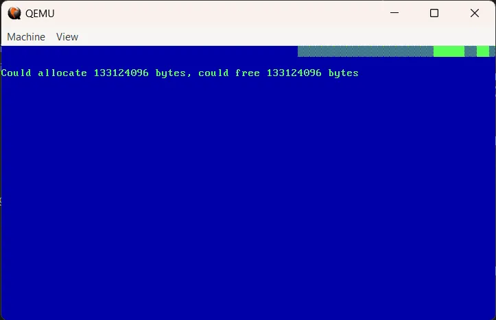
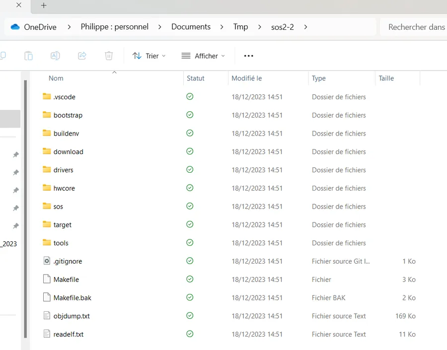
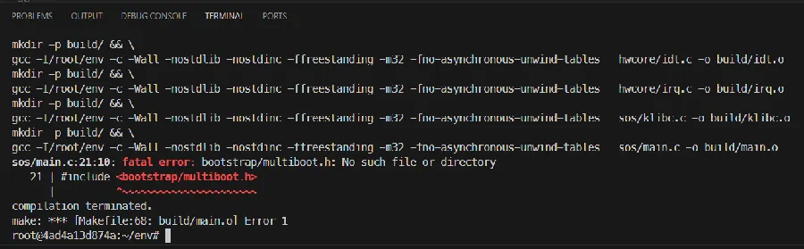
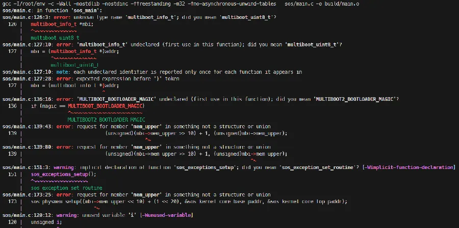
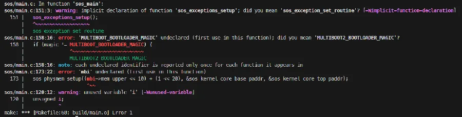
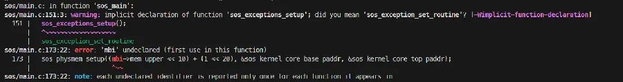
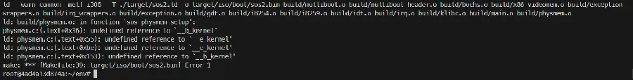
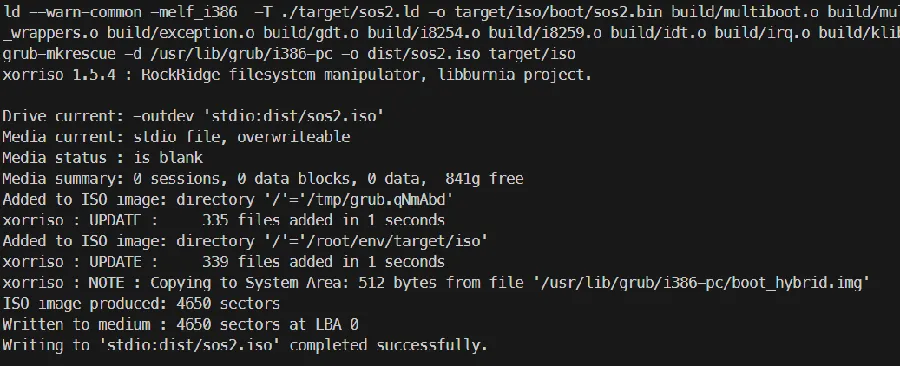
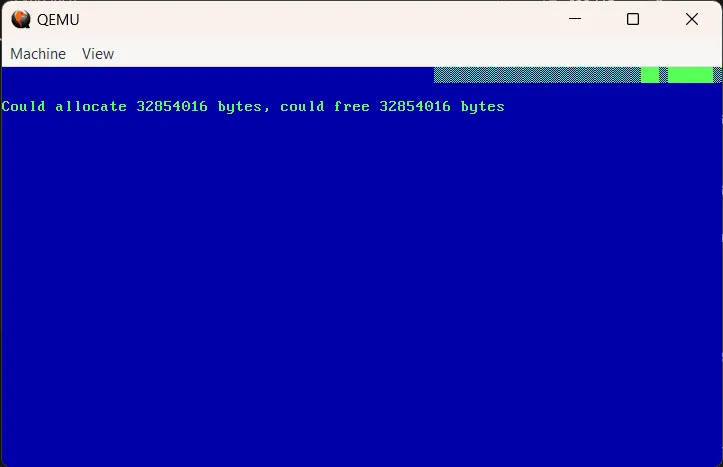

## Les épisodes précédents

* [Episode 1](https://www.40tude.fr/sos-2-le-retour-20-ans-apres/) (vaut mieux lire le 1 avant le 0)

* [Episode 0](https://www.40tude.fr/sos-2-le-retour-20-ans-apres-episode-0/)

* [Episode 2](https://www.40tude.fr/sos-2-le-retour-20-ans-apres-episode-2/)

## Introduction

Si tu arrives ici par hasard, note que l'idée c'est de faire tourner, dans un contexte remis au goût du jour, un OS 32 bits dont le code date d'une vingtaine d'années. Ce qui est vraiment génial c'est que **Simple OS** (c'est le nom de l'OS en question) est excessivement bien documenté car, à l'époque, toute une série d'articles étaient parus à son sujet dans Linux Mag. Je te laisse lire [les articles de l'époque](http://sos.enix.org/fr/SOSDownload) ainsi que les [épisodes précédents](https://www.40tude.fr/sos-2-le-retour-20-ans-apres/) de cette série. En ce qui concerne mes billets, je t'incite très fortement à lire le 1 puis le 0 puis de reprendre un ordre "normal" (oui, je confirme, la vie n'est pas un long fleuve tranquille).

Dans l'épisode 3, l'article original parle de la gestion de la mémoire physique.

<div align="center">

</div>


Voilà ce qui tourne ce soir sur mon PC

<div align="center">

</div>


Dans le reste de ce billet j'explique comment y arriver. Je suppose que tu as lu les épisodes précédents de cette série ainsi que les articles originaux. Je ne reviens pas dessus mais je suppose aussi que Docker et QEMU sont installés. Si ce n'est pas le cas, ce n'est pas très grave. Lis les articles 1 et 2. En ce qui concerne sos2-2 (résultat de l'épisode 2) tu peux récupérer l'ensemble de l'arborescence sur [GitHub](https://github.com/40tude/sos2-2/tree/main). Quand c'est fait, extraie le zip dans un répertoire quelconque. Attention, quand tu dézippe vérifies que les fichiers du projet sont bien sous `./sos2-2` et qu'il n'y a pas une arborescence du style `./sos2-2/sos2-main` avec les fichiers en dessous. Si c'est le cas, remonte les fichiers et les répertoires du projet d'un cran pour qu'ils soient bien tous directement sous `./sos2-2`. Bref, il faut que tu arrives à un truc du style :

<div align="center">

</div>


Ensuite copie-colle le code ci-dessous dans un script PowerShell que tu dois nommer `Create_sos2-3.ps1` (voir contenu du script). Prends soin à ce que, dans l'arborescence des fichiers, ce script soit "au-dessus" du répertoire `sos2-2`. Comme d'habitude maintenant, l'objectif du script est de :

* Faire une copie de l'arborescence de l'épisode précédent (ici sos2-2)

* De le renommer sos2-3

* De rapatrier, à titre de référence, les sources des épisodes 2 et 3 historiques

* De copier dans l'arborescence de sos2-3 les nouveaux fichiers qui sont apparus entre les versions des épisodes 2 et 3 de SOS. On fait ça afin de coller au mieux au code source original.

```powershell
# Make a copy of the directory containing previous version of sos2 and name it sos2-3
Copy-Item ./sos2-2 ./sos2-3 -Recurse
Set-Location ./sos2-3
if (Test-Path -Path "./.git") {
# Supprimer le répertoire .git
Remove-Item ./.git -Recurse -Force
}
if (Test-Path -Path "./download") {
# Clean up ./download
Get-ChildItem .\download\ | Remove-Item -Recurse -Force
}else{
New-Item ./download -ItemType Directory
}
# Get a copy of the article 2 and article 3
Invoke-WebRequest -URI http://sos.enix.org/wiki-fr/upload/SOSDownload/sos-code-art2.tgz -OutFile ./download/sos-code-art2.tgz
tar -xvzf ./download/sos-code-art2.tgz -C ./download
Invoke-WebRequest -URI http://sos.enix.org/wiki-fr/upload/SOSDownload/sos-code-art3-lm64.tgz -OutFile ./download/sos-code-art3-lm64.tgz
tar -xvzf ./download/sos-code-art3-lm64.tgz -C ./download
# Compare both directories and display differences
$Directories = Get-ChildItem .\download\sos-code-article3\ -Directory
foreach ( $Directory in $Directories) {
$Name = Split-Path -Path $Directory -Leaf
$Prev_Ver = Get-ChildItem -Recurse -Path .\download\sos-code-article2\$Name
$New_Ver = Get-ChildItem -Recurse -Path .\download\sos-code-article3\$Name
# Compare-Object $Prev_Ver $New_Ver -Property Name, Length -IncludeEqual
Compare-Object $Prev_Ver $New_Ver -Property Name, Length
}
# Replace the current ./hwcore with the one coming from article2
# Copy-Item ./download/sos-code-article2/hwcore ./ -Recurse -Force
# update main.c and types.h with version from article 2
Copy-Item ./download/sos-code-article3/sos/errno.h ./sos/errno.h
Copy-Item ./download/sos-code-article3/sos/list.h ./sos/list.h
Copy-Item ./download/sos-code-article3/sos/macros.h ./sos/macros.h
Copy-Item ./download/sos-code-article3/sos/main.c ./sos/main.c
Copy-Item ./download/sos-code-article3/sos/physmem.c ./sos/physmem.c
Copy-Item ./download/sos-code-article3/sos/physmem.h ./sos/physmem.h
Copy-Item ./download/sos-code-article3/sos/types.h ./sos/types.h
# Copy Create_sos2-2.ps1 in ./tools/Create_sos2-2.ps1
Copy-Item ../Create_sos2-3.ps1 ./tools/Create_sos2-3.ps1
# Remove-Item ../Create_sos2-3.ps1
# Launch VSCode from the current dir
# code .
```

Note qu'à la toute fin du script il y a 2 lignes qui sont en commentaire et que tu peux activer si tu souhaites supprimer, du répertoire du dessus, le script. Pas d'angoisse, une copie du script a été faite et se trouve dans `./tools`. Sinon la dernière ligne lance l'excellent VSCode.

Bon, allez, on "build" le projet.

Ça va râler un peu mais ce n'est pas grave... Depuis le terminal de VSCode, lance l'image Docker avec la commande suivante :

```plain
docker run --rm -it -v $pwd/:/root/env sos2-buildenv
```

Ensuite, depuis le terminal de l'image, tu "build" avec les commandes :

```plain
make clean
make
```

Voilà ce que je vois

<div align="center">

</div>


Ça, c'est facile. C'est même un classique dorénavant. Cette erreur de compilation est due au fait que le `main.c` de l'épisode 3 historique "cause" Grub 1 alors que SOS2 doit parler Grub 2... Relis les épisodes précédents si besoin. Dans `main.c` il faut faire la modification suivante :

```plain
// #include <bootstrap/multiboot.h>
#include <sos/multiboot2.h>
```

Build.

```plain
Make clean
Make
```

Du coup il y [cialis sans ordonnance](https://www.e-vroum.fr/acheter-cialis-en-ligne-sans-ordonnance-decouvrez-nos-reductions-exceptionnelles.html)
a plus de messages mais ce n'est pas trop gênant... Ce sont encore des histoires de structures de données liées à Grub 1

<div align="center">

</div>


Dans le fichier `main.c` je te propose de faire les modifications suivantes :

```plain
// multiboot_info_t *mbi;
// mbi = (multiboot_info_t *) addr;
```

Puis

```plain
// if (magic == MULTIBOOT_BOOTLOADER_MAGIC)
// /* Loaded with Grub */
// sos_x86_videomem_printf(1, 0,
// SOS_X86_VIDEO_FG_YELLOW | SOS_X86_VIDEO_BG_BLUE,
// "Welcome From GRUB to %s%c RAM is %dMB (upper mem = 0x%x kB)",
// "SOS", ',',
// (unsigned)(mbi->mem_upper >> 10) + 1,
// (unsigned)mbi->mem_upper);
// else
// /* Not loaded with grub */
// sos_x86_videomem_printf(1, 0,
// SOS_X86_VIDEO_FG_YELLOW | SOS_X86_VIDEO_BG_BLUE,
// "Welcome to SOS");
```

On sauve, on build.

```plain
Make clean
Make
```

Il reste des erreurs

<div align="center">

</div>


CTRL+click sur la ligne `main.c 158` puis tu mets en commentaire les lignes ci-dessous :

```plain
// if (magic != MULTIBOOT_BOOTLOADER_MAGIC) {
// sos_x86_videomem_putstring(20, 0, SOS_X86_VIDEO_FG_LTRED | SOS_X86_VIDEO_BG_BLUE | SOS_X86_VIDEO_FG_BLINKING, "I'm not loaded with Grub !");
// /* STOP ! */
// for (;;)
// continue;
// }
```

Il y a aussi un warning à cause d'une variable `i` qui n'est pas utilisée. Il faut appliquer la correction suivante :

```plain
//unsigned i;
```

On sauve, on build.

```plain
Make clean
Make
```

Quand y en a plus, y en a encore... Voilà ce que je vois :

<div align="center">

</div>


Là, c'est plus "touchy"... Mais bon on peut résoudre le premier warning en se rappelant que dans l'épisode 2 j'avais renommé la fonction `sos_exceptions_setup()` en `sos_install_dbl_fault_exceptions()`. Toujours dans `main.c` il faut donc appliquer la modification suivante :

```plain
//sos_exceptions_setup();
sos_install_dbl_fault_exceptions();
```

Ensuite, si on étudie un peu le code on réalise qu'il faut alimenter la fonction `sos_physmem_setup()` avec la limite haute de la RAM. Pour cela il faut utiliser les informations que nous donne Grub 2 et modifier le code comme suit (oui, oui je sais on peut faire beaucoup mieux mais comme j'ai hâte de voir si ça démarre je copie-colle un bout de code qui marchait dans l'épisode 1) :

```plain
struct multiboot_tag *tag;
for (tag = (struct multiboot_tag *)(addr + 8); tag->type != MULTIBOOT_TAG_TYPE_END; tag = (struct multiboot_tag *)((multiboot_uint8_t *)tag + ((tag->size + 7) & ~7))) {
switch (tag->type) {
case MULTIBOOT_TAG_TYPE_BASIC_MEMINFO:
mem_upper = ((struct multiboot_tag_basic_meminfo *)tag)->mem_upper;
break;
}
}
// sos_physmem_setup((mbi->mem_upper << 10) + (1 << 20), &sos_kernel_core_base_paddr, &sos_kernel_core_top_paddr);
sos_physmem_setup((mem_upper << 10) + (1 << 20), &sos_kernel_core_base_paddr, &sos_kernel_core_top_paddr);
```

Bien sûr, au tout début de la fonction `sos_main()` il faut pas oublier de déclarer la nouvelle variable `mem_upper` :

```plain
void sos_main(unsigned long magic, unsigned long addr) {
// unsigned i;
unsigned mem_upper = 0;
...
```

Youpi ! Il n'y a plus d'erreur ni de warning à la compil' mais l'édition de liens ne passe pas...

<div align="center">

</div>


Normal, comme expliqué dans les messages qui sont à l'écran, on n'a pas défini les variables `__b_kernel` et `__e_kernel`. Il faut modifier le fichier `target\sos2.ld` comme suit :

Dans le haut du fichier on ajoute une ligne "`__b_kernel = .;`" au tout début de la section `.text`

```plain
.text : ALIGN(CONSTANT(MAXPAGESIZE))
{
/* Defines a symbol '__b_kernel to mark the start of the kernel code/data */
__b_kernel = .;
*(.text)
........
```

Je ne déclare pas exactement l'étiquette `__b_kernel` comme dans le fichier `.lds` de l'article historique mais cela revient au même. En fait grâce à la consigne `ALIGN(CONSTANT(MAXPAGESIZE))` l'étiquette `.text` est alignée sur une page. Comme `__b_kernel` apparait juste après, le compteur (symbolisé par le `.`) ne va pas bouger entre temps. Finalement `__b_kernel` identifie bien le début du code et est bien alignée. Prends le temps de relire l'article original, compare et persuade toi que les fichiers `.lds` de SOS et `.ld` de SOS2 organisent le code de la même façon.

À la fin c'est un peu pareil, on ajoute une ligne (pour définir la valeur de `__e_kernel`) juste avant la section `DISCARD`

```plain
/* We take note of the end of the kernel */
__e_kernel = .;
/DISCARD/ :{
..........
```

On sauve, on build.

```plain
Make clean
Make
```

Il n'y a plus d'erreur ni de warning.

<div align="center">

</div>


Allez, depuis VSCode, on lance l'émulateur dans un second terminal PowerShell:

```plain
qemu-system-i386 -cdrom ./dist/sos2.iso
```
<div align="center">

</div>


Si dans un second test je lance l'émulateur avec cette commande :

```plain
qemu-system-i386 -m 32M -cdrom ./dist/sos2.iso
```

Voilà ce que je vois :

<div align="center">

</div>

## Conclusion

Si on compare avec les épisodes précédents, on ne s'en sort vraiment pas trop mal. C'est vrai que le chapitre en question traite surtout de structures de données en C, mais bon, si tous les épisodes à venir pouvaient se passer de la même façon... Sinon, je viens tout juste de déposer [SOS2-3 sur GitHub](https://github.com/40tude/sos2-3). Je réalise qu'il est peut-être temps de faire un peu de ménage : le `main.c` me parait bien encombré, il y a des `.bak` un peu partout et des `readelf.txt` ou `objdump.txt` qui ne sont pas d'actualité dans ce chapitre. Bref, je crois que je vais faire un peu de rangement. Ah oui, et si j'ai 2 minutes j'en profiterais pour corriger la rustine qui permet d'initialiser la variable `mem_upper`...

*Allez, à plus et la suite au prochain épisode...*

