## Les épisodes précédents

* [Episode 0](https://www.40tude.fr/sos-2-le-retour-20-ans-apres-episode-0/)

* [Episode 1](https://www.40tude.fr/sos-2-le-retour-20-ans-apres/)

## Introduction

Je ne reviens pas sur les motivations etc. Si tu arrives ici par hasard, note que l'idée c'est de faire tourner, dans un contexte remis au goût du jour, un OS 32 bits dont le code date d'une vingtaine d'années. Ce qui est vraiment génial c'est que Simple OS (c'est le nom de l'OS en question) est excessivement bien documenté car, à l'époque, toute une série d'articles étaient parus à son sujet dans Linux Mag. Je te laisse lire [les articles de l'époque](http://sos.enix.org/fr/SOSDownload) ainsi que l'épisode 1 puis l'épisode 0 de cette série (oui, je sais, c'est bizarre mais c'est mieux comme ça).

<div align="center">
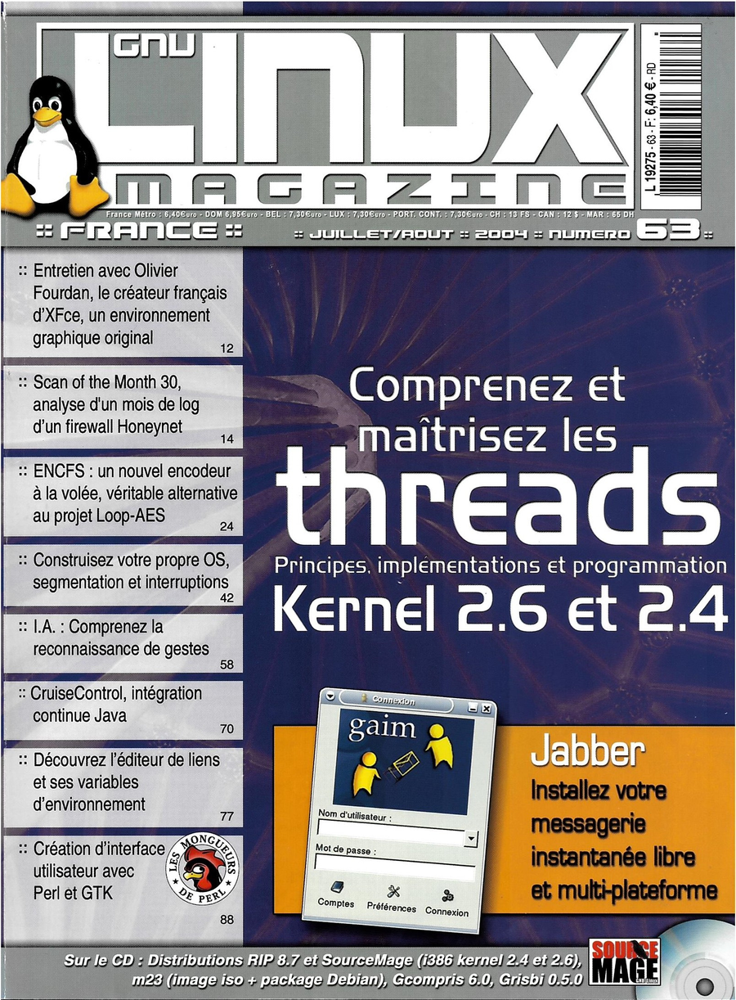
</div>


Bon, alors, c'est quoi le sujet du jour et qu'est-ce qui tourne ? Dans l'épisode 2 on met en place l'organisation de la mémoire (GDT, Basic Flat, 4GB...) ainsi que la gestion des interruptions (exceptions, IRQ mais pas les interruptions soft pour l'instant). Donc au menu on a mémoire ET interruptions en mode protégé.

En ce qui concerne le code de démo il tourne de nouveau (voir ci-dessous). Ne t'occupe pas de ce qui est à l'écran, on en reparlera peut-être plus loin (c'étaient des infos de debug). Cela dit, note juste qu'en haut à droite en vert c'est la preuve que les IRQ du [82C54](https://pdos.csail.mit.edu/6.828/2018/readings/hardware/82C54.pdf) sont bien prises en compte et qu'à gauche, en rouge, c'est la preuve qu'on réagit aux exceptions générées par des divisions par 0.

<div align="center">
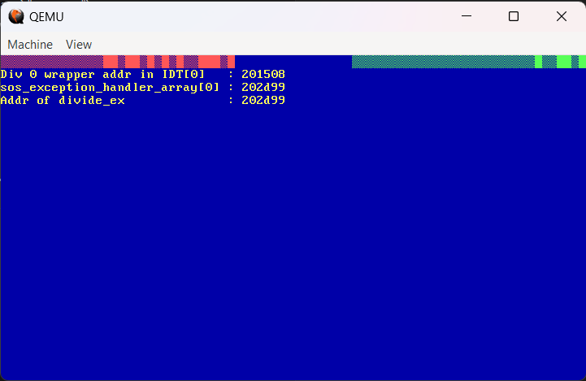
</div>


Après avoir terminé l'épisode 1, je pensais que le portage de l'épisode 2 allait se passer dans la joie et la bonne humeur. Que nenni... J'en ai bavé à cause d'un truc tout bête dont j'ai un peu honte après coup mais bon... Mes soucis au début de l'épisode 2 m'ont même obligé à faire ce que je ne voulais surtout pas faire : remonter un setup complet de l'époque (machine, Debian, GCC et Grub d'époque...). Cela a d'ailleurs fait l'objet de la rédaction de [l'épisode 0](https://www.40tude.fr/sos-2-le-retour-20-ans-apres-episode-0/). Ça a été une vraie galère mais il fallait que je me donne les moyens de comparer des pommes avec des pommes... Bref, les débuts de l'épisode 2 ont été très laborieux mais ce soir je suis au milieu du gué car j'estime que l'épisode 2 en est à sa moitié.

OK... Tu peux traduire ? Ça tourne mais tout le code assembleur spécifique à cet opus n'a pas encore été réécrit en NASM. Il y a donc 2 parties dans cet épisode 2 :

* **Episode 2, partie 1** : où je porte le code en gardant les codes assembleur à la syntaxe GAS

* **Episode 2, partie 2** : où le code assembleur aura été traduit en NASM

Non, je ne sais pas encore si je vais créer 2 billets différents ou laisser les 2 parties sur la même page web.

## Partie 1 où on garde le code assembleur en GAS

Je suppose que tu as le setup dont on a discuté dans [l'épisode 1](https://www.40tude.fr/sos-2-le-retour-20-ans-apres/) (docker, QEMU etc.) ainsi qu'un répertoire `sos2` qui contient le code du même épisode. Si ce n'est pas le cas ce n'est pas grave, on s'adapte. Relis l'épisode 1 et récupère le code sur [GitHub](https://github.com/40tude/sos2). Par exemple récupère un zip et extraie-le. Pour la suite, il faut juste que le répertoire s'appelle `sos2`. Attention, si tu dézippe vérifies que les fichiers du projet sont bien sous `./sos2` et qu'il n'y a pas une arborescence du style `./sos2/sos2-main` avec les fichiers en dessous. Si c'est le cas, remonte les fichiers et les répertoires du projet d'un cran pour qu'ils soient bien sous `./sos2`.

<div align="center">
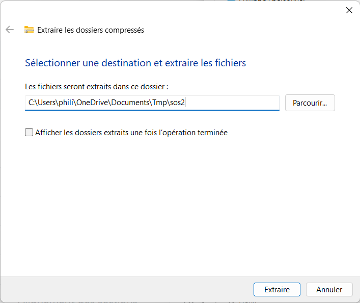
</div>


Ensuite copie-colle ce script dans un script PowerShell que tu peux nommer `Create_sos2-2.ps1` par exemple. Prends soin à ce que dans l'arborescence des fichiers, il soit "au-dessus" du répertoire `sos2`.

```powershell
# Make a copy of the directory containing previous version of sos2 and name it sos2-2
Copy-Item ./sos2 ./sos2-2 -Recurse
Set-Location ./sos2-2
if (Test-Path -Path "./.git") {
# Supprimer le répertoire ./sos2-2/.git
Remove-Item ./.git -Recurse -Force
}
if (Test-Path -Path "./download") {
# Clean up ./download
Get-ChildItem .\download\ | Remove-Item -Recurse -Force
}else{
New-Item ./download -ItemType Directory
}
# Get a copy of the article 1 and article 2
Invoke-WebRequest -URI http://sos.enix.org/wiki-fr/upload/SOSDownload/sos-code-art1.tgz -OutFile ./download/sos-code-art1.tgz
tar -xvzf ./download/sos-code-art1.tgz -C ./download
Invoke-WebRequest -URI http://sos.enix.org/wiki-fr/upload/SOSDownload/sos-code-art2.tgz -OutFile ./download/sos-code-art2.tgz
tar -xvzf ./download/sos-code-art2.tgz -C ./download
# Compare both directories and display differences
$Directories = Get-ChildItem .\download\sos-code-article2\ -Directory
foreach ( $Directory in $Directories) {
$Name = Split-Path -Path $Directory -Leaf
$Prev_Ver = Get-ChildItem -Recurse -Path .\download\sos-code-article1\$Name
$New_Ver = Get-ChildItem -Recurse -Path .\download\sos-code-article2\$Name
# Compare-Object $Prev_Ver $New_Ver -Property Name, Length -IncludeEqual
Compare-Object $Prev_Ver $New_Ver -Property Name, Length
}
# Replace the current ./hwcore with the one coming from article2
Copy-Item ./download/sos-code-article2/hwcore ./ -Recurse -Force
# update main.c and types.h with version from article 2
Copy-Item ./download/sos-code-article2/sos/main.c ./sos/main.c
Copy-Item ./download/sos-code-article2/sos/types.h ./sos/types.h
# Copy Create_sos2-2.ps1 in ./tools/Create_sos2-2.ps1
Copy-Item ../Create_sos2-2.ps1 ./tools/Create_sos2-2.ps1
# Remove-Item ../Create_sos2-2.ps1
# Launch VSCode from the current dir
# code .
```

Arborescence au début de l'épisode 2 doit ressembler à ça :

<div align="center">
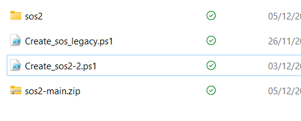
</div>


Ensuite tu ouvres une console PowerShell et tu lance le script (si problème relis le paragraphe 2 de Episode 1, c'est sans doute un souci de ExecutionPolicy)

<div align="center">

</div>

### Séquence explications

* On fait une copie du répertoire `sos2`

* Le répertoire du projet s'appelle `sos2-2` (le `-2` c'est pour épisode 2)

* `./sos2/download` contient les projets `sos` "canal historique" des épisodes 1 et 2

* À titre d'info on compare les répertoires et on affiche les différences

* On remonte d'un cran certains source qui n'existaient pas ou qui étaient très différents dans l'épisode 1 : `sos_main.c`, le répertoire `hw_core`...

### TO DO :

* Script d'installation similaire mais pour Linux

### Nouveau Makefile

Lance VSCode ou ton environnement de développement préféré. Concernant le nouveau `Makefile`. Allez, c'est Noyel, c'est cadeau... Non, en fait, pas du tout... À l'usage je trouvais que le précédent `Makefile` utilisait des variables qui n'étaient pas bien nommées. En plus il faut pour cette partie de l'épisode 2, supporter les fichiers assembleur écrit avec la syntaxe GAS etc.

Bon, bref, il y a 2 choses à faire :

* Renomme le `Makefile` en `Makefile.bak`

* Copie colle le code ci-dessous dans un nouveau fichier `Makefile`

```cpp
// #include <bootstrap/multiboot.h>
#include <sos/multiboot2.h>
```

3. Commenter les lignes 85 et 86. C'est du pur multiboot1.

```cpp
// multiboot_info_t *mbi;
// mbi = (multiboot_info_t *) addr;
```

4. Commenter les lignes 95-107. En fait, on s'en fout un peu car dans l'épisode 1 on a déjà validé qu'on démarrait dorénavant en Grub 2.

```cpp
// if (magic == MULTIBOOT_BOOTLOADER_MAGIC)
// /* Loaded with Grub */
// sos_x86_videomem_printf(1, 0,
// SOS_X86_VIDEO_FG_YELLOW | SOS_X86_VIDEO_BG_BLUE,
// "Welcome From GRUB to %s%c RAM is %dMB (upper mem = 0x%x kB)",
// "SOS", ',',
// (unsigned)(mbi->mem_upper >> 10) + 1,
// (unsigned)mbi->mem_upper);
// else
// /* Not loaded with grub */
// sos_x86_videomem_printf(1, 0,
// SOS_X86_VIDEO_FG_YELLOW | SOS_X86_VIDEO_BG_BLUE,
// "Welcome to SOS");
```

Sauve, `Make clean`, `Make`

#### Remarque

Je ne vais plus pouvoir faire référence aux numéros de lignes car mon VSCode utilise un fichier `.clang-format` avec, entre autres, une largeur de ligne de 180. Quand je sauve un fichier il le réorganise comme je le souhaite mais les N° de ligne ne coïncident plus. Bon, ceci dit, tout ça c'est des détails.

Ça doit passer à la compile et à l'édition de liens. Il y a un ou deux petits warnings mais rien de très grave. Voilà ce que je vois dans le terminal `docker` de VSCode :

<div align="center">
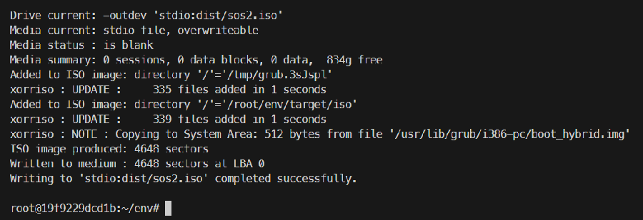
</div>


Ouvre un second terminal `pwsh` dans VSCode et lance QEMU. Si tu ne comprends rien à ce que je raconte, je te conseille d'aller lire l'épisode 1.

```powershell
qemu-system-i386 -cdrom ./dist/sos2.iso
```

Nom de Zeus, ça marche !

<div align="center">
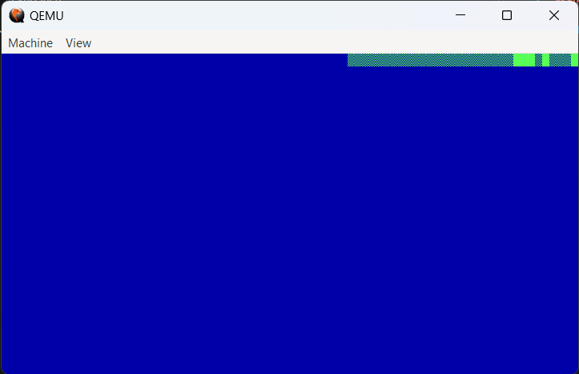
</div>


Heu... En fait, ça marche mais ça marche à moitié... En effet, si on illustre bien les IRQ (ça clignote en haut à droite en vert) on a aucun signe des exceptions (ça devrait clignoter en haut à gauche en rouge). Par exemple, voilà une capture du code de démo de l'époque :

<div align="center">
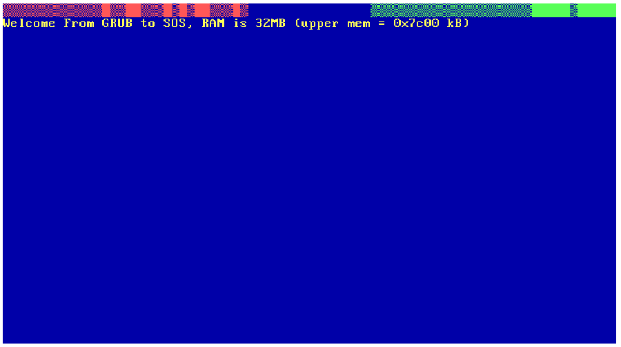
</div>


Bref... Il en manque un bout. Et ne viens pas me faire suer avec le texte qui ne s'affiche pas. Ce sont des informations Grub1 qu'on a commenté au début du "transportage" du code. "Mais sois un peu à ce que tu fais, bon sang !" 😁

<div align="center">

</div>


Et là commence un long, un très long moment de solitude... Je ne vais pas m'éterniser mais en gros tu sais que le code a fonctionné, il est donc valide mais là, tu cherches et tu trouves... Rien. J'ai remis en cause l'éditeur de lien, les segments de code, le compilateur... Pour finir, comme je l'ai dit je me suis senti obligé de faire une chose que je voulais absolument éviter : remonter une configuration identique à celle de l'époque. Cela a donné lieu à [l'épisode 0](https://www.40tude.fr/sos-2-le-retour-20-ans-apres-episode-0/) de cette série. Oui, oui, j'ai appris des trucs mais bon, cela n'a pas été une sinécure... N'empêche... Tu te prouves que le code fonctionnait bien à l'époque, then what? SOS2 a des bouts en NASM, la version du compilateur n'est plus la même... Tu cherches, tu fouilles, t'efface tout, tu recommence tout, tu relis tout... Le pire c'est que si tu as bien lu le second article paru dans Linux Mag, tu sais que si les IRQ fonctionnent, les exceptions doivent fonctionner. Mais bon tu as toujours des doutes alors tu commences à désassembler le code. Typiquement j'ai pas mal utilisé les 2 commandes ci-dessous :

```cpp
asm volatile("sti\n");
/* Raise a rafale of 'division by 0' exceptions. All this code is
not really needed (equivalent to a bare "i=1/0;"), except when
compiling with -O3: "i=1/0;" is considered dead code with gcc
-O3. */
i = 10;
while (1) {
/* Stupid function call to fool gcc optimizations */
sos_bochs_printf("i = 1 / %d...\n", i);
i = 1 / i;
}
/* Will never print this since the "divide by zero" exception always
returns to the faulting instruction (see Intel x86 doc vol 3,
section 5.12), thus re-evaluating the "divide-by-zero" exprssion
and raising the "divide by zero" exception again and again... */
sos_x86_videomem_putstring(2, 0, SOS_X86_VIDEO_FG_LTRED | SOS_X86_VIDEO_BG_BLUE, "Invisible");
return;
```

Le code assembleur correspondant. On retrouve bien le `sti` et le call `sos_bochs_printf`

```c
while (1) {
/* Stupid function call to fool gcc optimizations */
// sos_bochs_printf("i = 1 / %d...\n", i);
// i = 1 / i;
asm volatile("mov $0x1, %eax \n\
mov $0x0, %edx \n\
divl -0x8(%ebp) \n\
mov %eax, -0x8(%ebp) \n\
");
}
```

Sauve tous les fichiers, `Make clean`, `Make` et relance `qemu-system-i386`.

Ça doit passer "crème". GCC va chouiner un peu car, la variable `i` n'est pas utilisé. On s'en fiche. Tadaaa ! À priori on a trouvé ce qui clochait (compilateur trop malin...).

<div align="center">
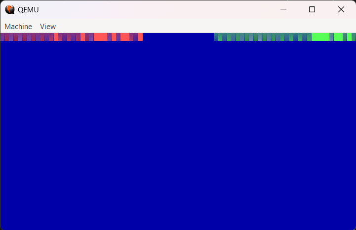
</div>


À ce niveau, tu peux retourner dans la fonction `sos_main()` et, si cela te fait plaisir, mettre les lignes où `i` apparait en commentaire ("`unsigned i;`" au début de sos_main() et "i=10;" juste avant la boucle "tant-que").

On n'est pas trop mal. Je te propose de lire, relire et re-relire l'article de l'épisode 2. C'est dense et c'est sûr il y a des trucs que tu as raté. Ci-dessous un exemple de ce que cela donne chez moi. Cela dit, je ne suis pas le plus malin et j'ai passé beaucoup de temps à chercher une raison pour laquelle les exceptions de type division par zéro ne seraient pas levées ni traitées correctement.

<div align="center">
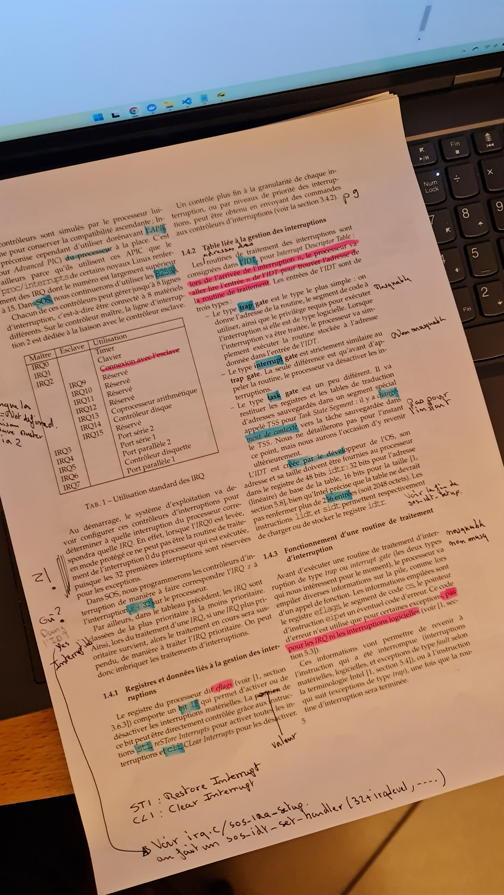
</div>


Pour le reste, afin de respecter le cahier des charges initial (voir épisode 1) il ne reste plus qu'à transformer les deux fichiers assembleur `./hwcore/exception_wrappers.S` et `./hwcore/irq_wrappers.S` qui respectent la syntaxe AT&T en fichiers assembleur à la syntaxe Intel.

Bon ben "yaka, faukon". Cela dit, comme j'ai passé pas mal de temps sur l'article, je copie/colle mes notes de lecture. L'article est clair, il n'y a pas de soucis mais bon parfois, lire ou entendre des explications avec des mots différents ça peut aider. En tout cas je souhaite garder une trace.

#### Mes notes de lecture à propos des exceptions

**Première série de notes :**

* Depuis `sos_main` on appelle `exception.c/sos_exception_set_routine` et on passe `divide_ex`

* Depuis `exception.c/sos_exception_set_routine`

* On met à jour `exception.c/sos_exception_handler_array[exception_number]` avec l'adresse mémoire de `routine`

* On appelle ensuite `idt.c/sos_idt_set_handler(SOS_EXCEPT_BASE + exception_number, (sos_vaddr_t)sos_exception_wrapper_array[exception_number], 0)`

* Bien voir qu'en second paramètre on passe l'adresse du wrapper assembleur de l'exception en question

* Ce dernier est stocké dans `sos_exception_wrapper_array[exception_number]`

* On met à jour l'IDT

* Au lieu de `sos_idt_set_handler(int index, sos_vaddr_t handler_address, int lowest_priviledge)`

* Faudrait `sos_idt_set_wrapper(int index, sos_vaddr_t wrapper_address, int lowest_priviledge)`

* => Changer le nom de la fonction ?

**Seconde série de notes :**

* Voir fig 5 p 7

* Quand une interruption n (exception, IRQ...) arrive, le processeur lit l'entrée n de l'idt

* Il y trouve l'adresse du wrapper.

* C'est la routine assembleur de traitement qui va, après avoir sauvé les registres, appeler le handler qui lui est écrit en C

* L'adresse du handler est dans `exception.c/sos_exception_handler_array[]`

* `sos_exception_handler_array[]` est référencé dans exception_wrappers.S

* Dans `sos/main.c` l'idt est initialisée lors de l'appel `sos_idt_setup()`
  + On initialise les 256 entrées etc.

  + Ce sont toutes des interrutions de type interrupt gate (0x06) non interruptibles

  + On charge l'`idt` avec l'instruction `lidt`

* Ensuite toujours dans `sos/main.c` on appelle
  + `sos_exceptions_setup()` (ou `sos_install_dbl_fault_exceptions()`) pour définir le handler des double faute (boucle infinie dans `./hwcore/exception_wrappers.S`)

* Dans `sos/main.c` on appelle ensuite `sos_exception_set_routine(SOS_EXCEPT_DIVIDE_ERROR, divide_ex)` pour definir `divide_ex` comme handler de l'exception division par 0
  + `divide_ex` est de type sos_exception_handler_t

* `sos_exception_set_routine` est définie dans `./hwcore/exception.c`
  + On met à jour le tableau `sos_exception_handler_array[]` à l'indice `SOS_EXCEPT_DIVIDE_ERROR` avec l'adr de `divide_ex`

  + Voir `sos_exception_handler_array[exception_number] = routine;`

  + Le tableau `sos_exception_handler_array[]` est défini dans `exception.c` et référencé dans `exception_wrapper.S`

  + Ensuite on appelle `idt.c/sos_idt_set_handler(SOS_EXCEPT_BASE + exception_number, sos_exception_wrapper_array[exception_number], 0)`

  + `sos_exception_wrapper_array[]` est défini dans `exception_wrappers.S`
    - C'est un tableau qui contient les adr des routines assembleur (wrappers) de 0 à 31

    - Dans `exception_wrappers.S` selon que la routine retourne ou non un code d'erreur elle est encodée d'une façon ou d'une autre

  + Dans `idt.c/sos_idt_set_handler`
    - on met à jour le contenu du tableau idt.

    - idt a 256 entrées sous forme de structures

    - Un des champs de la struct dit qu'il existe un handler.

    - 2 autres champs ont l'adr du handler

    - l'adr du handler passée c'est l'adr de la cellule du tableau `sos_exception_wrapper_array[exception_number]` qui contient l'adr du wrapper, la routine en assembleur

## Partie 2 où le code assembleur est traduit en NASM

Cette partie devrait être assez rapide puisqu'il s'agit de remplacer `exception_wrappers.S` et `irq_wrappers.S` par leur version respective à la sauce "Intel". Je te propose de commencer par renommer les 2 fichiers en question en "`.S.bak`". Ensuite copie-colle les 2 fichiers ci-dessous dans le répertoire ./hwcore :

```
; nasm -f elf32 hwcore/irq_wrappers.asm -o build/irq_wrappers.o

; Address of the table of handlers (defined in irq.c)
extern sos_irq_handler_array

; Address of the table of wrappers (defined below, and shared with irq.c
global sos_irq_wrapper_array

%macro Push_All 0
	push   edi
	push   esi
	push   edx
	push   ecx
	push   ebx
	push   eax
	sub    esp,0x2
	push  ss
	push  ds
	push  es
	push  fs
	push  gs
%endmacro

%macro Pop_All 0
	pop    gs
	pop    fs
	pop    es
	pop    ds
	pop    ss
	add    esp,0x2
	pop    eax
	pop    ebx
	pop    ecx
	pop    edx
	pop    esi
	pop    edi
	pop    ebp
%endmacro

%define Label(id)     sos_irq_wrapper_ %+ id

section .text

; Handlers for the IRQ of Master PIC (0...7)
%assign id 0
%rep    8
  align 4 						      ; NOP by default
  Label(id):                          ; sos_irq_wrapper_0 ... sos_irq_wrapper_7
    push   0x0                        ; Fake error code
    push   ebp                        ; Backup the actual context
    mov    ebp,esp
    Push_All
    mov    al,0x20                    ; Send EOI to PIC. See Intel 8259 datasheet
    out    0x20,al
    push   id                         ; Call the handler with IRQ number as argument
    lea    edi, sos_irq_handler_array
    call   [edi + 4*id]
    add    esp,0x4
    Pop_All                           ; Restore context
    add    esp, 0x4                   ; Remove fake error code
    iret
	%assign id id+1
%endrep

; Handlers for the IRQ of Slave PIC (8...15)
%assign id 8
%rep    8
  align 4 						      ; NOP by default
  Label(id):                          ; sos_irq_wrapper_8 ... sos_irq_wrapper_15
    push   0x0                        ; Fake error code
    push   ebp                        ; Backup the actual context
    mov    ebp,esp
    Push_All
    mov    al,0x20                    ; Send EOI to PIC. See Intel 8259 datasheet
    out    0xa0,al
    out    0x20,al
    push   id                         ; Call the handler with IRQ number as argument
    lea    edi, sos_irq_handler_array
    call   [edi + 4*id]
    add    esp,0x4
    Pop_All                           ; Restore the context
    add    esp,0x4                    ; Remove fake error code
    iret
	%assign id id+1
%endrep

; Build sos_irq_wrapper_array, shared with irq.c
section .rodata
align 32, db 0x0
sos_irq_wrapper_array:
%assign id 0
%rep    16
	dd Label(id)        	         ; sos_irq_wrapper_0 ... sos_irq_wrapper_15
	%assign id id+1
%endrep

section .note.GNU-stack noalloc noexec nowrite progbits             ; https://wiki.gentoo.org/wiki/Hardened/GNU_stack_quickstart
                                                                    ; https://stackoverflow.com/questions/73435637/how-can-i-fix-usr-bin-ld-warning-trap-o-missing-note-gnu-stack-section-imp
```

### Explications rapides

* Le noyau dur, c'est à dire le code des différents wrappers et une traduction directe du code original. Voir le contenu du fichier `irq_wrappers.S`

* Sinon, il y a 2 macros pour sauvegarder puis récupérer les registres

* Il y a une macro qui prend en paramètre `Id`. Si `Id` faut 8, la macro génère un label qui se nomme `sos_irq_wrapper_8`

* Ensuite on utilise une facilité de NASM qui permet de répéter des bouts de code (voir les pseudo-instructions `%rep`, `%endrep` et `%assign`). En gros c'est comme une boucle for. On initialise `id` avant la boucle et à chaque tour de boucle on l'incrémente jusqu'à ce qu'il atteigne la valeur du paramètre de `%rep`.

* Entre temps on répete le code mais on peut paramètrer certaines instructions avec `id`. Voir par exemple : `call [edi + 4*id]`.

* Il y a 2 boucles car le code des IRQ est différent selon que le N° de IRQ et inférieure ou supérieure/égale à 8

* À la fin on utilise encore une boucle pour créer le tableau `sos_irq_wrapper_array` qui contient les adresses (les labels) des différentes routines précédentes.

* À la toute fin, la ligne évite un warning. Lire les références web si besoin.

```
; nasm -f elf32 hwcore/exception_wrappers.asm -o build/exception_wrappers.o

; Address of the table of handlers (defined in exception.c)
extern sos_exception_handler_array

; Address of the table of wrappers (defined below), and shared with exception.c
global sos_exception_wrapper_array

%macro Push_All 0
	push   edi
	push   esi
	push   edx
	push   ecx
	push   ebx
	push   eax
	sub    esp,0x2
	push  ss
	push  ds
	push  es
	push  fs
	push  gs
%endmacro

%macro Pop_All 0
	pop    gs
	pop    fs
	pop    es
	pop    ds
	pop    ss
	add    esp,0x2
	pop    eax
	pop    ebx
	pop    ecx
	pop    edx
	pop    esi
	pop    edi
	pop    ebp
%endmacro

%define Label(id)     sos_exception_wrapper_ %+ id

section .text

; Wrappers for exceptions without error code
%macro Exception_No_Err 1
    align 4                       ; NOP by default
    Label(%1):
    push   0x0                    ; Fake error code
    push   ebp                    ; Backup the actual context
    mov    ebp,esp
    Push_All
    push %1                       ; Call the handler with exception number as argument */
    lea  edi, sos_exception_handler_array
    call   [edi + 4*%1]
    add    esp,0x4
    Pop_All                       ; Restore context
    add    esp, 0x4               ; Remove fake error code
    iret
%endmacro

; Wrappers for exceptions with error code
%macro Exception_With_Err 1
  align 4                         ; NOP by default
  Label(%1):
  push   ebp                      ; Backup the context
  mov    ebp,esp
  Push_All
  push   %1                       ; Call the handler with exception number as argument
  lea    edi, sos_exception_handler_array
  call   [edi + 4*%1]
  add    esp,0x4
  Pop_All                         ; Restore context
  add    esp,0x4                  ; Error code isn't compatible with iretd
  iret
%endmacro

; Wrappers for exceptions without error code from [0 to 7]
%define SOS_EXCEPT_DIVIDE_ERROR                  0         ; No error code
;%define SOS_EXCEPT_DEBUG                         1         ; No error code
;%define SOS_EXCEPT_NMI_INTERRUPT                 2         ; No error code
;%define SOS_EXCEPT_BREAKPOINT                    3         ; No error code
;%define SOS_EXCEPT_OVERFLOW                      4         ; No error code
;%define SOS_EXCEPT_BOUND_RANGE_EXCEDEED          5         ; No error code
;%define SOS_EXCEPT_INVALID_OPCODE                6         ; No error code
;%define SOS_EXCEPT_DEVICE_NOT_AVAILABLE          7         ; No error code
%assign id SOS_EXCEPT_DIVIDE_ERROR
%rep    8
  Exception_No_Err id
  %assign id id+1
%endrep

; Double fault handler not supported. We must define it since we
; define an entry for it in the sos_exception_wrapper_array.
%define SOS_EXCEPT_DOUBLE_FAULT                  8         ; Yes (Zero)
%assign id SOS_EXCEPT_DOUBLE_FAULT
align 4                         ; NOP by default
Label(id):
Crash:	hlt
jmp Crash                       ; Machine halting

; Wrappers for exceptions without error code
%define SOS_EXCEPT_COPROCESSOR_SEGMENT_OVERRUN   9         ; No error code
%assign id SOS_EXCEPT_COPROCESSOR_SEGMENT_OVERRUN
Exception_No_Err id

; Wrappers for exceptions with error code from [10 to 14]
%define SOS_EXCEPT_INVALID_TSS                  10         ; Yes
; %define SOS_EXCEPT_SEGMENT_NOT_PRESENT          11         ; Yes
; %define SOS_EXCEPT_STACK_SEGMENT_FAULT          12         ; Yes
; %define SOS_EXCEPT_GENERAL_PROTECTION           13         ; Yes
; %define SOS_EXCEPT_PAGE_FAULT                   14         ; Yes
%assign id SOS_EXCEPT_INVALID_TSS
%rep    5
  Exception_With_Err id
  %assign id id+1
%endrep

; Wrappers for exceptions without error code from [15 to 16]
%define SOS_EXCEPT_INTEL_RESERVED_1             15         ; No error code
; %define SOS_EXCEPT_FLOATING_POINT_ERROR         16         ; No error code
%assign id SOS_EXCEPT_INTEL_RESERVED_1
%rep    2
  Exception_No_Err id
  %assign id id+1
%endrep

; Wrappers for exceptions with error code
%define SOS_EXCEPT_ALIGNEMENT_CHECK             17         ; Yes (Zero)
%assign id SOS_EXCEPT_ALIGNEMENT_CHECK
Exception_With_Err id

;Wrappers for exceptions without error code from [18 to 31]
%define SOS_EXCEPT_MACHINE_CHECK                18         ; No error code
; %define SOS_EXCEPT_INTEL_RESERVED_2             19         ; No error code
; %define SOS_EXCEPT_INTEL_RESERVED_3             20         ; No error code
; %define SOS_EXCEPT_INTEL_RESERVED_4             21         ; No error code
; %define SOS_EXCEPT_INTEL_RESERVED_5             22         ; No error code
; %define SOS_EXCEPT_INTEL_RESERVED_6             23         ; No error code
; %define SOS_EXCEPT_INTEL_RESERVED_7             24         ; No error code
; %define SOS_EXCEPT_INTEL_RESERVED_8             25         ; No error code
; %define SOS_EXCEPT_INTEL_RESERVED_9             26         ; No error code
; %define SOS_EXCEPT_INTEL_RESERVED_10            27         ; No error code
; %define SOS_EXCEPT_INTEL_RESERVED_11            28         ; No error code
; %define SOS_EXCEPT_INTEL_RESERVED_12            29         ; No error code
; %define SOS_EXCEPT_INTEL_RESERVED_13            30         ; No error code
; %define SOS_EXCEPT_INTEL_RESERVED_14            31         ; No error code
%assign id SOS_EXCEPT_MACHINE_CHECK
%rep    14
  Exception_No_Err id
  %assign id id+1
%endrep

; Build the sos_irq_wrapper_array, shared with interrupt.c
section .rodata
align 32, db 0x0
sos_exception_wrapper_array:
%assign id 0
%rep    32
  dd Label(id)            ; sos_exception_wrapper_0 ... sos_exception_wrapper_31
  %assign id id+1
%endrep

section .note.GNU-stack noalloc noexec nowrite progbits     ; https://wiki.gentoo.org/wiki/Hardened/GNU_stack_quickstart
                                                            ; https://stackoverflow.com/questions/73435637/how-can-i-fix-usr-bin-ld-warning-trap-o-missing-note-gnu-stack-section-imp
```

### Explications rapides

* Lire le code `exception_wrappers.S`

* J'applique les mêmes techniques que dans `irq_wrappers.asm`

* Il faut peut-être juste remarquer que dans les macros `Exception_No_Err` et `Exception_With_Err` je fais appelle à d'autres macros à qui je transfère le paramètre. Exemple : `Label(%1):`

* Un truc qui est bien avec GAS et que je n'ai pas retrouvé dans NASM c'est qu'on peut écrire des choses du type : `for n in (jeu de valeurs) répette les instructions suivantes end_for`. Voir le code de `exception_wrappers.S` si besoin.

* Il y a bien la notion de boucle dans NASM mais les valeurs de l'indice doivent être espacées du même intervalle. Tous les 1, tous les 3. Je n'ai pas trouvé comment faire le `for n in ...` de GAS (je n'ai pas non plus posé la question sur Stack Overflow)

* C'est pour cette raison que les différentes boucles n'utilisent que des N° d'exceptions qui se suivent. C'est ballot. On aurait pu faire plus court et donc plus "safe".

* Bon, sinon comme dans le code original on fait la différence selon que l'exception possède ou non un code d'erreur. Les exceptions, leur N° et l'indication concernant leur code d'erreur sont en commentaire.

Typiquement voilà ce à quoi ressemble le répertoire ./hwcore

<div align="center">
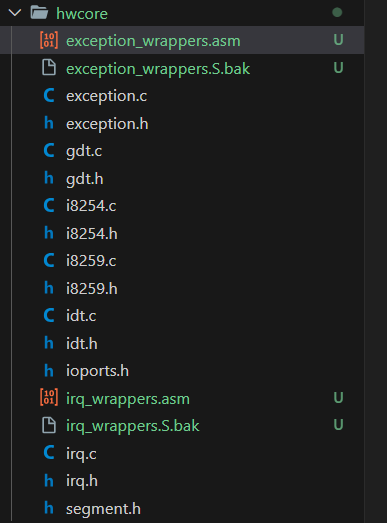
</div>


Ce n'est pas du tout obligatoire car on a renommé les "`.S`" en "`.S.bak`" mais... afin d'être sûr de ne plus tenir compte que des fichiers "`.asm`" du répertoire `./hwcore` je te propose de commenter les 2 lignes ci-dessous dans le Makefile :

```plain
# HWCORE_S := $(shell find hwcore -name *.S)
# HWCORE_OBJ0 := $(patsubst hwcore/%.S, build/%.o, $(HWCORE_S))
```

Enfin, toujours dans le Makefile, je te propose de modifier la variable HWCORE_OBJ comme ci-dessous :

```plain
#HWCORE_OBJ := ${HWCORE_OBJ0} ${HWCORE_OBJ1} ${HWCORE_OBJ2}
HWCORE_OBJ := ${HWCORE_OBJ1} ${HWCORE_OBJ2}
```

Allez, sauve tous les fichiers, `Make clean`, `Make` dans le terminal docker puis relance `qemu-system-i386` dans le terminal pwsh. Ce n'est pas très sexy car normalement ça doit compiler sans warning et fonctionner comme un charme. Voilà ce que je vois :

<div align="center">
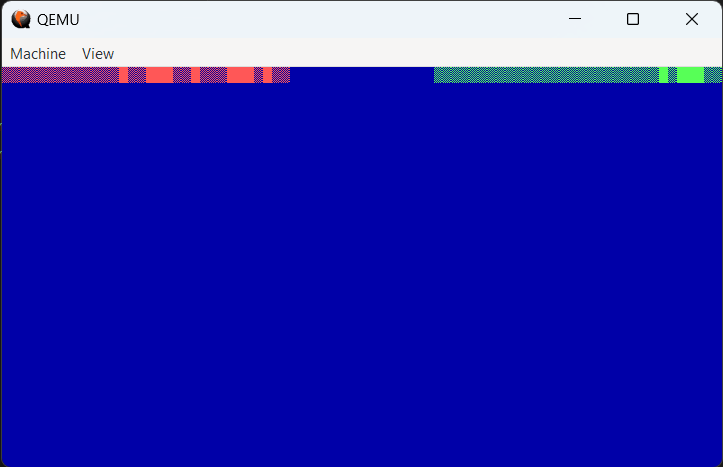
</div>

## Conclusion

Ben voilà, on y est enfin arrivé. Pour info je viens de déposer sur [GitHub](https://github.com/40tude/sos2-2) le dernier update. Je ne sais pas trop à quelle sauce on va être mangé dans l'épisode 3 (j'ai rien lu encore). Mais bon, [nom de Zeus](https://www.youtube.com/watch?v=DYH4Q2AQxs4), avec toute l'épaisseur du trait acquise lors des derniers plans galère, j'imagine que cela va être une promenade de santé 🤞.

Je vais avoir un peu de charge côté boulot. Je ne promet donc rien côté calendirer. Je fais au mieux mais moi aussi j'ai hate de voir comment l'épisode 3 va se dérouler.

*Allez, à plus et la suite au prochain épisode...*

