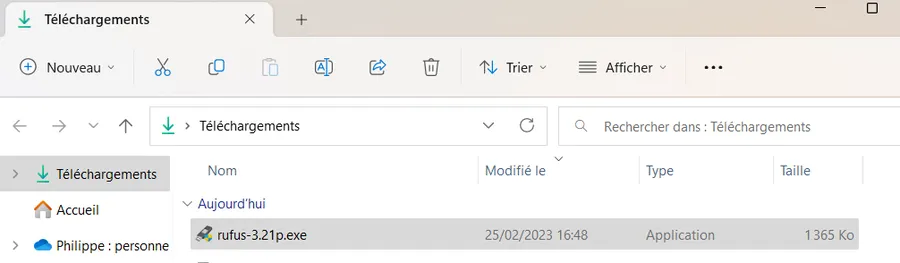
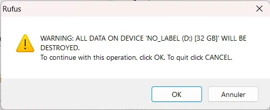

# Install Windows 11 with a USB key

<div align="center">

</div>

## Check the target PC

I know, this may seem weird. But please, just to be sure... Double check the target PC fulfill all W11 requirements. If not, install Windows 10 which is still a particularly good OS.

## How to get Windows 11 ISO

Before you start reading, keep in mind I strongly recommend to install Windows Pro rather than the Family Edition. Note also that it might be a good idea to connect the PC which will download the ISO file directly to your Wifi box with a cable. Indeed, the ISO file is pretty big (around 5GB theses days).

You may be able to get the latest ISO by your own means. On my side, I used to go on the [Malekal](https://www.malekal.com/telecharger-iso-windows-11/) page but, I don't know why, nothing is working for me today. Anyway, there are tons of web sites and Google is you friend (Microsoft should simplify their delivery process since some of us just want the ISO file). Here, we will use this [page](https://lecrabeinfo.net/telecharger-iso-windows-11.html).

Click on the link "Télécharger..." (blue banner at the bottom)

<div align="center">

</div>


Then, at the bottom of the next page, click on the link which says "Télécharger ...".

<div align="center">

</div>


You may have to fill this kind of popup.

<div align="center">

</div>


Then the download should start. According to the quality of your connexion to the net this may take some time (5 GB). Anyway, in the meantime we will download the application which will create the bootable USB key.

### Optional but useful

No matter how you got the ISO. The steps below may help you.

Once the ISO file is in the Downloads directory, open a terminal (WIN + x, i). This means press the WIN and the "x" keys at the same time and then press the "i" key. If this does not work for you, press the WIN key then type "PowerShell" and press ENTER.

The prompt should confirm you are in a PowerShell session and in your home directory. Go to the Downloads directory with this command:

```
cd ./Downloads
```

Now, we will check that the download ended without any error. Enter this command:

```
Get-FileHash -Algorithm SHA1 .\Win11_22H2_French_x64v1.iso
```

The `-Algorithm` parameter above is `SHA1` because this is the information, we got from the Donwload web page. If on your side the encoding is different, don't panic. Once you type in "Algorithm" and the space after it, press TAB. PowerShell will propose different algorithms. Keep pressing TAB to select the one matching your needs.

The hash code you will get after few seconds should be strictly identical to the code available on the download page. If it is not, try again or try another web site. Here is what I see in the terminal.

```
Algorithm       Hash                                                                   Path
---------       ----                                                                   ----
SHA1            CB9AD0B980ECBE6596BAD407869EE7D775455AD1                               C:\Users\phili\Downloads\Win1...
```
## Get Rufus

Rufus is the software which create the bootable USB key. I tried to use [Ventoy](https://ventoy.net/en/index.html) but without success. However, Rufus works like a charm for me. I like the idea from Ventoy. I should give it a second chance one rainy day.

Get Rufus from this [page](https://rufus.ie/en/). I used to download the portable version (no installation on your PC)

<div align="center">

</div>


Once downloaded, double click on rufus-X.YZp.exe in file explorer, in the Downloads directory.

<div align="center">

</div>


The very first time you may be asked if you're OK to let Rufus looking for updates online.

<div align="center">

</div>


Then the main window appears on screen

<div align="center">

</div>


Now, it is time to plug in a "not too slow" USB key. I used to use a [USB 3.1, 32 GB SanDisk](https://amzn.eu/d/afimwSC) key. Finally, you should fill the different options as below. The most crucial point is to select GPT in the "Partition scheme" and NOT MBR (the "old" Master Boot Record). Once this is done, press the Start button.

<div align="center">

</div>


On the next popup window, you may select additional options. I used to leave everything empty.

<div align="center">

</div>


Press OK on the warning window.

<div align="center">

</div>


Green tea time 🍵 !

<div align="center">

</div>

## How to get a Windows Product Key

Here we are talking about legal Windows product key.

For example, you can go on this kind of [site](https://fr.shopping.rakuten.com/offer/buy/7318179745/microsoft-windows-11-pro-cle-d-activation-en-livraison-2h-par-email.html). I used to buy from DA-Licences. I'm not affiliated but so far, so good, I get the key in a matter of minutes by mail and I never had any problem.

<div align="center">

</div>


Just to make sure... Buy the product key for the version of Windows you downloaded. Yes, I know this is ridiculous but it's always better to say it. So, if you got a Windows 11 Pro ISO you buy a Windows 11 Pro product key.

Wait a minute... How is it possible to get a product key at that price while the Windows option is so expensive when I buy it from Dell, Lenovo or directly from Microsoft? In fact, the licenses hereinabove are OEM licenses. These are legal perpetual licenses installed on PCs whose configuration is NOT supposed to change. This means that if next year, if you make a RAM upgrade or swap your hard drive, you may have to get a new product key. However, divide the price of a Personal licence by the price of an OEM licence and you should realize that the ROI is damn good (256€/0.90€ = 284 potential re-installations).

For more detailed information, you can watch this [video in French](https://youtu.be/1N_YcnbRegM?t=63) or this one in plain [English](https://youtu.be/UZcuRiZIIRY?t=149)


## Windows installation

Our personal data from the target PC are saved somewhere or in OneDrive, we have a target PC which is Windows 11 compliant, a bootable USB key on one hand and a product key on the other. One last thing, make sure the target PC is wired connected to the net or that you know the wifi password. Show time!

I will illustrate the case with my Lenovo laptop (read [this page](NOT YET TRANSFERED) to know why Santa Clauss brought it last Christmas. FYI, I'm not a gamer).

* Turn off the target PC.
* Insert an RJ-45 cable if you can.
* Insert the bootable USB key.
* Turn on the PC.
* Press F2 while the screen is still black. Feel free to press F2 more than one times.
* Select the USB key as the device to use for booting.
* Let it work.
* I realize the trackpad is not working. I simply insert a USB mouse on one of the ports.
* At one point you're asked to enter the product key.
* The installer finds many partitions on the hard drive. I remove all of them.
* Show time 2!
  + Files are copied.
  + The PC restarts.
  + Don't forget to remove the USB key.
* A back up of the BIOS is made.
  + I don't know if it is specific to my PC.
* The PC restarts again, and the graphical part of the installation starts.
* Enter your Microsoft account or create one.
* Since I have a Microsoft account the installer wants to restore from a registered configuration
  + This is not what I want
  + Select "More Options"
  + Then pick pick the "Configure as a New Device" option
* I used to say NO to all the questions:
  + PC localization
  + Feedback to Microsoft
  + ...
* When I'm asked about the kind of usage I will have with this PC, I do not select any option.
* I also answer "No" when I get a proposal for XBox blablabla
* Since I used OneDrive, I check the option.
  + If you don't use OneDrive, do not select it. There is no need to add useless software on a brand-new PC.
* Then the installer will check for updates.
* After that you should be done. Congratulations!

OK, OK, Windows is installed but this is the beginning of the journey not the end. Few things need to be checked and installed.

## Windows Update

Give your brand-new PC few minutes to recover then press WIN + I and click on the Windows Update option at the bottom of the list. You may have to go thru this process one or two times and your PC may restart one or two times as well.

<div align="center">

</div>

## BIOS update

Make sur all the Fn keys, sound, trackball, Wifi... Are working properly. If not, you may have to go and download the latest BIOS update from the PC supplier. I can't say much here because the situation depends on the brand of your PC. Just keep this paragraph as a reminder.

For example, I was not able to make the mic working. There are plenty of web site that help you checking mike, camera etc. I had to press WIN + R and to type :

```
mmsys.cpl
```
<div align="center">

</div>


From there I was able to find a solution. This is an example but again, before to go further, make sure you take the time to check most features of the host.

If you have a recent Lenovo laptop, read the paragraph about the Legion Toolkit before doing anything else. Indeed the Legion Toolkit can help you to update the BIOS of your laptop etc.

## Getting the latest version of the video driver

It all depends on the brand of your video card, but you need to get the latest driver. In the case of my Lenovo, I have a GeForce 3070 Ti. I go the NVIDIA web site. The experience should be similar with other suppliers.

<div align="center">

</div>


* I download the driver.
* Once it is in the Downloads directory, I double click on it to start the installation.
* This might be specific to NVIDIA but at one point I can select "Custom Installation" option. This might be "Advanced", "Expert" or other with other suppliers.
* I always select New Installation. This removes previously installed software and proceed to a fresh installation.

## Installing Legion Toolkit

This is specific to recent Lenovo laptops. Skip this section if your target PC is not one of them.

Using the Legion Toolkit allow you to NOT install the software from Lenovo, which is very heavy, very intrusive etc. And trust me, I do my best to stay polite.

Go to GitHub page of the [Legion Toolkit page](https://github.com/BartoszCichecki/LenovoLegionToolkit) and click on the "Latest" release button. See the bottom left corner of the capture below.

<div align="center">

</div>


Once in the Downloads directory, double click on it and let the installer work. I'll let you discover by yourself what you can do with the Legion Toolkit.

## Installation of the others software

### Choco

Trust me, you may not know it yet but [choco](https://community.chocolatey.org/) is one of your best friends. Below we will install choco and we will install one software. Just to show how easy the process is and demonstrate the benefits. To make a long story short, with choco you oversimplify the installation process and the upgrade of ALL the installed softwares with one command. OK, let's start by installing choco.

Open a terminal in elevated mode (WIN + x, a). If this does not work for you, press the WIN key then type "PowerShell" and then select the "Execute as administrator" option.

Copy and paste the line below, press ENTER and let it work.

```
Set-ExecutionPolicy Bypass -Scope Process -Force; [System.Net.ServicePointManager]::SecurityProtocol = [System.Net.ServicePointManager]::SecurityProtocol -bor 3072; iex ((New-Object System.Net.WebClient).DownloadString('https://community.chocolatey.org/install.ps1'))
```

Once this is done, to check that everything is OK, just type choco and press ENTER. You should see something similar to:

```
PS C:\Users\phili> choco
Chocolatey v1.3.0
Please run 'choco -?' or 'choco <command> -?' for help menu.
```

Let's say you want to install VSCode (but this would be the same process with Google Chrome, Acrobate Reader, PowerShell Core, Python, FileZilla, Power Toys... You name it). If you don't know what VSCode is, don't jump out the window just yet. This is a text/code editor. It could at least replace notepad but, here too, trust me, it can do much more than that.

Ok, let's first check if the software is available with the next command:

```
choco search vs code
```

Here is what I get:

```
PS C:\Users\phili> choco search vs code
Chocolatey v1.3.0
vscode-code-runner 0.12.0 [Approved]
vscode-go-nightly 2023.2.2319 [Approved]
editorconfig.vs 0.2.6 [Approved] - Possibly broken
vscode-prettier 9.10.4 [Approved]
vscode-cloud-code 1.21.3 [Approved]
vscode-test-explorer 2.21.1 [Approved]
vscode-test-explorer-diagnostics 0.1.1 [Approved]
vscode-test-explorer-status-bar 1.2.0 [Approved]
...
```

Hmm. Everything starts with "vscode", let's try something else:

```
PS C:\Users\phili> choco search vscode
Chocolatey v1.3.0
vscode 1.75.1 [Approved]
vscode.template 1.0 [Approved]
vscode-gitignore 0.9.0 [Approved]
vscode-cpptools 0.24.1 [Approved]
...
```

The package we are looking for is now at the top of the list. Let's enter this command to install it:

```
choco install vscode -y
```

The `-y` option is here to answer "Yes" automatically during the installation process.

To speed things during your search, you could use Google and search for: "vscode chocolatey". You then reach the dedicated web page where you can copy the command to use in PowerShell (don't forget the `-y)`.

<div align="center">

</div>


Now I have two good news for you.

### Good news #1

If you want to check what is installed on your PC, use the command `choco -list`. See below:

```
PS C:\Users\phili> choco list -l
Chocolatey v1.3.0
chocolatey 1.3.0
chocolatey-compatibility.extension 1.0.0
chocolatey-core.extension 1.4.0
DotNet4.5.2 4.5.2.20140902
GoogleChrome 110.0.5481.178
vscode 1.75.1
vscode.install 1.75.1
```
### Good news #2

Next month if you want to upgrade all the listed softwares you will need one command (we could even create a scheduled task in taskschd.msc). See below:

```
choco upgrade all
```

I hope you realize, how chocolatey can help you installing and maintaining your software up to date. Read the doc, read the help file, and enjoy.

Two points to keep in mind:

* One of the hardest things at the begining is: 3 weeks from now, remember to use choco rather than download, click, check the options, confirm etc.

* Make sure to use choco always in an elevated terminal (it is as important as water for a [Mogwaï](https://youtu.be/NLZP4QA4mU4?t=101))


```
# Make sure to use an elevated terminal (WIN, X + A)
choco install MySoftware -y
choco upgrade all

choco help
```

If you want to uninstall VSCode run this command

```
choco uninstall vscode
```
## Windows debloat

Believe it or not, this is important to clean up a fresh Windows installation. I will not explain the full process here (one could dedicate a full web site to this topic). However here are two ressources that may help. But again, Google and YouTube are your friends. Search for "windows debloat".

* You can read [this page in french](``NOT YET TRANSFERED``)
* You can watch [this video in English](<https://youtu.be/tPRv-ATUBe4?t=160>)
    * **Summary** : one PowerShell command and one click). Try it. If needed, you can always now reinstall Windows with your USB key and the same Product key 😊


## Next step
[Finalize Windows 11 installation]()

