# Prompt Anaconda dans Win Terminal

## Résultat attendu
À la fin je souhaite pouvoir choisir un prompt Anaconda dans la liste des terminaux que propose l'excellent Win Terminal

<div align="center">
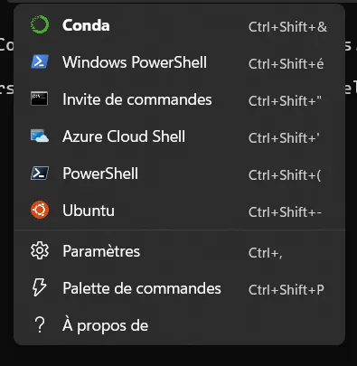
</div>


Et me retrouver dans une console avec mon environnement virtuel Anaconda classique

<div align="center">
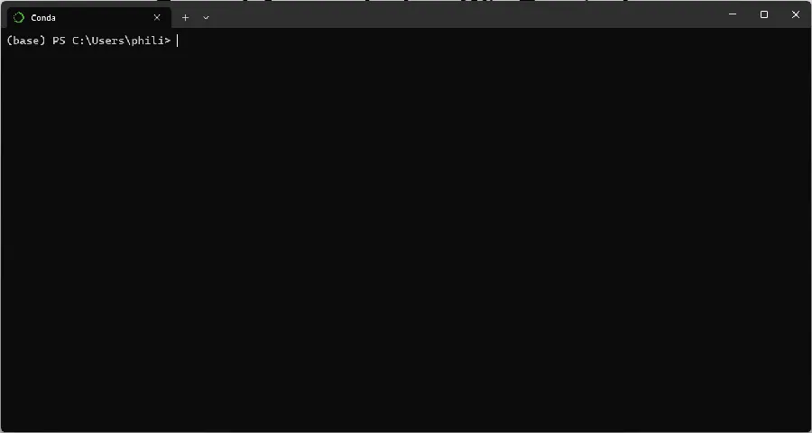
</div>

## Méthode
Je suppose que des versions relativement récentes de Win 11, Win Terminal et Anaconda sont installées.

Ouvrir Win Terminal (WIN + X + I)

Ouvrir les settings de Win Terminal (CTRL + , )

En bas, à gauche, choisir "Ouvrir le fichier JSON". En ce qui me concerne, la suite va se faire sous l'excellent VSCode.

<div align="center">
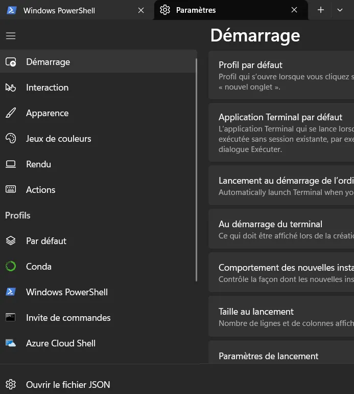
</div>


Retrouver la section "profiles" dans le fichier (plutôt en haut de ce dernier). Si vous êtes perdu, faites une recherche (CTRL+F) sur le mot "profiles"

<div align="center">
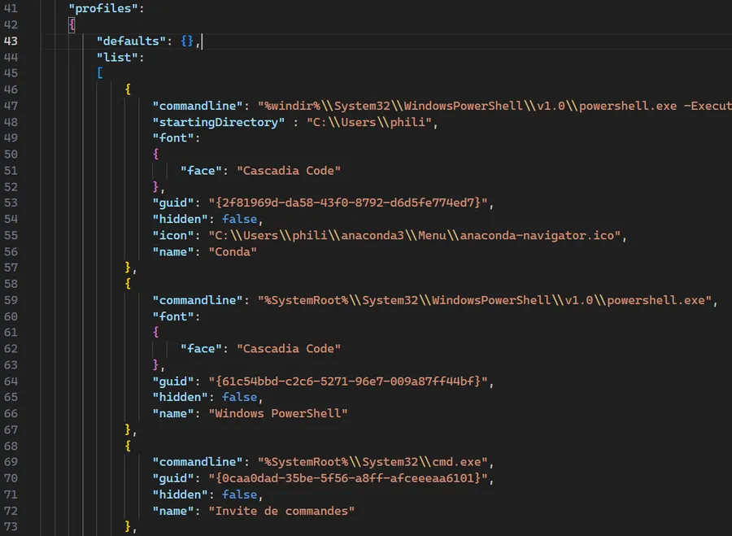
</div>


On va rajouter un nouveau profile en haut de la liste. Ce dernier est contenu dans un jeu de parenthèses (et une virgule qu'il ne faut pas oublier). Ci-dessous j'ai mis en haut du profile les 4 options qui sont obligatoires et en bas les 3 options dont on peut se passer.

```
{
  "name": "Conda",
  "hidden": false,
  "guid":
  "commandline":

  "startingDirectory" :
  "font":
  "icon":
},
```

* ``name`` : Mettez ce que vous voulez. J'ai mis "Conda". N'oubliez pas la virgule en fin de ligne
* ``hidden`` : Mettez "false," car on veut voir ce profile. Il n'y a pas de guillemets mais il y a une virgule à la fin. Voir ci-dessus si besoin.
* ``guid`` : Il faut aller dans une session Powershell et taper "New-Guid", copier l'id généré et le coller dans le profile. Toujours pareil, n'oubliez pas la virgule en fin de ligne.

<div align="center">
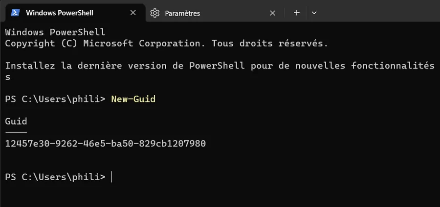
</div>


* ``commandline`` : Là, c'est un peu plus "touchy".  
Il faut commencer par retrouver le prompt PowerShell de Anaconda. J'appuie sur la touche Windows puis je tape ``ana``. Je vois alors les informations ci-dessous :

<div align="center">
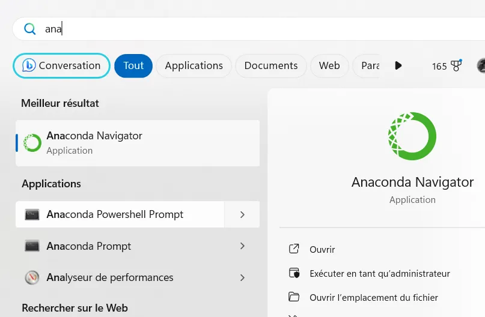
</div>


Clic droit sur "Anaconda PowerShell Prompt" et choisir l'option "Ouvrir l'emplacement du fichier"

<div align="center">
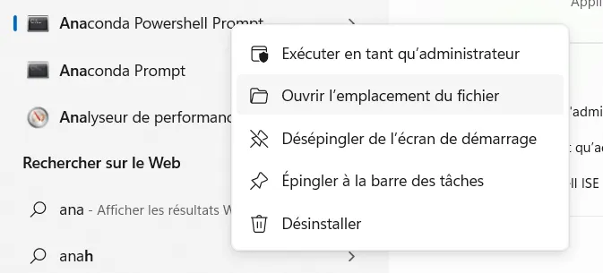
</div>


On arrive dans l'explorateur de fichiers :

<div align="center">
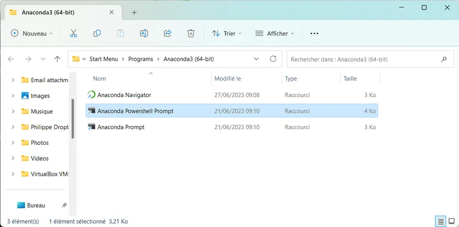
</div>


J'appuie sur ALT + ENTER pour faire apparaitre les propriétés du fichier sélectionné :

<div align="center">
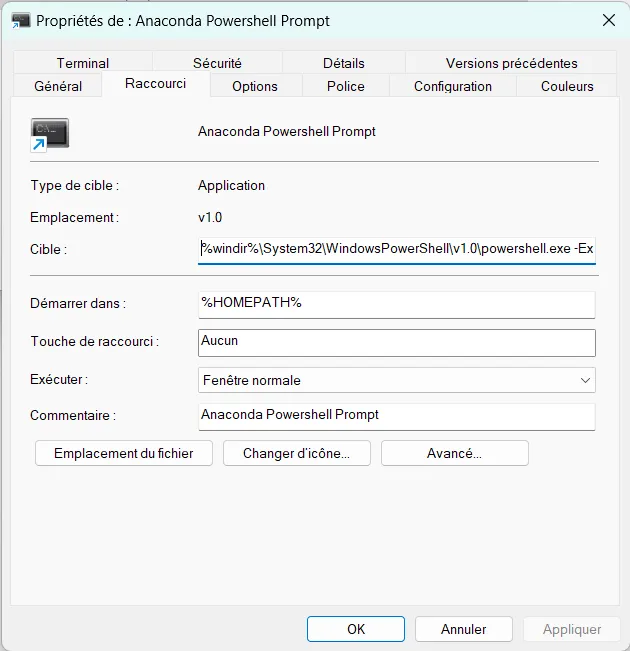
</div>


Je clique dans le champ cible. CTRL + A pour tout sélectionner puis je colle ça dans un nouveau fichier dans VSCode. Chez moi ça ressemble à ça :

```
%windir%\System32\WindowsPowerShell\v1.0\powershell.exe -ExecutionPolicy ByPass -NoExit -Command "& 'C:\Users\phili\anaconda3\shell\condabin\conda-hook.ps1' ; conda activate 'C:\Users\phili\anaconda3' "
```

Je ne suis pas sûr de tout comprendre mais en gros on "voit" qu'on invoque PowerShell en outrepassant l'exécution policy en cours et en lui passant une commande. Cette dernière lance un script "conda-hook.ps1" et active un environnement.

Il faut copier-coller cette ligne en face du paramètre "commandline" du profile. Ensuite il faut l'adapter. Afin de vous aider, vous retrouverez ci-dessous sur la première ligne la ligne de commande du prompt PowerShell Anaconda originale et sur la seconde ce que j'ai dans le profile.

Il faut remplacer tous les "\" par des "\\" ou par des "/".

Ensuite le plus pénible c'est de ne pas trop ratatouiller avec les guillemets.
    * Y en a une au début et une à la fin.
    * Y en a une qui disparait devant le "&".

Si vous n'ajoutez rien pour l'instant après "commandline" dans le profile il n'y a pas de virgule en fin de ligne. Sinon, si vous allez ajouter des paramètres optionnels il ne faut pas oublier la virgule en fin de ligne

```
%windir%\System32\WindowsPowerShell\v1.0\powershell.exe -ExecutionPolicy ByPass -NoExit -Command "& 'C:\Users\phili\anaconda3\shell\condabin\conda-hook.ps1' ; conda activate 'C:\Users\phili\anaconda3' "

"%windir%\\System32\\WindowsPowerShell\\v1.0\\powershell.exe -ExecutionPolicy ByPass -NoExit -Command & 'C:\\Users\\phili\\anaconda3\\shell\\condabin\\conda-hook.ps1' ; conda activate 'C:\\Users\\phili\\anaconda3' ",
```

À ce stade vous pouvez sauvegarder le fichier settings.json (sans le fermer, on n'a pas tout à fait terminé) et faire un test d'ouverture de terminal Anaconda dans Win Terminal. Pas besoin de relancer quoique ce soit. Si ça ne marche pas il faut modifier le profil du fichier settings.json

En ce qui concerne les options c'est assez évident :
* ``startingDirectory`` : Indiquez le répertoire où vous souhaitez ouvrir la session. Utilisez "/" ou "\\" dans le chemin.
* ``font``: C'est vraiment une question de préférence mais cela peut être nécessaire si vous avez autorisé les ligatures et si vous utilisez [Posh-Git](https://github.com/dahlbyk/posh-git).
* ``icon``: Pointez sur un fichier ".ico" avec l'icône Anaconda. Utilisez "/" ou "\\" dans le chemin.

Voici le profile auquel je suis arrivé :
* Notez qu'il n'y a pas de virgule à la fin de la dernière ligne du profile
* Comme ce nouveau profile est le premier de la liste, il y a une virgule derrière la seconde parenthèse du profile.

```
{
  "commandline": "%windir%\\System32\\WindowsPowerShell\\v1.0\\powershell.exe -ExecutionPolicy ByPass -NoExit -Command & 'C:\\Users\\phili\\anaconda3\\shell\\condabin\\conda-hook.ps1' ; conda activate 'C:\\Users\\phili\\anaconda3' ",
  "startingDirectory" : "C:\\Users\\phili",
  "font":
    {
      "face": "Cascadia Code"
    },
  "guid": "{2f81969d-da58-43f0-8792-d6d5fe774ed7}",
  "hidden": false,
  "icon": "C:\\Users\\phili\\anaconda3\\Menu\\anaconda-navigator.ico",
  "name": "Conda"
},
```
## Remarques

J'ai installé [Oh-my-posh](https://ohmyposh.dev/) dans Win Terminal. 

Cependant, dans un terminal Conda, ce dernier ajoute le nom de l'environnement virtuel dans lequel on est. Cela décale tout est ce n'est pas très joli. Un exemple ci-dessous :

<div align="center">
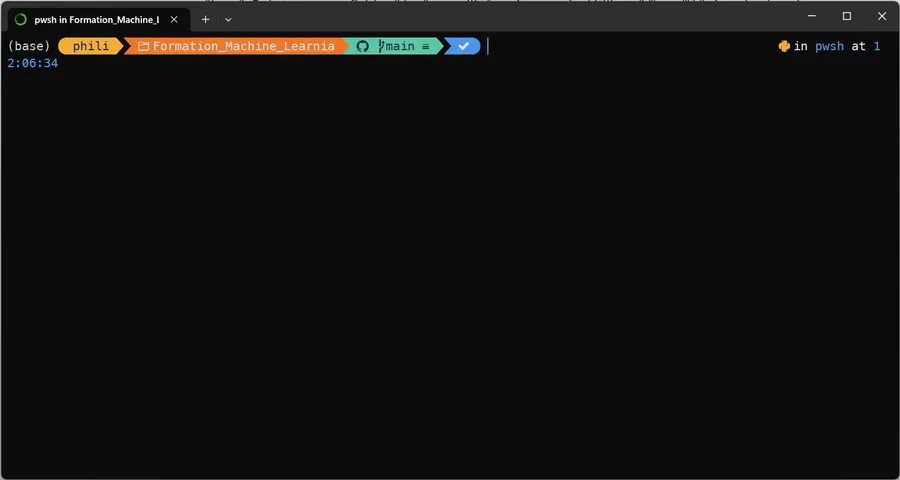
</div>


Pour résoudre le "souci" il suffit de taper la ligne ci-dessous puis d'ouvrir un nouveau terminal Conda dans un nouvel onglet.

```
conda config --set changeps1 False
```

Voilà ce que cela donne.

<div align="center">
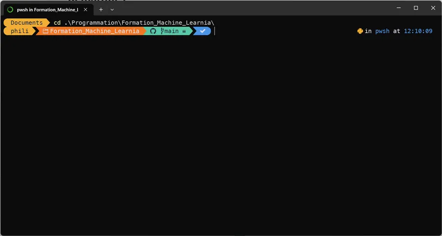
</div>


Pour faire revenir le nom de l'environnement virtuel il suffit de ressaisir la commande précédente et de passer ``True``.

