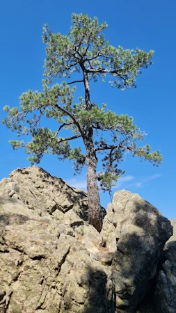

# 40tude.fr 

Nombre d'articles sur le site : **{{ site.pages | size }}**

<table>
  <tbody>
  
  
  
  
    <tr>
      <td>
        
        {{ page.content }}
        
          
          
        

        
        
          
        
          
          
          
            
              
            
          
          
        

        
      </td>
      <td>
        <h2><a href="{{ page.url }}">{{ page.title }} :</a></h2>
        {{ page.content | markdownify | strip_html | truncatewords: nb_words }}
      </td>
    </tr>
  
  </tbody>
</table>

### À propos  
* Il faut lire "**fortitude point fr**". Il n'y a pas de sens caché, j'ai toujours aimé cette façon d'écrire ce mot qui en Anglais désigne la force intérieure ou le courage moral dont une personne fait preuve face à l'adversité, à la douleur ou aux difficultés. Une qualité qui permet de rester ferme, résilient et digne dans les épreuves, sans céder à la peur ou au découragement. Perso, pour moi, la fortitude c'est ça : 

* Typiquement en Corse, en rando à chaque fois que je vois un pin tordu par les vents, enraciné dans une crevasse rocheuse en haut d’une montagne, qui survit malgré le manque de sol, l’aridité, le froid ou les tempêtes, je me dit que c'est une belle incarnation de ce qu'est la fortitude. Il ne s’agit pas d’une force éclatante ou agressive, mais plutôt d’une persévérance silencieuse, d’une capacité à tenir bon dans l’adversité, à résister au temps. La fortitude n’est pas seulement humaine. Elle peut aussi s’observer dans les formes de vie qui refusent de céder, là où tout semble hostile. Ce pin n’a pas choisi la facilité, mais il a choisi de vivre. Pour moi c’est ça, la fortitude. Bon allez, j'arrête là.
* Heu... Pas de référence non plus à [l'opération de désinformation](https://fr.wikipedia.org/wiki/Op%C3%A9ration_Fortitude){:target="_blank"} de la seconde guerre mondiale.  
* Les **commentaires** : ils sont les bienvenus. Il suffit d'aller dans cet [espace dédié](https://github.com/40tude/40tude.github.io/discussions). Techniquement le site est sur GitHub. Il est probable qu'avant de pouvoir écrire, on te demande de t'inscrire. 
* Les **images** : faut pas hésiter à cliquer dessus. Elles s'affichent alors dans leur dimensions initiales et tu peux zoomer si besoin    
* **Historique** : Le site précédent, hébergé chez **OVH** a été **piraté** en avril 2024. De mon point de vue d'utilisateur "lambda" qui souhaite simplement écrire et garder ses notes dans un blog, OVH n'a rien fait pour protéger mon site ni pour m'aider après coup (j'étais client depuis 2011 sans jamais avoir contacté le support...). D'un autre côté, je n'en pouvais plus de **WordPress**. Je parle surtout de l'édition des billets. Au début, en 2010, ça allait à peu près mais sur la fin c'est devenu n'importe quoi...  WP c'est sans doute très bien pour certains mais il ne correspond plus du tout à mes besoins. En plus, j'ai l'impression que ça part en vrille chez WP. [Lire ce billet sur Medium.](https://medium.com/notes-and-theories/this-man-controls-40-of-the-internet-and-its-a-problem-1b37a66e6185){:target="_blank"}
* **Update du 08/02/25** : il reste encore 84 billets à transferer. Essentiellement dans la catégorie Motos (roulage, bricolage ZX6R et RSV4). Pendant le transfert, même si j'apporte quelques modifications aux billets, je ne vais pas modifier les dates de dernière mise à jour. Je ne le ferai que si, après le transfert, je reviens sur une page pour y ajouter des compléments ou la réécrire complètement. Les dates de première et de dernière édition se trouvent **en bas de chaque page**, tandis que **l'estimation du temps de lecture** s'affiche en haut. J'essaie de rester focus sur le transfert mais j'avoue que je commence à tirer la langue.