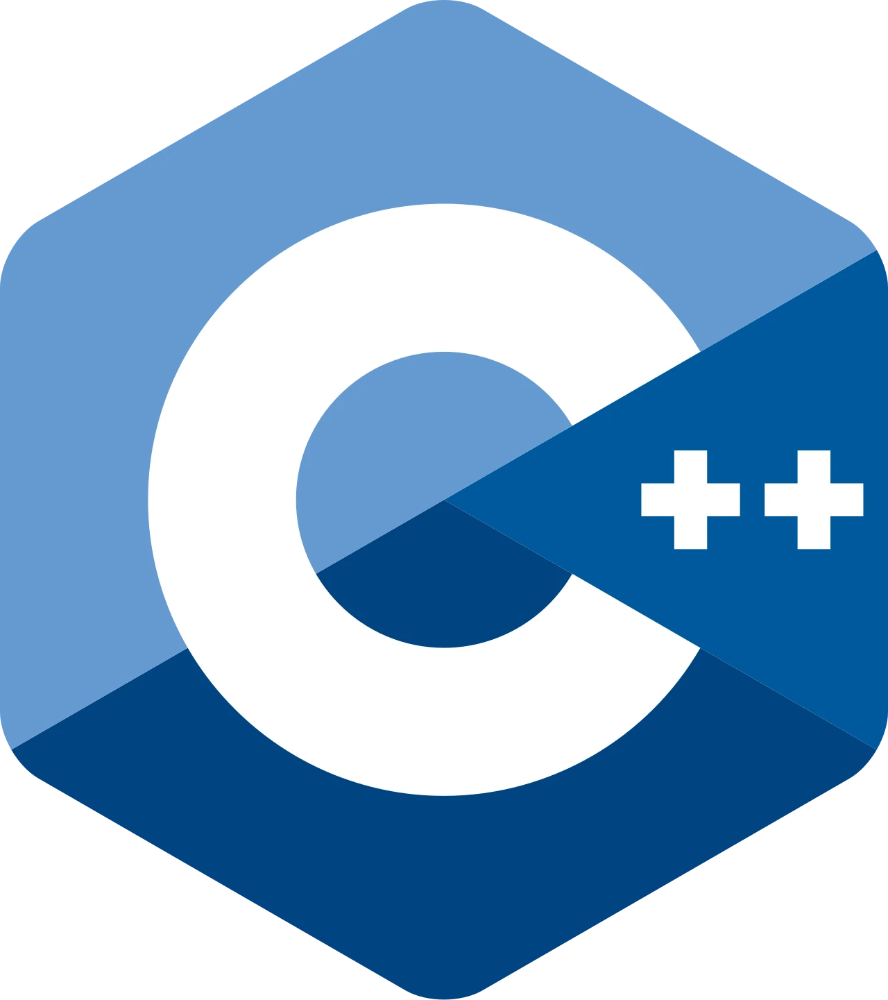

<!-- 
At the root, see : 
* reveal-md.json 
* ./css/custom.css 

* If issue with indentation in source code on slides
	* CTRL+SHIFT+P Convert Indentation to Tabs

reveal-md ./rust_code_snippets.md --watch
reveal-md ./rust_code_snippets.md --static docs

Don't forget to ./build.ps1 before to commit


Template
	- Titre max à 42 chars dans VSCode
	- 32 lignes de code max

### *************************************
```rust
def main{

}
```

-->


<link rel="stylesheet" href="css/custom.css">

# Code Snippets


---

```rust [42: 4-5] 
// Define a struct to represent a singly linked list node
#[derive(Debug)]
struct ListNode {
	val: i32,
	next: Option<Box<ListNode>>,
}

// Implement ListNode
impl ListNode {
	fn new(val: i32, next: Option<Box<ListNode>>) -> Self {
		ListNode { val, next }
	}
}

```

---


### Indentation issues ?

```rust

// Define a struct to represent a singly linked list node
#[derive(Debug)]
struct ListNode {
	val: i32,
	next: Option<Box<ListNode>>,
}

// Implement ListNode
impl ListNode {
	fn new(val: i32, next: Option<Box<ListNode>>) -> Self {
		ListNode { val, next }
	}
}

```


---


```rust [2-3]
fn main(){
	let x = String::from("hi");
	let y = &x; // <----- immutable borrow
	println!(("{x}");)
	println!(("{y}");)
}

```

```rust
fn main(){
	let x = String::from("hi");
	let y = &x; // <----- immutable borrow
	println!(("{x}");)
	println!(("{y}");)
}

```


---


Associated function
* act on type, not instance
* does not have ``self`` has parameter

```rust
struct Point {
	x: f64,
	y: f64,
}

impl Point {
	fn origin() -> Self {
		Point { x: 0.0, y: 0.0 }
	}
}

let p = Point::origin();
println!("{} --- {}", p.x, p.y);

```
---


Option Type
```rust
fn get_username(id: i32) -> Option<String> {
	if id == 1 {
		return Some("letsgetrusty".to_owned());
	}
	None
}

fn main() {
	let id = 1;
	match get_username(id) {
		Some(username) => println!("Username found: {}", username),
		None => println!("No username found for id {}", id),
	}

	let id2 = 2;
	match get_username(id2) {
		Some(username) => println!("Username found: {}", username),
		None => println!("No username found for id {}", id2),
	}
}

```
---


Enums

```rust
// Define user roles using an enum
enum Role {
	Admin,
	Reader,
	Writer,
}

// Check whether a user role is allowed to publish a blog
fn can_publish_blog(r: Role) -> bool {
	match r {
		Role::Admin | Role::Writer => true,
		_ => false,
	}
}

fn main() {
	// Create examples of each role
	let admin = Role::Admin;
	let reader = Role::Reader;
	let writer = Role::Writer;

	// Check and print if each role can publish a blog
	println!("Admin can publish: {}", can_publish_blog(admin));   // true
	println!("Reader can publish: {}", can_publish_blog(reader)); // false
	println!("Writer can publish: {}", can_publish_blog(writer)); // true
}


```
---


Error Handling

```rust
use std::num::ParseIntError;

// Parse two string slices into i32 and return their sum, or a parsing error
fn parse_then_add(a: &str, b: &str) -> Result<i32, ParseIntError> {
	let a: i32 = a.parse()?;
	let b: i32 = b.parse()?;
	Ok(a + b)
}

fn main() {
	// Test with valid integers
	match parse_then_add("3", "7") {
		Ok(result) => println!("Sum is: {}", result),        // print 10
		Err(e) => println!("Error parsing integers: {}", e),
	}

	// Test with an invalid string
	match parse_then_add("foo", "7") {
		Ok(result) => println!("Sum is: {}", result),
		Err(e) => println!("Error parsing integers: {}", e), // print a parse error
	}
}

```
---


Traits from std lib - Default

```rust
// La méthode default() génère des valeurs par défaut implicites (par exemple 0 pour i8, vec![] pour Vec<T>, None pour Option<T>),
#[derive(Debug, Default)]
struct Player {
	level: i8,
	items: Vec<Item>,
	special_power: Option<Power>,
}

// Vec<Item> nécessite que Item implémente aussi Default et Debug, donc on ajout #[derive(Debug, Default)] à Item.
#[derive(Debug, Default)]
struct Item {
	name: String,
}

// Option<Power> ne nécessite que Debug, donc Power n’a besoin que de #[derive(Debug)]
#[derive(Debug)]
enum Power {
	Fire,
	Ice,
	Thunder,
}

fn main() {
	let p1 = Player::default();
	println!("{p1:#?}");
}

```
---


Traits from std lib - Default

```rust
#[derive(Debug)]
struct Player {
	level: i8,
	items: Vec<Item>,
	special_power: Option<Power>,
}

#[derive(Debug)]
struct Item {
	name: String,
}

#[derive(Debug)]
enum Power {
	Fire,
	Ice,
	Thunder,
}

// Valeurs par défaut personnalisées pour Player
impl Default for Player {
	fn default() -> Self {
		Self {
			level: 1,
			items: vec![
				Item { name: "Sword".to_string() },
				Item { name: "Shield".to_string() },
			],
			special_power: Some(Power::Fire),
		}
	}
}

// Valeur par défaut pour Item (obligatoire si on veut faire Default ailleurs automatiquement)
impl Default for Item {
	fn default() -> Self {
		Self {
			name: "Unknown".to_string(),
		}
	}
}

fn main() {
	let p1 = Player::default();
	println!("{p1:#?}");
}
```
---


Traits from std lib - FromStr

```rust
use std::str::FromStr;
use std::num::ParseIntError;

#[derive(Debug, PartialEq)]
struct Point {
	x: i32,
	y: i32,
}

impl FromStr for Point {
	type Err = ParseIntError;

	fn from_str(s: &str) -> Result<Self, Self::Err> {
		let coords: Vec<&str> = s
			.trim_matches(|p| p == '(' || p == ')')
			.split(',')
			.collect();

		let x_fromstr = coords[0].parse::<i32>()?;
		let y_fromstr = coords[1].parse::<i32>()?;

		Ok(Point {
			x: x_fromstr,
			y: y_fromstr,
		})
	}
}

fn main() {
	let p = Point::from_str("(1,2)");
	assert_eq!(p.unwrap(), Point { x: 1, y: 2 });
	println!("Test passed!");
}
```
---


Traits from std lib - From & TryFrom

```rust
use std::fs;
use std::io;
use std::num;

#[derive(Debug)]
enum CliError {
	IoError(io::Error),
	ParseError(num::ParseIntError),
}

// Conversion de io::Error → CliError
impl From<io::Error> for CliError {
	fn from(error: io::Error) -> Self {
		CliError::IoError(error)
	}
}

// Conversion de ParseIntError → CliError
impl From<num::ParseIntError> for CliError {
	fn from(error: num::ParseIntError) -> Self {
		CliError::ParseError(error)
	}
}

// Fonction principale : lecture d'un fichier, parsing d’un i32
fn open_and_parse_file(file_name: &str) -> Result<i32, CliError> {
	let contents = fs::read_to_string(file_name)?;           // peut retourner un io::Error. Si besoin l’opérateur ? va faire implicitement un return Err(CliError::from(err))
	let num: i32 = contents.trim().parse()?;                 // peut retourner un ParseIntError
	Ok(num)
}

fn main() {
	// Création d’un fichier temporaire
	let file_name = "temp.txt";
	fs::write(file_name, "42").expect("Failed to write temp file");

	match open_and_parse_file(file_name) {
		Ok(n) => println!("Parsed number: {}", n),
		Err(e) => println!("Error occurred: {:?}", e),
	}

	// Nettoyage du fichier temporaire
	let _ = fs::remove_file(file_name);
}
```
---


Macros from std lib - ToDo

```rust
trait Database {
	fn connect(&self, url: &str);
	fn query(&self) -> QueryResult;
}

struct QueryResult;
struct MyDB;

impl Database for MyDB {
	fn connect(&self, url: &str) {
		// …
	}

	fn query(&self) -> QueryResult {
		todo!();
	}
}

fn main() {
	let s = MyDB;
	s.connect("DATABASE_URL");

	// we aren't calling query(), so this is fine.
}
```
---


Macros from std lib - Concat

```rust
fn main() {
	let s = concat!("test", 10, 'b', true);
	assert_eq!(s, "test10btrue");
}
```
---


Macros from std lib - Format

```rust
fn main() {
	// Formatage de types hétérogènes
	let s1: String = "hello".to_owned();
	let s2: &str = "world!";
	let s3: String = format!("{} {}", s1, s2);
	println!("{s3}")
}

```
---


Macros from std lib - Format

```rust
fn main() {
	let name = "Alice";
	let age = 30;
	let height = 1.68;
	let profile = format!("Name: {}, Age: {}, Height: {:.1}m", name, age, height);
	println!("{profile}");    
}

```
---


Macros from std lib - Format

```rust
fn main() {
	// Alignement et remplissage
	let left = format!("{:<10}", "left");
	let center = format!("{:^10}", "center");
	let right = format!("{:>10}", "right");
	println!("|{}|{}|{}|", left, center, right);
}

```
---


Macros from std lib - Format

```rust
struct My_Point {
	x: i32,
	y: i32,
}

// Le trait std::fmt::Display permet de personnaliser l'affichage d'une structure avec {}
impl std::fmt::Display for My_Point {
	fn fmt(&self, f: &mut std::fmt::Formatter<'_>) -> std::fmt::Result {
		write!(f, "({:.2}, {:.2})", self.x as f64, self.y as f64)
	}
}

fn main() {
	let p = My_Point { x: 3, y: 7 };
	println!("The point is : {p}");
}

```
---


```rust
fn main(){
	let number = vec![5,2,8,1? 3];
	let max_element = numbers.iter().max();
	match max_element{
		Some(&max) => println!("Max element = {max}"),
		None       => println!("Vector is empty"),
	}
}

```
---


snippet

```rust
fn num_to_ordinal_expr(x: u32) -> String {
	format!("{}{}", x, match (x % 10, x % 100) {
		(1, 1) | (1, 21...91) => "st", 
		(2, 2) | (2, 22...92) => "nd", 
		(3, 3) | (3, 23...93) => "rd", 
		_ => "th" 
	}) 
} 
```
---


<!-- # Welcome !

---

## Slide II

This is a **Reveal.js** presentation written in Markdown.

---

## Slide III

Lorem ipsum dolor sit amet, consectetur adipiscing elit. Vestibulum dictum odio id molestie iaculis. Duis vel consequat quam. Duis fermentum, dolor id imperdiet luctus, ipsum neque ultricies velit, eu ultricies risus dui ut nibh. Sed cursus hendrerit odio, eu commodo metus mattis sed. Etiam vitae commodo purus. Pellentesque nec eros in risus lobortis fringilla id et massa. Mauris vel faucibus lectus. Pellentesque molestie sit amet nibh a laoreet. Proin suscipit tortor in quam mattis, vel fermentum enim pellentesque. Fusce id dolor commodo, pretium sapien non, posuere tortor.

---
## Slide IV

- Donec ac eros a nulla consequat sagittis. 
- Integer nec tempus augue. 
- Nunc in leo nec diam fringilla sodales. 
- Donec arcu turpis, commodo vel dignissim sit amet, rhoncus id nisl. 
- Curabitur metus erat, luctus ut libero non, malesuada egestas neque. 
- Curabitur hendrerit gravida neque, ac fringilla nulla iaculis quis. 
 -->
---

<!-- ## Show me the Code  -->


<!-- ## C++ vs Rust


<div class="flex-columns">
<div class="column">

### C++
- Langage compilé
- Héritage du C++

```cpp
#include <iostream>
int main() {
	std::cout << "Hello C++" << std::endl;
}
```
</div>

<div class="column">

### Rust
- Langage compilé sécurisé
- Gestion mémoire sans GC

```rust
fn main() {
	println!("Hello Rust");
}
</div>```


---

## Images

<div align="center">

</div>

---

## Call to action

I propose the **following** actions to take place *yesterday* 😁

- Do this
- Do that -->